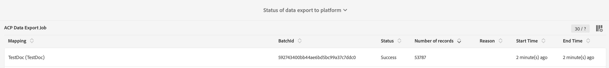

# 對應啟動 {#mapping-activation}

>[!IMPORTANT]
>
>促銷活動標準資料服務目前處於測試階段，可能會在不另行通知的情況下頻繁更新。 客戶必須在Azure上代管（目前僅限北美地區測試版）才能存取這些功能。 如果您想要存取，請聯絡Adobe客戶服務。

當映射定義完成時，可以發佈映射。 在部署步驟後，Campaign standard和Adobe Experience platform之間的資料複製會自動啟動。 您可以隨時按一下按鈕來停止復 **[!UICONTROL Stop]**制。

視您的對應修改而定，您可以選擇將所有記錄重新傳送至Adobe Experience Platform。

從部署圖格中，您可以存取出版物記錄檔並匯出記錄檔。

在標籤 **[!UICONTROL Export jobs]**中，您可以監視已發佈映射的導出作業。

如果要監視所有資料導出作業，請轉至 **[!UICONTROL Administration]**>**[!UICONTROL Development]** > **[!UICONTROL Platform]**>菜**[!UICONTROL Status of data export to platform]** 單。

資料擷取工作狀態：

* **[!UICONTROL Created]**:建立資料提取作業並正在進行資料提取。
* **[!UICONTROL Failed]**:資料擷取工作失敗。 原因欄位說明失敗的原因。 故障可以是暫時的或永久的。 在發生瞬時故障時，在配置的間隔後建立新的提取作業。 作為疑難排解的第一步，使用者可以檢查失敗的原因欄位。 如果原因將使用者重新導向至Adobe Experience Platform UI，使用者可登入Adobe Experience Platform，並可檢查資料集中的批次狀態，以判斷確切的失敗原因。
* **[!UICONTROL Uploaded]**:首先在Adobe Experience platform中建立批次，然後將資料擷取至該批次。 批次ID欄位會顯示Adobe Experience platform中批次的批次ID。 Adobe Experience platform也會對批次執行貼文驗證。 批次會先標示為已上傳，直到Adobe Experience platform完成貼文驗證步驟為止。 工作會在上傳後持續輪詢Adobe Experience platform以取得批次狀態。 批可以在Adobe Experience platform中進行「失敗」或「成功」狀態的貼文驗證。
* **[!UICONTROL Success]**:將批次上傳至Adobe Experience platform後，作業狀態（平台中的貼文驗證）會在設定的間隔後進行檢查。 「成功」狀態可識別Adobe Experience platform中的資料擷取成功。
