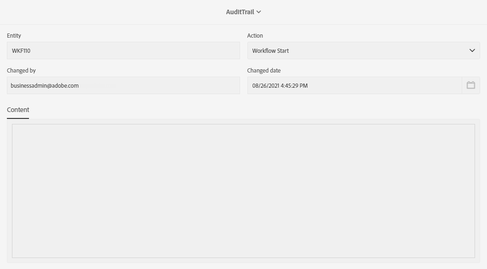
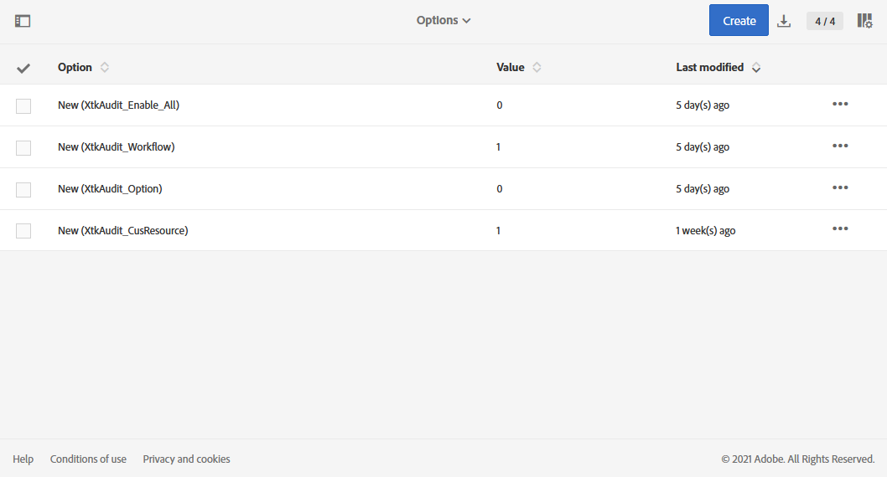

# 稽核軌跡 {#audit}

的 **[!UICONTROL Audit trail]** 允許您訪問在實例中所做的更改的完整歷史記錄。

**[!UICONTROL Audit trail]** 即時捕獲在您的Adobe Campaign Standard實例中發生的操作和事件的綜合清單。 它包括訪問資料歷史的自助式方法，以幫助回答以下問題：您的工作流、自定義資源和選項發生了什麼情況，上次更新了這些資源和選項，或您的用戶在實例中做了什麼。

**[!UICONTROL Audit trail]** 包括三個元件：

* **自定義資源審核跟蹤**:檢查活動和對自定義資源所做的最後修改。

   有關 **[!UICONTROL Custom resources]**，請參閱 [頁](../../developing/using/key-steps-to-add-a-resource.md)。

* **工作流審核跟蹤**:檢查活動和對工作流所做的最後修改，另外檢查工作流的狀態，如：

   * 建立時間
   * 已修改
   * 已刪除
   * 工作流啟動
   * 工作流暫停
   * 工作流停止
   * 工作流重新啟動
   * 工作流清理
   * 工作流模擬
   * 工作流喚醒
   * 工作流立即停止
   * 使用同一用戶重新啟動工作流
   * 工作流重新啟動未知命令

   有關 **[!UICONTROL Workflows]**，請參閱 [頁](../../automating/using/get-started-workflows.md)。

* **選項審核跟蹤**:檢查活動和上次對選項進行的修改。

   有關 **[!UICONTROL Options]**，請參閱 [頁](../../administration/using/about-campaign-standard-settings.md)。

請注意，預設保留期為30天。

## 訪問審核跟蹤 {#audit-access}

要訪問實例的審核跟蹤，請執行以下操作：

1. 在Adobe Campaign Standard，從高級菜單中，選擇 **[!UICONTROL Administration]** > **[!UICONTROL Audit trail]**。

   

1. 的 **[!UICONTROL Audit trail]** 窗口。 Adobe Campaign Standard將審核工作流、選項和自定義資源的建立、編輯和刪除操作。

   從 **[!UICONTROL Search]** 菜單中，您可以在以下位置篩選實體：

   * **[!UICONTROL Start date]**
   * **[!UICONTROL End date]**
   * **[!UICONTROL Type]**:「全部」、「工作流」、「自定義資源」和「選項」之間的實體類型。
   * **[!UICONTROL Entity name]**:工作流、選項或自定義資源的ID

   

1. 選擇其中一個實體以瞭解有關上次修改的詳細資訊。

1. 「審計實體」(Audit entity)窗口將為您提供有關所選實體的更詳細資訊，如：

   * **[!UICONTROL Entity]**:工作流、選項或自定義資源的ID。
   * **[!UICONTROL Action]**:上次對此實體執行的操作。
   * **[!UICONTROL Changed by]**:上次修改此實體的最後一個人的用戶名。
   * **[!UICONTROL Changed date]**:對此實體執行的上次操作的日期。
   * **[!UICONTROL Content]**:代碼塊，它為您提供了有關實體中更改內容的詳細資訊。

   在本示例中，我們可以看到WKF110工作流已由此實例的業務管理員於8月26日啟動。

   

## 啟用/禁用審核跟蹤 {#enable-disable-audit}

>[!NOTE]
>
> 只有功能管理員才能啟用或禁用審核跟蹤。 如需關於此項目的詳細資訊，請參閱此[頁面](../../administration/using/users-management.md#functional-administrators)。

可以針對特定活動輕鬆激活或停用審核跟蹤。

若要這麼做：

1. 在Adobe Campaign Standard，從高級菜單中，選擇 **[!UICONTROL Administration]** > **[!UICONTROL Application settings]** > **[!UICONTROL Options]**。

   

1. 根據要禁用的實體選擇以下選項之一：

   * **[!UICONTROL XtkAudit_Workflows]** 選項管理工作流的審核跟蹤。
   * **[!UICONTROL XtkAudit_Option]** 選項的審核跟蹤。
   * **[!UICONTROL XtkAudit_CusResource]** 選項管理自定義資源的審核跟蹤。
   * **[!UICONTROL XtkAudit_Enable_All]** 選項來管理每個實體的審核跟蹤。

      >[!NOTE]
      >
      >如果 **[!UICONTROL XtkAudit_Enable_All]** 選項設定為0, **[!UICONTROL Audit trail]** 功能將完全禁用，而不考慮其它單個選項值。
   

1. 從 **[!UICONTROL Options]** 頁，設定 **[!UICONTROL Value (integer)]** 0 **[!UICONTROL Audit trail]** 或1以啟用它。

   

1. 按一下&#x200B;**[!UICONTROL Save]**。
