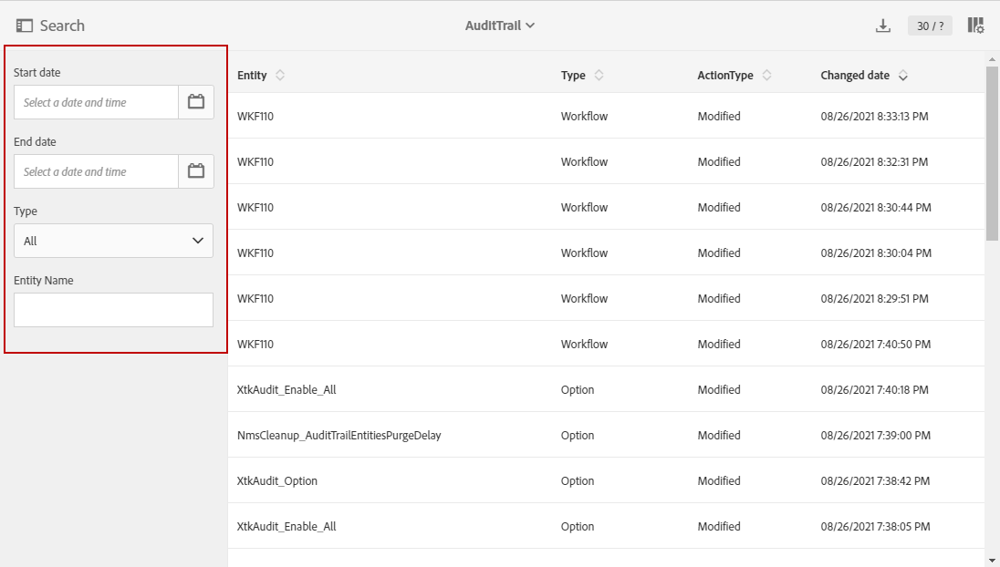
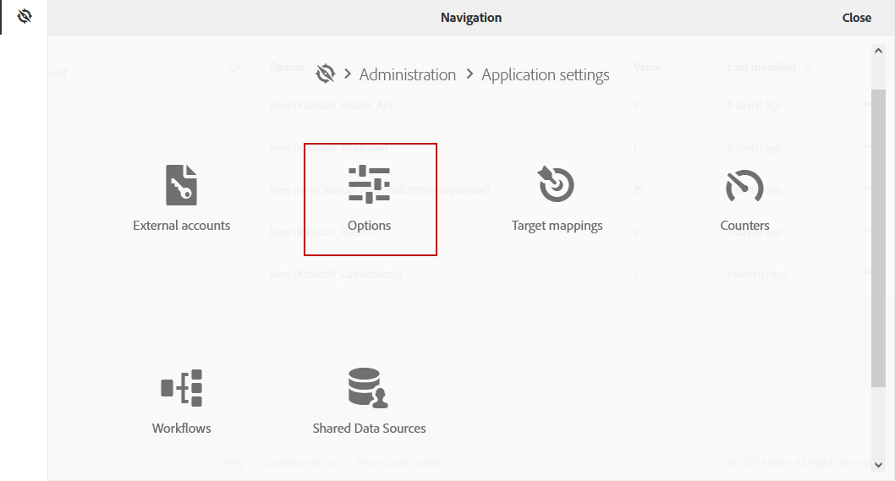

# 稽核軌跡 {#audit}

此 **[!UICONTROL Audit trail]** 可讓您存取在執行個體中所做變更的完整歷史記錄。

**[!UICONTROL Audit trail]** 即時擷取在您的Adobe Campaign Standard例項中發生之動作和事件的完整清單。 其中包括自助式存取資料記錄，以協助回答下列問題：工作流程、自訂資源和選項的變更、上次更新的人員，或您的使用者在例項中執行的動作。

**[!UICONTROL Audit trail]** 包含三個元件：

* **自訂資源稽核軌跡**:檢查活動，以及上次對自訂資源完成的修改。

   如需 **[!UICONTROL Custom resources]**，請參閱 [頁面](../../developing/using/key-steps-to-add-a-resource.md).

* **工作流審核跟蹤**:檢查活動以及上次對工作流程完成的修改，此外，還檢查工作流程的狀態，例如：

   * 已建立
   * 已修改
   * 已刪除
   * 工作流程開始
   * 工作流程暫停
   * 工作流程停止
   * 工作流程重新啟動
   * 工作流程清除
   * 工作流模擬
   * 工作流喚醒
   * 工作流立即停止
   * 重新啟動工作流程（與同一個用戶）
   * 工作流重新啟動未知命令

   如需 **[!UICONTROL Workflows]**，請參閱 [頁面](../../automating/using/get-started-workflows.md).

* **選項審核跟蹤**:檢查活動，以及上次對選項進行的修改。

   如需 **[!UICONTROL Options]**，請參閱 [頁面](../../administration/using/about-campaign-standard-settings.md).

請注意，預設保留期為30天。

## 存取稽核軌跡 {#audit-access}

若要存取執行個體的稽核軌跡：

1. 在Adobe Campaign Standard中，從進階功能表中選取 **[!UICONTROL Administration]** > **[!UICONTROL Audit trail]**.

   

1. 此 **[!UICONTROL Audit trail]** 窗口將開啟，其中包含實體清單。 Adobe Campaign Standard會稽核工作流程、選項和自訂資源的建立、編輯和刪除動作。

   從 **[!UICONTROL Search]** 功能表，您可以依下列項目篩選實體：

   * **[!UICONTROL Start date]**
   * **[!UICONTROL End date]**
   * **[!UICONTROL Type]**:在「全部」、「工作流」、「自定義資源」和「選項」之間的實體類型。
   * **[!UICONTROL Entity name]**:工作流程、選項或自訂資源的ID

   

1. 選取其中一個實體，以進一步了解上次修改。

1. 「審覈實體」窗口將為您提供有關所選實體的更詳細資訊，例如：

   * **[!UICONTROL Entity]**:工作流程、選項或自訂資源的ID。
   * **[!UICONTROL Action]**:上次對此實體執行的操作。
   * **[!UICONTROL Changed by]**:上次修改此實體的最後一個人員的用戶名。
   * **[!UICONTROL Changed date]**:對此實體執行的上次操作的日期。
   * **[!UICONTROL Content]**:程式碼區塊，可提供實體中確切變更項目的詳細資訊。

   在此示例中，我們可以看到此實例的業務管理員已於8月26日啟動了工作流WKF110。

   

## 啟用/停用稽核軌跡 {#enable-disable-audit}

您可以輕鬆啟動或停用特定活動的稽核軌跡。

若要這麼做：

1. 在Adobe Campaign Standard中，從進階功能表中選取 **[!UICONTROL Administration]** > **[!UICONTROL Application settings]** > **[!UICONTROL Options]**.

   

1. 根據要禁用的實體選擇以下選項之一：

   * **[!UICONTROL XtkAudit_Workflows]** 選項，以管理工作流程的稽核軌跡。
   * **[!UICONTROL XtkAudit_Option]** 選項，以管理選項的稽核軌跡。
   * **[!UICONTROL XtkAudit_CusResource]** 選項，以管理自訂資源的稽核軌跡。
   * **[!UICONTROL XtkAudit_Enable_All]** 選項，以管理每個實體的稽核軌跡。

      >[!NOTE]
      >
      >若 **[!UICONTROL XtkAudit_Enable_All]** 選項設為0，則 **[!UICONTROL Audit trail]** 無論其他個別選項值為何，功能都會完全停用。
   

1. 從 **[!UICONTROL Options]** 頁面，設定 **[!UICONTROL Value (integer)]** 設為0 **[!UICONTROL Audit trail]** 或1來啟用。

   

1. 按一下&#x200B;**[!UICONTROL Save]**。
