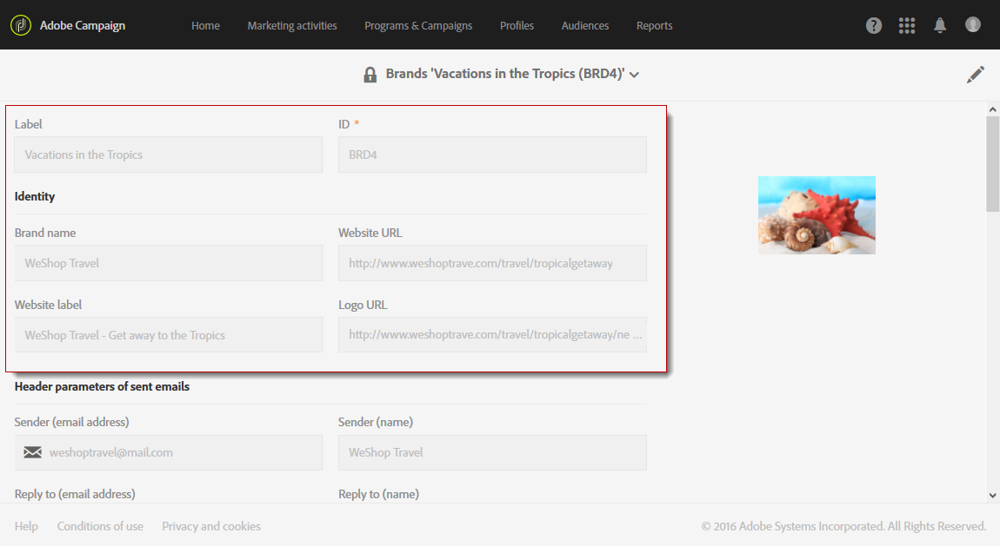

# 品牌推廣{#branding}

## 關於品牌識別 {#about-brand-identity}

每家公司都有品牌視覺化和技術准則。 有了Adobe Campaign，您可以定義一組規格，為客戶呈現一致的品牌，從標誌到技術層面，例如電子郵件寄件者、URL或網域。

技術管理員可定義一或多個品牌，以集中輸入影響品牌識別的參數。 這包括品牌標誌、著陸頁面存取URL的網域或訊息追蹤設定。 有了Adobe Campaign，您可以建立這些品牌，並將其連結至訊息或登陸頁面。 此配置在模板中管理。

## 設定和使用品牌 {#configuring-and-using-brands}

配置和使用品牌的主要原則是：

1. 建立和設定品牌——此作業需要特定權限，並由Adobe Campaign技術管理員執行。
1. 為此品牌建立一或多個傳送和著陸頁面範本。 請參閱「 [建立範本](../../start/using/marketing-activity-templates.md) 」一節。
1. 根據此範本建立訊息和登陸頁面。 請參閱「建 [立電子郵件](../../channels/using/creating-an-email.md) 」 [和「建立著陸頁面](../../channels/using/designing-a-landing-page.md) 」區段。

>[!IMPORTANT]
>
>用戶不能建立或修改品牌：這些作業必須由Adobe Campaign技術管理員執行。 如需任何要求，請聯絡Adobe客戶服務。 多品牌無法用於交易訊息的內容。 如需詳細資訊，請參閱「交 [易式訊息與品牌推廣」](../../channels/using/about-transactional-messaging.md#permissions-and-branding)。

品牌位於功能表 **[!UICONTROL Administration > Instance settings > Brand configuration]** 中。

依預設，新建立的品牌僅對管理員指派具有對應權限的使用者可見。

品牌 **由** 下列特性定義：

* 身 **分識別**，可定義並個人化您的品牌。 本節包含下列欄位：

   

   * **介面中** ，顯示標籤
   * **品牌名稱**
   * **品牌的網** 站URL **** 和網站標籤
   * **品牌標誌**

* **[!UICONTROL Header parameters of sent emails]** 個人化促銷活動的收件者所看到的內容。 本節包含下列欄位：

   

   * **傳送者（電子郵件地址）** ，以及品牌的電子郵件地址。
   * **傳送者（名稱）** ，其名稱為品牌名稱。
   * **使用客戶可回覆的電子郵件地址** （電子郵件地址）回覆。
   * **使用品牌名稱回覆(name)** 。
   * **錯誤（電子郵件地址）** ，此電子郵件地址將用於發生錯誤時。
   >[!IMPORTANT]
   >
   >更新電子郵件的標題參數後，如果從範本建立的電子郵件中，傳送者的名稱和電子郵件地址未變更，請檢查範本的進階設定。

* **網際網路上公開的伺服器** ，定義用於追蹤的伺服器，也用於著陸頁面存取。 本節包含下列欄位：

   

   * **用於托管及存取您建立之不同著陸頁面** ，應用程式伺服器的外部URL。
   * **追蹤伺服器的外部URL** ，在傳送期間用作追蹤的URL。
   * **用作傳送中預設鏡像頁面** ，鏡像頁面伺服器的外部URL。
   >[!NOTE]
   >
   >若要在Campaign使用者介面中顯示著陸頁面預覽和鏡像頁面演算，應用程式伺服器和鏡像頁面伺服器URL必須安全。 在這種情況下，在設定這些URL時，請使用https://，而非http://。

* **[!UICONTROL Tracking URL configuration (Web Analytics)]**，此定義您品牌的URL追蹤設定。

   允許在外部系統（例如Adobe Analytics或Google Analytics等Web Analytics工具）上追蹤連結的其他參數，在此處定義。

   

## 為電子郵件指派品牌 {#assigning-a-brand-to-an-email}

### 將品牌連結至範本 {#linking-a-brand-to-a-template}

若要使用為品牌定義的參數，必須將其連結至傳送範本或著陸頁面範本。 若要這麼做，您必須建立或編輯範本。

>[!NOTE]
>
>有關建立模板的詳細資訊，請參閱「創 [建模板](../../start/using/marketing-activity-templates.md) 」部分。

建立範本後，您就可以將其連結至品牌。 操作步驟：

1. 按一下 **[!UICONTROL Edit properties]** 按鈕以存取範本屬性。

   

1. 使用下拉式清單來選取您要連結至範本的品牌。

   >[!NOTE]
   >
   >依預設，會 **[!UICONTROL Default brand (branding)]** 選取。

   

   若要檢視所選品牌的設定方式，請按一下 **[!UICONTROL Navigate to the detail of the element selected]** 圖示。

   

1. 確認您的選擇並儲存範本。

您的範本會連結至品牌。 在電子郵件編輯器中，預設寄件者的 **「電子郵件地址」、「預設寄件者名稱**」或「 **Logo****** 」等元素會使用設定的品牌資料。

### 品牌使用案例 {#branding-use-case}

在此範例中，我們將建立新的旅遊相關品牌，並在電子郵件中使用。

#### 設定新品牌 {#configure-a-new-brand}

>[!IMPORTANT]
>
>品牌設定僅由Adobe管理，因為它需要特定權限和技術設定。

1. Adobe Campaign管理員會在中建立品牌 **[!UICONTROL Administration > Instance settings > Brand configuration]**。 他從進階功 **能表新增了Vacations in the Tropics** 元素，並設定 **[!UICONTROL ID]** 品牌的 **[!UICONTROL Header parameters of sent emails]** 和品牌。

   

1. 然後管理員會設定網際網 **路上公開之伺服器的URL** ，以便使用著陸頁面，接著使用追蹤URL。

   在此範例中，使 **用的Web Analytics** 工具 **是Google Analytics**。 管理員會依下列方式設定追蹤URL:

   

品牌已正確建立和設定。 行銷團隊現在可以使用它。

#### 實作新品牌 {#implement-a-new-brand}

身為傳送經理，您負責建立傳送範本以使用新品牌。 若要達成此目的，請依照下列步驟：

1. 在進階功能表 **[!UICONTROL Resources > Templates > Delivery templates]**&#x200B;中，複製內建範本以設定新的傳送範本。

   

1. 若要將此範本連結至 **Vacations in the Tropics** brand，請編輯範本屬性，然後從下拉式清單中選取品牌。

   

1. 設定此電子郵件範本以反映品牌識別。
1. 範本完成後，您就可以儲存它。

   

   傳送範本現在可用來建立將傳送給觀眾的電子郵件。

#### 在傳遞中使用新品牌 {#use-the-new-brand-in-a-delivery}

若要建立連結至品牌的電子郵件，請遵循下列步驟：

1. 按一下功 **[!UICONTROL Create]** 能表中的按 **[!UICONTROL Marketing activities]** 鈕。

   

1. 選擇活 **[!UICONTROL Email]** 動，然後選擇連結至新品牌的範本。

   

1. 您的電子郵件已設定好。 您可以先檢查資訊，再使用測試設定檔進行測試，然後傳送給您的觀眾。

   

