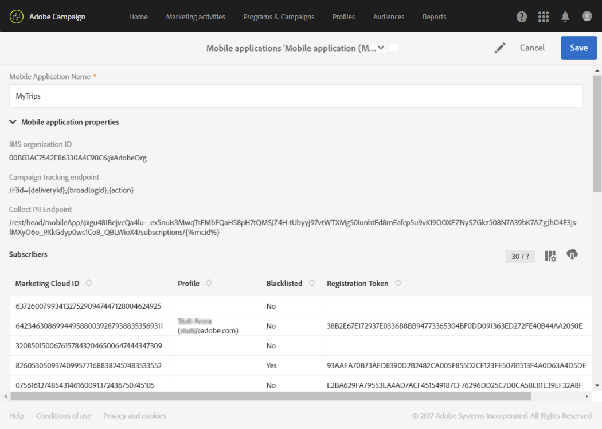

# 設定行動應用程式{#configuring-a-mobile-application}

在行動應用程式上，會收到推播通知或應用程式內訊息，這些應用程式首先需要在Adobe Campaign standard中設定，視您要使用的頻道而定。

* 若要傳送應用程式內訊息和推播通知，您的行動應用程式必須在Adobe Campaign中運用Adobe Experience Platform SDK來設定。 請參 [閱「使用Adobe Experience Platform SDK](#using-adobe-experience-platform-sdk)」。

* 若要僅傳送推播通知，您可以使用SDK V4來設定Adobe Campaign與Adobe Mobile Service之間的整合。 請參 [閱使用SDK V4](#using-sdk-v4)。

在Adobe Campaign中運用Experience Cloud Mobile SDK V4或Experience Platform SDK設定行動應用程式後，必須由管理員在 [!UICONTROL Administration] &gt; [!UICONTROL Channels] &gt;選單下設 [!UICONTROL Mobile app] 定。

>[!CAUTION]
>
>推播通知和應用程式內建置必須由專家使用者執行。 如果您需要協助，請聯絡您的Adobe客戶主管或專業服務合作夥伴。

設定行動應用程式後，您就可以擷取其收集的PII資料，以從資料庫建立或更新描述檔。 如需更多相關資訊，請參閱本節：根 [據行動應用程式資料建立和更新個人檔案資訊](../../channels/using/updating-profile-with-mobile-app-data.md)。

## 使用Adobe Experience Platform SDK {#using-adobe-experience-platform-sdk}

>[!Note]
>
>若要進一步瞭解使用Adobe Experience Platform SDK的Adobe Campaign standard支援的不同行動使用案例，請參閱本 [頁](https://helpx.adobe.com/campaign/kb/configure-launch-rules-acs-use-cases.html)。

若要使用Experience Platform SDK應用程式傳送推播通知和應用程式內訊息，行動應用程式必須在Adobe Experience Platform Experience Platform Launch中設定，並在Adobe Campaign中設定。 如需使用Experience Platform SDK設定行動應用程式的詳細步驟，請參閱本 [頁](https://helpx.adobe.com/campaign/kb/configuring-app-sdkv4.html)。

請依照下列步驟啟動設定：

1. 請確定您可以存取頻 **[!UICONTROL Mobile]** 道：Adobe Campaign中的推播通知和應用程式內訊息。 如果沒有，請連絡您的帳戶團隊。

   

1. 在Experience Platform Launch中建立行動應用程式，方法是建立Mobile類型的屬性。 如需詳細資訊，請參閱 [Experience Platform Launch檔案](https://aep-sdks.gitbook.io/docs/getting-started/create-a-mobile-property#create-a-new-mobile-property) 。
1. 在Experience Platform Launch **[!UICONTROL Adobe Campaign Standard]** 中安裝行動應用程式的擴充功能：

   如需擴充功能的詳細資訊，請參閱 [Experience Platform Launch檔案](https://aep-sdks.gitbook.io/docs/using-mobile-extensions/adobe-campaign-standard) 。

1. 在Adobe Launch中設定應用程式的規則，請參閱在Launch [中設定應用程式](https://helpx.adobe.com/campaign/kb/config-app-in-launch.html#Step1Createdataelements)
1. 在Adobe Campaign standard中設定您的Adobe Launch應用程式，請參 [閱「在Adobe Campaign中設定Adobe Launch應用程式」](https://helpx.adobe.com/campaign/kb/configuring-app-sdk.html#SettingupyourAdobeLaunchapplicationinAdobeCampaign)。
1. 將頻道專用的設定新增至您的行動應用程式設定，請參 [閱Adobe Campaign中頻道專用的應用程式設定](https://helpx.adobe.com/campaign/kb/configuring-app-sdk.html#ChannelspecificapplicationconfigurationinAdobeCampaign)。

   

## 使用SDK V4 {#using-sdk-v4}

與應用程式內部不同，SDK V4和Adobe Experience Platform SDK支援推播通知。 如需將推播通知與行動應用程式搭配使用的詳細步驟，請參閱此 [頁面](https://helpx.adobe.com/campaign/kb/configuring-app-sdkv4.html)。

接收推播通知的行動應用程式必須由管理員在Adobe Campaign介面中設定。 透過設定Adobe Campaign和Adobe Mobile Services，您將能夠將行動應用程式的資料用於促銷活動。

若要傳送推播通知，您必須：

1. 請確定您可以存取Adobe **[!UICONTROL Mobile app]** Campaign中的渠道。
1. 在下列位置設定您的行動應用程式：

   * [Adobe Campaign](https://helpx.adobe.com/campaign/kb/configuring-app-sdkv4.html#SettingupamobileapplicationinAdobeCampaign)。
   * [Adobe Mobile Services](https://helpx.adobe.com/campaign/kb/configuring-app-sdkv4.html#ConfiguringamobileapplicationinAdobeMobileServices)。

1. 執行行動應用程式的特定設定：

   * 將從Adobe Mobile services介面下載的設定檔與行動應用程式封裝。
   * 將Experience Cloud Mobile SDK整合到您的行動應用程式中。

1. 定義您要向應用程式訂閱者收集的資料。 在Adobe Campaign資料庫中擁有描述檔的行動應用程式的訂閱者，會根據您所定義的條件進行協調。

   For more on this, refer to this [page](https://helpx.adobe.com/campaign/kb/configuring-app-sdkv4.html#Collectingsubscribersdatafromamobileapplication).

1. 請在裝置上啟動行動應用程式並登入，以確認設定已順利完成。 請確定您選擇接收通知。
1. 然後，在Adobe Campaign的進階功能表中，選取 **[!UICONTROL Administration]** &gt; **[!UICONTROL Channels]** &gt; **[!UICONTROL Mobile app]**。
1. 從清單中選取您的行動應用程式，以顯示其屬性。 您的訂閱資訊會顯示在訂閱者清單下。

   

1. 若要檢查描述檔已訂閱的行動應用程式，請在選單 **[!UICONTROL Profiles & Audiences > Profiles]** 中選取描述檔，然後按一 **[!UICONTROL Edit profile properties]** 下右側的按鈕。 行動應用程式會列在標 **[!UICONTROL Mobile App Subscriptions]** 簽中。

   