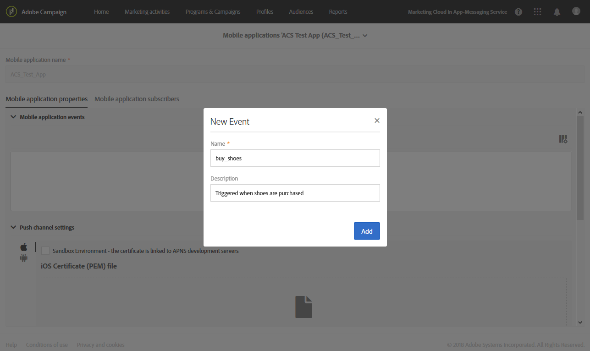

# 設定行動應用程式{#configuring-a-mobile-application}

## 使用Adobe Experience Platform SDK設定行動應用程式 {#using-adobe-experience-platform-sdk}

>[!IMPORTANT]
>
> Adobe Experience Platform Launch已經過品牌重塑，現在是Adobe Experience Platform中的一套資料收集技術。 因此，所有產品檔案中出現了幾項術語變更。 請參閱 [以下檔案](https://experienceleague.adobe.com/docs/experience-platform/tags/term-updates.html) 以取得術語變更的彙整參考資料。

請注意，推播通知和應用程式內實作必須由專家使用者執行。 如需協助，請聯絡您的Adobe客戶主管或專業服務合作夥伴。

若要使用Experience Platform SDK應用程式傳送推播通知和應用程式內訊息，必須在資料收集UI中設定行動應用程式，並在Adobe Campaign中設定。

設定行動應用程式後，您可以擷取其收集的PII資料，以從資料庫建立或更新設定檔。 如需詳細資訊，請參閱本區段： [根據行動應用程式資料建立和更新設定檔資訊](../../channels/using/updating-profile-with-mobile-app-data.md).

若要進一步瞭解Adobe Campaign Standard透過使用Adobe Experience Platform SDK支援的不同行動使用案例，請參閱此 [頁面](../../administration/using/supported-mobile-use-cases.md).

若要完成設定，請完成下列步驟：

1. 在Adobe Campaign中，確定您可以存取下列專案：
   * **[!UICONTROL Push notification]**
   * **[!UICONTROL In-App message]**
   * **[!UICONTROL Adobe Places]**

   如果沒有，請聯絡您的客戶團隊。

1. 檢查您的使用者是否擁有Adobe Campaign Standard的必要許可權和Adobe Experience Platform的標籤。
   * 在Adobe Campaign Standard中，確認IMS使用者屬於標準使用者和管理員產品設定檔。 此步驟可讓使用者登入Adobe Campaign Standard、導覽至Experience Platform SDK行動應用程式頁面，並檢視您在資料收集UI中建立的行動應用程式屬性。

   * 在資料收集UI中，確認您的IMS使用者屬於Experience Platform Launch產品設定檔。
此步驟可讓使用者登入資料收集UI，以建立和檢視屬性。 如需資料收集UI中產品設定檔的詳細資訊，請參閱 [建立您的產品設定檔](https://experienceleague.adobe.com/docs/experience-platform/tags/admin/manage-permissions.html#gain-admin-rights-for-a-tags-product-profile). 在產品設定檔中，公司或屬性上應該沒有許可權設定，但使用者應該能夠仍然登入。

   若要完成安裝擴充功能、發佈應用程式、設定環境等額外工作，您必須在產品設定檔中設定許可權。

1. 在資料收集UI中，建立 **[!UICONTROL Mobile property]**. 如需詳細資訊，請參閱[設定行動裝置屬性](https://developer.adobe.com/client-sdks/documentation/getting-started/create-a-mobile-property)。

1. 在資料收集UI中，按一下 **[!UICONTROL Extensions]** 標籤，前往 **[!UICONTROL Catalog]**，並搜尋 **[!UICONTROL Adobe Campaign Standard]** 副檔名。 如需詳細資訊，請參閱 [Adobe Campaign Standard](https://developer.adobe.com/client-sdks/documentation/adobe-campaign-standard).

1. 若要在Campaign Standard中支援位置使用案例，請安裝 **[!UICONTROL Places]** 資料收集UI中的擴充功能。 請參閱此 [頁面](https://developer.adobe.com/client-sdks/solution/places).

1. 在Adobe Campaign Standard中，設定您在資料收集UI中建立的行動裝置屬性。 請參閱 [在Adobe Campaign中設定Adobe Experience Platform Launch應用程式](../../administration/using/configuring-a-mobile-application.md#set-up-campaign).

1. 將通道專屬設定新增至您的行動應用程式設定。
如需詳細資訊，請參閱[ Adobe Campaign 中的通道特定應用程式設定](../../administration/using/configuring-a-mobile-application.md#channel-specific-config)。

1. 如有需要，您可以刪除標籤屬性。
如需詳細資訊，請參閱 [正在刪除您的應用程式](../../administration/using/configuring-a-mobile-application.md#delete-app).

## 從Launch技術工作流程同步行動應用程式AEPSDK {#aepsdk-workflow}

在資料收集UI中建立和設定行動屬性後， **[!UICONTROL Sync Mobile app AEPSDK from Launch]** 技術工作流程現在將同步在Adobe Campaign Standard中匯入的標籤行動屬性。

根據預設，技術工作流程每15分鐘啟動一次。 如有需要，可以手動重新啟動：

1. 在Adobe Campaign Standard中，從進階功能表選取 **[!UICONTROL Administration]** > **[!UICONTROL Application Settings]** > **[!UICONTROL Workflows]**.
1. 開啟 **[!UICONTROL Sync Mobile app AEPSDK from Launch (syncWithLaunch)]** 工作流程。

   

1. 按一下 **[!UICONTROL Scheduler]** 活動。

1. 選取 **[!UICONTROL Immediate execution]**。

   

您的工作流程現在將重新啟動並同步在Adobe Campaign Standard中匯入的標籤行動屬性。

## 在Adobe Campaign中設定您的應用程式 {#set-up-campaign}

若要在Campaign中使用標籤行動屬性，您也必須在Adobe Campaign中設定此屬性。 在Adobe Campaign中，確認IMS使用者屬於標準使用者和管理員產品設定檔。

您必須等待技術工作流程執行，並將標籤行動屬性同步至Adobe Campaign。 然後，您可以在Adobe Campaign中加以設定。

如需從Launch技術工作流程同步行動應用程式AEPSDK的詳細資訊，請參閱此 [區段](../../administration/using/configuring-a-mobile-application.md#aepsdk-workflow).

>[!NOTE]
>
>依預設，組織單位設定為「全部」的管理員可以編輯行動應用程式。

1. 從進階功能表中，選取 **[!UICONTROL Administration]** > **[!UICONTROL Channels]** > **[!UICONTROL Mobile app (AEP SDK)]**.

   

1. 選取您在資料收集UI中建立的行動應用程式。
其 **[!UICONTROL Property Status]** 應為 **[!UICONTROL Ready to configure]**.

   >[!NOTE]
   >
   >根據預設，若要擷取在資料收集UI中建立的行動應用程式清單，Campaign Standard會使用NmsServer_URL選項中定義的值來尋找相符的屬性。
   >
   >在某些情況下，行動應用程式的Campaign端點可能會與NmsServer_URL中定義的端點不同。 在此情況下，請在 `Launch_URL_Campaign` 選項。 Campaign將使用此選項的值在資料收集UI中尋找相符的屬性。

   

1. 您可以在底下變更行動應用程式的組織單位 **[!UICONTROL Access Authorization]** 區段來限制特定組織單位對此行動應用程式的存取。 如需詳細資訊，請參閱此頁面。

   在此，管理員可以從下拉式清單中選取子組織單位，以指派子組織單位。

   

1. 若要建立Campaign與Adobe Experience Platform中的標籤之間的連線，請按一下 **[!UICONTROL Save]**.

1. 確認行動應用程式的狀態已從變更 **[!UICONTROL Ready to Configure]** 至 **[!UICONTROL Configured]**.

   當Campaign擴充功能顯示金鑰已成功設定時，您也可以驗證屬性已在Campaign中成功設定。

   

1. 為了讓此設定生效，變更需要在資料收集UI中發佈。

   如需詳細資訊，請參閱 [發佈設定](https://developer.adobe.com/client-sdks/documentation/getting-started/create-a-mobile-property/#publish-the-configuration)

## Adobe Campaign中的通道特定應用程式設定 {#channel-specific-config}

您的行動應用程式現在已準備好用於Campaign的推播通知或應用程式內傳遞。 您現在可以根據需要進一步設定，以建立將觸發應用程式內訊息和/或上傳推送憑證的事件。

1. 從進階功能表中，選取 **[!UICONTROL Administration]** > **[!UICONTROL Channels]** > **[!UICONTROL Mobile app (AEP SDK)]**.

1. 選取您在資料收集UI中建立和設定的行動應用程式。

1. 在 **[!UICONTROL Mobile application properties]** 索引標籤上，您可以開始新增行動應用程式中可用於應用程式內訊息的事件。

1. 若要設定事件，請按一下 **[!UICONTROL Create Element]**.

   

1. 輸入名稱和說明。

   

1. 按一下&#x200B;**[!UICONTROL Add]**。

   現在，當您建立應用程式內訊息時，事件會顯示在「觸發器」索引標籤上。 如需詳細資訊，請參閱 [準備和傳送應用程式內訊息](../../channels/using/preparing-and-sending-an-in-app-message.md).

1. 在 **[!UICONTROL Device-specific settings]** 行動應用程式控制面板的區段，針對每個裝置提供應用程式詳細資訊。

   * +++ 適用於iOS

     輸入下列應用程式明細：

      * **應用程式ID (iOS套件組合ID)**：請參閱 [Apple檔案](https://developer.apple.com/documentation/appstoreconnectapi/bundle_ids) 以取得套件組合ID的詳細資訊。
      * **iOS憑證(P8)檔案**：拖放您的.p8驗證金鑰。
      * **金鑰ID**：請參閱 [Apple檔案](https://developer.apple.com/help/account/manage-keys/get-a-key-identifier/) 以取得金鑰ID的詳細資訊。
      * **iOS團隊ID**：請參閱 [Apple檔案](https://developer.apple.com/help/account/manage-your-team/locate-your-team-id//) 以取得有關iOS團隊ID的詳細資訊。

        
+++

   * +++ 適用於Android

     輸入下列應用程式明細：

      * **應用程式ID （Android套件名稱）**：請參閱 [Android檔案](https://support.google.com/admob/answer/9972781?hl=en#:~:text=The%20package%20name%20of%20an,supported%20third%2Dparty%20Android%20stores) 以取得封裝名稱的詳細資訊。
      * **Android金鑰(Json)檔案**：拖放您的.json私密金鑰檔案。

        
+++

1. 上傳憑證後，系統會顯示一則訊息，通知您上傳成功並顯示憑證的到期日。

1. 按一下 **[!UICONTROL Mobile application subscribers]** 標籤即可檢視訂閱者清單以及有關這些訂閱者的其他資訊，例如他們是否選擇退出您的通知。

## 正在刪除您的應用程式 {#delete-app}

>[!CAUTION]
>
>刪除您的應用程式無法還原。

若要刪除您的應用程式，請完成中的步驟 [刪除行動屬性](https://developer.adobe.com/client-sdks/documentation/adobe-campaign-standard/#deleting-mobile-properties-in-the-data-collection-ui).

刪除應用程式後，請在Adobe Campaign中確認應用程式的屬性狀態是否已正確更新為「Launch中的已刪除」。

按一下Adobe Campaign中的應用程式，即可選擇按一下「從Campaign刪除」 ，將此應用程式從Adobe Campaign中完全移除。

