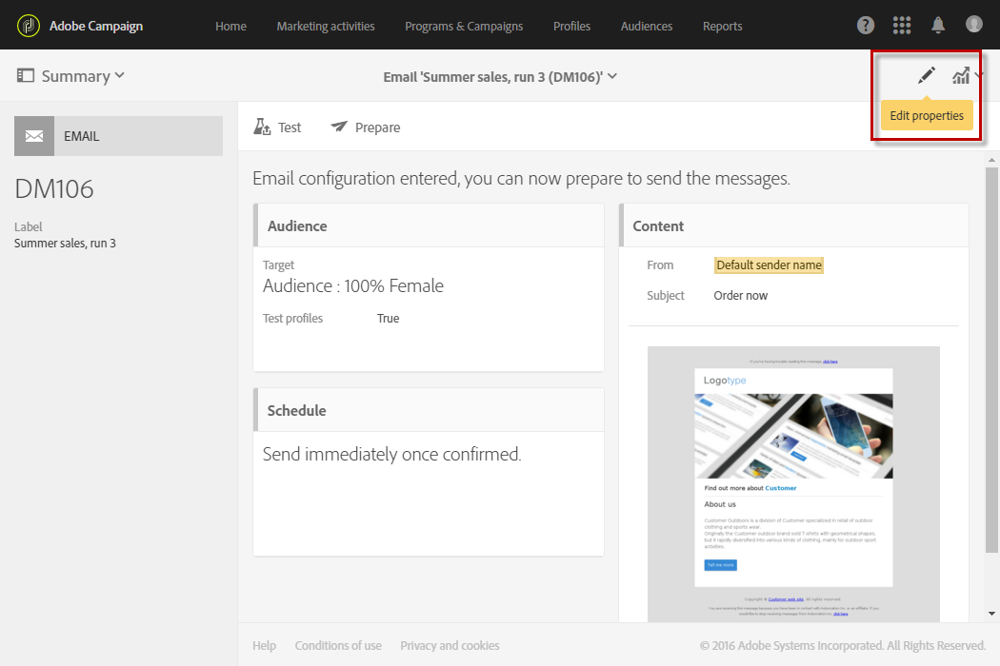
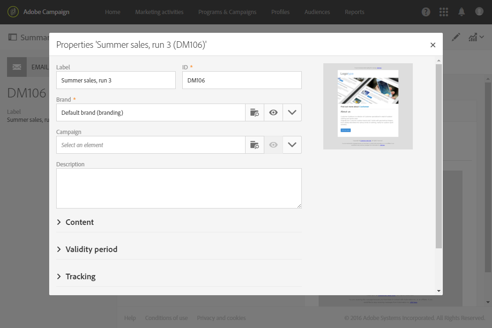

# 設定電子郵件通道{#configuring-email-channel}

身為促銷活動 [管理員](../../administration/using/users-management.md#functional-administrators)，您可以設定電子郵件渠道設定。 這些進階設定包括一般電子郵件通道參數、電子郵件傳送帳戶、電子郵件處理規則和電子郵件屬性。 在本頁，您將學習如何編輯一般電子郵件和傳送參數的預設值。

請注意，有些電子郵件設定現在由Adobe Campaign Enhanced MTA管理。 因此：
* 促銷活動使用者介面中的某些設定不再套用：
   * 「設 **[!UICONTROL Retries]** 定」選單 [和「傳送」電子郵](#email-channel-parameters) 件屬性參數中的設定  。
   * 「電 **[!UICONTROL MX management]** 子郵 **[!UICONTROL Domain management]** 件處理規 [則」選單中的和規則](#email-processing-rules)。

* 其他參數現在由「增強的MTA」部分管理，而某些設定仍可在「促銷活動」中完成。 受影響的設定如下：
   * 功能 **[!UICONTROL Message delivery duration]** 表中的參 **[!UICONTROL Configuration]** 數。 For more on this, see [this section](#email-channel-parameters).
   * 節 **[!UICONTROL Delivery duration]** 中 **[!UICONTROL Validity limit for sending messages]** 的或 **[!UICONTROL Validity period]** 參數。 For more on this, see [this section](#validity-period-parameters).
   * 中 **[!UICONTROL Bounce mails]** 的規則 **[!UICONTROL Email processing rules]**。 For more on this, see [this section](#email-processing-rules).

## 電子郵件通道參數 {#email-channel-parameters}

電子郵件設定畫面可用來定義電子郵件頻道的參數。 管理員可以在> > > **[!UICONTROL Administration]>功能表中存取這些[!UICONTROL Channels][!UICONTROL Email][!UICONTROL Configuration]**設定。

* **授權遮色片欄位**

   列出 **[!UICONTROL Header parameters of sent emails]** 可用來傳送電子郵件給收件者（寄件者位址）並通知其任何錯誤（錯誤位址）的授權電子郵件地址。  Adobe Campaign會檢查輸入的地址在訊息準備階段是否有效。 此操作模式可確保不使用任何可能觸發傳遞性問題的地址。
   * 傳送者和錯誤位址皆由Adobe設定。 這些欄位不能是空的。
   * 您無法編輯這些欄位。 若要更新地址，請聯絡Adobe客戶服務團隊。
   * 若要新增其他位址，您可以使用 [「控制面板](https://docs.adobe.com/content/help/en/control-panel/using/subdomains-and-certificates/setting-up-new-subdomain.html) 」來設定新的子網域，或聯絡Adobe客戶服務團隊。 請注意，如果使用數個遮色片，則會以逗號分隔。
   * 使用星號（例如*@yourdomain.com）來設定位址是個很好的作法： 它可讓您使用以子網域名稱結尾的任何位址。

* **可傳遞性**

   由 **[!UICONTROL Delivery reports ID]** Adobe客戶服務團隊提供。 它使用技術傳遞能力報告中使用的傳遞能力ID來識別每個實例。
   <!--The Technical Deliverability report is not accessible through the UI in ACS. It will be replaced with 250ok in the future (project starting).-->

* **傳送參數**

   Adobe Campaign會從開始日期開始傳送訊息。 該 **[!UICONTROL Message delivery duration]** 欄位允許您指定消息的發送期間。

   >[!IMPORTANT]
   >
   >**現在，促銷活動中的此參數只有在設定為3.5天或更少時才使用。** 如果您定義的值高於3.5天，則不會考慮該值，因為Adobe Campaign Enhanced MTA現在會管理它。

   此欄 **[!UICONTROL Online resources validity duration]** 位用於上傳的資源，主要用於鏡像頁面和影像。 本頁上的資源在限定時間內有效（以節省磁碟空間）。

* **重試次數**

   暫時未傳送的訊息可能會自動重試。 如需詳細資訊，請參 [閱傳送暫時失敗後重試](../../sending/using/understanding-delivery-failures.md#retries-after-a-delivery-temporary-failure)。

   >[!NOTE]
   >
   >Adobe Campaign Enhanced MTA現在會根據IP在歷史和目前指定網域的執行狀況，管理要執行的最大重試次數和兩次重試之間的最小延遲。 將忽 **略促銷活動** 中的「重試次數」設定。

   <!--This section indicates how many retries should be performed the day after the send is started (**Number of retries**) and the minimum delay between retries (**Retry period**). By default, five retries are scheduled for the first day with a minimum interval of one hour, spread out over the 24 hours of the day. One retry per day is programmed after that and until the delivery deadline, which is defined in the **[!UICONTROL Delivery parameters]** section.-->

* **電子郵件隔離參數**

   在欄位 **[!UICONTROL Time between two significant errors]** 中輸入值，以定義應用程式在發生故障時，在增加錯誤計數器之前等待的時間。 預設值為 **&quot;1d&quot;**,1天。

   到達值 **[!UICONTROL Maximum number of errors before quarantine]** 後，會隔離電子郵件地址。 預設值為 **&quot;5&quot;**: 第五個錯誤時，地址將被隔離。 這表示該連絡人將自動排除在後續傳送之外。
   <!--Actually the way ACS works is that the address is already on the quarantine list on the first bounce, but with a different status meaning that the error count has started.-->

   有關隔離的詳細資訊，請參 [閱瞭解隔離管理](../../sending/using/understanding-quarantine-management.md)。

## 電子郵件傳送帳戶 {#email-routing-accounts}

預設 **[!UICONTROL Integrated email routing]** 會提供外部帳戶。 它包含允許應用程式傳送電子郵件的技術參數。

帳戶類型必須一律設 **[!UICONTROL Routing]**&#x200B;定為、渠道 **[!UICONTROL Email]** 和傳送模式設定為 **[!UICONTROL Bulk delivery]**。

**相關主題**:

[外部帳戶](../../administration/using/external-accounts.md)

## 電子郵件處理規則 {#email-processing-rules}

管理 **[!UICONTROL Email processing rules]** 員可通過菜單訪問 **[!UICONTROL Administration > Channels > Email]** 該。

請注意，電子郵件網域和MX規則現在由Adobe Campaign Enhanced MTA管理：
* **DKIM(DomainKeys Indified Mail)** ，電子郵件驗證簽署由「增強的MTA」針對所有網域的所有訊息完成。 除非在「增強的MTA」 **層級另有指定**，否則不會使用「傳送者ID **」、「網域金鑰**」或「 **S/MIME** 」進行簽署。
* 增強型MTA使用其專屬的MX規則，可讓它根據您過去的電子郵件信譽，以及您傳送電子郵件的網域所提供的即時回應，依網域自訂您的吞吐量。

### 彈回郵件 {#bounce-mails}

非同步彈回數仍由Campaign inMail程式透過規則來 **[!UICONTROL Bounce mails]** 限定。

此規則包含可由遠端伺服器傳回的字元字串清單，讓您限定錯誤(**Hard**、 **Soft** 或 **Ignored**)。

>[!NOTE]
>
>對於同步傳送失敗錯誤訊息，Adobe Campaign Enhanced MTA會決定反彈類型和資格，並將該資訊傳回至Campaign。

有關彈回郵件資格的詳細資訊，請參 [閱本節](../../sending/using/understanding-delivery-failures.md#bounce-mail-qualification)。

<!--Because they are now managed by the Enhanced MTA, the bounce qualifications in the Campaign **[!UICONTROL Message qualification]** table are no longer used. For more on bounce mail qualification, see this [section](../../sending/using/understanding-delivery-failures.md#bounce-mail-qualification).

### Management of email domains {#managing-email-domains}

The email domains are now managed by the Adobe Campaign Enhanced MTA. The Adobe Campaign **[!UICONTROL Domain management]** rules are no longer used.

**DKIM (DomainKeys Identified Mail)** email authentication signing is done by the Enhanced MTA for all messages with all domains. It does not sign with **Sender ID**, **DomainKeys**, or **S/MIME** unless otherwise specified at the Enhanced MTA level.

### MX management {#mx-management}

The MX rules are now managed by the Adobe Campaign Enhanced MTA. The Adobe Campaign **[!UICONTROL MX management]** delivery throughput rules are no longer used.

The Enhanced MTA uses its own MX rules that allow it to customize your throughput by domain based on your own historical email reputation, and on the real-time feedback coming from the domains where you are sending emails.-->

## 電子郵件屬性清單 {#list-of-email-properties}

本節詳細說明電子郵件或電子郵件範本的屬性畫面中可用的參數清單。

>[!NOTE]
>
>有些參數只適用於範本。 您可存取的參 [數取決於您的權限](../../administration/using/users-management.md)。

若要編輯電子郵件或電子郵件範本的屬性，請使用按 **[!UICONTROL Edit properties]** 鈕。

### 一般參數 {#general-parameters}

在電子郵件參數畫面頂端，使用和欄位識別 **[!UICONTROL Label]** 電子 **[!UICONTROL ID]** 郵件。 此資訊會顯示在介面中，但訊息收件者看不到。

>[!IMPORTANT]
>
>ID必須是唯一的。

欄位 **[!UICONTROL Brand]** 可讓您選取連結至傳送的品牌。 有關使用和設定品牌的詳細資訊，請參閱「品 [牌](../../administration/using/branding.md) 」一節。

欄位 **[!UICONTROL Campaign]** 可讓您輸入連結至電子郵件的促銷活動。

您也可以在對應欄 **[!UICONTROL Description]** 位中新增影像，並編輯清單中電子郵件縮圖上顯示的影像。

### 傳送參數 {#sending-parameters}

此 **[!UICONTROL Send]** 區段僅適用於電子郵件範本。 它包含下列參數：

#### 重試參數 {#retries-parameters}

暫時未傳送的訊息可能會自動重試。 如需詳細資訊，請參 [閱傳送暫時失敗後重試](../../sending/using/understanding-delivery-failures.md#retries-after-a-delivery-temporary-failure)。

>[!NOTE]
>
>Adobe Campaign Enhanced MTA現在會根據IP在歷史和目前指定網域的執行狀況，來管理兩次重試之間的最小延遲和要執行的最大重試次數。 將忽略「 **促銷活動** 重試次數」設定。

<!--This section indicates how many retries should be performed the day after the send is started ( **[!UICONTROL Max. number of retries]** ) and the minimum delay between retries ( **[!UICONTROL Retry period]** ).

By default, five retries are scheduled for the first day with a minimum interval of one hour, spread out over the 24 hours of the day. One retry per day is programmed after that and until the delivery deadline, which is defined in the [Validity period parameters](#validity-period-parameters) section.

The number of retries can be changed globally (contact your Adobe technical administrator) or for each delivery or delivery template.-->

在「 **促銷活動」中設定的傳送持續** (在「有效期間參數 [」區段中定義)](#validity-period-parameters) 設定仍將接受，但最多只能接受3.5天 ****。 此時，重試佇列中的任何訊息都會從佇列中移除，並以彈回數的形式傳回。 如需傳送失敗的詳細資訊，請參 [閱本節](../../sending/using/understanding-delivery-failures.md#about-delivery-failures)。

#### 電子郵件格式參數 {#email-format-parameters}

您可以設定要傳送的電子郵件格式。 有三種可用選項：

* **使用收件者偏好設定** （預設模式）: 消息格式根據儲存在收件人配置檔案中的資料定義，並預設儲存在 **Email format** 欄位(@emailFormat)中。 如果收件者希望以特定格式接收訊息，則此格式為傳送的格式。 如果欄位未完成，則會傳送多部分替代訊息（請參閱下面）。
* **讓收件者郵件用戶端選擇最適合的格式（多部分替代）**: 消息包含兩種格式： 文字和HTML。 接收時顯示的格式取決於收件人的郵件軟體（多部分替代）的配置。

   >[!IMPORTANT]
   >
   >此選項包含兩個版本的訊息。 因此，它會影響傳送吞吐量，因為消息大小較大。

* **以文字格式傳送所有訊息**: 訊息會以文字格式傳送。 HTML格式不會傳送，但僅當收件者按一下訊息中的連結時，才會用於鏡像頁面。

#### SMTP測試模式 {#smtp-test-mode}

此選 **[!UICONTROL Enable SMTP test mode]** 項允許您測試通過SMTP連接發送的電子郵件，而不實際發送郵件。
這些消息將被處理，直到與SMTP伺服器建立連接為止，但不會發送這些消息。

此選項適用於電子郵件和電子郵件範本。

如果為電子郵件模板啟用SMTP測試模式選項，則根據此模板建立的所有電子郵件都將啟用此選項。

>[!IMPORTANT]
>
>如果為電子郵件啟用此選項，則在取消勾選該選項之前，不會傳送任何訊息。
>電子郵件或電子郵件範本控制面板中會顯示警告。

有關配置SMTP的詳細資訊，請參閱「電子郵 [件SMTP參數清單」部分](#list-of-email-smtp-parameters) 。

### 有效期參數 {#validity-period-parameters}

該 **[!UICONTROL Validity period]** 部分包含以下參數：

* **[!UICONTROL Explicitly set validity dates]**: 取消選中此框後，您必須在和欄位中輸入 **[!UICONTROL Delivery duration]** 持續時間 **[!UICONTROL Resource validity limit]** 。

   如果您想要定義特定的時間和日期，請勾選此方塊。

   

* **[!UICONTROL Delivery duration]** / **[!UICONTROL Validity limit for sending messages]**: Adobe Campaign會從開始日期開始傳送訊息。 此欄位允許您指定消息的發送期間。

   >[!IMPORTANT]
   >
   >此參數現在由Adobe Campaign Enhanced MTA管理。 **您必須定義最多3.5天的值。** 如果您定義的值高於3.5天，則不會考慮該值。

* **[!UICONTROL Resource validity duration]** / **[!UICONTROL Validity limit date for resources]**: 此欄位用於上傳的資源，主要用於鏡像頁面和影像。 本頁上的資源在限定時間內有效（以節省磁碟空間）。
* **[!UICONTROL Mirror page management]**: 鏡像頁是可通過Web瀏覽器線上上訪問的HTML頁。 其內容與電子郵件內容相同。 預設情況下，如果連結插入郵件內容中，將生成鏡像頁。 此欄位可讓您修改產生此頁面的方式：

   >[!IMPORTANT]
   >
   >必須已為要建立鏡像頁面的電子郵件定義HTML內容。

   * **[!UICONTROL Generate the mirror page if a mirror link appears in the email content]** （預設模式）: 如果連結插入郵件內容，則生成鏡像頁。
   * **強制生成鏡像頁**: 即使消息中未插入到鏡像頁的連結，也會建立鏡像頁。
   * **不生成鏡像頁**: 不會產生任何鏡像頁面，即使連結位於訊息中亦然。
   * **生成僅使用消息ID可訪問的鏡像頁**: 此選項可讓您在傳送記錄視窗中存取包含個人化資訊的鏡像頁面內容。

>[!NOTE]
>
>參數 **[!UICONTROL Delivery duration]** 不適用於事務性消息。 有關交易式訊息的詳細資訊，請參 [閱本節](../../channels/using/about-transactional-messaging.md)。

### 追蹤參數 {#tracking-parameters}

該 **[!UICONTROL Tracking]** 部分包含以下參數：

* **[!UICONTROL Activate tracking]**: 可讓您啟用／停用訊息URL追蹤。 若要管理每個訊息URL的追蹤，請使用「電子郵 **[!UICONTROL Links]** 件設計器」動作列中的圖示。 請參 [閱關於追蹤的URL](../../designing/using/links.md#about-tracked-urls)。
* **[!UICONTROL Tracking validity limit]**: 可讓您定義在URL上啟動追蹤的持續時間。
* **[!UICONTROL Substitution URL for expired URLs]**: 您可以輸入URL至追蹤過期後將顯示的網頁。

### 高級參數 {#advanced-parameters}

該節 **[!UICONTROL Advanced parameters]** 包含多個參數。

第一個欄位可讓您輸入必要資訊，以製作電子郵件標題。 您可以在此處管理回覆位址和文字，以及傳送者位址（填入「寄件者：」欄位）。 這些資訊可以個人化。

按一下將要變更之欄位右側的按鈕，然後新增個人化欄位、內容區塊或動態文字。

「個人化電子郵件內容」檔案中詳細說明了插 [入和使用個人化](../../designing/using/personalization.md) 內容。

#### 目標內容 {#target-context}

定位內容可讓您定義一組表格，這些表格將用於電子郵件定位（在對象定義畫面中）和個人化（在HTML內容編輯器中定義個人化欄位）。

#### 路由 {#routing}

此欄位指明所使用的路由模式。 它參考外部帳戶。 例如，如果您想要使用包含特定品牌設定的外部帳戶，則可使用此帳戶。

>[!NOTE]
>
>外部帳戶可透過「管理 **>應用程式** 設定 **>外部帳** 戶」功能表存取 **** 。

#### 準備 {#preparation}

「批准消息」部分中將詳細 [介紹準備消息](../../sending/using/preparing-the-send.md) 。

* **[!UICONTROL Typology]**: 在傳送之前，必須準備訊息，才能驗證內容和設定。 在準備階段期間應用的驗證規則以類型學 **定義**。 例如，對於電子郵件，準備包括檢查主題、URL和影像等。 選擇要在此欄位中應用的類型學。

   >[!NOTE]
   >
   >本節會顯示可透過> **[!UICONTROL Administration]** > **[!UICONTROL Channels]** > **[!UICONTROL Typologies]** 選單存取的 [類型](../../sending/using/about-typology-rules.md)。

* **[!UICONTROL Compute the label during delivery preparation]**: 可讓您使用個人化欄位、內容區塊和動態文字，在訊息準備階段計算電子郵件的標籤值。

   您也可以使用已宣告至工作流程外部訊號活動的事件變數來個人化傳送標籤。 如需詳細資訊，請參閱[本小節](../../automating/using/calling-a-workflow-with-external-parameters.md)。

* **[!UICONTROL Save SQL queries in the log]**: 此選項允許您在準備階段期間在日誌中添加SQL查詢日誌。

#### 校對設定 {#proof-settings}

本節允許您配置要在校對的主題行中使用的預設前置詞。 For more in this, refer to [this section](../../sending/using/sending-proofs.md).

### 電子郵件SMTP參數清單 {#list-of-email-smtp-parameters}

該 **[!UICONTROL SMTP]** 部分包含以下參數：

* **[!UICONTROL Character encoding]**: 如果 **[!UICONTROL Force encoding]** 要強制進行消息編碼，請選中該框，然後選擇要使用的編碼。
* **[!UICONTROL Bounce mails]**: 根據預設，彈回郵件會在平台的錯誤收件匣(定義於 **[!UICONTROL Administration]** > **[!UICONTROL Channels]** > **[!UICONTROL Email]** >畫面)中收到 **[!UICONTROL Configuration]** 。 要定義電子郵件的特定錯誤地址，請在欄位中輸入該 **[!UICONTROL Error address]** 地址。
* **[!UICONTROL Additional SMTP headers]**: 此選項允許在消息中添加其他SMTP標頭。 在欄位中輸入的 **[!UICONTROL Headers]** 指令碼必須參照每行一個標題，其形式 **為name:value**。 如有必要，值會自動編碼。

   >[!IMPORTANT]
   >
   >為高級用戶保留添加用於插入其他SMTP標頭的指令碼。 此指令碼的語法必須符合以下內容類型的要求： 沒有未使用的空間，沒有空行等。

### 訪問授權參數清單 {#list-of-access-authorization-parameters}

該 **[!UICONTROL Access authorization]** 部分包含以下參數：

* 欄位 **[!UICONTROL Organizational unit]** 可讓您限制特定使用者存取此電子郵件。 與指定設備或父設備關聯的用戶將擁有此電子郵件的讀寫權限。 與子設備關聯的用戶將只具有對此電子郵件的讀取訪問權限。

   >[!NOTE]
   >
   >您可以透過「管理>使用者與 **安全性** 」功 **能表來設定組織單位** 。

* 自 **[!UICONTROL Created by]**&#x200B;動完 **[!UICONTROL Created]**&#x200B;成、 **[!UICONTROL Modified by]** 和 **[!UICONTROL Last modified]** 欄位。
