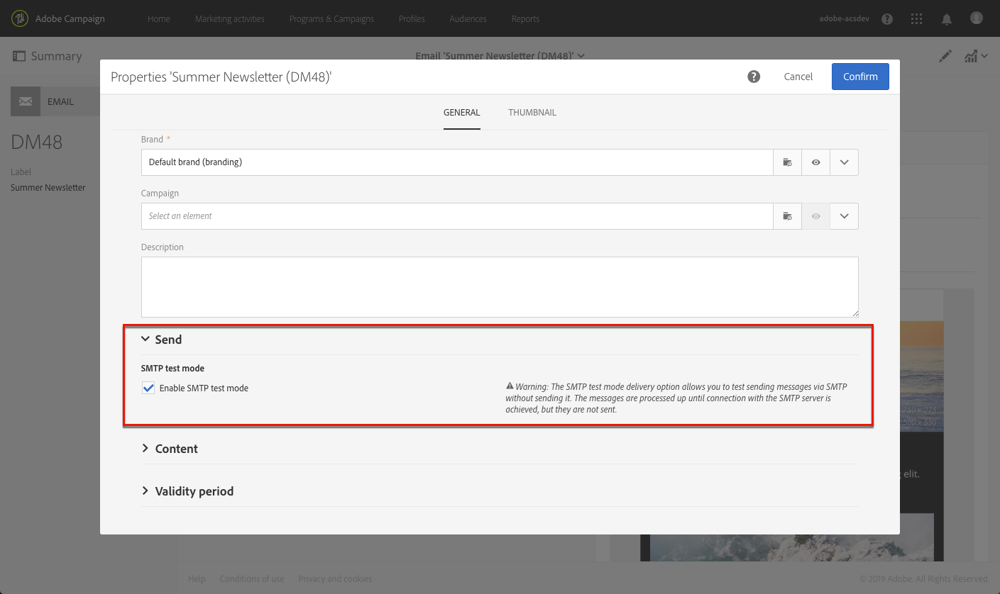

# 設定電子郵件通道{#configuring-email-channel}

身為 Campaign [管理員](../../administration/using/users-management.md#functional-administrators)，您可以進行電子郵件通道設定。這些進階設定包含一般電子郵件通道參數、電子郵件路由帳戶、電子郵件處理規則和電子郵件屬性。在本頁，您將學會如何編輯一般電子郵件和傳送參數的預設值。

## 電子郵件通道參數 {#email-channel-parameters}

電子郵件設定畫面可用於定義電子郵件通道的參數。管理員可以存取「**[!UICONTROL Administration]> [!UICONTROL Channels] > [!UICONTROL Email] >[!UICONTROL Configuration]**」功能表中的這些設定。

* **授權遮罩欄位**

   **[!UICONTROL Header parameters of sent emails]** 小節列出您可用於傳送電子郵件給收件者（寄件者地址），並讓他們傳回自動回覆的電子郵件地址，例如非同步退件、休假回覆等。（錯誤地址）。Adobe Campaign 會檢查所輸入的地址在訊息準備階段期間是否有效。此操作模式可確保不使用任何可能觸發傳送能力問題的地址。
   * 寄件者和錯誤位址皆由 Adobe 設定。那些欄位不可為空白。
   * 您無法編輯那些欄位。若要更新地址，請聯絡 Adobe 客戶服務團隊。
   * 若要新增其他地址，您可以使用 「[控制面板](https://docs.adobe.com/content/help/zh-Hant/control-panel/using/subdomains-and-certificates/setting-up-new-subdomain.html)」來設定新的子網域，或聯絡 Adobe 客戶服務團隊。請注意，如果使用數個遮罩，則會以逗號分隔。
   * 使用星號（例如 *@yourdomain.com）來設定地址是很理想的作法：這可讓您使用以子網域名稱結尾的任何地址。

* **傳送能力**

   **[!UICONTROL Delivery reports ID]** 是由 Adobe 客戶服務團隊提供。其會使用技術傳送能力報告中使用的傳送能力 ID 來識別每個執行個體。
   <!--The Technical Deliverability report is not accessible through the UI in ACS. It will be replaced with 250ok in the future (project starting).-->

* **傳送參數**

   Adobe Campaign 會從開始日期開始傳送訊息。

   **[!UICONTROL Message delivery duration]** 欄位可讓您指定傳送中遇到暫時錯誤或軟退信之任何郵件會重試的時間範圍。

   >[!IMPORTANT]
   >
   >**現在，只有當設定為 3.5 天或更短時間時，才會在 Campaign 中使用此參數。** 如果您定義的值超過　3.5　天，則不會考慮該值。

   **[!UICONTROL Online resources validity duration]** 欄位是用於上傳的資源，主要用於鏡像頁面和影像。本頁上的資源在限定時間內有效（以節省磁碟空間）。

* **重試次數**

   暫時未傳送的郵件可能會自動重試。如需詳細資訊，請參閱[傳送暫時失敗後重試](../../sending/using/understanding-delivery-failures.md#retries-after-a-delivery-temporary-failure)。

   >[!IMPORTANT]
   >
   >要執行的最大重試次數和兩次重試之間的最小延遲現在取決於IP在歷史域和當前給定域上的執行情況。 促銷活動中的&#x200B;**[!UICONTROL Retry period]**&#x200B;和&#x200B;**[!UICONTROL Number of retries]**&#x200B;設定將被忽略。

   <!--This section indicates how many retries should be performed the day after the send is started (**Number of retries**) and the minimum delay between retries (**Retry period**). By default, five retries are scheduled for the first day with a minimum interval of one hour, spread out over the 24 hours of the day. One retry per day is programmed after that and until the delivery deadline, which is defined in the **[!UICONTROL Delivery parameters]** section.-->

* **電子郵件隔離參數**

   在欄位 **[!UICONTROL Time between two significant errors]** 中輸入值，以定義應用程式在發生軟退信失敗時增加錯誤計數器之前等待的時間。1 天的預設值是 **&quot;1d&quot;**。

   達到值 **[!UICONTROL Maximum number of errors before quarantine]** 時，則會隔離電子郵件地址。預設值是 **&quot;5&quot;**：發生第五個錯誤時，將會隔離該地址。這表示該在後續傳送時將自動排除該聯絡人。
   <!--Actually the way ACS works is that the address is already on the quarantine list on the first bounce, but with a different status meaning that the error count has started.-->

   如需隔離的詳細資訊，請參閱[瞭解隔離管理](../../sending/using/understanding-quarantine-management.md)。

## 電子郵件路由帳戶{#email-routing-accounts}

預設會提供 **[!UICONTROL Integrated email routing]** 外部帳戶。其包含可讓應用程式傳送電子郵件的技術參數。

帳戶類型必須一律設定為 **[!UICONTROL Routing]**、通道設定為 **[!UICONTROL Email]**，而且傳送模式設定為 **[!UICONTROL Bulk delivery]**。

**相關主題**：

[外部帳戶](../../administration/using/external-accounts.md)

## 電子郵件處理規則 {#email-processing-rules}

管理員 **[!UICONTROL Email processing rules]** 可透過功能表存取 **[!UICONTROL Administration > Channels > Email]**。

>[!IMPORTANT]
>
>電子郵件網域和MX規則現在會自動管理<!--by the Adobe Campaign Enhanced MTA (Message Transfer Agent)-->，無法變更。

* **DKIM(DomainKeys Indified Mail)電子郵件驗** 證簽署會針對所有網域的所有訊息完成。它不會與&#x200B;**傳送者ID**、**DomainKeys**&#x200B;或&#x200B;**S/MIME**&#x200B;簽署。
* MX規則會根據您過去的電子郵件信譽，以及您傳送電子郵件的網域所提供的即時回應，依網域自訂您的吞吐量。

<!--Note that the email domains and the MX rules are now managed by the Adobe Campaign Enhanced MTA:
* **DKIM (DomainKeys Identified Mail)** email authentication signing is done by the Enhanced MTA for all messages with all domains. It does not sign with **Sender ID**, **DomainKeys**, or **S/MIME** unless otherwise specified at the Enhanced MTA level.
* The Enhanced MTA uses its own MX rules that allow it to customize your throughput by domain based on your own historical email reputation, and on the real-time feedback coming from the domains where you are sending emails.-->

### 退回郵件 {#bounce-mails}

非同步退信仍由 Campaign inMail 程序透過 **[!UICONTROL Bounce mails]** 規則來限定。

這些規則包含可由遠端伺服器傳回的字元字串清單，可讓您限定錯誤（**Hard**、**Soft** 或 **Ignored**）。

>[!IMPORTANT]
>
>同步傳送失敗錯誤訊息現在由Adobe Campaign Enhanced MTA限定，此MTA可決定反彈類型和資格，並將該資訊傳回至Campaign。

有關退信限定的詳細資訊，請參閱[本節](../../sending/using/understanding-delivery-failures.md#bounce-mail-qualification)。

<!--Because they are now managed by the Enhanced MTA, the bounce qualifications in the Campaign **[!UICONTROL Message qualification]** table are no longer used. For more on bounce mail qualification, see this [section](../../sending/using/understanding-delivery-failures.md#bounce-mail-qualification).

### Management of email domains {#managing-email-domains}

The email domains are now managed by the Adobe Campaign Enhanced MTA. The Adobe Campaign **[!UICONTROL Domain management]** rules are no longer used.

**DKIM (DomainKeys Identified Mail)** email authentication signing is done by the Enhanced MTA for all messages with all domains. It does not sign with **Sender ID**, **DomainKeys**, or **S/MIME** unless otherwise specified at the Enhanced MTA level.

### MX management {#mx-management}

The MX rules are now managed by the Adobe Campaign Enhanced MTA. The Adobe Campaign **[!UICONTROL MX management]** delivery throughput rules are no longer used.

The Enhanced MTA uses its own MX rules that allow it to customize your throughput by domain based on your own historical email reputation, and on the real-time feedback coming from the domains where you are sending emails.-->

## 電子郵件屬性清單 {#list-of-email-properties}

本節詳細說明電子郵件或電子郵件範本之屬性畫面中可用的參數清單。

>[!NOTE]
>
>一些參數只適用於範本。您可以存取的參數[視於您的權限而定](../../administration/using/users-management.md)。

若要編輯電子郵件或電子郵件範本的屬性，請使用 **[!UICONTROL Edit properties]** 按鈕。

### 一般參數 {#general-parameters}

在電子郵件參數畫面頂端，使用 **[!UICONTROL Label]** 及 **[!UICONTROL ID]** 欄位來視別電子郵件。此資訊會顯示在介面中，但郵件收件者看不到。

>[!IMPORTANT]
>
>ID 必須是唯一的。

**[!UICONTROL Brand]** 欄位可讓您選取連結至傳送的品牌。有關使用和設定品牌的詳細資訊，請參閱[「品牌](../../administration/using/branding.md)」一節。

**[!UICONTROL Campaign]** 欄位可讓您輸入連結至電子郵件的行銷活動。

您也可以在對應欄位中新增 **[!UICONTROL Description]**，並編輯清單中電子郵件縮圖上顯示的影像。

### 傳送參數 {#sending-parameters}

**[!UICONTROL Send]** 區段僅適用於電子郵件範本。其包含下列參數：

#### 重試參數 {#retries-parameters}

暫時未傳送的郵件可能會自動重試。如需詳細資訊，請參閱[傳送暫時失敗後重試](../../sending/using/understanding-delivery-failures.md#retries-after-a-delivery-temporary-failure)。

>[!IMPORTANT]
>
>重試之間的最小延遲和要執行的最大重試次數現在取決於IP在歷史域和當前給定域的執行情況。 促銷活動中的&#x200B;**[!UICONTROL Retry period]**&#x200B;和&#x200B;**[!UICONTROL Max. number of retries]**&#x200B;設定將被忽略。

在 Campaign 中設定的&#x200B;**傳送持續期間設定**（在[有效期間參數](#validity-period-parameters)區段中定義）**仍將接受，但最多只能接受　3.5　天**。此時，重試佇列中的任何郵件都會從佇列中移除，並以退信的形式傳回。如需傳送失敗的詳細資訊，請參閱[本節](../../sending/using/understanding-delivery-failures.md#about-delivery-failures)。

#### 電子郵件格式參數 {#email-format-parameters}

您可以設定要傳送的電子郵件格式。有三種可用選項：

* **使用收件者偏好設定**（預設模式）：郵件格式的定義是根據儲存在收件人設定檔中的資料定義，並預設會儲存在 **Email format** 欄位　(@emailFormat)　中。如果收件者希望以特定格式接收郵件，則此格式為傳送的格式。如果欄位尚未完成，則會傳送替代的多重部分郵件（請參閱下文）。
* **讓收件者郵件用戶端選取最適合的格式（替代的多重部分）**：郵件包含兩種格式：文字和　HTML。接收時顯示的格式視收件人的郵件軟體（替代的多重部分）的設定而定。

   >[!IMPORTANT]
   >
   >此選項包含兩個版本的郵件。因此，它會影響傳送輸送量，因為郵件大小較大。

* **以文字格式傳送所有郵件**：郵件會以文字格式傳送。將不會傳送　HTML　格式，但只有當收件者按一下郵件中的連結時，才會用於鏡像頁面。

#### SMTP　測試模式 {#smtp-test-mode}

**[!UICONTROL Enable SMTP test mode]** 選項可讓您測試透過　SMTP　連線傳送的電子郵件，而不會實際傳送郵件。
將會處理這些郵件，直到與　SMTP　伺服器建立連線為止，但不會傳送這些郵件。

此選項適用於電子郵件和電子郵件範本。

如果為電子郵件範本啟用　SMTP　測試模式選項，則根據此模板建立的所有電子郵件都將啟用此選項。

>[!IMPORTANT]
>
>如果為電子郵件啟用此選項，則在取消核取該選項之前，不會傳送任何郵件。
>電子郵件或電子郵件範本控制面板中會顯示警告。

有關設定　SMTP　的詳細資訊，請參閱[電子郵件　SMTP　參數清單](#list-of-email-smtp-parameters)小節。

### 有效期間參數 {#validity-period-parameters}

**[!UICONTROL Validity period]** 一節包含下列參數：

* **[!UICONTROL Explicitly set validity dates]**：取消核取此方塊時，您必須在 **[!UICONTROL Delivery duration]** 及 **[!UICONTROL Resource validity limit]** 欄位中輸入持續時間。

   如果您想要定義特定的時間和日期，請核取此方塊。

   

* **[!UICONTROL Delivery duration]** / **[!UICONTROL Validity limit for sending messages]**：Adobe Campaign　會從開始日期開始傳送訊息。此欄位可讓您指定傳送郵件的期間。

   >[!IMPORTANT]
   >
   >**您必須定義最多　3.5　天的值。** 如果您設定的值超過3.5天，則不會考慮此值。

* **[!UICONTROL Resource validity duration]** / **[!UICONTROL Validity limit date for resources]**：此欄位是用於上傳的資源，主要用於鏡像頁面和影像。本頁上的資源在限定時間內有效（以節省磁碟空間）。
* **[!UICONTROL Mirror page management]**：鏡像頁面是可透過網頁瀏覽器線上存取的　HTML　頁面。其內容與電子郵件內容相同。依預設，如果將連結插入郵件內容中，則會產生鏡像頁面。此欄位可讓您修改產生此頁面的方式：

   >[!IMPORTANT]
   >
   >必須已針對要建立鏡像頁面之電子郵件定義　HTML　內容。

   * **[!UICONTROL Generate the mirror page if a mirror link appears in the email content]**（預設模式）：如果將連結插入郵件內容中，則會產生鏡像頁面。
   * **強制產生鏡像頁面**：即使未將任何鏡像頁面的連結插入郵件中，也會建立鏡像頁面。
   * **不要產生鏡像頁面**：不會產生任何鏡像頁面，即使郵件中已經有連結亦然。
   * **產生僅可使用郵件　ID　存取的鏡像頁面**：此選項可讓您在傳送記錄視窗中存取包含個人化資訊的鏡像頁面內容。

>[!NOTE]
>
>**[!UICONTROL Delivery duration]** 參數不適用於異動訊息。如需異動訊息的詳細資訊，請參閱[本節](../../channels/using/getting-started-with-transactional-msg.md)。

### 追蹤參數 {#tracking-parameters}

**[!UICONTROL Tracking]** 一節包含下列參數：

* **[!UICONTROL Activate tracking]**：可讓您啟用/停用郵件 URL 追蹤。若要管理每個郵件 URL 的追蹤，請使用「電子郵件設計工具」動作列中的 **[!UICONTROL Links]** 圖示。請參閱[關於追蹤的 URL](../../designing/using/links.md#about-tracked-urls)。
* **[!UICONTROL Tracking validity limit]**：可讓您定義要對 URL 啟動追蹤的持續時間。
* **[!UICONTROL Substitution URL for expired URLs]**：您可以對追蹤過期後將顯示的網頁輸入 URL。

### 進階參數 {#advanced-parameters}

**[!UICONTROL Advanced parameters]** 一節包含多個參數。

第一個欄位可讓您輸入必要資訊，以製作電子郵件標題。您可以在此處管理回覆位址和文字，以及寄件者地址（其中會填入「寄件者：」欄位）。可將此資訊加以個人化。

按一下將要變更之欄位右側的按鈕，然後新增個人化欄位、內容區塊或動態文字。

[個人化電子郵件內容](../../designing/using/personalization.md)文件中會詳細說明插入及使用個人化內容。

#### 目標內容 {#target-context}

目標定位內容可讓您定義一組表格，這些表格將用於進行電子郵件目標定位（在對象定義畫面中）和個人化（在 HTML 內容編輯器中定義個人化欄位）。

#### 路由 {#routing}

此欄位會指出所使用的路由模式。其會參考外部帳戶。例如，如果您想要使用包含特定品牌設定的外部帳戶，則可使用此帳戶。

>[!NOTE]
>
>可透過「**管理** > **應用程式設定** > **外部帳戶**」功能表存取外部帳戶。

#### 準備 {#preparation}

[核准郵件](../../sending/using/preparing-the-send.md)一節中會詳細說明準備郵件。

* **[!UICONTROL Typology]**：在任何傳送作業之前，必須準備郵件，才能驗證內容和設定。在&#x200B;**類型**&#x200B;中定義準備階段期間，會套用驗證規則。例如，對於電子郵件，準備涉及檢查主題、URL 和影像等。選取要在此欄位套用的類型。

   >[!NOTE]
   >
   >可透過「**[!UICONTROL Administration]** > **[!UICONTROL Channels]** > **[!UICONTROL Typologies]**」功能表存取的類型，會顯示在[本節](../../sending/using/about-typology-rules.md)中。

* **[!UICONTROL Compute the label during delivery preparation]**：可讓您使用個人化欄位、內容區塊和動態文字，在郵件準備階段期間運算電子郵件的標籤值。

   也可以使用已宣告至工作流程外部訊號活動的事件變數，以個人化傳送標籤。如需詳細資訊，請參閱[本區段](../../automating/using/calling-a-workflow-with-external-parameters.md)。

* **[!UICONTROL Save SQL queries in the log]**：此選項可讓您在準備階段期間，將 SQL 查詢記錄檔新增至日誌。

#### 校樣設定 {#proof-settings}

本節可讓您將預設前置位元設定為使用校樣的主旨行。如需詳細資訊，請參閱[本節](../../sending/using/sending-proofs.md)。

### 電子郵件 SMTP 參數清單 {#list-of-email-smtp-parameters}

**[!UICONTROL SMTP]** 一節包含下列參數：

* **[!UICONTROL Character encoding]**：如果您要強制對郵件編碼，請核取 **[!UICONTROL Force encoding]** 方塊，然後選取您要使用的編碼。
* **[!UICONTROL Bounce mails]**：依預設，會在平台的錯誤收件匣中接收退信郵件（在「**[!UICONTROL Administration]** > **[!UICONTROL Channels]** > **[!UICONTROL Email]** > **[!UICONTROL Configuration]**」畫面中定義）。若要定義電子郵件的特定錯誤地址，請在　**[!UICONTROL Error address]**　欄位中輸入該地址。
* **[!UICONTROL Additional SMTP headers]**：此選項可將其他　SMTP　標頭新增至您的郵件中。在　**[!UICONTROL Headers]**　欄位中輸入的指令碼必須參照每行一個標題，其形式為 **name:value**。如有必要，會自動對值編碼。

   >[!IMPORTANT]
   >
   >會為進階使用者保留新增指令碼，以便插入其他 SMTP 標題。此指令碼的語法必須符合以下內容類型的要求：沒有未使用的空間，沒有空行等。

### 存取授權參數清單 {#list-of-access-authorization-parameters}

**[!UICONTROL Access authorization]** 一節包含下列參數：

* **[!UICONTROL Organizational unit]** 欄位可讓您限制特定使用者對於此電子郵件的存取權限。與指定單位或上層單位相關聯的使用者會擁有此電子郵件的讀寫存取權限。與下層單位相關聯的使用者將只具有對此電子郵件的讀取存取權限。

   >[!NOTE]
   >
   >您可以透過「**管理** > **使用者與安全性**」功能表設定組織單位。

* 會自動完成 **[!UICONTROL Created by]**、**[!UICONTROL Created]**、**[!UICONTROL Modified by]** 及 **[!UICONTROL Last modified]** 欄位。

## 舊版設定{#legacy-settings}

如果您是&#x200B;**not**&#x200B;執行最新版的促銷活動，則下列所述的參數和UI區段仍適用於您。

### 重試次數 {#legacy-retries}

[配置菜單](#email-channel-parameters)和[電子郵件屬性的發送參數](#retries-parameters)中的&#x200B;**[!UICONTROL Retries]**&#x200B;設定指示在發送開始後應執行多少次重試(**[!UICONTROL Number of retries]** / **[!UICONTROL Max. number of retries]**)和兩次重試之間的最小延遲(**[!UICONTROL Retry period]**)。

可以全域變更重試次數（連絡您的Adobe技術管理員），或針對每個傳送或傳送範本變更重試次數。

依預設，會為第一天排程5次重試，最低間隔為1小時，分佈在一天的24小時內。 每天一次重試的程式設定在此之後，直到交貨期限為止，交貨期限在&#x200B;**[!UICONTROL Configuration]**&#x200B;菜單的&#x200B;**[!UICONTROL Delivery parameters]**&#x200B;部分或在交貨級別的&#x200B;**[!UICONTROL Validity period]**&#x200B;部分中全局定義（請參見下面的[交貨期間](#legacy-delivery-duration)部分）。

### 傳送持續時間{#legacy-delivery-duration}

[設定功能表](#email-channel-parameters)中的&#x200B;**[!UICONTROL Message delivery duration]**&#x200B;參數可讓您指定傳送中遇到暫時錯誤或軟彈回數的任何訊息將會重試的時間範圍。

[有效期間參數](#validity-period-parameters)區段中的&#x200B;**[!UICONTROL Delivery duration]**&#x200B;或&#x200B;**[!UICONTROL Validity limit for sending messages]**&#x200B;參數可讓您指定可傳送訊息的期間。

### 電子郵件處理規則 {#legacy-email-processing-rules}

管理員可通過&#x200B;**[!UICONTROL Administration > Channels > Email > Email processing rules]** [菜單](#email-processing-rules)訪問和修改&#x200B;**[!UICONTROL MX management]**、**[!UICONTROL Bounce mails]**&#x200B;和&#x200B;**[!UICONTROL Domain management]**&#x200B;規則。

### 退回郵件資格 {#legacy-bounce-mail-qualification}

要列出各種彈回數及其相關的錯誤類型和原因，請按一下左上角的&#x200B;**[!UICONTROL Adobe Campaign]**&#x200B;徽標，然後選擇&#x200B;**[!UICONTROL Administration > Channels > Quarantines > Message qualification]**。

彈回數可以有下列資格狀態：

* **[!UICONTROL To qualify]**:彈回郵件必須符合條件。必須由交付能力團隊完成資格認證，以確保平台的交付能力正常運作。 只要郵件不符合條件，反彈郵件就不會用來豐富電子郵件處理規則清單。
* **[!UICONTROL Keep]**:彈回郵件已經合格，將會被「更新」用於傳遞 **性工** 作流程，以便與現有的電子郵件處理規則進行比較並豐富清單。
* **[!UICONTROL Ignore]**:彈回郵件是合格的，但「更新」不會用於傳遞 **能力工** 作流程。因此，它不會傳送至用戶端例項。

<!--Bounces are qualified through the **[!UICONTROL Bounce mails]** processing rule. For more on accessing this rule, refer to this [section](#legacy-bounce-mail-qualification).-->

### 傳遞的指標報告{#legacy-delivered-status-report}

在每則訊息的&#x200B;**[!UICONTROL Summary]**&#x200B;檢視中，當軟彈回和硬彈回報告回來時，**[!UICONTROL Delivered]**&#x200B;百分比會在傳送的有效期間逐漸上升。

軟彈跳訊息在傳送第一天後會顯示為&#x200B;**[!UICONTROL Failed]**，並會在傳送的有效期間的每一天重試。
