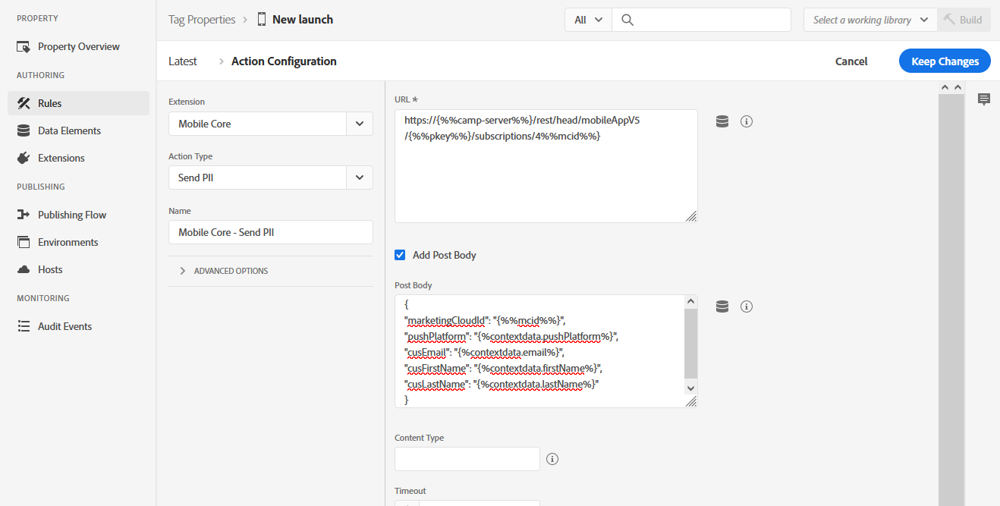

# 設定啟動規則以支援Adobe Campaign Standard 使用案例 {#configuring-rules-launch}

在中， [!DNL Adobe Experience Platform Launch]您需要建立資料元素和規則，以便將PII和其他資料從行動應用程式傳送至 [!DNL Adobe Campaign Standard]。

為確保中的所有配置更改都 [!DNL Adobe Experience Platform Launch] 生效，您必須發佈這些更改。 如需詳細資訊，請參 [閱發佈](https://aep-sdks.gitbook.io/docs/getting-started/create-a-mobile-property#publish-the-configuration)。

若要在中建立規 [!DNL Experience Platform Launch]則，請遵循下列步驟：

1. [建立資料元素](../../administration/using/configuring-rules-launch.md#create-data-elements)
2. [建立您要](../../administration/using/configuring-rules-launch.md#create-data-elements) 支援之使用案例的規則：
   * [PII回傳](../../administration/using/configuring-rules-launch.md#pii-postback)
   * [應用程式內追蹤回傳](../../administration/using/configuring-rules-launch.md#inapp-tracking-postback)
   * [推播通知追蹤回傳](../../administration/using/configuring-rules-launch.md#push-tracking-postback)
   * [位置回傳](../../administration/using/configuring-rules-launch.md#location-postback)

## 建立資料元素 {#create-data-elements}

以下是我們建議您在中建立的資料元素 [!DNL Experience Platform Launch]。
您可以根據需求建立其他資料元素。

* **[!UICONTROL Experience Cloud ID]**
* **[!UICONTROL Pkey]**
* **[!UICONTROL Campaign server]**

要建立這些資料元素：

1. 在行 [!DNL Experience Platform Launch]動應用程式儀表板中，按一下標 **[!UICONTROL Data Elements]** 簽。

1. 若要建立資 **[!UICONTROL Experience Cloud ID]** 料元素，請按一下 **[!UICONTROL Create New Data Element]**。

1. 例如 **[!UICONTROL Name]** ，在欄位中輸入 **mcid**。

1. From the **[!UICONTROL Extension]** drop-down, select **[!UICONTROL Mobile Core]**. 然 **[!UICONTROL Experience Cloud ID]** 後在 **[!UICONTROL Data element]** 類型下拉式清單中。

   

1. 若要建立Pkey資料元素，請按一下 **[!UICONTROL Add data element]**。

1. 例如 **[!UICONTROL Name]** ，在欄位中鍵入 **pkey**。

1. From the **[!UICONTROL Extension]** drop-down, select **[!UICONTROL Adobe Campaign Standard]**. 然 **[!UICONTROL pkey]** 後在 **[!UICONTROL Data element]** 類型下拉式清單中。

1. 若要建立促銷活動伺服器資料元素，請按一下 **[!UICONTROL Add data element]**。

1. 在欄位 **[!UICONTROL Name]** 中，輸入名稱，例如 **camp-server**。

1. From the **[!UICONTROL Extension]** drop-down, select **[!UICONTROL Adobe Campaign Standard]**. 然後， **[!UICONTROL Campaign Server]** 在「類 **[!UICONTROL Data element]** 型」(Type)下拉式清單中。

## 建立規則 {#creating-rules}

您需要建立下列規則：

* [PII回傳](../../administration/using/configuring-rules-launch.md#pii-postback)
* [應用程式內追蹤回傳](../../administration/using/configuring-rules-launch.md#inapp-tracking-postback)
* [推播通知追蹤回傳](../../administration/using/configuring-rules-launch.md#push-tracking-postback)
* [位置回傳](../../administration/using/configuring-rules-launch.md#location-postback)

### PII回傳 {#pii-postback}

>[!NOTE]
>
>若要從行動應用程式傳送PII資訊至Adobe Campaign，您必須實作SDK API。 如需詳細資訊，請前往 [CollectPII](https://aep-sdks.gitbook.io/docs/using-mobile-extensions/mobile-core/mobile-core-api-reference#collect-pii)。

若要傳送PII資料 [!DNL Adobe Campaign Standard]至，請在下列位置建立規 [!DNL Experience Platform Launch]則：

1. 在行 [!DNL Experience Platform Launch]動應用程式儀表板中，按一下 **[!UICONTROL Rules]** 索引標籤 **[!UICONTROL Create New Rule]**。

1. 輸入名稱，例如 **Mobile Core - Collect PII**。

1. In the **[!UICONTROL Events]** section, click **[!UICONTROL Add]**.

1. From the **[!UICONTROL Extension]** drop-down, select **[!UICONTROL Mobile Core]**. 然後， **[!UICONTROL Collect PII]** 在下 **[!UICONTROL Event type]** 拉式清單中。

1. 按一下 **[!UICONTROL Keep changes]**。

1. In the **[!UICONTROL Actions]** section, click **[!UICONTROL Add]**.

1. From the **[!UICONTROL Extension]** drop-down, select **[!UICONTROL Mobile Core]**. 然後， **[!UICONTROL Send PII]** 在下 **[!UICONTROL Action type]** 拉式清單中。

1. 在 **[!UICONTROL URL]**&#x200B;中，輸入以下URL:

   ```
   https://{%%camp-server%%}/rest/head/mobileAppV5/{%%pkey%%}/subscriptions/{%%mcid%%}
   ```

1. 選擇復 **[!UICONTROL Add Post Body]** 選框。

1. 在中 **[!UICONTROL Post Body]**，鍵入以下內容：

   ```
   {
   "marketingCloudId":
   "{%%mcid%%}",
   "cusEmail":
   "",
   "cusFirstName":
   "",
   "cusLastName":
   "" }
   ```

   MarketingCloudId可讓您協調應用程式訂閱者與資料庫中的收件者，因此是必要項目。 您可以根據您的業務需求指定其他金鑰值配對。 在上述範例中，會從應用程式傳遞「電子郵件」、「名字」和「姓氏」。

   索引鍵（例如cusEmail、cusFirstName和cusLastName）應符合您在Adobe Campaign Standard例項的自訂資源中定義的欄位ID。 值變數（例如email、firstName和LastName）應符合從行動應用程式傳送的JSON資料中，從應用程式程式碼呼叫AMS collectPII API時的金鑰。

   您也可以根據事件觸發程式，在Collect PII回傳或不同的回傳中傳遞生命週期資料。 以下是生命週期資料JSON的範例：

   ```
   {
   "marketingCloudId":"{%%mcid%%}",
   "cusDayslastlaunch": "{%%DaysSinceLastUse%%}", 
   "cusDaysfirstlaunch": "{%%DaysSinceFirstUse%%}", 
   "cusLaunches": "{%%Launches%%}"
   }
   ```

   在中定義的資料元素 [!DNL Experience Platform Launch] 應以雙重百分比括住，例如%%mcid%%，而應用程式的上下文變數應以單一百分比括住，例如%contextdata.email%。

1. 在中 **[!UICONTROL Content Type]**，輸入 **application/json**。

1. In **[!UICONTROL Timeout]**, select 0.

   

您的使用者資料現在已設定為傳送至Campaign。

### 應用程式內追蹤回傳 {#inapp-tracking-postback}

若要傳送追蹤資料 [!DNL Adobe Campaign Standard] 至，以報告您的使用者如何與行動應用程式中的應用程式內訊息互動，請在中建立下列規則 [!DNL Experience Platform Launch]:

1. 在行 [!DNL Experience Platform Launch]動應用程式儀表板中，選取標籤並 **[!UICONTROL Rules]** 按一下 **[!UICONTROL Add Rule]**。

1. 輸入名稱，例如 **Adobe Campaign —— 應用程式內點按追蹤**。

1. In the **[!UICONTROL Events]** section, click **[!UICONTROL Add]**.

1. From the **[!UICONTROL Extension]** drop-down, select **[!UICONTROL Adobe Campaign Standard]**. 然後， **[!UICONTROL In-App click tracking]** 在下 **[!UICONTROL Event type]** 拉式清單中。

1. 按一下 **[!UICONTROL Keep changes]**。

1. In the **[!UICONTROL Actions]** section, click **[!UICONTROL Add]**.

1. From the **[!UICONTROL Extension]** drop-down, select **[!UICONTROL Mobile Core]**. 然後， **[!UICONTROL Send postback]** 在下 **[!UICONTROL Event type]** 拉式清單中。

1. 在 **[!UICONTROL URL]**&#x200B;中，鍵入以下URL:

   ```
   https://{%%camp-server%%}/r/?id=&mcid={%%mcid%%}
   ```

1. 選擇復 **[!UICONTROL Add post body]** 選框。

1. 在中 **[!UICONTROL Post Body]**&#x200B;鍵入 **{}**。

1. 在中 **[!UICONTROL Content Type]**，輸入 **application/json**。

1. In **[!UICONTROL Timeout]**, select 0.

   

### 推播通知追蹤回傳 {#push-tracking-postback}

若要傳送追蹤資料 [!DNL Adobe Campaign Standard]至，以協助追蹤您的推播通知傳送以及使用者與行動應用程式的互動，您必須在中建立規則 [!DNL Experience Platform Launch]。

如需推播追蹤的詳細資訊，請參閱 [推播追蹤](../../administration/using/push-tracking.md)。

若要追蹤應用程式動作，請使用trackAction API。 如需詳細資訊，請參閱「 [追蹤應用程式動作](https://app.gitbook.com/@aep-sdks/s/docs/using-mobile-extensions/mobile-core/mobile-core-api-reference#track-app-actions)」。

1. 在行 [!DNL Experience Platform Launch]動應用程式儀表板中，按一下標 **[!UICONTROL Rules]** 簽並按一下 **[!UICONTROL Add Rule]**。

1. 輸入名稱，例如 **Adobe Campaign —— 推播點按追蹤**。

1. In the **[!UICONTROL Events]** section, click **[!UICONTROL Add]**.

1. From the **[!UICONTROL Extension]** drop-down, select **[!UICONTROL Mobile Core]**. 然後， **[!UICONTROL Track Action]** 在下 **[!UICONTROL Event type]** 拉式清單中。

1. 從下拉 **[!UICONTROL Action]** 式清單中，選 **[!UICONTROL Action]**&#x200B;取、選 **[!UICONTROL equals]**&#x200B;取和輸入 **追蹤**。

1. 按一下 **[!UICONTROL Keep changes]**。然後，在區 **[!UICONTROL Actions]** 段中按一下 **[!UICONTROL Add]**。

1. From the **[!UICONTROL Extension]** drop-down, select **[!UICONTROL Mobile Core]**. 然後， **[!UICONTROL Send postback]** 在下 **[!UICONTROL Action type]** 拉式清單中。

1. 在 **[!UICONTROL URL]**&#x200B;中，輸入以下URL:

   ```
   https://{%%camp-server%%}/r/?id=,,&mcId={%%mcid%%}
   ```

1. 選擇復 **[!UICONTROL Add post body]** 選框。

1. 新增您的貼文內文，例如{ }。

1. 在中 **[!UICONTROL Content Type]**，輸入 **application/json**。

1. In **[!UICONTROL Timeout]**, select 0.

### 位置回傳 {#location-postback}

1. 在行 [!DNL Experience Platform Launch]動應用程式儀表板中，按一下標 **[!UICONTROL Rules]** 簽並按一下 **[!UICONTROL Add Rule]**。

1. 鍵入名稱，例如「位 **置」回傳**。

1. In the **[!UICONTROL Events]** section, click **[!UICONTROL Add]**.

1. 建立事件，例如輸入POI或退出POI。 從下拉 **[!UICONTROL Extension]** 式清單中，選取「 **位置——測試版」**。 然後， **在下拉式清單** 中 **輸入POI** 或退出POI **[!UICONTROL Event type]** 。

1. 輸入名稱，例如， **Places - Beta - Enter POI****或Exit POI**。

1. In the **[!UICONTROL Actions]** section, click **[!UICONTROL Add]**.

1. From the **[!UICONTROL Extension]** drop-down, select **[!UICONTROL Mobile Core]**. 然後， **[!UICONTROL Send postback]** 從下 **[!UICONTROL Action type]** 拉式清單中。

1. 輸入名稱，例如「行動 **核心——傳送位置回傳」**。

1. 在 **[!UICONTROL URL]**&#x200B;中，輸入以下URL:

   ```
   https://{%%camp-server%%}/rest/head/mobileAppV5/{%%pkey%%}/locations/
   ```

1. 選取核 **[!UICONTROL Add post body]** 取方塊並新增您的貼文內文，例如：

   ```
   {
   "locationData": {
       "distances": "{%%Distance%%}",
       "poiLabel": "{%%POILabel%%}",
       "latitude": "{%%Latitude%%}",
       "longitude": "{%%Longitude%%}",
       "appId": "{%%AppId%%}",
       "marketingCloudId": "{%%ECID%%}"
   }
   }
   ```

   >[!NOTE]
   >
   >在上述範例中，右側的資料元素需要運用「建立資料元素」中的 [!DNL Experience Platform Launch] 步驟來設定 [其中的元素](../../administration/using/configuring-rules-launch.md#create-data-elements)。 左側的資料元素在中受支援， [!DNL Adobe Campaign Standard] 不需要任何設定。 如果您需要其他資料，則需要在中執行自訂資源擴充 [!DNL Adobe Campaign Standard]。

1. 在中 **[!UICONTROL Content Type]**，輸入 **application/json**。

1. In **[!UICONTROL Timeout]**, select 5.

   
