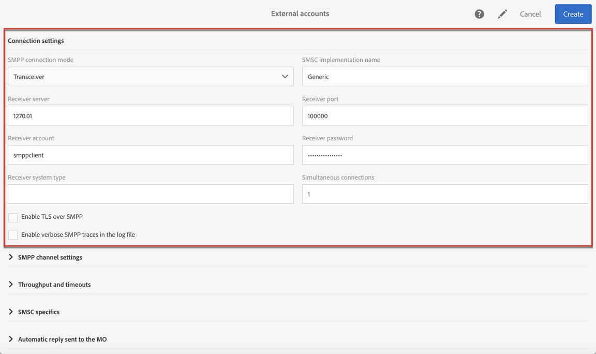
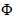

# 設定 SMS 通道{#configuring-sms-channel}

若要傳送 SMS 訊息，管理員必須在 **[!UICONTROL Administration]** > **[!UICONTROL Channels]** > **[!UICONTROL SMS]** > **[!UICONTROL SMS accounts]** 功能表下設定一或多個外部帳戶。

建立和修改外部帳戶的步驟在[外部帳戶](../../administration/using/external-accounts.md)區段中詳細說 明。您會在下方找到傳送 SMS 訊息之外部帳戶的特定參數。

## 定義 SMS 路由 {#defining-an-sms-routing}

預設會提供外部帳戶 **[!UICONTROL SMS routing via SMPP]**，但可用於新增其他帳戶。

如果您想使用 SMPP 通訊協定，也可以建立新的外部帳戶。有關 SMS 通訊協定和設定的詳細資訊，請參閱此[技術說明](https://helpx.adobe.com/tw/campaign/kb/sms-connector-protocol-and-settings.html)。

1. 從 **[!UICONTROL Administration > Application settings > External accounts]** 建立新的外部帳戶。
1. 將帳戶類型定義為 **[!UICONTROL Routing]**，將通道定義為 **[!UICONTROL Mobile (SMS)]** 並將傳送模式定義為 **[!UICONTROL Bulk delivery]**。

   

1. 定義連線設定。

   若要輸入傳送 SMS 訊息的特定連線設定，請聯絡您的 SMS 服務提供者，該服務提供者將向您說明如何填入不同的外部帳戶欄位。

   

   **[!UICONTROL Enable TLS over SMPP]** 選項可讓您加密 SMPP 通訊。

   **[!UICONTROL Enable verbose SMPP traces in the log file]** 可讓您將所有 SMPP 通訊傾印到記錄檔案中。必須啟用此選項，才能疑難排解連接器，並與提供者所看到的流量進行比較。

1. 請聯絡 Adobe，他們會根據您選取的提供者，為您提供進入 **[!UICONTROL SMS-C implementation name]** 欄位的值。
1. 定義 SMPP 通道設定。您可以從 [SMS 編碼和格式](#sms-encoding-and-formats)區段瞭解詳情。

   如果您希望將所有傳入的 SMS 儲存到 inSMS 表格中，請啟用 **[!UICONTROL Store incoming MO in the database]**。有關如何檢索傳入 SMS 的詳細資訊，請參閱[本區段](../../channels/using/managing-incoming-sms.md#storing-incoming-sms)。

   **[!UICONTROL Enable Real-time KPI updates during SR processing]** 選項可讓您在進行傳送之後，即時更新 **[!UICONTROL Delivered]** 或 **[!UICONTROL Bounces + Errors]** KPI。這些 KPI 可在 **[!UICONTROL Deployment]** 視窗中找到，並直接從提供者接收的 SR（狀態報告）重新計算。

   

1. 定義 **[!UICONTROL Throughput and timeouts]** 參數。

   您可以指定出站訊息（&quot;MT&quot;，Mobile Terminated）的吞吐量上限，以每秒 MT 為單位。如果您在對應欄位中輸入　&quot;0&quot;，則吞吐量將無限制。

   與持續時間對應的所有欄位的值需要以秒為單位完成。

1. 定義　SMS-C　特定參數，以備您需要定義特定編碼對應時使用。如需詳細資訊，請參閱[詳細文件](#smsc-specifics)。

   如果您不想遵守 SMPP 通訊協定，並將 **[!UICONTROL +]** 首碼傳輸到 SMS 提供者 (SMS-C) 的伺服器，請啟用 **[!UICONTROL Send full phone number (send characters other than digits)]** 選項。

   但是，由於某些提供者需要使用 **[!UICONTROL +]** 首碼，因此建議您向您的提供者查詢，並建議您視需要啟用此選項。

1. 如有需要，請根據回覆的內容定義自動回覆以觸發動作。如需詳細資訊，請參閱[本區段](../../channels/using/managing-incoming-sms.md#managing-stop-sms)。
1. 儲存 SMS 路由外部帳戶的設定。

您現在可以使用新的路由，透過 Adobe Campaign 傳送 SMS 訊息。

## SMS 編碼和格式 {#sms-encoding-and-formats}

### SMS 編碼、長度和音譯 {#sms-encoding--length-and-transliteration}

根據預設，SMS 中的字元數量符合 GSM（行動通訊全球系統）標準。

使用 GSM 編碼的 SMS 訊息最多只能有 160 個字元，若是以多個部分傳送的訊息，則每個 SMS 的 SMS 訊息最多只能有 153 個字元。

>[!NOTE]
>
>某些字元會計為兩個字元（括弧、方括弧、歐元符號等）。可用 GSM 字元的清單顯示在[字元表 – GSM 標準](#table-of-characters---gsm-standard)區段。

您也可以核取相對應的方塊，以授權字元音譯。

音譯包括當 GSM 標準未考慮到 SMS 的一個字元時，用另一個字元取代該字元。

* 如果音譯已獲得&#x200B;**授權**，則在傳送訊息時，未考慮的每個字元會由 GSM 字元取代。例如，字元 &quot;ë&quot; 會由 &quot;e&quot; 取代。因此，訊息會稍微變更，但字元限制將維持不變。
* 如果音譯未獲&#x200B;**授權**，每個包含未納入考量之字元的訊息都會以二進位格式 (Unicode) 傳送：因此，所有字元都將按原樣發送。不過，使用 Unicode 的 SMS 訊息最多只能有 70 個字元（若是以多個部分傳送的訊息，則每個 SMS 有 67 個字元）。如果超出字元數上限，則會傳送數則訊息，這可能會造成額外成本。

>[!IMPORTANT]
>
>將個人化欄位插入您的 SMS 訊息內容，可能會引入 GSM 編碼未考慮的字元。[個人化 SMS 訊息](../../channels/using/personalizing-sms-messages.md)區段提供內容範例。

依預設，會停用字元音譯。如果您希望 SMS 訊息中的所有字元都保持原樣，不要變更正確名稱（例如），建議您不要啟用此選項。

不過，如果您的 SMS 訊息包含許多產生 Unicode 訊息的字元，您可以選取啟用此選項，以限制傳送訊息的成本。

### 字元表 – GSM Standard {#table-of-characters---gsm-standard}

本節介紹 GSM 標準所考慮的字元。除下面提及的字元外，所有插入訊息內文的字元都會將整個訊息轉換為二進位格式 (Unicode)，因此限制為 70 個字元。如需詳細資訊，請參閱 [SMS 編碼、長度和音譯](#sms-encoding--length-and-transliteration)。

**基本字元**

<table> 
 <tbody> 
  <tr> 
   <td> @  </td> 
   <td>    </td> 
   <td> SP  </td> 
   <td> 0  </td> 
   <td> ¡  </td> 
   <td> P  </td> 
   <td> ¿  </td> 
   <td> P  </td> 
  </tr> 
  <tr> 
   <td> £  </td> 
   <td> _  </td> 
   <td> !  </td> 
   <td> 1  </td> 
   <td> A  </td> 
   <td> Q  </td> 
   <td> a  </td> 
   <td> q  </td> 
  </tr> 
  <tr> 
   <td> $  </td> 
   <td>    </td> 
   <td> "  </td> 
   <td> 2  </td> 
   <td> B  </td> 
   <td> R  </td> 
   <td> b  </td> 
   <td> r  </td> 
  </tr> 
  <tr> 
   <td> ¥  </td> 
   <td>    </td> 
   <td> #  </td> 
   <td> 3  </td> 
   <td> C  </td> 
   <td> S  </td> 
   <td> c  </td> 
   <td> s  </td> 
  </tr> 
  <tr> 
   <td> è  </td> 
   <td>    </td> 
   <td> ¤  </td> 
   <td> 4  </td> 
   <td> D  </td> 
   <td> T  </td> 
   <td> d  </td> 
   <td> t  </td> 
  </tr> 
  <tr> 
   <td> é  </td> 
   <td>    </td> 
   <td> %  </td> 
   <td> 5  </td> 
   <td> E  </td> 
   <td> U  </td> 
   <td> e  </td> 
   <td> u  </td> 
  </tr> 
  <tr> 
   <td> ù  </td> 
   <td>    </td> 
   <td> &amp;  </td> 
   <td> 6  </td> 
   <td> F  </td> 
   <td> V  </td> 
   <td> f  </td> 
   <td> v  </td> 
  </tr> 
  <tr> 
   <td> ì  </td> 
   <td>    </td> 
   <td> '  </td> 
   <td> 7  </td> 
   <td> G  </td> 
   <td> W  </td> 
   <td> g  </td> 
   <td> w  </td> 
  </tr> 
  <tr> 
   <td> ò  </td> 
   <td>    </td> 
   <td> (  </td> 
   <td> 8  </td> 
   <td> H  </td> 
   <td> X  </td> 
   <td> h  </td> 
   <td> x  </td> 
  </tr> 
  <tr> 
   <td> Ç  </td> 
   <td>    </td> 
   <td> )  </td> 
   <td> 9 </td> 
   <td> I  </td> 
   <td> Y  </td> 
   <td> i  </td> 
   <td> y  </td> 
  </tr> 
  <tr> 
   <td> LF  </td> 
   <td>    </td> 
   <td> *  </td> 
   <td> :  </td> 
   <td> J  </td> 
   <td> Z  </td> 
   <td> j  </td> 
   <td> z  </td> 
  </tr> 
  <tr> 
   <td> Ø  </td> 
   <td> ESC  </td> 
   <td> +  </td> 
   <td> ;  </td> 
   <td> K  </td> 
   <td> Ä  </td> 
   <td> k  </td> 
   <td> ä  </td> 
  </tr> 
  <tr> 
   <td> ø  </td> 
   <td> Æ  </td> 
   <td> ,  </td> 
   <td> &lt;  </td> 
   <td> L  </td> 
   <td> Ö  </td> 
   <td> l  </td> 
   <td> ö  </td> 
  </tr> 
  <tr> 
   <td> CR  </td> 
   <td> æ  </td> 
   <td> -  </td> 
   <td> = </td> 
   <td> M  </td> 
   <td> Ñ  </td> 
   <td> m  </td> 
   <td> ñ  </td> 
  </tr> 
  <tr> 
   <td> Å  </td> 
   <td> ß  </td> 
   <td> .  </td> 
   <td> &gt;  </td> 
   <td> N  </td> 
   <td> Ü  </td> 
   <td> n  </td> 
   <td> ü  </td> 
  </tr> 
  <tr> 
   <td> å  </td> 
   <td> É  </td> 
   <td> /  </td> 
   <td> ?  </td> 
   <td> O  </td> 
   <td> §  </td> 
   <td> o  </td> 
   <td> à  </td> 
  </tr> 
 </tbody> 
</table>

SP：Space

ESC：Escape

LF：換行

CR：歸位

**進階字元（計算兩次）**

^ { } [ ~ ] | €

### SMSC 細節 {#smsc-specifics}

>[!NOTE]
>
>這些選項可讓您調整連接器以使用非標準 SMSC（即不完全遵循 SMPP 3.4 規範）或特定編碼要求，並且僅應由進階使用者設定。

傳送 SMS 訊息時，Adobe Campaign 可以使用一或多種文字編碼。每個編碼都有其專屬的字元集，並決定符合 SMS 訊息的字元數。

**[!UICONTROL DATA_CODING]** 欄位可讓 Adobe Campaign 與使用編碼的 SMS-C 通訊。

>[!NOTE]
>
>**data_coding** 值及實際使用編碼之間的對應是標準化的。然而，特定 SMS-C 有其獨特的對應：在這種情況下，您的 **Adobe Campaign** 管理員需要宣告此對應。請洽詢您的提供者以瞭解更多資訊。

**[!UICONTROL Define a specific mapping of encodings]** 功能可讓您宣告 **data_codings**，並視需要強制進行編碼：若要這麼做，請在表格中指定單一編碼。

**設定**

* 未檢查 **[!UICONTROL Define a specific mapping of encodings]** 功能時，連接器會採取一般行為：

   * 它會嘗試使用 GSM 編碼，將 **data_coding = 0** 的值指派給它。
   * 如果 GSM 編碼失敗，則會使用 **UCS2** 編碼，並對其指派值 **data_coding = 8**。

   

* 核取 **[!UICONTROL Define a specific mapping of encodings]** 功能後，您可以定義要使用的編碼以及連結的 **[!UICONTROL data_coding]** 欄位值。Adobe Campaign 會嘗試使用清單中的第一個編碼，如果第一個編碼不可能，則請執行下列操作。

   宣告的順序非常重要：建議您以&#x200B;**成本**&#x200B;的遞增順序顯示清單，以利於編碼，讓您在每則 SMS 訊息中盡可能多地顯示字元。

   僅宣告您要使用的編碼。如果 SMS-C 提供的某些編碼不符合您的使用目的，請勿在清單中宣告。

   

### 自動回覆傳送至 MO {#automatic-reply-sent-to-the-mo}

當描述檔回覆透過 Campaign 傳送的 SMS 訊息時，您可以設定自動傳回給他的訊息，以及要執行的動作。

如需詳細資訊，請參閱[本區段](../../channels/using/managing-incoming-sms.md)。

## 設定 SMS 屬性{#configuring-sms-properties}

本節詳細說明 SMS 傳送或 SMS 範本屬性畫面中 SMS 專屬的參數清單。

用於傳送 SMS 訊息的特定參數會在 **[!UICONTROL Send]** 及 **[!UICONTROL Advanced parameters]** 區段中重新分組。

From the **[!UICONTROL Advanced parameters]** section:

* **[!UICONTROL From]** 選項可讓您使用字串個人化 SMS 訊息寄件者的名稱。此名稱將顯示為收件者行動電話上 SMS 訊息的傳送者姓名。

   如果此欄位為空，則會是使用的外部帳戶中提供的來源號碼。如果未提供來源號碼，則將使用簡短代碼。SMS 傳送專用的外部帳戶會顯示在[定義 SMS 路由](#defining-an-sms-routing)區段。

   

   >[!IMPORTANT]
   >
   >請查看您所在國家/地區有關修改寄件者地址的法規。您也應洽詢您的 SMS 服務提供者，以瞭解他們是否提供此功能。

從SMS **[!UICONTROL Send]** 範本的區段：

* **[!UICONTROL Maximum number of SMS per message]** 選項可讓您定義用於傳送訊息的 SMS 訊息數目。如果超過此數目，則不會傳送訊息。

   >[!IMPORTANT]
   >
   >如果您已將個人化欄位或條件文字插入 SMS 訊息的內容，訊息的長度，以及因此要傳送的 SMS 訊息數目，可能會因收件者而異。如需詳細資訊，請參閱[個人化 SMS 訊息](../../channels/using/personalizing-sms-messages.md)區段。

   

* **[!UICONTROL Transmission mode]** 欄位可讓您判斷 SMS 訊息的傳送方式：

   * **[!UICONTROL Saved on SIM card]**：會將該訊息儲存在收件者的電話 SIM 卡上。
   * **[!UICONTROL Saved on mobile]**：會將該訊息儲存在電話的內部記憶體中。
   * **[!UICONTROL Flash]**：該訊息會顯示在收件者的行動電話以作為通知，之後訊息會消失，而不會儲存。
