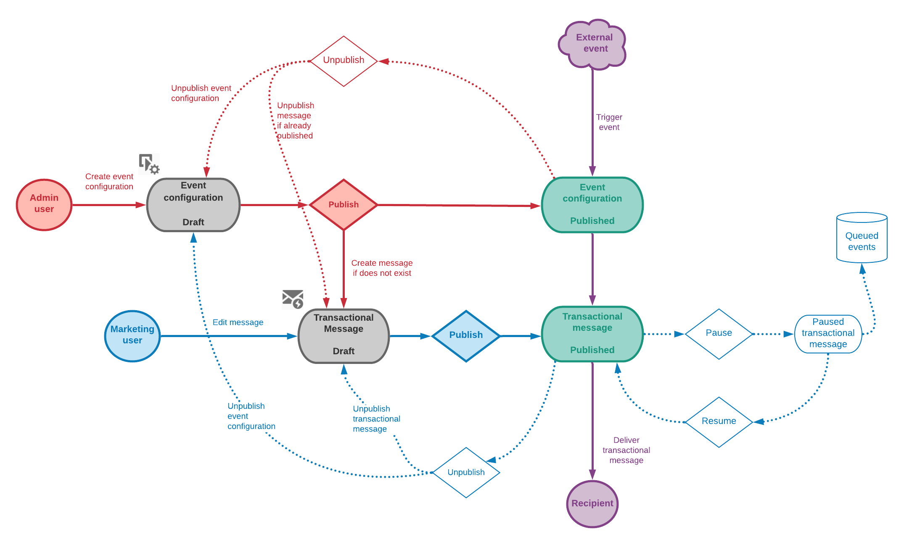

# 設定交易式訊息傳遞{#configuring-transactional-messaging}

若要使用Adobe Campaign傳送交易訊息，您首先需要說明事件資料的結構。

事件配置必須由[administrator](../../administration/using/users-management.md#functional-administrators)執行以下步驟。

>[!NOTE]
>
>配置會隨您要發送的事務性消息類型而有所不同。 有關詳細資訊，請參閱[事務性事件特定配置](#transactional-event-specific-configurations)。

發佈事件後：

* 網站開發人員將使用的API已部署，交易事件現在可以傳送。 請參閱[整合網站中事件的觸發](#integrating-the-triggering-of-the-event-in-a-website)。

* 自動建立相應的事務消息。 請參閱[事務性消息傳遞入門](../../channels/using/getting-started-with-transactional-msg.md)。

## 建立事件{#creating-an-event}

若要開始，請建立符合您需求的事件。

>[!IMPORTANT]
>
>只有擁有&#x200B;**[!UICONTROL Administration]**&#x200B;角色且是&#x200B;**[!UICONTROL All]** [組織單位](../../administration/using/organizational-units.md)一部分的用戶才具有建立事件配置的適當權限。

1. 按一下左上方的 **[!UICONTROL Adobe Campaign]** 標誌，然後選取「**[!UICONTROL Marketing plans]** > **[!UICONTROL Transactional messages]** > **[!UICONTROL Event configuration]**」。
1. 按一下 **[!UICONTROL Create]** 按鈕。
1. 為事件提供&#x200B;**[!UICONTROL Label]**&#x200B;和&#x200B;**[!UICONTROL ID]**。 **[!UICONTROL ID]**&#x200B;欄位是必填欄位，開頭應為&quot;EVT&quot;。 如果您不使用此首碼，則會在您按一下&#x200B;**[!UICONTROL Create]**&#x200B;後自動新增該首碼。

   

   >[!IMPORTANT]
   >
   >ID不得超過64個字元，包括EVT首碼。

1. 選擇將用於發送事務性消息&#x200B;**[!UICONTROL Email]**、**[!UICONTROL Mobile (SMS)]**&#x200B;或&#x200B;**[!UICONTROL Mobile application]**（推播通知）的渠道。

   >[!NOTE]
   >
   >每個事件設定只能使用一個通道。事件建立後，便無法變更通道。

1. 選取與所需事件設定對應的定位維度，然後按一下&#x200B;**[!UICONTROL Create]**。

   事件型交易訊息會鎖定事件本身包含的資料，而以描述檔為基礎的交易訊息則會鎖定Adobe Campaign資料庫中包含的資料。 有關詳細資訊，請參閱[事務性事件特定配置](#transactional-event-specific-configurations)。

>[!NOTE]
>
>建立的即時事件數量可能會對您的平台造成影響。 為確保最佳效能，請務必刪除您不再需要的即時事件。 請參閱[刪除事件](#deleting-an-event)。

## 定義事件屬性{#defining-the-event-attributes}

在&#x200B;**[!UICONTROL Fields]**&#x200B;部分中，定義將整合到事件內容中的屬性，然後可用於個性化事務性消息。

添加和修改欄位的步驟與[自定義資源](../../developing/using/configuring-the-resource-s-data-structure.md#adding-fields-to-a-resource)的步驟相同。

>[!NOTE]
>
>如果要建立多語言事務性消息，請使用&#x200B;**[!UICONTROL AC_language]** ID定義其他事件屬性。 這僅適用於事件事務性消息。 發佈事件後，編輯多語言交易訊息內容的步驟與編輯多語言標準電子郵件的步驟相同。 請參閱[建立多語言電子郵件](../../channels/using/creating-a-multilingual-email.md)。

## 定義資料集{#defining-data-collections}

您可以新增元素的集合至事件內容，每個元素本身包含數個屬性。

此系列可用於交易電子郵件中，以新增[產品清單](../../channels/using/event-transactional-messages.md#using-product-listings-in-a-transactional-message)至訊息內容，例如產品清單——價格、參考編號、數量等。 清單的每個產品。

1. 在&#x200B;**[!UICONTROL Collections]**&#x200B;區段中，按一下&#x200B;**[!UICONTROL Create element]**&#x200B;按鈕。

   

1. 新增系列的標籤和ID。
1. 為清單的每個產品新增您要在交易訊息中顯示的所有欄位。

   在此範例中，我們新增了下列欄位：

   

1. **[!UICONTROL Enrichment]**&#x200B;標籤可讓您豐富系列的每個項目。 這可讓您使用Adobe Campaign資料庫或您建立之其他資源的資訊，個人化對應產品清單的元素。

>[!NOTE]
>
>豐富集合元素的步驟與[豐富事件](#enriching-the-transactional-message-content)一節中所述的步驟相同。 請注意，豐富活動不允許您豐富系列：您需要在&#x200B;**[!UICONTROL Collections]**&#x200B;區段中，將擴充功能新增至系列本身。

發佈事件和訊息後，您就可以在交易訊息中使用此系列。

以下是此範例的API預覽：

**相關主題：**

* [預覽和發佈事件](#previewing-and-publishing-the-event)
* [在交易式訊息中使用產品清單](../../channels/using/event-transactional-messages.md#using-product-listings-in-a-transactional-message)

## 豐富事件{#enriching-the-transactional-message-content}

您可以利用Adobe Campaign資料庫的資訊豐富交易式訊息內容，以個人化您的訊息。 例如，您可以從每個收件者的姓氏或CRM ID中，復原資料，例如其地址、出生日期或「描述檔」表格中新增的任何其他自訂欄位，以個人化傳送給他們的資訊。

可以利用擴展的&#x200B;**[!UICONTROL Profile and services Ext API]**&#x200B;資訊豐富事務性消息內容。 有關詳細資訊，請參閱[擴展API:發佈擴充功能](../../developing/using/step-2--publish-the-extension.md)

此資訊也可以儲存在新資源中。 在這種情況下，資源必須直接連結到&#x200B;**[!UICONTROL Profile]**&#x200B;或&#x200B;**[!UICONTROL Service]**&#x200B;資源，或通過其他表連結。 例如，在以下配置中，如果&#x200B;**[!UICONTROL Product]**&#x200B;資源連結到&#x200B;**[!UICONTROL Profile]**&#x200B;資源，則可以使用&#x200B;**[!UICONTROL Product]**&#x200B;資源（如產品類別或ID）的資訊豐富事務性消息內容。

有關資源建立和發佈的詳細資訊，請參閱[此頁](../../developing/using/key-steps-to-add-a-resource.md)。

1. 在&#x200B;**[!UICONTROL Enrichment]**&#x200B;區段中，按一下&#x200B;**[!UICONTROL Create element]**&#x200B;按鈕。

   

1. 選擇要將消息連結到的資源。 在這種情況下，請選擇&#x200B;**[!UICONTROL Profile]**&#x200B;資源。

   

1. 使用&#x200B;**[!UICONTROL Create element]**&#x200B;按鈕將選定資源中的欄位連結到先前添加到事件中的其中一個欄位（請參閱[定義事件屬性](#defining-the-event-attributes)）。

   

1. 在此示例中，我們協調&#x200B;**[!UICONTROL Last name]**&#x200B;和&#x200B;**[!UICONTROL First name]**&#x200B;欄位與&#x200B;**[!UICONTROL Profile]**&#x200B;資源中的相應欄位。

   

   您也可以使用&#x200B;**[!UICONTROL Service]**&#x200B;資源豐富事務性消息內容。 有關服務的詳細資訊，請參閱此[部分](../../audiences/using/creating-a-service.md)。

1. 如果您正在建立或編輯基於配置檔案的事件，請在&#x200B;**[!UICONTROL Targeting enrichment]**&#x200B;部分中，選擇將在傳送執行期間用作消息目標的擴充。

   

   >[!NOTE]
   >
   >根據&#x200B;**[!UICONTROL Profile]**&#x200B;資源選擇定位擴充是描述檔事件的必備項目。

發佈事件和訊息後，此連結可讓您豐富交易訊息的內容。

**相關主題：**

* [預覽和發佈事件](#previewing-and-publishing-the-event)。
* [個人化交易式訊息](../../channels/using/event-transactional-messages.md#personalizing-a-transactional-message).

## 預覽和發佈事件{#previewing-and-publishing-the-event}

您必須先預覽並發佈事件，才能使用事件。

1. 按一下&#x200B;**[!UICONTROL API preview]**&#x200B;按鈕，查看網站開發人員在發佈之前將會使用的REST API模擬。 發佈事件後，此按鈕也可讓您在生產中檢視API的預覽。 請參閱[整合網站中事件的觸發](#integrating-the-triggering-of-the-event-in-a-website)。

   

   >[!NOTE]
   >
   >REST API會依所選渠道和所選定的定位維度而有所不同。 有關各種配置的詳細資訊，請參閱[事務性事件特定配置](#transactional-event-specific-configurations)。

1. 按一下&#x200B;**[!UICONTROL Publish]**&#x200B;啟動發佈。

   

   網站開發人員將使用的API已部署，交易事件現在可以傳送。

1. 您可以在對應的頁籤中查看發佈日誌。

   

   >[!IMPORTANT]
   >
   >每次修改事件時，您必須再按一下&#x200B;**[!UICONTROL Publish]**，以產生網站開發人員將使用的更新REST API。

   發佈事件後，會自動建立連結至新事件的交易訊息。

1. 您可以透過位於左側區域的連結直接存取此交易性訊息。

   

要觸發事件發送事務性消息，您必須修改並發佈剛建立的消息。 請參閱[事件交易式訊息](../../channels/using/event-transactional-messages.md)。

您也必須將此觸發事件整合至您的網站。 請參閱[整合網站中事件的觸發](#integrating-the-triggering-of-the-event-in-a-website)。

一旦Adobe Campaign開始接收與此事件設定相關的事件，您就可以透過&#x200B;**[!UICONTROL History]**&#x200B;區段下的&#x200B;**[!UICONTROL Latest transactional events]**&#x200B;連結存取第三方服務所傳送並由Adobe Campaign處理的最新事件。

事件（以JSON格式）會從最新到最舊列出。 此清單可讓您檢查資料（例如內容或事件狀態），以利控制和除錯。

### 取消發佈事件{#unpublishing-an-event}

**[!UICONTROL Unpublish]**&#x200B;按鈕可讓您取消事件的發佈，該發佈會從REST API中刪除與先前建立的事件對應的資源。 現在，即使事件是透過網站觸發，也不會再傳送相對應的訊息，也不會將之儲存在資料庫中。

>[!NOTE]
>
>如果您已經發佈了相應的事務性消息，事務性消息發佈也將被取消。 請參閱[取消發佈事務性消息](../../channels/using/event-transactional-messages.md#unpublishing-a-transactional-message)。

按一下&#x200B;**[!UICONTROL Publish]**&#x200B;按鈕以生成新的REST API。

### 交易式訊息發佈程序 {#transactional-messaging-pub-process}

下圖說明了交易式訊息發佈程序。

有關發佈、暫停和取消發佈事務性消息的詳細資訊，請參閱[本節](../../channels/using/event-transactional-messages.md#publishing-a-transactional-message)。

### 刪除事件{#deleting-an-event}

事件一經解除發佈，或事件尚未發佈後，您即可從事件設定清單中刪除。 操作步驟：

1. 按一下左上方的標誌 **[!UICONTROL Adobe Campaign]**，然後選取 **[!UICONTROL Marketing plans]** > **[!UICONTROL Transactional messages]** > **[!UICONTROL Event configuration]**。
1. 將滑鼠指標暫留在您選擇的事件設定上，然後選取&#x200B;**[!UICONTROL Delete element]**&#x200B;按鈕。

   

   >[!NOTE]
   >
   >請確定事件配置具有&#x200B;**[!UICONTROL Draft]**&#x200B;狀態，否則您將無法刪除它。 **[!UICONTROL Draft]**&#x200B;狀態適用於尚未發佈或[未發佈](#unpublishing-an-event)的事件。

1. 按一下 **[!UICONTROL Confirm]** 按鈕。

   

>[!IMPORTANT]
>
>刪除已發佈且已使用的事件配置也會刪除對應的事務性消息及其發送和跟蹤日誌。

## 搜索事務事件{#searching-transactional-events}

要訪問和搜索已建立的事務事件，請執行以下步驟。

1. 按一下左上方的 **[!UICONTROL Adobe Campaign]** 標誌，然後選取「**[!UICONTROL Marketing plans]** > **[!UICONTROL Transactional messages]** > **[!UICONTROL Event configuration]**」。
1. 按一下 **[!UICONTROL Show search]** 按鈕。

   

1. 您可以篩選&#x200B;**[!UICONTROL Publication status]**。 這可讓您僅顯示已發佈的事件，例如。
1. 您也可以使用&#x200B;**[!UICONTROL Last event received]**&#x200B;篩選事件。 例如，如果輸入10，則只會顯示上次10天前或更久收到的事件配置。 這可讓您顯示在指定期間內哪些事件處於非活動狀態。

   

   >[!NOTE]
   >
   >預設值為0。 然後會顯示所有事件。

## 整合網站{#integrating-the-triggering-of-the-event-in-a-website}中事件的觸發

建立事件後，您必須將此事件的觸發整合至您的網站。

在[交易式傳訊作業原則](../../channels/using/getting-started-with-transactional-msg.md#transactional-messaging-operating-principle)章節中說明的範例中，您希望當客戶在購物車中購買產品前離開您的網站時，觸發「購物車放棄」事件。 若要這麼做，您的網站網頁開發人員必須使用Adobe Campaign Standard REST API。

請參閱[REST API Documentation](../../api/using/managing-transactional-messages.md)。

## 事務性事件特定配置{#transactional-event-specific-configurations}

事務性事件配置可能因您要發送的事務性消息類型（事件或配置檔案）以及將使用的渠道而異。

以下各節詳細介紹了根據所需事務性消息應設定哪些特定配置。 有關配置事件的一般步驟的詳細資訊，請參閱[建立事件](#creating-an-event)。

### 基於事件的事務性消息{#event-based-transactional-messages}

若要傳送事件型交易訊息，您首先需要建立並設定事件，以事件本身所包含的資料為目標。
如需詳細資訊，請參閱[參與交易訊息傳送](https://helpx.adobe.com/tw/campaign/kb/simplify-campaign-management.html#Managedatatofuelengagingexperiences)。

1. 建立事件配置時，選擇&#x200B;**[!UICONTROL Real-time event]**&#x200B;目標維（請參閱[建立事件](#creating-an-event)）。
1. 將欄位添加到事件中，以便能夠個性化事務性消息（請參閱[定義事件屬性](#defining-the-event-attributes)）。
1. 如果您想要使用Adobe Campaign資料庫的其他資訊，請豐富交易訊息內容（請參閱[豐富交易訊息內容](#enriching-the-transactional-message-content)）。

   >[!NOTE]
   >
   >事件型交易式訊息應僅使用傳送事件中的資料來定義收件者和訊息內容個人化。不過，您可以使用 Adobe Campaign 資料庫的資訊，豐富您交易式訊息的內容。

1. 預覽並發佈事件（請參閱[預覽並發佈事件](#previewing-and-publishing-the-event)）。

   在預覽事件時，REST API會包含根據所選頻道指定電子郵件地址或行動電話的屬性。

   發佈事件後，會自動建立連結至新事件的交易訊息。 要觸發事件發送事務性消息，您必須修改並發佈剛建立的消息，請參閱[事件事務性消息](../../channels/using/event-transactional-messages.md)。

1. 將事件整合至您的網站（請參閱[整合網站中事件的觸發）。](#integrating-the-triggering-of-the-event-in-a-website)

### 基於配置檔案的事務性消息{#profile-based-transactional-messages}

若要傳送以描述檔為基礎的交易訊息，您首先需要建立並設定Adobe Campaign資料庫中包含的事件定位資料。

1. 建立事件配置時，選擇&#x200B;**[!UICONTROL Profile event]**&#x200B;目標維（請參閱[建立事件](#creating-an-event)）。
1. 將欄位添加到事件中，以便能夠個性化事務性消息（請參閱[定義事件屬性](#defining-the-event-attributes)）。 您必須至少添加一個欄位才能建立富集。 您不需要建立其他欄位，例如&#x200B;**名字**&#x200B;和&#x200B;**姓氏**，因為您可以使用Adobe Campaign資料庫中的個人化欄位。
1. 建立擴展，以便將事件連結到&#x200B;**[!UICONTROL Profile]**&#x200B;資源（請參閱[豐富事務性消息內容](#enriching-the-transactional-message-content)）。 使用&#x200B;**[!UICONTROL Profile]**&#x200B;定位維度時，必須建立擴充。
1. 預覽並發佈事件（請參閱[預覽並發佈事件](#previewing-and-publishing-the-event)）。

   在預覽事件時，REST API不包含指定電子郵件地址或行動電話的屬性，因為該屬性將從&#x200B;**[!UICONTROL Profile]**&#x200B;資源中擷取。

   發佈事件後，會自動建立連結至新事件的交易訊息。 要觸發事件發送事務性消息，您必須修改並發佈剛建立的消息，請參閱[發送配置檔案事務性消息](../../channels/using/profile-transactional-messages.md#sending-a-profile-transactional-message)。

1. 將事件整合至您的網站（請參閱[整合網站中事件的觸發）。](#integrating-the-triggering-of-the-event-in-a-website)

### 事件型交易推播通知{#event-based-transactional-push-notifications}

若要傳送交易推播通知，您必須據以設定Adobe Campaign。 請參閱[推送組態](https://helpx.adobe.com/tw/campaign/kb/configuring-app-sdkv4.html)。

若要向所有選擇接收行動應用程式通知的使用者傳送匿名交易式推播通知，您首先需要建立並設定事件，以事件本身所包含的資料為目標。 相應步驟如下。

事件必須包含下列三個元素：

* **註冊Token**，此為一個行動應用程式與一個裝置的使用者ID。 它可能不對應Adobe Campaign資料庫中的任何描述檔。
* **行動應用程式名稱**（所有裝置皆有一個- Android和iOS）。 這是Adobe Campaign中設定的行動應用程式ID，將用來接收使用者裝置上的推播通知。 如需詳細資訊，請參閱此[頁面](https://helpx.adobe.com/campaign/kb/configuring-app-sdkv4.html)
* **推送平台**（Android為「gcm」,iOS為「apns」）。

1. 建立事件配置時，選擇&#x200B;**[!UICONTROL Mobile application]**&#x200B;通道和&#x200B;**[!UICONTROL Real-time event]**&#x200B;目標維（請參閱[建立事件](#creating-an-event)）。
1. 將欄位添加到事件中，以便能夠個性化事務性消息（請參閱[定義事件屬性](#defining-the-event-attributes)）。
1. 如果您想要使用Adobe Campaign資料庫的其他資訊，請豐富交易訊息內容（請參閱[豐富交易訊息內容](#enriching-the-transactional-message-content)）。

   >[!NOTE]
   >
   >事件型交易式訊息應僅使用傳送事件中的資料來定義收件者和訊息內容個人化。不過，您可以使用 Adobe Campaign 資料庫的資訊，豐富您交易式訊息的內容。

1. 預覽並發佈事件（請參閱[預覽並發佈事件](#previewing-and-publishing-the-event)）。

   在預覽事件時，REST API會包含「registrationToken」、「application」和「pushPlatform」屬性，這些屬性將用來定位傳送。

   

   發佈事件後，就會自動建立連結至新事件的交易推播通知。 若要修改並發佈剛建立的訊息，請參閱[傳送針對事件的交易推播通知。](../../channels/using/transactional-push-notifications.md#transactional-push-notifications-targeting-an-event)

1. 將事件整合至您的網站（請參閱[整合網站中事件的觸發）。](#integrating-the-triggering-of-the-event-in-a-website)

### 以描述檔為基礎的交易推播通知{#profile-based-transactional-push-notifications}

若要傳送交易式推播通知給已訂閱您行動應用程式的Adobe Campaign設定檔，您首先需要建立並設定以Adobe Campaign資料庫為目標的事件。

1. 建立事件配置時，選擇&#x200B;**[!UICONTROL Mobile application]**&#x200B;通道和&#x200B;**[!UICONTROL Profile]**&#x200B;目標維（請參閱[建立事件](#creating-an-event)）。

   依預設，交易推播通知會傳送至收件者所訂閱的所有行動應用程式。 若要傳送推播通知給特定行動應用程式，請在清單中選取它。 其他行動應用程式將會由訊息定位，但會排除在傳送之外。

   

1. 如果要個性化事務性消息，請向事件添加欄位（請參閱[定義事件屬性](#defining-the-event-attributes)）。

   >[!NOTE]
   >
   >您必須至少添加一個欄位才能建立富集。 您不需要建立其他欄位，例如&#x200B;**名字**&#x200B;和&#x200B;**姓氏**，因為您可以使用Adobe Campaign資料庫中的個人化欄位。

1. 建立擴展，以便將事件連結到&#x200B;**[!UICONTROL Profile]**&#x200B;資源（請參閱[豐富事務性消息內容](#enriching-the-transactional-message-content)）。 使用&#x200B;**[!UICONTROL Profile]**&#x200B;定位維度時，必須建立擴充。
1. 預覽並發佈事件（請參閱[預覽並發佈事件](#previewing-and-publishing-the-event)）。

   在預覽事件時，REST API不包含指定註冊Token、應用程式名稱和推播平台的屬性，因為這些屬性將從&#x200B;**[!UICONTROL Profile]**&#x200B;資源中擷取。

   發佈事件後，就會自動建立連結至新事件的交易推播通知。 若要修改並發佈剛建立的訊息，請參閱[傳送以描述檔](../../channels/using/transactional-push-notifications.md#transactional-push-notifications-targeting-a-profile)為目標的交易推播通知。

1. 將事件整合至您的網站（請參閱[整合網站中事件的觸發）。](#integrating-the-triggering-of-the-event-in-a-website)

### 配置事件以發送後續消息{#configuring-an-event-to-send-a-follow-up-message}

後續訊息是預先定義的行銷傳送範本，可用於工作流程中，以傳送訊息給特定交易訊息的收件者。 有關詳細資訊，請參閱[後續消息](../../channels/using/follow-up-messages.md)。

1. 使用您建立的事件設定來傳送事件交易訊息。 請參閱[事件型事務性消息](#event-based-transactional-messages)。
1. 設定事件時，請勾選&#x200B;**[!UICONTROL Create follow-up delivery template for this event]**&#x200B;方塊，再發佈事件。

   

1. 預覽並發佈事件（請參閱[預覽並發佈事件](#previewing-and-publishing-the-event)）。

   發佈事件後，會自動建立交易訊息和連結至新事件的後續傳送範本。 有關使用後續消息的詳細資訊，請參閱[發送後續消息](../../channels/using/follow-up-messages.md#sending-a-follow-up-message)。

## 使用案例：配置事件以發送事務性消息{#use-case--configuring-an-event-to-send-a-transactional-message}

在此範例中，我們想設定事件，以便在網站上每次購買產品後傳送確認訊息，並具備下列必要條件：

當我們想要透過其CRM ID來識別客戶時，請先確定&#x200B;**[!UICONTROL Profile]**&#x200B;資源已使用此新欄位進行擴充。

同樣地，必須已建立並發佈與購買相對應的自定義資源，並且必須連結到&#x200B;**[!UICONTROL Profile]**&#x200B;資源。 這樣，您就可以從此資源中檢索資訊，以豐富郵件內容。

有關資源建立和發佈的詳細資訊，請參閱[此頁](../../developing/using/key-steps-to-add-a-resource.md)。

1. 使用&#x200B;**[!UICONTROL Email]**&#x200B;頻道和&#x200B;**[!UICONTROL Profile]**&#x200B;定位維度建立新事件（請參閱[建立事件](#creating-an-event)）。
1. 定義可用於個性化事務性消息的屬性。 在本例中，請新增「CRM ID」和「產品識別碼」欄位（請參閱[定義事件屬性](#defining-the-event-attributes)）。

   

1. 要使消息內容豐富有關客戶先前購買的資訊，請建立以&#x200B;**[!UICONTROL Purchase]**&#x200B;資源為目標的擴充（請參閱[豐富事務消息內容](#enriching-the-transactional-message-content)）。

   

1. 在先前添加到消息的「產品標識符」欄位和&#x200B;**[!UICONTROL Purchase]**&#x200B;資源中的相應欄位之間建立連接條件。

   

1. 預覽並發佈事件（請參閱[預覽並發佈事件](#previewing-and-publishing-the-event)）。
1. 將事件整合在您的網站中（請參閱[整合網站中事件的觸發）。](#integrating-the-triggering-of-the-event-in-a-website)

