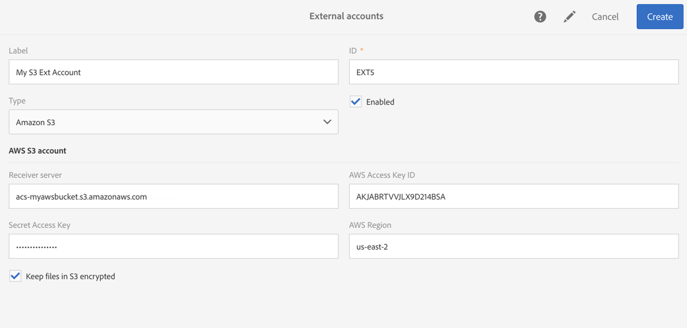

# 外部帳戶{#external-accounts}

外部帳戶是可讓您設定並測試對Adobe Campaign外部伺服器的存取權的設定。

這些外部帳戶可用於促銷活動工作流程，以存取和管理資料。

您可以設定下列外部帳戶類型：

* SFTP。 如需詳細資訊，請參閱[本章節](#sftp-external-account)。
* Amazon Storage Service(S3)。 如需詳細資訊，請參閱[本章節](#amazon-s3-external-account)。
* Adobe Experience Manager。 如需詳細資訊，請參閱[本章節](#adobe-experience-manager-external-account)。
* Adobe Analytics. 如需詳細資訊，請參閱[本章節](../../integrating/using/configure-campaign-analytics-integration.md)。
* Google reCAPTCHA。 如需詳細資訊，請參閱[本章節](#google-recaptcha-external-account)。
* Microsoft Azure Blob儲存。 如需詳細資訊，請參閱[本章節](#microsoft-azure-external-account)。

>[!NOTE]
>
>Adobe在產品布建程式期間會使用其他類型的外部帳戶。 從Campaign Standard 17.9發行，FTP外部帳戶仍可定義，但無法再用於新的工作流程活動。 如果已設定連接，則該連接仍處於啟用狀態。

管理員可在功能表下設定外部 **[!UICONTROL Administration > Application settings > External accounts]** 帳戶。

## 建立外部帳戶 {#creating-an-external-account}

Adobe Campaign隨附一組預先定義的外部帳戶。 若要設定與外部系統（例如用於檔案傳輸的FTP伺服器）的連線，您可以建立自己的外部帳戶。

技術流程（例如技術工作流程或宣傳工作流程）會使用外部帳戶。 在工作流程中或與任何其他應用程式（Adobe Target、Experience Manager等）進行資料交換時，您需要選取外部帳戶。

1. 按一下&#x200B;**[!UICONTROL Create]**&#x200B;按鈕。
1. 輸入標籤。 在工作流程中選取外部帳戶時，將會使用標籤和ID。
1. 選擇要建立的帳戶類型。
1. 在相關時指定憑證、伺服器位址、埠號或金鑰，以設定帳戶的存取權。

   所需資訊通常由您所連接的伺服器提供商提供。

1. 儲存您的帳戶。

外部帳戶會建立並新增至帳戶清單。 它現在可用於工作流活動和傳送屬性中的資料／檔案傳輸或路由配置。

## SFTP外部帳戶 {#sftp-external-account}

不同的外部帳戶類型需要指定不同的資訊。

對於SFTP外部帳戶，請提供下列詳細資訊：

* 伺服器位址。 例如， **ftp.domain.com**。
* 埠號。 For example, **22**.
* SFTP伺服器憑證： 用來連接至伺服器的帳戶名稱和密碼。

### Adobe代管SFTP伺服器建議 {#adobe-hosted-sftp-server-recommendations}

管理用於 ETL 的檔案和資料時，這些檔案儲存在 Adobe 提供的託管 SFTP 伺服器上。此 SFTP 旨在作為臨時儲存空間，您可以在其上控製檔案的保留和刪除。

當未正確使用或監視時，此空間可快速填滿伺服器上的可用物理空間，並造成嚴重問題。 這可能會導致平台上的資料遺失或損毀。

為避免此類問題，Adobe建議遵循下列最佳實務：

* 盡可能保持最小的資料。
* 使用基於密鑰的身份驗證以避免密碼過期。 支援的格 **式僅限****OpenSSH和** SSH2。 您必須提供公開金鑰給Adobe支援團隊，才能將它上傳到Campaign伺服器。
* 只需視需要保留資料。 15天是最大時間限制。
* 使用工作流程正確刪除資料 (管理使用資料的工作流程的保留)。
* 在 SFTP 上載和工作流程中使用批次處理。
* 處理錯誤/例外狀況。
* 時常登入 SFTP 以直接檢查其內容。
* 請記住，SFTP 硬碟的管理主要是您的責任。

此外，請注意，您嘗試從中啟動SFTP連線的公用IP必須新增至促銷活動例項的允許清單。 將IP位址新增至允許清單可透過支 [援票證](https://helpx.adobe.com/enterprise/using/support-for-experience-cloud.html)，並提供用於驗證的公開金鑰。

SFTP伺服器可從「控制面板」進行管理。 For more information, refer to the [Control Panel documentation](https://docs.adobe.com/content/help/en/control-panel/using/sftp-management/about-sftp-management.html).

>[!NOTE]
>
>控制面板僅適用於AWS托管客戶的管理員用戶。
在此查看您的實例是否托管在AWS [上](https://docs.adobe.com/content/help/en/control-panel/using/faq.html#ims-org-id)。

## Amazon S3外部帳戶 {#amazon-s3-external-account}

Amazon S3伺服器欄位應填寫如下：

```
<S3 bucket name>.s3.amazonaws.com/<s3 object path>
```

若要以S3加密模式儲存檔案，請核取方 **[!UICONTROL Keep files in S3 encrypted]** 塊。



所需資訊通常由您所連接的伺服器提供商提供。

指定與 **[!UICONTROL AWS Region]** 端點相關聯。 您可以在官方的 [Amazon S3檔案中查看受支援的地區和簽名版本](https://docs.aws.amazon.com/general/latest/gr/rande.html#s3_region)。

>[!NOTE]
>
>您應 **[!UICONTROL Receiver server]** 該在沒有您的AWS地區的情況下輸入，以後將自動將其添加到您的URL中。

### Amazon S3帳戶建議 {#amazon-s3-account-recommendations}

為協助您設定Amazon S3帳戶，我們建議您遵循下列建議：

* 建立嚴格的儲存貯體原則，以限制對S3儲存貯體的存取。 建立儲存貯體時，可設定儲存貯體原則。 For more information, refer to the [Amazon S3 documentation](https://docs.aws.amazon.com/AmazonS3/latest/dev//example-bucket-policies.html).
* 建立外部帳戶時，請勾選方塊，啟用加密以將敏感資料儲存在S3儲 **[!UICONTROL Keep files in S3 encrypted]** 存貯體。
* 授予儲存貯體權限，以指定誰可以存取儲存貯體中的物件。 有關貯體權限的詳細資訊，請參閱 [Amazon S3檔案](https://docs.aws.amazon.com/AmazonS3/latest/dev//access-control-overview.html)。

## Adobe Experience Manager外部帳戶 {#adobe-experience-manager-external-account}

Adobe Experience Manager外部帳戶用於整合Campaign與Experience Manager。

本檔案提供與此整合相關的程式 [與需求](../../integrating/using/get-started-campaign-integrations.md)。

當您設定此新外部帳戶時，您必須提供下列詳細資訊：

* 伺服器： 輸入Adobe Experience Manager伺服器的URL。 例如：

   ```
   http://aem.domain.com:4502
   ```

* AEM帳戶認證： 使用可存取Adobe Experience Manager例項的帳戶。 它應該是Experience Manager中促銷活動——遠端群組的帳戶部分。

## Google reCAPTCHA外部帳戶 {#google-recaptcha-external-account}

>[!NOTE]
>
>Google reCAPTCHA設定需要Google帳戶。

Google reCAPTCHA機制可讓您保護著陸頁面，使其免受機器人程式造成的垃圾郵件和濫用。 這對您的客戶來說不會造成干擾，因為它不需要客戶進行任何互動，而且是以與您網站的互動為基礎。 若要註冊您的網站，請參閱本 [頁](https://www.google.com/recaptcha/admin/create)。 您必須選擇V3 reCAPTCHA類型。

若要將Google reCAPTCHA V3新增至您的登陸頁面，您必須先在外部帳戶中進行設定。 如需如何將其新增至著陸頁面的詳細資訊，請參閱此 [節](../../channels/using/configuring-landing-page.md#setting-google-recaptcha)。

若為Google reCAPTCHA V3外部帳戶，請提供下列詳細資訊：

* A **[!UICONTROL Label]** 和 **[!UICONTROL ID]** 您的外部帳戶
* **[!UICONTROL Type]**: Google reCAPTCHA
* 您的 **[!UICONTROL Site key]** 和 **[!UICONTROL Site secret]**
* A介 **[!UICONTROL Threshold]** 於0和1之間

   0.0值表 **[!UICONTROL Threshold]** 示它可能是機器人，1.0可能是良好的互動。 預設情況下，可以使用閾值0.5。


## Microsoft Azure Blob儲存外部帳戶 {#microsoft-azure-external-account}

>[!NOTE]
>
>在Adobe Campaign Standard中設定外部帳戶所需的資訊，可在Azure入口網站中，透過選取 **[!UICONTROL Settings]** >找到 **[!UICONTROL Access keys]**。

Azure Blob儲存連接器可用來匯入或匯出資料至Adobe Campaign，使用工作流程 **[!UICONTROL Transfer file]** 活動。 For more on this, refer to this [section](../../automating/using/transfer-file.md#azure-blob-configuration-wf).

對於Microsoft Azure Blob儲存外部帳戶，請提供以下詳細資訊：

* A **[!UICONTROL Label]** 和 **[!UICONTROL ID]** 您的外部帳戶
* **[!UICONTROL Type]**: Microsoft Azure Blob儲存
* 您的 **[!UICONTROL Account name]** 和 **[!UICONTROL Account key]**。 若要瞭解在何處尋找您的帳戶名稱和金鑰，請參閱本 [頁](https://docs.microsoft.com/en-us/azure/storage/common/storage-account-keys-manage)。
* 您的 **[!UICONTROL Endpoint suffix]**。 您可在Azure入口網站的 **[!UICONTROL Connection string]** 功能表 **[!UICONTROL Access keys]** 中找到它。 For more on this, refer to this [page](https://docs.microsoft.com/en-us/azure/storage/common/storage-account-keys-manage).
* 你的 **[!UICONTROL Container]** 名字。 如果您打算使用多個容器，則需要建立與容器一樣多的外部帳戶。
* 選 **[!UICONTROL Concurrency]** 項可讓您微調檔案傳輸的速度。


設定好後，按一 **[!UICONTROL Test connection]** 下以連結Adobe Campaign至Microsoft Azure Blob儲存空間。

### Microsoft Azure Blob儲存建議 {#azure-blob-recommendations}

**加密**

Adobe Campaign使用安全連線(HTTPS)存取您的Microsoft Azure Blob儲存帳戶。

**帳戶金鑰**

設定外部帳戶時，您必須使用Azure入口網 **[!UICONTROL Account key]** 站中的其中一個。 有關在何處查找帳戶密鑰的詳細資訊，請參閱本 [頁](https://docs.microsoft.com/en-us/azure/storage/common/storage-account-keys-manage#view-access-keys-and-connection-string)。

**最佳化檔案傳輸速度**

選 **[!UICONTROL Concurrency]** 項可讓您微調檔案傳輸的速度。
它表示用於執行檔案傳輸的線程數。 每個線程都將從blob下載約1MB的一部分。 然後，它們將被排隊以寫入磁碟。 請注意，增加線程數也會增加應用程式在檔案傳輸期間使用的資源的負載。

完成檔案傳輸後，您可以在工作流程記錄檔中尋找效能度量。

**重試次數**

根據預設，Azure Blob的檔案傳輸最多可重試4次。  如果Azure儲存服務傳回錯誤碼，例如503（伺服器忙碌）或500（作業逾時），這表示您的儲存帳戶可能接近或超過擴充能力。 當使用新帳戶或執行測試時，可能會發生此情況。

如果錯誤仍然存在，您可以在進階功能表> >下建立選項，以增加重試 **[!UICONTROL Administration]** 次 **[!UICONTROL Application Settings]** 數 **[!UICONTROL Options]**。

如果實施，則必須按如下方式建立選項：

```
ID:        AzureBlob_Max_Retries
Date type: Integer
Default:   <the number of retries needed>
```
