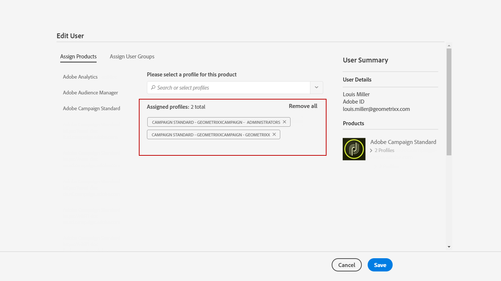

# 管理群組和使用者{#managing-groups-and-users}

## 關於安全性群組 {#about-security-groups}

安全性群組是一組使用者，在您的組織內共用相同的角色和權限。

使用者必須始終連結到安全性群組。這可讓您指派他們特定的角色和組織單位。

如需角色的詳細資訊，下頁的表格會依據使用者角色而提供不同作業：[Adobe Campaign Standard 授權](https://docs.campaign.adobe.com/doc/standard/en/Technotes/AdobeCampaign-ACSRights.pdf)。

預設安全性群組為：

* **[!UICONTROL Administrators]**
* **[!UICONTROL Delivery supervisors]**
* **[!UICONTROL Message Center agents]**
* **[!UICONTROL Standard Users]**
* **[!UICONTROL Workflow supervisors]**

如果使用者未連結至任何安全性群組，他將無法存取 Adobe Campaign。

若要限制使用者的存取權，請勿將使用者新增至 Campaign Standard 使用者群組，因為此使用者連結至 **[!UICONTROL All]** 組織單位。

>[!NOTE]
>
>依預設，將 **[!UICONTROL All (all)]** 組織單位指派給 **[!UICONTROL Administrators]** 安全性群組。其為唯讀狀態且無法修改。

## 建立安全性群組並指派使用者 {#creating-a-security-group-and-assigning-users}

>[!IMPORTANT]
>
>請注意，在 Admin Console 中，會將安全性群組稱為設定檔。

如果現成的群組不足以管理您的使用者，您可以建立自己的安全性群組。Administrator 可同時存取 Adobe Campaign 管理功能表和 Admin Console，以管理這些功能。如需 Admin Console 的詳細資訊，請參閱本[文件](https://helpx.adobe.com/tw/enterprise/managing/user-guide.html)。

首先，我們需要將兩個現成的群組（Standard User 和 Administrator）指派給使用者。這些安全性群組將限制 Adobe Campaign 的某些功能：舉例來說，Standard User 可以存取 Adobe Campaign 的基本存取權限，而 Administrator 可以存取管理功能表。

請注意，使用者登入 Adobe Campaign 時，Admin Console 對安全性群組所進行的任何變更都會同步化。

然後，我們想要建立一組安全性群組（Geometrixx 及 Geometrixx Chattes），這些群組會根據　Standard 使用者和 Administrator　的組織單位來限制部分存取權限。

首先，您需要將一個現成的安全性群組指派給使用者：

1. 在　Admin Console，依序選取您的執行個體和 **Users** 索引標籤。

   

1. 按一下 **[!UICONTROL Add user]** 按鈕，然後輸入使用者的電子郵件地址。
1. 在 **[!UICONTROL Assign Products]** 索引標籤中，從下拉式清單依序選取您的執行個體以及　**[!UICONTROL Administrators]**　現成安全性群組。這可讓使用者存取管理功能表，並建立下一個安全性群組。

   

1. 按一下　**[!UICONTROL Save]**　並依照相同的程序，將　**[!UICONTROL Standard Users]**　現成安全性群組指派給新使用者。

   

將您的兩個使用者附加至 **[!UICONTROL Administrators]** 及 **[!UICONTROL Standard users]** 現成安全性群組（會將角色指派給我們的使用者）之後，Administrator 使用者現在可已建立兩個安全性群組（**Geometrixx** 及 **Geometrixx Clothes**），除了現成安全性群組之外，還會將組織單位指派給我們的使用者。

1. 在　Admin Console，依序選取您的執行個體及　**Products** 索引標籤。
1. 按一下 **New Profile** 按鈕以建立 **Geometrixx** 安全性群組。

   

1. 請依照此確切語法輸入 **[!UICONTROL Profile name]**：**[!UICONTROL Campaign Standard- instance name - ID of the security group]** 並按一下 **[!UICONTROL Done]**。

   之後，在　Adobe Campaign　中建立安全性群組時，將會使用所選取的　ID。

   >[!NOTE]
   >
   >如如果上述語法不適用於舊版執行個體，則需要以&#x200B;**[!UICONTROL Campaign - instance name - ID of the security group]**　取代。

   

1. 之後，請依照相同的程序建立 **Geometrixx Chatters** 安全性群組。
1. 選取　**[!UICONTROL Users]**　索引標籤，將您的安全性群組指派給使用者。

   

1. 按一下之前建立的使用者，然後再按　**[!UICONTROL Products]**　類別中的  圖示。

   選取 **[!UICONTROL Edit products assigned directly]**，開始為使用者指派新的安全性群組。

   

1. 在 **[!UICONTROL Assign Products]** 索引標籤中，選取您的執行個體並從下拉式清單中選取之前建立的安全性群組　Geometrixx，然後將之指派給您的　Administrator　使用者。

   按一下 **[!UICONTROL Save]**。

   

   如果使用者位於數個群組中：

   * 會累積不同群組中的角色。此處的使用者會分為兩個不同的群組：一個群組會擔任角色，另一個群組則會擔任單位。
   * 這是將會使用的最高階層單位（請參閱[組織單位](../../administration/using/organizational-units.md)區段中的範例）。
   * 如果單位具有相同的對等層級，而且位於階層中的平行分支，則無法再連接該使用者。

1. 請依照相同的程序，將 Geometrixx Chates 安全性群組指派給您的 Standard 使用者。

   

新建立的安全性群組現在會在 Admin Console 中建立。您也需要在 Adobe Campaign 中建立這些檔案，才能完全同步化。

Administrator 使用者必須建立一組用於指派組織單位的安全性群組：Geometrixx 及 Geometrixx Chattes。若要瞭解如何建立組織單位，請參閱[建立和管理單位](../../administration/using/organizational-units.md#creating-and-managing-units)。

1. 按一下左上方的標誌 **[!UICONTROL Adobe Campaign]**，然後選取 **[!UICONTROL Administration > Users & Security > Security groups]**。
1. 建立新的安全性群組並指定其 **[!UICONTROL Label]** 及 **[!UICONTROL ID]**。

   ID 必須與 Admin Console 中選取的 ID 相同。

1. 在 **[!UICONTROL User access]** 欄位中，指派組織單位。在此處，會為 Geometrixx 安全性群組指派 **[!UICONTROL All]** 組織單位。

   >[!NOTE]
   >
   >如果您要指派現成可用的安全性群組給使用者，則需要重設組織單位。

   

1. 您也可以將角色指派給安全性群組。在此情況下，不需要執行此步驟，因為會使用現成的安全性群組 **[!UICONTROL Administrators]** 及 **[!UICONTROL Standard users]** 來指派角色。
1. 請依照相同的程序建立最後一個安全性 Geometrixxx Chates，並指派 Geometrixx Chates 組織單位。

   

現在已將您的使用者指派給安全性群組，而且可以連線至 Adobe Campaign。

>[!IMPORTANT]
>
>如果從 Admin Console 的安全性群組中移除使用者，雖然他們仍是 Adobe Campaign 安全性群組的成員，但他們將無法再登入 Adobe Campaign。在此情況下，請在 Admin Console 中移除該使用者的電子郵件地址，以防止他們收到敏感資訊。

