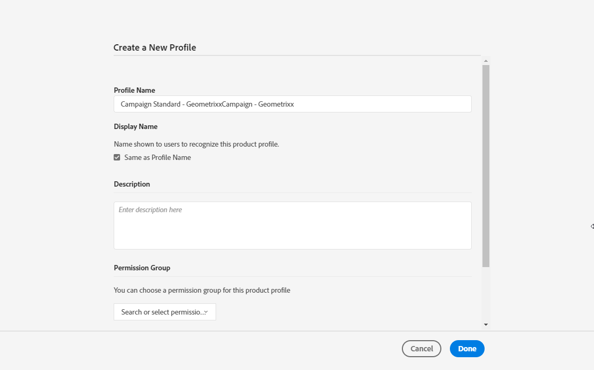

# 管理群組和使用者{#managing-groups-and-users}

## 關於安全組 {#about-security-groups}

安全性群組是一組使用者，在您的組織內共用相同的角色和權限。

用戶必須始終連結到安全組。 這可讓您指派他們特定的角色和組織單位。

有關角色的詳細資訊，以下頁中的表顯示了根據用戶角色的不同操作： [Adobe Campaign Standard授權](https://docs.campaign.adobe.com/doc/standard/en/Technotes/AdobeCampaign-ACSRights.pdf)。

預設安全組為：

* **[!UICONTROL Administrators]**
* **[!UICONTROL Delivery supervisors]**
* **[!UICONTROL Message Center agents]**
* **[!UICONTROL Standard Users]**
* **[!UICONTROL Workflow supervisors]**

如果使用者未連結至任何安全性群組，他將無法存取Adobe Campaign。

若要限制使用者的存取權，請勿將使用者新增至「促銷活動標準」使用者群組，因為此使用者連結至組織 **[!UICONTROL All]** 單位。

## 建立安全組並分配用戶 {#creating-a-security-group-and-assigning-users}

>[!CAUTION]
>
>請注意，在管理控制台中，安全群組稱為設定檔。

如果現成可用的群組不足以管理您的使用者，您可以建立自己的安全性群組。 管理員可同時存取Adobe Campaign管理功能表和管理控制台，以管理這些功能。 有關管理控制台的詳細資訊，請參閱本 [檔案](https://helpx.adobe.com/enterprise/managing/user-guide.html)。

在這裡，我們首先需要將兩個現成的群組Standard使用者和管理員指派給我們的使用者。 這些安全性群組將限制Adobe Campaign的某些功能：「標準使用者」可以存取Adobe Campaign的基本存取權，而「管理員」可以存取管理功能表。

請注意，當使用者登入Adobe Campaign時，管理控制台上對安全性群組所做的任何變更都會同步。

然後，我們想要建立一組安全性群組Geometrixx和Geometrixx Chattes，這些群組會根據我們的Standard使用者和管理員的組織單位限制部分存取。

您首先需要將一個現成的安全組分配給用戶：

1. 在「管理控制台」中，依序選取您的例項和「使 **用者** 」標籤。

   

1. 按一下 **[!UICONTROL Add user]** 按鈕，然後輸入使用者的電子郵件地址。
1. 在標 **[!UICONTROL Assign Products]** 簽中，從下拉式清單 **[!UICONTROL Administrators]** 中選擇您的例項，然後選擇立即可用的安全性群組。 這可讓使用者存取管理功能表，並建立下一個安全性群組。

   

1. 按一 **[!UICONTROL Save]** 下並依照相同的程式，將 **[!UICONTROL Standard Users]** 立即可用的安全性群組指派給新使用者。

   

一旦您的兩個使用者附加至指派角色給我們使用者的 **[!UICONTROL Administrators]****[!UICONTROL Standard users]** 、立即可用的安全性群組，管理員使用者現在可以建立兩個安全性群組 **Geometrixx** 和 **Geometrixx Chattes** ，除了立即可用的安全性群組外，還會將組織單位指派給我們的使用者。

1. 在「管理控制台」中，依序選取您的例項和「產 **品** 」標籤。
1. 按一下「 **新增描述檔** 」按鈕以建立 **Geometrixx** 安全性群組。

   

1. 請依此完 **[!UICONTROL Profile name]** 全語法輸入：並 **[!UICONTROL Campaign Standard- instance name - ID of the security group]** 按一下 **[!UICONTROL Done]**。

   然後，在Adobe Campaign中建立安全性群組時，將會使用所選的ID。

   >[!NOTE]
   >
   >如果上述語法似乎不適用於較舊的例項，則需要以取代 **[!UICONTROL Campaign - instance name - ID of the security group]**。

   

1. 然後，請依照相同的程式建立 **Geometrixx Chatters** security群組。
1. 選擇標籤，將您的安全性群組指派給您的 **[!UICONTROL Users]** 使用者。

   

1. 按一下您先前建立的使用者，然  後按一下類別中的 **[!UICONTROL Products]** 圖示。

   選擇 **[!UICONTROL Edit products assigned directly]** 以開始為用戶分配新的安全組。

   

1. 在標籤 **[!UICONTROL Assign Products]** 中，選取您的例項，然後從下拉式清單中選取您先前建立的安全性群組Geometrixx，將其指派給您的管理員使用者。

   Click **[!UICONTROL Save]**.

   

   如果使用者位於數個群組中：

   * 各組的角色被累積。 在這裡，使用者分為兩個不同的群組：一個在單位中扮演角色。
   * 它是層次結構中將使用的最高單位(請參閱「組織單位」部 [分中的示例](../../administration/using/organizational-units.md) )。
   * 如果設備具有相同的對等級別，並且位於層次中的並行分支中，則用戶將無法再連接。

1. 請依照相同的程式，將Geometrixx Chates安全性群組指派給您的Standard使用者。

   

新建立的安全性群組現在會在管理控制台中建立。 您也需要在Adobe Campaign中建立這些檔案，才能完全同步。

管理員用戶必須建立一組用於分配組織單位的安全組：Geometrixx和Geometrixx Chattes。 要瞭解如何建立組織單位，請參 [閱建立和管理單位](../../administration/using/organizational-units.md#creating-and-managing-units) 。

1. 按一下 **[!UICONTROL Adobe Campaign]** 左上角的標誌，然後選取 **[!UICONTROL Administration > Users & Security > Security groups]**。
1. 建立新的安全性群組並指定其 **[!UICONTROL Label]** 和 **[!UICONTROL ID]**。

   ID必須與「管理控制台」中選擇的ID相同。

1. 在現場 **[!UICONTROL User access]** 中，分配組織單位。 在這裡，Geometrixx安全性群組會指派組織 **[!UICONTROL All]** 單位。

   

1. 您也可以將角色指派給您的安全群組。 在本例中，由於現成可用的安全組並用於指派角色，因此 **[!UICONTROL Administrators]** 不 **[!UICONTROL Standard users]** 需要此步驟。
1. 請依照相同的程式建立最後一個安全性的Geometrixxx Chates，並指派Geometrixx Chates組織單位。

   

您的使用者現在已指派至安全性群組，並可以連線至Adobe Campaign。

>[!CAUTION]
>
>如果使用者從管理控制台中的安全性群組中移除，他們將仍是Adobe Campaign安全性群組的一部分，而且將無法再登入Adobe Campaign。 在此情況下，請移除管理控制台中使用者的電子郵件地址，以免他們收到敏感資訊。

