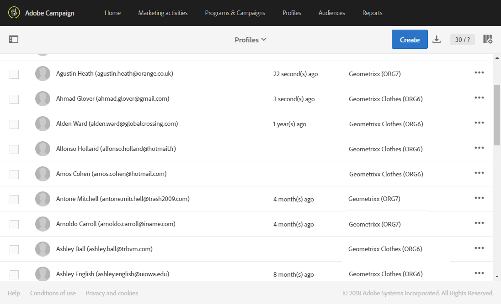

# 組織單位{#organizational-units}

## 關於單位 {#about-units}

平台的每個對象和用戶都與組織單元連結。 該單元允許定義分層結構，以便給用戶提供過濾視圖。 用戶單元為不同平台對象定義其訪問級別。

>[!CAUTION]
>
>如果使用者未連結至任何單位，該使用者將無法連結至Adobe Campaign。 如果您想要限制特定使用者或使用者群組的存取權，請勿將其連結至裝 **[!UICONTROL All]** 置。

用戶對父單元中的所有對象都具有只讀訪問權限。 他可以讀取和寫入其單位和子單位的所有對象。 用戶無法訪問並行分支中的對象。

預設情況下，只有 **[!UICONTROL All]** 設備可用。

在為用戶分配組織單位時，此單位將始終應用於用戶建立的對象。

>[!NOTE]
>
>當使用者位於連結至不同單位的數個群組時，會套用特定規則。 如需詳細資訊，請參閱「管 [理群組和使用者](../../administration/using/managing-groups-and-users.md) 」一節。

## 建立和管理單元 {#creating-and-managing-units}

組織單位可讓您根據使用者所連結的組織來篩選例項。 在您的例項中，此單位可代表地區、國家或甚至品牌。

在此，我們先前已建立對兩個使用者具有不同角色的安全性群組：一個使用者被指派為安全群組Administrators和Geometrixx，另一個使用者則屬於安全群組Standard使用者和Geometrixxx Chattes。請參閱 [Creating a security group](../../administration/using/managing-groups-and-users.md#creating-a-security-group-and-assigning-users) , and assigning users for the full example。

我們現在需要為Geometrixx Chates和Geometrixx安全性群組建立組織單位：

1. 從Adobe促銷活動進階功能表，選 **[!UICONTROL Administration]** 取&gt; **[!UICONTROL Users & security]** &gt; **[!UICONTROL Organizational units]**。
1. 按一下 **[!UICONTROL Create]** 開始配置組織單位。

   

1. 將預設值 **[!UICONTROL Label]** 變更 **[!UICONTROL ID]** 為Geometrixx。
1. 然後，將此設備連結到父設備。 我們選了 **[!UICONTROL All]**。

   

1. 最後，按一下 **[!UICONTROL Create]** 開始將新組織單位分配給安全組。
1. 請依照與Geometrixx Chattes單元相同的程式進行，只不過其父單位必須是先前建立的單位Geometrixx。

   

若要查看指派不同單位給不同安全性群組的影響，指派給管理員和Geometrixx群組的使用者將建立兩個電子郵件範本，以查看指派給標準使用者和Geometrixxx Chastes的其他使用者可以或無法存取的項目。

1. 從進階功能表中，選取 **[!UICONTROL Resources]** &gt; **[!UICONTROL Templates]** &gt; **[!UICONTROL Delivery Templates]**。
1. 複製現有範本，並視需要加以個人化。 有關詳細資訊，請參閱關於 [模板部分](../../start/using/about-templates.md) 。
1. 建立模板時，選擇要為模 **[!UICONTROL Edit properties]** 板分配設備的表徵圖。

   

1. 在下拉 **[!UICONTROL Access authorization]** 式功能表中，選取組織單位。

   在此，我們將使用先前建立的組織單位Geometrixx建立一個範本。

   

1. 依照相同的程式建立指派給先前建立之Geometrixx Chates組織單位的第二個範本。

指派給「標準使用者」和「Geometrixx服裝」群組的使用者將能夠檢視這兩個範本。 由於組織單位的階層結構，他將擁有連結至Geometrixx Chats單位之範本的讀取和寫入存取權，並僅擁有連結至Geometrixx單位之範本的唯讀存取權。

由於Geometrixx Chattes單位是Geometrixx的子單位，當使用者嘗試修改Geometrixx範本時，會出現下列訊息：

組織單位可以限制對不同功能（例如描述檔）的存取。 例如，如果我們的Geometrixxx Chates使用者存取標 **[!UICONTROL Profiles]** 簽，他將能夠完整存取並修改Geometrixxx Chats組織單位的描述檔。

具有Geometrixx組織單位的描述檔將只讀，但若我們的使用者嘗試修改一個描述檔，則會出現下列錯誤： **[!UICONTROL You do not have the rights needed to modify the 'profile' resource of ID]**。

## 分區配置檔案 {#partitioning-profiles}

如果您的組織需要隔離每個不同品牌所聯絡的個人檔案，您可以依組織單位來劃分個人檔案。

依預設，您的設定檔中無法使用組織單位欄位，因此需要新增。

用戶無法訪問沒有組織單位的配置檔案。

>[!CAUTION]
>
>我們建議在匯入任何描述檔之前先新增此選項。 如果您已匯入客戶資料庫，則必須進行更新，才能在已匯入的描述檔上設定組織單位值。

1. 從進階功能表，透過Adobe Campaign標誌，選取「管理&gt;開 **發&gt;自訂資源」**。
1. 選擇 **Profile** （配置檔案）或建立新的自定義資源以擴展配置檔案。
1. 選中「 **添加訪問授權管理欄位** 」框，在配置檔案擴展中添加 **組織單位** 。

   

1. Click **[!UICONTROL Save]**.
1. 重新發佈自訂資源以更新結構。 有關發佈過程的詳細資訊，請參閱「 [更新結構](../../developing/using/data-model-concepts.md) 」部分。

組織單位欄位會新增至您在區段中的設定檔 **[!UICONTROL Access authorization]** 中。

**相關主題**:

* [關於單位](../../administration/using/organizational-units.md#about-units)
* [關於存取管理](../../administration/using/about-access-management.md)

