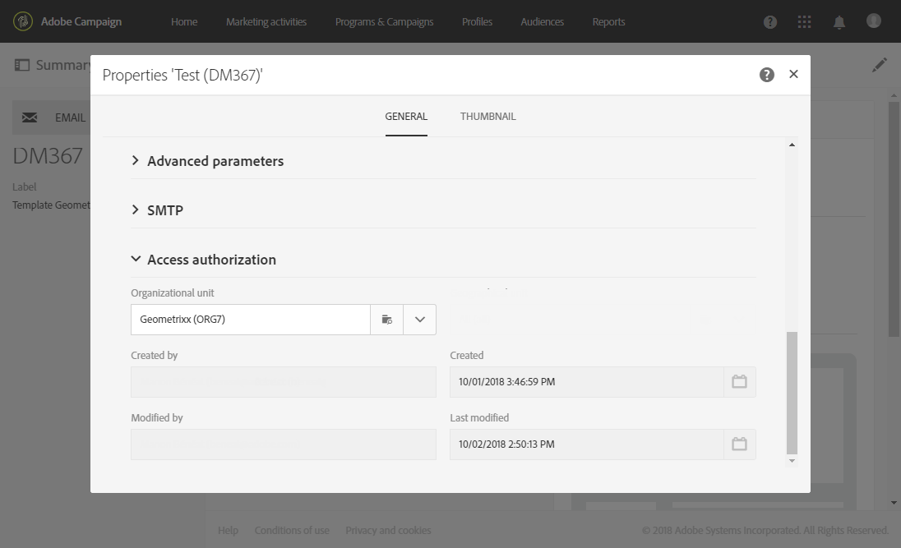

# 組織單位{#organizational-units}

## 關於單位 {#about-units}

平台的每個物件和使用者都會連結至組織單位。 此單位允許定義階層結構，以便為使用者提供篩選檢視。 使用者的單位會定義不同平台物件的存取層級。

>[!IMPORTANT]
>
>如果使用者未連結至任何單位，該使用者將無法連線至Adobe Campaign。 如果您想要限制特定使用者或使用者群組的存取權，請勿將其連結至&#x200B;**[!UICONTROL All]**&#x200B;單位。 建議在匯入任何設定檔之前，先新增選項&#x200B;**存取授權管理欄位**。 如需詳細資訊，請參閱本[區段](../../administration/using/organizational-units.md#partitioning-profiles)。
>
>依預設，將 **[!UICONTROL All (all)]** 組織單位指派給 **[!UICONTROL Administrators]** 安全性群組。其為唯讀狀態且無法修改。

使用者對父單位中的所有物件具有唯讀存取權。 這類使用者對其單位和子單位的所有物件具有讀寫存取權。 使用者無權存取平行分支中的物件。

依預設，只有&#x200B;**[!UICONTROL All]**&#x200B;單位可用。

當指派給使用者組織單位時，此單位將一律套用至使用者建立的物件。

>[!NOTE]
>
>當使用者位於連結至不同單位的數個群組時，將會套用某些規則。 如需詳細資訊，請參閱[管理群組和使用者](../../administration/using/managing-groups-and-users.md)區段。

## 建立和管理單位 {#creating-and-managing-units}

組織單位可讓您根據使用者連結到的組織來篩選例項。 此單位可代表您執行個體中的地區、國家/地區或甚至品牌。

在此處，我們先前已建立安全性群組，其中兩個使用者擁有不同的角色：一個使用者被指派給安全性群組管理員和Geometrixx，另一個使用者屬於安全性群組標準使用者和Geometrixx服裝請參閱[建立安全性群組並指派使用者](../../administration/using/managing-groups-and-users.md#creating-a-security-group-and-assigning-users)以取得完整範例。

我們現在需要為Geometrixx服裝和Geometrixx安全性群組建立組織單位：

1. 在Adobe促銷活動進階功能表中，選取&#x200B;**[!UICONTROL Administration]** > **[!UICONTROL Users & security]** > **[!UICONTROL Organizational units]**。
1. 按一下&#x200B;**[!UICONTROL Create]**&#x200B;開始設定您的組織單位。

   

1. 將預設&#x200B;**[!UICONTROL Label]**&#x200B;和&#x200B;**[!UICONTROL ID]**&#x200B;變更為Geometrixx。
1. 然後，將此單位連結到父單位。 在此，我們選擇&#x200B;**[!UICONTROL All]**。

   

1. 最後，按一下&#x200B;**[!UICONTROL Create]**&#x200B;開始將新的組織單位指派給安全性群組。
1. 對「Geometrixx服裝」單位遵循相同的程式，但它的父單位必須是先前建立的單位Geometrixx。

   

若要檢視將不同單位指派給不同安全性群組的影響，指派給「管理員」和「Geometrixx」群組的使用者將建立兩個電子郵件範本，以檢視其他指派給「標準使用者」和「Geometrixx服飾」的使用者可以存取或無法存取哪些內容。

1. 從進階功能表，選取&#x200B;**[!UICONTROL Resources]** > **[!UICONTROL Templates]** > **[!UICONTROL Delivery Templates]**。
1. 複製現有範本，並視需要加以個人化。 如需詳細資訊，請參閱[關於範本](../../start/using/marketing-activity-templates.md)區段。
1. 建立範本時，選取&#x200B;**[!UICONTROL Edit properties]**&#x200B;圖示以將單位指派給範本。

   

1. 在&#x200B;**[!UICONTROL Access authorization]**&#x200B;下拉式功能表中，選取組織單位。

   在此，我們將以先前建立的組織單位Geometrixx建立一個範本。

   

1. 依照相同的程式，建立指派給先前建立之Geometrixx服裝組織單位的第二個範本。

指派給&#x200B;**標準使用者**&#x200B;和&#x200B;**Geometrixx服飾**&#x200B;群組的使用者將能夠看到這兩個範本。 由於組織單位的階層結構，他們將擁有連結至Geometrixx服裝單位的範本讀寫存取權，以及連結至Geometrixx單位的範本唯讀存取權。

由於「Geometrixx服飾」單位是Geometrixx的子單位，當使用者嘗試修改Geometrixx範本時，會出現下列訊息：

組織單位可以限制不同功能（例如設定檔）的存取權。 例如，如果我們的GeometrixxClothes使用者存取&#x200B;**[!UICONTROL Profiles]**&#x200B;標籤，將能夠以GeometrixxClothes組織單位完整存取及修改設定檔。

雖然具有Geometrixx組織單位的設定檔將是唯讀的，但如果使用者嘗試修改一個設定檔，則會出現以下錯誤： **[!UICONTROL You do not have the rights needed to modify the 'profile' resource of ID]**。

## 分割設定檔 {#partitioning-profiles}

>[!IMPORTANT]
>
>我們建議在匯入任何設定檔之前新增此選項，因為使用者無法存取沒有組織單位的設定檔。
>
>如果您已匯入客戶資料庫，則必須進行更新，才能在已匯入的設定檔上設定組織單位值。

如果您的組織需要隔離由每個不同品牌聯絡的設定檔，您可以按其組織單位分割您的設定檔。

依預設，您的設定檔上沒有組織單位欄位可用，需要新增這些欄位。

1. 從進階功能表，透過Adobe Campaign標誌，選取&#x200B;**管理>開發>自訂資源**。
1. 選取&#x200B;**設定檔**&#x200B;或建立新的自訂資源以擴充設定檔。 如需如何擴充設定檔的詳細資訊，請參閱此[頁面](../../developing/using/extending-the-profile-resource-with-a-new-field.md#step-1--extend-the-profile-resource)。
1. 勾選&#x200B;**新增存取授權管理欄位**&#x200B;方塊，在&#x200B;**設定檔**&#x200B;擴充功能中新增組織單位。

   

1. 按一下&#x200B;**[!UICONTROL Save]**。
1. 重新發佈自訂資源以更新結構。 如需有關發佈程式的詳細資訊，請參閱[更新結構](../../developing/using/updating-the-database-structure.md)區段。

已將組織單位欄位新增到您在&#x200B;**[!UICONTROL Access authorization]**&#x200B;區段中的設定檔。

**相關主題**：

* [關於單位](../../administration/using/organizational-units.md#about-units)
* [關於存取管理](../../administration/using/about-access-management.md)
