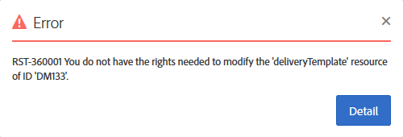

# 組織單位{#organizational-units}

## 關於件數 {#about-units}

平台的每個物件和使用者都連結至組織單位。 該單元允許定義分層結構，以便給用戶一個經過篩選的視圖。 用戶單元為不同的平台對象定義其訪問級別。

>[!IMPORTANT]
>
>如果使用者未連結至任何裝置，該使用者將無法連線至Adobe Campaign。 如果要限制特定用戶或用戶組的訪問權限，請勿將其連結到&#x200B;**[!UICONTROL All]**&#x200B;設備。 建議您先新增選項&#x200B;**存取授權管理欄位**，再匯入任何設定檔。 如需詳細資訊，請參閱本[區段](../../administration/using/organizational-units.md#partitioning-profiles)。
>
>依預設，將 **[!UICONTROL All (all)]** 組織單位指派給 **[!UICONTROL Administrators]** 安全性群組。其為唯讀狀態且無法修改。

用戶對父單元中的所有對象具有只讀訪問權限。 他對其單位和兒童單位的所有對象都有讀寫權限。 用戶無權訪問並行分支中的對象。

預設情況下，僅&#x200B;**[!UICONTROL All]**&#x200B;單位可用。

當為用戶分配組織單位時，此單位將始終應用於用戶建立的對象。

>[!NOTE]
>
>當使用者位於連結至不同單位的數個群組中時，會套用特定規則。 如需詳細資訊，請參閱[管理群組和使用者](../../administration/using/managing-groups-and-users.md)區段。

## 建立和管理單元 {#creating-and-managing-units}

組織單位可讓您根據使用者連結的組織來篩選執行個體。 此單位可代表您例項中的地區、國家或甚至品牌。

在此，我們先前已為兩個使用者建立具有不同角色的安全性群組：一個用戶被分配給安全組管理員和Geometrixx，另一個用戶屬於安全組標準用戶和Geometrixx服裝有關完整示例，請參閱[建立安全組和分配用戶](../../administration/using/managing-groups-and-users.md#creating-a-security-group-and-assigning-users)。

我們現在需要為Geometrixx服裝和Geometrixx安全組建立組織單位：

1. 從Adobe促銷活動進階功能表中，選取&#x200B;**[!UICONTROL Administration]** > **[!UICONTROL Users & security]** > **[!UICONTROL Organizational units]**。
1. 按一下&#x200B;**[!UICONTROL Create]**&#x200B;開始配置組織單位。

   

1. 將預設&#x200B;**[!UICONTROL Label]**&#x200B;和&#x200B;**[!UICONTROL ID]**&#x200B;變更為Geometrixx。
1. 然後，將此單元連結到父單元。 在此，我們選擇了&#x200B;**[!UICONTROL All]**。

   

1. 最後，按一下&#x200B;**[!UICONTROL Create]**&#x200B;開始將新組織單位指派給安全性群組。
1. 對「Geometrixx服裝」單元遵循相同的步驟，但其父單元必須是先前建立的單元Geometrixx。

   

要查看將不同設備分配給不同安全組的影響，分配給管理員和Geometrixx組的用戶將建立兩個電子郵件模板，以查看分配給標準用戶和Geometrixx服裝的其他用戶可以或無法訪問哪些內容。

1. 從高級菜單中，選擇&#x200B;**[!UICONTROL Resources]** > **[!UICONTROL Templates]** > **[!UICONTROL Delivery Templates]**。
1. 複製現有範本，並視需要加以個人化。 有關詳細資訊，請參閱[關於範本](../../start/using/marketing-activity-templates.md)區段。
1. 建立模板時，選擇&#x200B;**[!UICONTROL Edit properties]**&#x200B;表徵圖以將單位分配給模板。

   

1. 在&#x200B;**[!UICONTROL Access authorization]**&#x200B;下拉式功能表中，選取組織單位。

   在此，我們將使用先前建立的組織單位Geometrixx建立一個範本。

   

1. 請依照相同的程式，建立指派給先前建立之Geometrixx服裝組織單位的第二個範本。

指派給「標準使用者」和「Geometrixx服裝」群組的使用者將能看到這兩個範本。 由於組織單位的分層結構，他將具有對連結到Geometrixx服裝單位的模板的讀寫訪問權，並且只對連結到Geometrixx單位的模板的只讀訪問權。

由於Geometrixx服裝單元是Geometrixx的子單元，因此當用戶嘗試修改Geometrixx模板時，將顯示以下消息：

組織單位可限制存取不同功能，例如設定檔。 例如，如果我們的Geometrixx服裝用戶訪問&#x200B;**[!UICONTROL Profiles]**&#x200B;頁簽，他將能夠完全訪問並修改Geometrixx服裝組織單位的配置檔案。

雖然具有Geometrixx組織單位的設定檔將只讀，但如果我們的使用者嘗試修改一個設定檔，則會出現下列錯誤：**[!UICONTROL You do not have the rights needed to modify the 'profile' resource of ID]**。

## 分割設定檔 {#partitioning-profiles}

>[!IMPORTANT]
>
>建議您在匯入任何設定檔之前新增此選項，因為使用者無法存取沒有組織單位的設定檔。
>
>如果您已匯入客戶資料庫，則需要更新，才能在已匯入的設定檔上設定組織單位值。

如果您的組織需要隔離每個不同品牌所聯絡的設定檔，您可以依其組織單位來分割您的設定檔。

依預設，您的設定檔上沒有組織單位欄位，需要新增。

1. 從進階功能表，透過Adobe Campaign標誌，選取&#x200B;**管理>開發>自訂資源**。
1. 選擇&#x200B;**配置檔案**&#x200B;或建立新的自定義資源以擴展配置檔案。 如需如何擴充設定檔的詳細資訊，請參閱此[page](../../developing/using/extending-the-profile-resource-with-a-new-field.md#step-1--extend-the-profile-resource)。
1. 勾選&#x200B;**新增存取授權管理欄位**&#x200B;方塊，以在&#x200B;**設定檔**&#x200B;擴充功能中新增組織單位。

   

1. 按一下&#x200B;**[!UICONTROL Save]**。
1. 重新發佈自訂資源以更新結構。 有關發佈過程的詳細資訊，請參閱[更新結構](../../developing/using/updating-the-database-structure.md)部分。

組織單位欄位會新增至&#x200B;**[!UICONTROL Access authorization]**&#x200B;區段中的設定檔。

**相關主題**：

* [關於件數](../../administration/using/organizational-units.md#about-units)
* [關於存取管理](../../administration/using/about-access-management.md)
