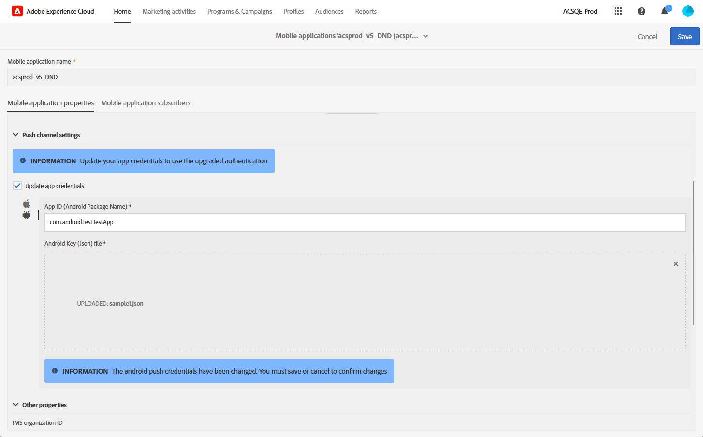
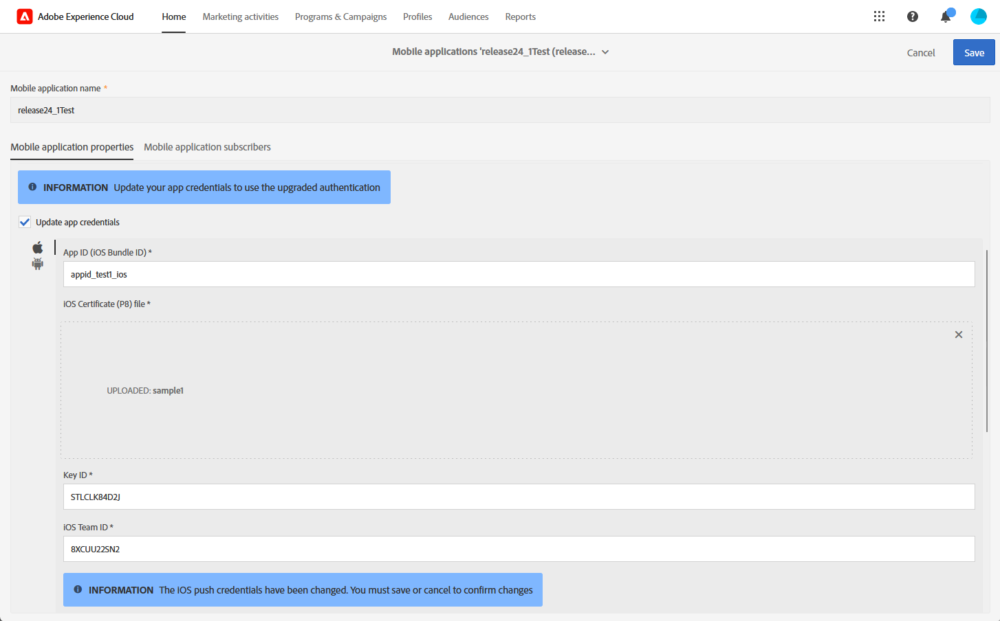

# 推播通知頻道變更 {#push-upgrade}

您可以使用Campaign在Android和iOS裝置上傳送推播通知。 為此，Campaign需仰賴特定的訂閱服務。 Android Firebase Cloud Messaging (FCM)服務的一些重要變更將於2024年發行，可能會影響您的Adobe Campaign實施。 您可能需要更新Android推送訊息的訂閱服務設定，才能支援此變更。

此外，Adobe強烈建議改用權杖式連線來連線APN，而非更安全、更可擴充的憑證式連線。

為確保服務不中斷，您必須升級在Adobe Campaign註冊的行動應用程式，以納入FCM (Android)和APN (iOS)的最新驗證機制。

[進一步瞭解如何在Adobe Campaign Standard中設定您的行動應用程式憑證](configuring-a-mobile-application.md#channel-specific-config)

## Google Android Firebase Cloud Messaging (FCM)服務 {#fcm-push-upgrade}

### 哪些部分有所變更？ {#fcm-changes}

Google持續改善服務，其中舊版FCM API將於&#x200B;**2024年6月20日**&#x200B;終止服務。 在[Google Firebase檔案](https://firebase.google.com/docs/cloud-messaging/http-server-ref){target="_blank"}中進一步瞭解Firebase雲端通訊HTTP通訊協定。

從[24.1版本](../../rn/using/release-notes.md)開始，Adobe Campaign Standard支援HTTP v1 API來傳送Android推播通知訊息。

### 您有受到影響嗎？ {#fcm-impact}

如果您已使用Adobe Campaign Standard傳送推播通知，您必須更新實施。

轉換至最新的API是必須的，這樣才能避免任何服務中斷。

<!--To check if you are impacted, you can filter your **Services and Subscriptions** as per the filter below

* If any of your active push notification service uses the **HTTP (legacy)** API, your setup will be directly impacted by this change. You must review your current configurations and move to the newer APIs as described below.

* If your setup exclusively uses the **HTTP v1** API for Android push notifications, then you are already in compliance and no further action will be required on your part.-->

### 如何更新？ {#fcm-transition-procedure}

#### 先決條件 {#fcm-transition-prerequisites}

* 已在24.1版本中新增支援&#x200B;**HTTP v1 API**&#x200B;模式。 如果您的環境執行於較舊的版本，此變更的先決條件是將您的環境升級至[最新的Campaign Standard版本](../../rn/using/release-notes.md)。

* 需要Android Firebase Admin SDK服務的帳戶JSON檔案，才能將行動應用程式移至HTTP v1。 在[Google Firebase檔案](https://firebase.google.com/docs/admin/setup#initialize-sdk){target="_blank"}中瞭解如何取得此檔案。

* 如果您仍在使用此舊版SDK，您必須使用Adobe Experience Platform SDK更新實作。 在[本文章](sdkv4-migration.md)中瞭解如何移轉至Adobe Experience Plaform SDK。

* 執行以下步驟之前，請確定您在Adobe Experience Platform Data Collection Mobile中擁有&#x200B;**行動應用程式設定**&#x200B;許可權。 [了解更多](https://experienceleague.adobe.com/docs/experience-platform/collection/permissions.html?lang=en#adobe-experience-platform-data-collection-permissions){target="_blank"}。

#### 轉換程式 {#fcm-transition-steps}

若要將環境移至HTTP v1，請遵循下列步驟：

1. 瀏覽至&#x200B;**[!UICONTROL Administration]** > **[!UICONTROL Channels]** > **[!UICONTROL Mobile app (AEP SDK)]**。

   

1. 選取需要更新憑證的特定行動應用程式。

1. 核取&#x200B;**[!UICONTROL Update app credentials]**&#x200B;核取方塊。

   

1. 從您的Android專案的`build.gradle`檔案提供應用程式ID (Android套件名稱)。 例如，`com.android.test.testApp`。 請務必針對中繼和生產環境使用不同的ID。

1. 上傳您的Android私密金鑰JSON金鑰檔案。

   

1. 按一下&#x200B;**儲存**&#x200B;按鈕。

>[!NOTE]
>
>套用這些變更後，所有傳送至Android裝置的新推播通知都會使用HTTP v1 API。 處於重試、進行中及使用中的現有推播傳送仍使用HTTP （舊版） API。

## Apple iOS推播通知服務(APN) {#apns-push-upgrade}

### 哪些部分有所變更？ {#ios-changes}

依照Apple的建議，您應使用無狀態驗證權杖來保護與Apple推播通知服務(APN)的通訊。

權杖型驗證提供與APN無狀態通訊的方式。 無狀態通訊比憑證式通訊更快，因為無狀態通訊不需要APN查閱憑證或其他與您的提供者伺服器相關的資訊。 使用權杖型驗證還有其他優點：

* 您可以使用來自多個提供者伺服器的相同Token。

* 您可以使用一個Token為貴公司的所有應用程式散發通知。

在[Apple開發人員檔案](https://developer.apple.com/documentation/usernotifications/establishing-a-token-based-connection-to-apns){target="_blank"}中進一步瞭解與APN的權杖型連線。

Adobe Campaign Standard同時支援權杖型和憑證型連線。 如果您的實施仰賴憑證式連線，Adobe強烈建議您將其更新為權杖式連線。

### 您有受到影響嗎？ {#ios-impact}

如果您目前的實施仰賴憑證式請求來連線至APN，則會受到影響。 建議轉換為權杖型連線。

<!--To check if you are impacted, you can filter your **Services and Subscriptions** as per the filter below:

* If any of your active push notification service uses the **Certificate-based authentication** mode (.p12), your current implementations should be reviewed and moved to a **Token-based authentication** mode (.p8) as described below.

* If your setup exclusively uses the **Token-based authentication** mode for iOS push notifications, then your implementation is already up-to-date and no further action will be required on your part.-->

### 如何更新？ {#ios-transition-procedure}

#### 先決條件 {#ios-transition-prerequisites}

* 已在[24.1版本](../../rn/using/release-notes.md)中新增&#x200B;**權杖式驗證**&#x200B;模式的支援。 如果您的環境執行於較舊的版本，此變更的先決條件是將您的環境升級至[最新的Campaign Standard版本](../../rn/using/release-notes.md)。

* 您需要APNs驗證Token簽署金鑰才能產生您的伺服器所使用的Token。 如[Apple開發人員檔案](https://developer.apple.com/documentation/usernotifications/establishing-a-token-based-connection-to-apns){target="_blank"}所述，您向您的Apple開發人員帳戶要求此金鑰。

#### 轉換程式 {#ios-transition-steps}

若要將iOS行動應用程式移至權杖型驗證模式，請遵循下列步驟：

1. 瀏覽至&#x200B;**[!UICONTROL Administration]** > **[!UICONTROL Channels]** > **[!UICONTROL Mobile app (AEP SDK)]**。

   

1. 選取需要更新憑證的特定行動應用程式。

1. 核取&#x200B;**[!UICONTROL Update app credentials]**&#x200B;核取方塊。

   

1. 提供&#x200B;**應用程式識別碼** (iOS套件組合識別碼)。 您可以在Xcode中的應用程式主要目標中找到iOS套件組合ID （應用程式ID）。

1. 上傳您的&#x200B;**iOS p8憑證檔案**。

1. 填入APNs連線設定&#x200B;**[!UICONTROL Key Id]**&#x200B;和&#x200B;**[!UICONTROL iOS Team Id]**。

   

1. 按一下&#x200B;**[!UICONTROL Save]**。

您的iOS應用程式現在已移至權杖型驗證模式。

## 常見問題集{#push-upgrade-faq}

+++我們可以在stage &amp; prod例項上保留相同的appID嗎？

對於iOS行動應用程式，中繼和生產環境皆可使用相同的應用程式ID，亦即您的iOS應用程式套件組合ID。 不過，在Android上，每個環境的應用程式ID應該是唯一的。 因此，我們建議將「中繼」附加至在中繼環境中建立的應用程式ID

+++

+++我們可以只移轉Android應用程式嗎？

否，Android和iOS應用程式都需要依照上述步驟移轉。

+++

+++移轉後需要執行哪種型別的驗證？

我們的建議是對所有推送相關使用案例進行功能驗證。

+++

+++儲存行動應用程式時出現「未授權」錯誤時，該怎麼做？

這似乎是與Adobe Experience Platform資料收集相關的許可權問題。 若要解決此問題，您必須依照本文先決條件一節所述，在Adobe Admin Console中新增「行動」和「行動應用程式設定」許可權。

+++

+++行動應用程式程式碼是否需要變更？

否，只需要Firebase和應用程式開發人員帳戶中的設定相關變更。 客戶行動應用程式不需要變更。

+++

+++我們是否需要每年更新iOS憑證？

否，移轉後，無需每年更新iOS憑證。

+++

+++若未完成此移轉會發生什麼事？

根據Google的通知，Android推送訊息將在2024年6月20日之後開始失敗。 [深入了解](https://firebase.google.com/docs/cloud-messaging/migrate-v1){target="_blank"}.

+++

+++客戶完成FCMv1移轉後可移回至FCM嗎？

是，客戶可以在2024年6月20日之前移轉至FCM。 在此日期之後，將無法再使用移轉選項。

+++

+++SDK V4行動應用程式是否支援HTTP v1 API移轉？

不行，客戶必須先將行動應用程式移轉至V5 SDK，然後繼續上述移轉。 他們需要優先執行此動作，因為根據Google的通知，他們的推送服務從2024年6月起將開始失敗。

+++

+++中繼執行個體上的變更是否會影響生產執行個體？

否，中繼行動應用程式中的任何變更都不會對生產執行個體造成影響。

+++