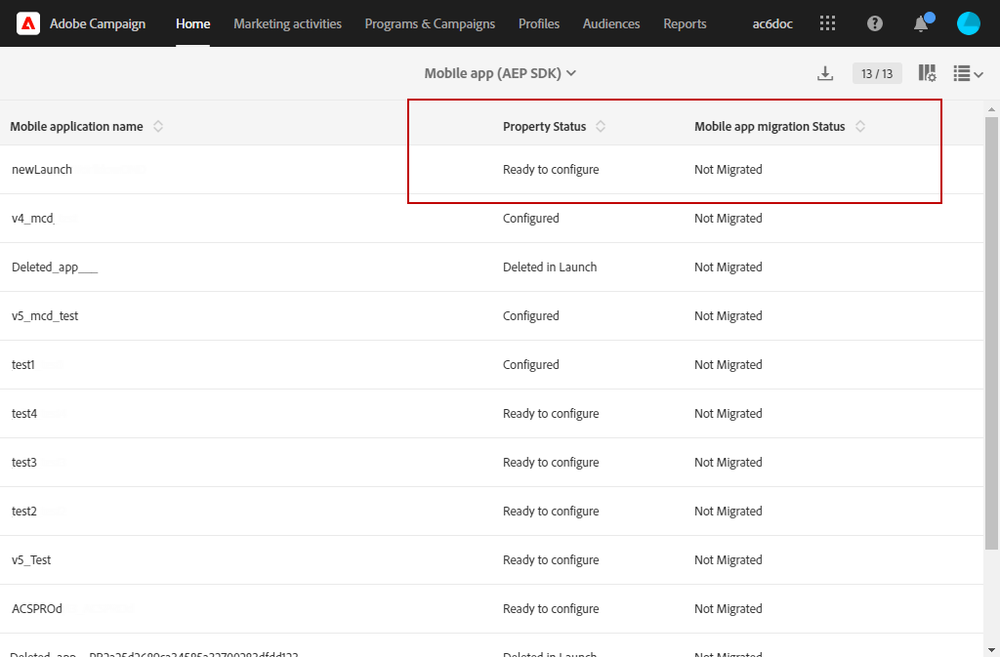

# 如何將您的行動應用程式從 SDK v4 移轉至 Adobe Experience Platform SDK {#sdkv4-migration}

自2021年8月31日起，Adobe Experience Platform Mobile第4版SDK已停止支援。 如果您仍在使用此舊版SDK，您必須使用Adobe Experience Platform SDK更新實作 **2024年6月底前**. 閱讀本文章以瞭解如何移轉至Adobe Experience Platform SDK。

>[!IMPORTANT]
>
> 開始將SDK V4行動應用程式移轉至Adobe Experience Platform SDK之前，請先仔細閱讀檔案。

## 關於SDK V4移轉

Adobe Campaign Standard使用SDK V4來處理行動應用程式，作為與Adobe Experience Platform SDK分開的應用程式。

將Adobe SDK版本從v4升級至Adobe Experience Platform後，行動應用程式需要繼續使用現有應用程式訂閱者資料和行銷活動：因此需要移轉。

>[!NOTE]
>
> 本頁會記錄SDK v4行動應用程式移轉至新建立的Adobe Experience Platform SDK應用程式的程式。 您的SDK v4行動應用程式將不會與具有的Adobe Experience Platform SDK行動應用程式合併 **[!UICONTROL Configured]** **[!UICONTROL Property status]**.

| 移轉後不會變更的專案 |
|:-:|
| 使用移轉的SDK V4應用程式時，不會對現有的傳遞與行銷活動造成影響。 |
| 行動應用程式的名稱將維持不變。 |
| 將保留iOS和Android的平台認證。 |
| 將會保留應用程式的所有訂閱者及其資料。 |
| 現有的SDK v4行動應用程式將繼續傳送資料（PII資料、訂閱者與權杖資訊）至Adobe Campaign Standard。 |
| 此 **[!UICONTROL Organizational unit]** 的將維持不變。 |

| 移轉後會有哪些變更 |
|:-:|
| 行動應用程式將可在 **[!UICONTROL Administration]** > **[!UICONTROL Channels]** > **[!UICONTROL Mobile app (Adobe Experience Platform SDK)]**. 移轉前，此功能適用於 **[!UICONTROL Administration]** > **[!UICONTROL Channels]** > **[!UICONTROL Mobile app (SDK V4)]**. |
| 此 **[!UICONTROL Collect PII Endpoint]** 的欄位將會變更。 較舊 **[!UICONTROL Collect PII Endpoint]** 將繼續運作，傳送的資料不會遺失。 |
| 應用程式將繫結至標籤 **[!UICONTROL Mobile Property]**. 它將以新建立的行動應用程式形式處理。 |
| 移轉中使用的原始Adobe Experience Platform SDK應用程式將不會以個別應用程式的形式存在。 只有移轉的SDK v4應用程式才可使用。 |

## 將您的行動應用程式從SDK v4移轉至Adobe Experience Platform SDK {#how-to-migrate}

移轉前，您應考量下列建議：

* 移轉程式無法復原。
* 您不應同時執行多個應用程式的移轉。 您也應確定多個視窗不會同時觸發相同應用程式的移轉。
* 移轉前，請確定您已被指派 **[!UICONTROL Organizational unit]** 您要移轉的行動應用程式以及用來移轉的Adobe Experience Platform應用程式。
* 移轉後，應用程式會變成Adobe Experience Platform SDK應用程式。 其變更將連結至其對應的標籤 **[!UICONTROL Mobile Property]**.

1. 建立新的 **[!UICONTROL Mobile property]** 在資料收集UI中。 如需詳細資訊，請參閱 [檔案](https://developer.adobe.com/client-sdks/documentation/getting-started/create-a-mobile-property/).

1. 在Adobe Campaign Standard中，從進階功能表選取 **[!UICONTROL Administration]** > **[!UICONTROL Application Settings]** > **[!UICONTROL Workflows]** 並開啟 **[!UICONTROL syncWithLaunch]** 工作流程。 檢查工作流程是否已結束且沒有錯誤。

1. 工作流程完成後，從 **[!UICONTROL Administration]** > **[!UICONTROL Channels]** > **[!UICONTROL Mobile app (Adobe Experience Platform SDK)]** 功能表，檢查行動應用程式在Adobe Campaign Standard中是否可用，以及是否位於 **[!UICONTROL Ready to Configure]** 州別。

   

1. 在 **[!UICONTROL Administration]** > **[!UICONTROL Channels]** > **[!UICONTROL Mobile app (SDK V4)]**，選取您要移轉的SDK V4應用程式。

1. 選取 **[!UICONTROL Mobile application migration to AEP SDK]** 索引標籤。

   

1. 從 **[!UICONTROL Select AEP SDK mobile application to merge current application with]** 從下拉式清單中，選取先前建立的Adobe Experience Platform SDK行動應用程式。

1. 按一下&#x200B;**[!UICONTROL Migrate]**。

   

1. 從 **[!UICONTROL Migration application]** 視窗，按一下 **[!UICONTROL Ok]**.

   

1. 成功完成視窗出現，按一下 **[!UICONTROL Go to Adobe Experience Platform SDK Channel list]**.

1. 從Adobe Experience Platform SDK頻道清單頁面，檢查您先前的V4行動應用程式是否設為 **[!UICONTROL Ready To Configure]**.

1. 選取您的行動應用程式並按一下 **[!UICONTROL Save]** 以完成移轉。

此移轉後，移轉的應用程式將可提供V4版本行動應用程式收集的訂閱者以及AEP版本行動應用程式收集的新訂閱者。

若要區分兩種不同型別的訂閱者，您可以新增自訂欄位： **[!UICONTROL Text]** 擴充自訂資源時鍵入 **[!UICONTROL Subscriptions to an application (appSubscriptionRcp)]** 作為 `sdkversion` 或 `appVersion` 例如。 如需如何擴充自訂資源的詳細資訊，請參閱本 [頁面](../../developing/using/creating-or-extending-the-resource.md).
然後，您需要設定關聯的標籤 **[!UICONTROL Mobile property]** 以在「收集PII」呼叫中傳送此自訂欄位值，並據此變更您的行動應用程式設定。

## 常見問答集 {#faq}

### 問：在SDK v4行動應用程式中，移轉至Adobe Experience Platform SDK的行動應用程式標籤不可見。 {#tab-not-visible}

答：從進階功能表 **[!UICONTROL Administration]** > **[!UICONTROL Application Settings]** > **[!UICONTROL Options]**，檢查的值 **[!UICONTROL Enable migration of mobile app from SDK v4 to Adobe Experience Platform SDK option]** 選項。 預設應將它設為1並啟用。 管理員可能已經手動停用。

### 問：從行動應用程式移轉至Adobe Experience Platform SDK索引標籤中，訊息無資料出現。 {#no-data}

A：僅限您符合資格的 **[!UICONTROL Organizational unit]** 會顯示在清單中。 請確定您有正確的移轉Adobe Experience Platform應用程式。 此 **[!UICONTROL Property Status]** Adobe Experience Platform的URL設定為 **[!UICONTROL Ready to Configure]**  和 **[!UICONTROL Mobile app migration status]** 設為 **[!UICONTROL Not Migrated]**.

### 問：為何具有已設定屬性狀態的Adobe Experience Platform SDK應用程式無法用於移轉？ {#property-status}

答：移轉程式會保留SDK v4訂閱者和屬性。 它只會保留Adobe Experience Platform SDK應用程式中的標籤相關資訊。 Adobe Experience Platform SDK應用程式的訂閱者和其他資料將會遺失。 為避免任何資料遺失，請僅將Adobe Experience Platform SDK應用程式與 **[!UICONTROL Ready to Configure]** **[!UICONTROL Property Status]** 符合移轉資格。

### 問：移轉之後，我可以在哪裡找到先前的SDK v4行動應用程式？ {#v4-app-not-visible}

答：移轉後的行動應用程式將顯示於進階功能表 **[!UICONTROL Administration]** > **[!UICONTROL Channels]** > **[!UICONTROL Mobile app (Adobe Experience Platform SDK)]**.

### 問：移轉之後，我可以在哪裡找到新建立的Adobe Experience Platform SDK應用程式？ {#aep-not-visible}

答：用於移轉的新建立Adobe Experience Platform SDK應用程式將不會以獨立應用程式存在。 只有移轉的SDK v4應用程式才可使用。

### 問：如果SDK v4行動應用程式組織單位已設為「A」（組織單位ALL的子項），且Adobe Experience Platform SDK已設為「ALL」。 如何移轉行動應用程式？ {#v4-org-unit}

答：的管理員 **[!UICONTROL Organizational unit]** 所有人員將有權管理這兩個行動應用程式，並將負責移轉。

### 問：如果SDK v4行動應用程式組織單位設為A，而Adobe Experience Platform SDK應用程式設為B （組織單位A的同胞）。 如何移轉行動應用程式？ {#aep-org-unit}

答：Adobe Experience Platform SDK應用程式是同層級的資產 **[!UICONTROL Organizational unit]**，的使用者看不到行動應用程式 **[!UICONTROL Organizational unit]** A.行動應用程式將可供 **[!UICONTROL Organizational unit]** 全部，但我們不建議這些管理員移轉行動應用程式。
在此情況下，您應該將行動應用程式在同一個 **[!UICONTROL Organizational unit]** 或在 **[!UICONTROL Organizational unit]** 上層連結。
如需詳細資訊，請參閱 **[!UICONTROL Organizational unit]**，請參閱此 [區段](../../administration/using/organizational-units.md).

### 問：在您的Adobe Experience Platform SDK行動應用程式（從v4行動應用程式移轉）頁面的「推播通道設定」下拉式清單下，不會顯示Android金鑰或iOS憑證的已上傳日期/名稱等資訊 {#no-information-v5}

答：建立SDK V4行動應用程式時，系統不會儲存此資訊。 將您的SDK V4行動應用程式移轉至Adobe Experience Platform SDK行動應用程式時，移轉後的行動應用程式也不會有這類資訊。 一旦使用者將上傳新的iOS憑證或Android金鑰，金鑰或憑證的不同詳細資訊就會儲存並正確顯示在下 **[!UICONTROL Push channel settings]** 下拉式清單。
