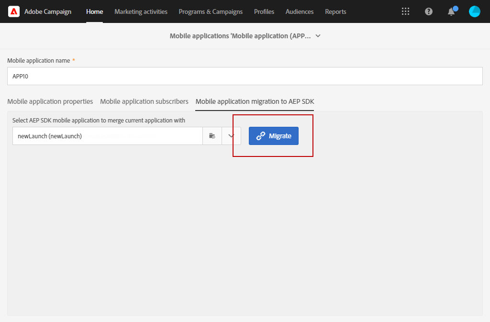

# 如何將您的行動應用程式從 SDK v4 移轉至 Adobe Experience Platform SDK {#sdkv4-migration}

>[!IMPORTANT]
>
> 遷移過程是不可逆的。
>
> 開始將SDK V4行動應用程式移轉至Adobe Experience Platform SDK之前，請仔細閱讀檔案。

## 關於SDK V4移轉

Adobe Campaign Standard使用SDK V4處理行動應用程式，將其與使用Adobe Experience Platform SDK的應用程式分開。
將AdobeSDK版本從v4升級至Adobe Experience Platform後，行動應用程式需要繼續使用現有的應用程式訂閱者資料和促銷活動：因此，需要遷移。

>[!NOTE]
>
> 本頁記錄SDK v4行動應用程式移轉至新建立的Adobe Experience Platform SDK應用程式的程式。 您的SDK v4行動應用程式不會與Adobe Experience Platform SDK行動應用程式與 **[!UICONTROL Configured]** **[!UICONTROL Property status]**.

| 移轉後不會變更的項目 |
|:-:|
| 使用移轉的SDK V4應用程式的現有傳送和行銷活動將沒有影響。 |
| 行動應用程式的名稱將保持相同。 |
| 將保留iOS和Android的平台憑證。 |
| 應用程式的所有訂閱者及其資料將會保留。 |
| 現有的SDK v4行動應用程式會繼續將資料（PII資料、訂閱者與代號資訊）傳送至Adobe Campaign Standard。 |
| 此 **[!UICONTROL Organizational unit]** 行動應用程式的區段將維持不變。 |

| 移轉後會有何變更 |
|:-:|
| 行動應用程式將可在 **[!UICONTROL Administration]** > **[!UICONTROL Channels]** > **[!UICONTROL Mobile app (Adobe Experience Platform SDK)]**. 移轉前，可在 **[!UICONTROL Administration]** > **[!UICONTROL Channels]** > **[!UICONTROL Mobile app (SDK V4)]**. |
| 此 **[!UICONTROL Collect PII Endpoint]** 應用程式的變更。 年長者 **[!UICONTROL Collect PII Endpoint]** 會繼續運作，所傳送的資料不會遺失。 |
| 應用程式將系結至Adobe Experience Platform Launch **[!UICONTROL Mobile Property]**. 會以新建立的行動應用程式處理。 |
| 移轉中使用的原始Adobe Experience Platform SDK應用程式將不會作為個別應用程式存在。 只有移轉的SDK v4應用程式才可供使用。 |

## 將行動應用程式從SDK v4移轉至Adobe Experience Platform SDK {#how-to-migrate}

移轉前，您應考量下列建議：

* 遷移過程是不可逆的。
* 不應同時運行多個應用程式的遷移。 您也應確保同一個應用程式的移轉不會同時由多個視窗觸發。
* 移轉前，請確定您已獲指派 **[!UICONTROL Organizational unit]** 移轉的行動應用程式，以及您用於移轉的Adobe Experience Platform應用程式。
* 移轉後，應用程式將會變成Adobe Experience Platform SDK應用程式。 其變更將連結至其對應的Launch **[!UICONTROL Mobile Property]**.

1. 建立新 **[!UICONTROL Mobile property]** 在Adobe Experience Platform Launch。 如需詳細資訊，請參閱 [Adobe Experience Platform Launch檔案](https://aep-sdks.gitbook.io/docs/getting-started/create-a-mobile-property#create-a-mobile-property).

1. 在Adobe Campaign Standard中，從進階功能表中選取 **[!UICONTROL Administration]** > **[!UICONTROL Application Settings]** > **[!UICONTROL Workflows]** 然後開啟 **[!UICONTROL syncWithLaunch]** 工作流程。 檢查工作流程是否已結束，且無錯誤。

1. 工作流程完成後，從 **[!UICONTROL Administration]** > **[!UICONTROL Channels]** > **[!UICONTROL Mobile app (Adobe Experience Platform SDK)]** ，檢查行動應用程式是否可在Adobe Campaign Standard中使用，以及是否在 **[!UICONTROL Ready to Configure]** 狀態。

   

1. 在 **[!UICONTROL Administration]** > **[!UICONTROL Channels]** > **[!UICONTROL Mobile app (SDK V4)]**，選取您要移轉的SDK V4應用程式。

1. 選取 **[!UICONTROL Mobile application migration to AEP SDK]** 索引標籤。

   

1. 從 **[!UICONTROL Select AEP SDK mobile application to merge current application with]** 下拉式清單中，選取先前建立的Adobe Experience Platform SDK行動應用程式。

1. 按一下&#x200B;**[!UICONTROL Migrate]**。

   

1. 從 **[!UICONTROL Migration application]** 按一下 **[!UICONTROL Ok]**.

   

1. 出現「successful completion（成功完成）」窗口，按一下 **[!UICONTROL Go to Adobe Experience Platform SDK Channel list]**.

1. 在Adobe Experience Platform SDK通道清單頁面中，檢查您先前的V4行動應用程式是否已設為 **[!UICONTROL Ready To Configure]**.

1. 選取您的行動應用程式，然後按一下 **[!UICONTROL Save]** 完成移轉。

此移轉後，行動應用程式的V4版所收集的訂閱者，以及行動應用程式的AEP版所收集的新訂閱者，將可在已移轉的應用程式中使用。

若要區分兩種不同的訂閱者，您可以新增新的自訂欄位，位於 **[!UICONTROL Text]** 擴充自訂資源時的類型 **[!UICONTROL Subscriptions to an application (appSubscriptionRcp)]** as `sdkversion` 或 `appVersion` 例如， 如需如何擴充自訂資源的詳細資訊，請參閱 [頁面](../../developing/using/creating-or-extending-the-resource.md).
然後，您就需要設定相關的Launch **[!UICONTROL Mobile property]** 若要在收集PII呼叫中傳送此自訂欄位值，並據此變更行動應用程式設定。

## 常見問答集 {#faq}

### 問：在SDK v4行動應用程式中，看不到移動應用程式移轉至Adobe Experience Platform SDK標籤。 {#tab-not-visible}

答：從進階功能表 **[!UICONTROL Administration]** > **[!UICONTROL Application Settings]** > **[!UICONTROL Options]**，檢查 **[!UICONTROL Enable migration of mobile app from SDK v4 to Adobe Experience Platform SDK option]** 選項。 此值應設為1，並預設為啟用。 管理員可能已手動禁用它。

### 問：從「行動應用程式移轉至Adobe Experience Platform SDK」標籤，出現「無資料」訊息。 {#no-data}

答：僅適用於 **[!UICONTROL Organizational unit]** 會顯示在清單中。 請確定您有正確的Adobe Experience Platform移轉應用程式。 此 **[!UICONTROL Property Status]** Adobe Experience Platform應用程式的 **[!UICONTROL Ready to Configure]**  和 **[!UICONTROL Mobile app migration status]** 設為 **[!UICONTROL Not Migrated]**.

### 問：為何無法使用已設定屬性狀態的Adobe Experience Platform SDK應用程式進行移轉？ {#property-status}

答：移轉程式會保留SDK v4訂閱者和屬性。 它只會從Adobe Experience Platform SDK應用程式中保留Launch的相關資訊。 來自Adobe Experience Platform SDK應用程式的訂閱者和其他資料將會遺失。 為避免任何資料遺失，請僅使用Adobe Experience Platform SDK應用程式 **[!UICONTROL Ready to Configure]** **[!UICONTROL Property Status]** 符合移轉資格。

### 問：移轉後，我可在何處找到先前的SDK v4行動應用程式？ {#v4-app-not-visible}

答：移轉後的行動應用程式會從進階功能表中顯示 **[!UICONTROL Administration]** > **[!UICONTROL Channels]** > **[!UICONTROL Mobile app (Adobe Experience Platform SDK)]**.

### 問：移轉後，我可在何處找到新建立的Adobe Experience Platform SDK應用程式？ {#aep-not-visible}

答：用於移轉的新建立Adobe Experience Platform SDK應用程式將不作為個別應用程式存在。 只有移轉的SDK v4應用程式才可供使用。

### 問：如果SDK v4行動應用程式組織單位設為A（組織單位ALL的子項），而Adobe Experience Platform SDK設為ALL。 如何移轉行動應用程式？ {#v4-org-unit}

答：管理員 **[!UICONTROL Organizational unit]** ALL將有權管理兩個移動應用程式，並負責遷移。

### 問：如果SDK v4行動應用程式組織單位設為A，而Adobe Experience Platform SDK應用程式設為B（組織單位A的同層級）。 如何移轉行動應用程式？ {#aep-org-unit}

答：Adobe Experience Platform SDK應用程式是同層級資產的 **[!UICONTROL Organizational unit]**，行動應用程式將不會顯示給 **[!UICONTROL Organizational unit]** A.行動應用程式將可供 **[!UICONTROL Organizational unit]** 但我們不建議這些管理員移轉行動應用程式。
在此情況下，您應將行動應用程式移動至 **[!UICONTROL Organizational unit]** 或 **[!UICONTROL Organizational unit]** 具有父連結。
如需 **[!UICONTROL Organizational unit]**，請參閱 [節](../../administration/using/organizational-units.md).

### 問：從您的Adobe Experience Platform SDK行動應用程式（從v4行動應用程式移轉）頁面，在「推播通道設定」下拉式清單下，不會顯示Android金鑰或iOS憑證的上傳日期/名稱等資訊 {#no-information-v5}

答：建立SDK V4行動應用程式時，系統不會儲存此資訊。 將SDK V4行動應用程式移轉至Adobe Experience Platform SDK行動應用程式時，您移轉的行動應用程式也不會有這類資訊。 使用者一旦上傳新的iOS憑證或Android金鑰，金鑰或憑證的不同詳細資料就會儲存並正確顯示在 **[!UICONTROL Push channel settings]** 下拉式清單。
