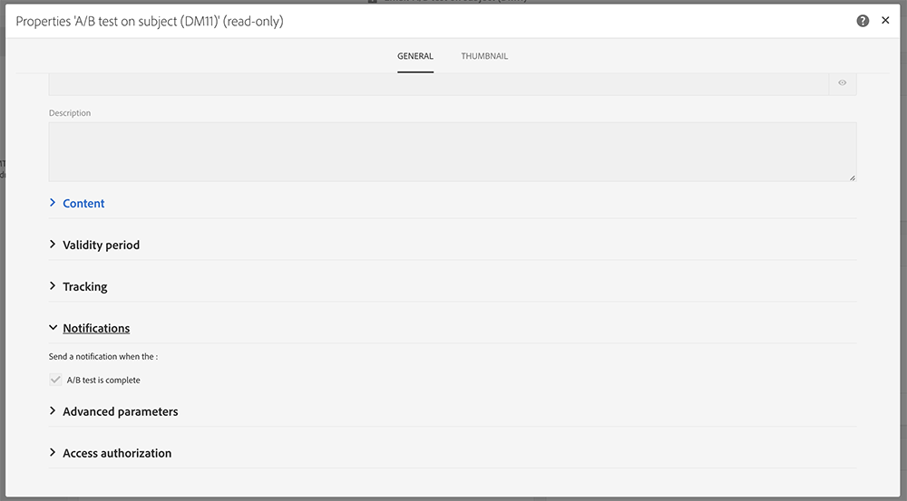

# 傳送內部通知{#sending-internal-notifications}

Adobe Campaign可讓您直接在應用程式中接收有關重要系統活動的通知。 即時通知可讓相關利益相關者隨時得知相關資訊，讓使用者能夠立即直接從應用程式中處理活動通知。 團隊的成果是，提高了靈活性、效率和更順暢地執行宣傳活動。

您可以設定下列物件的通知：

* **[!UICONTROL A/B Test emails]**: 電子郵件建立者和修改者會收到選擇變型（自動模式）或需要選擇變型（手動模式）的通知。 按一下通知會顯示對應的電子郵件。 預設會在現成可用的A/B測試範本中啟用通知。 如果您要停用它們，請編輯電子郵件或電子郵件範本的屬性，並取消勾選「一般>通知」 **下方的方塊**。 有關A/B測試電子郵件的詳細資訊，請參 [閱建立AB測試](../../channels/using/designing-an-a-b-test-email.md)。 有關電子郵件屬性的詳細資訊，請參 [閱電子郵件屬性清單](../../administration/using/configuring-email-channel.md#list-of-email-properties)。

   

* **[!UICONTROL Workflows]**: 每當工作流程發生錯誤時，都會通知所選安全性群組的每個成員（電子郵件和應用程式內通知）。 按一下通知或電子郵件連結會顯示對應的工作流程。 預設會在現成可用的工作流程範本中停用通知。 如果要激活它們，請編輯工作流或工作流模板的屬性，並在「常規」>「執行」>「錯誤管理」>「監 **管者」下添加安全組**。 有關安全組的詳細資訊，請參閱管 [理組和用戶](../../administration/using/managing-groups-and-users.md)。 有關工作流屬性的詳細資訊，請參閱 [工作流屬性](../../automating/using/managing-execution-options.md)。

   
