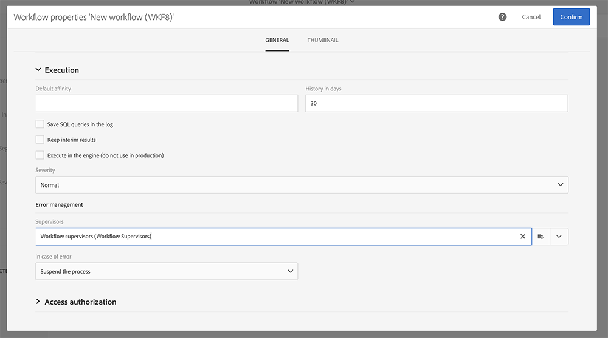

# 傳送內部通知{#sending-internal-notifications}

Adobe Campaign為您提供了直接在應用程式中接收有關重要系統活動的通知的可能性。 即時通知可隨時通知相關利益相關方，並為用戶提供立即和直接對應用程式內的活動通知採取行動的能力。 團隊的結果是提高靈活性、效率和更順利地執行活動。

您可以為以下對象配置通知：

* **[!UICONTROL A/B Test emails]**:通知電子郵件建立者和修改者已選擇變型（自動模式）或需要選擇變型（手動模式）。 按一下通知將顯示相應的電子郵件。 預設情況下，通知會在現成A/BTest模板中激活。 如果要取消激活它們，請編輯電子郵件或電子郵件模板的屬性，並取消選中位於 **常規>通知**。 有關A/BTest電子郵件的詳細資訊，請參閱 [建立ABTest](../../channels/using/designing-an-a-b-test-email.md)。 有關電子郵件屬性的詳細資訊，請參閱 [電子郵件屬性清單](../../administration/using/configuring-email-channel.md#list-of-email-properties)。

   

* **[!UICONTROL Workflows]**:每當工作流出錯時，都會通知選定安全組的每個成員（電子郵件和In-App通知）。 按一下通知或電子郵件連結將顯示相應的工作流。 預設情況下，在現成工作流模板中，通知將被停用。 如果要激活它們，請編輯工作流或工作流模板的屬性，並在 **常規>執行>錯誤管理>主管**。 有關安全組的詳細資訊，請參閱 [管理組和用戶](../../administration/using/managing-groups-and-users.md)。 有關工作流屬性的詳細資訊，請參閱 [工作流屬性](../../automating/using/managing-execution-options.md)。

   
