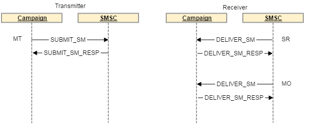
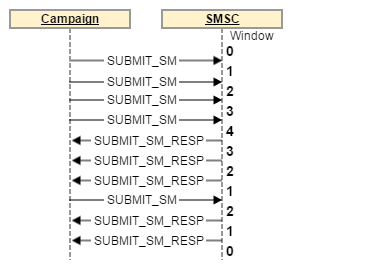

# 簡訊連接器通訊協定及設定 {#sms-connector-protocol}

>[!NOTE]
>
>此 **SMS聯結器通訊協定及設定** 若需Adobe Campaign Classic的相關資訊，請參閱此處 [頁面](https://experienceleague.adobe.com/docs/campaign-classic/using/sending-messages/sending-messages-on-mobiles/sms-protocol.html).
>
>透過此檔案，所有對詳細資訊的參照、欄位名稱和值均參照 [SMPP 3.4規格](https://smpp.org/SMPP_v3_4_Issue1_2.pdf).

## 概覽 {#overview}

SMS可能僅限於傳送無格式的短文字訊息，但其簡易性使其成為有價值的通訊頻道。

傳送SMS有兩個主要方法：

* 手動透過電話傳送，這是人們直接溝通的常見方式。

* 透過Adobe Campaign傳送訊息的方式，從網際網路傳送。 為此，您需要將網際網路連線至行動網路的SMS服務提供者。
Adobe Campaign使用SMPP通訊協定傳送SMS給服務提供者。

本檔案將逐步引導您完成Adobe Campaign與SMPP提供者之間的連線設定。

SMPP提供者有時可能會偏離官方規格，但Adobe Campaign中的SMS聯結器提供許多選項來調整其行為，使其與大多數提供者相容。

>[!IMPORTANT]
>
>設定與新提供者的連線可能需要一些技術技能、TCP知識、二進位、十六進位表示和文字編碼。 它還需要與提供者進行積極的合作。

### 簡訊型別 {#sms-types}

透過SMS提供者傳送大量簡訊時，您會遇到三種不同的SMS：

* **SMS MT （已終止行動裝置）**：Adobe Campaign透過SMPP提供者向行動電話發出的SMS。

* **SMS MO （行動裝置原始）**：行動裝置透過SMPP提供者傳送給Adobe Campaign的SMS。

* **SMS SR （狀態報表）或DR或DLR （交貨收貨）**：行動裝置透過SMPP提供者傳送給Adobe Campaign的回條，指出已成功接收簡訊。 Adobe Campaign也可能收到指出訊息無法傳送的SR，通常附有錯誤說明。

您需要區分確認（RESP PDU，SMPP通訊協定的一部分）和SR： SR是一種透過網路端對端傳送的SMS，而確認僅是確認一項傳送已成功。

確認和SR都可以觸發錯誤，區分兩者有助於疑難排解。

### 簡訊所攜帶的資訊 {#information-sms}

簡訊包含的資訊多於文字。 以下是您可在SMS中找到的專案清單：

* 限制在140個位元組的文字，根據編碼方式，這表示70到160個字元之間。 另請參閱 [SMS文字編碼](../../administration/using/sms-protocol.md#sms-text-encoding) 以下提供詳細資訊和限制。

* 收件者地址，有時稱為 `ADC` 或 `MSISDN`. 這是將會接收簡訊的行動裝置號碼。

* 可呼叫的寄件者地址 `oADC` 或有時 `sender id`. 這可以是日常使用的電話號碼、透過提供者傳送時的簡短代碼或名稱。 名稱是選用功能，在此情況下您無法回覆SMS。

* 指出訊息是否為快閃訊息的旗標。 快閃訊息是未儲存在記憶體中的快顯視窗。

* 用於指示是否需要SR的旗標。

* 有效日期，之後不允許任何網路裝置重試。

* A `data_coding` 欄位，表示文字的編碼。

## smpp通訊協定 {#smpp-protocol}

Adobe Campaign Standard支援SMPP通訊協定版本3.4。這是廣泛的通訊協定，允許傳送SMS給提供者(SMSC)並接收SMS以及回條。 有關詳細資訊，請參閱 [SMPP檔案](https://smpp.org/SMPP_v3_4_Issue1_2.pdf).

SMS服務提供者端的網路裝置通常稱為SMSC。

### smpp連線 {#smpp-connections}

Adobe Campaign透過TCP連線至SMS服務提供者的網路裝置。 SMPP通訊協定會設定從Adobe Campaign到提供者的永久TCP連線。 TCP連線一律由Adobe Campaign起始，即使是接收訊息亦然。
SMPP會根據其模式開啟1或2個TCP連線。 所有連線一律由Adobe Campaign起始。

SMPP通訊協定可以在兩種模式中運作：

* **傳送器+接收器（或TX+RX）**：兩個獨立的TCP連線用於傳送及接收訊息。
* **收發器(abor TRX)**：單一TCP連線用於傳送及接收訊息。

>[!NOTE]
>
>TRX較Adobe Campaign Standard偏好使用，因為它會減少連線數量，並簡化發生失敗時的連線復原工作。

### SMPP PDU {#smpp-pdu}

SMPP傳輸單位（「封包」）稱為PDU。 A **PDU** 包含命令、狀態、序號和資料。

每個PDU都必須由 `SMPP RESP PDU` （同步回應）。 請求可以管道化：傳送者可以傳送許多命令，而不需要等候 `RESP`，可隨時管線傳送的要求數稱為視窗。 `RESP PDU` 可能會以任何順序到達，與其對應的啟動器PDU的順序無關。

在中隔開 **傳送器+接收器** 模式，所使用的連線取決於傳送的訊息型別。 傳送器連線用於MT，而接收器連線用於MO和SR。 各種訊息的要求和回應會透過相同的TCP連線傳送。

例如，傳送MT時，會使用傳送器連線，而 `RESP` 會確認MT也會透過傳送器通道傳送。 當您收到MO （或SR）時，會使用接收器連線來接收MO並傳送 `RESP` 確認MO的訊息。



在Adobe Campaign Standard中，MT和SR調解是MTA的原生功能，因此沒有專用的SMS程式。

成功 `SUBMIT_SM_RESP PDU` 成功時會在傳送記錄中觸發「已傳送」訊息狀態 `DELIVER_SM (SR) PDU` 觸發「已接收」訊息狀態。

### 安全性方面 {#security-aspects}

通訊協定本身並未加密。 大部分提供者在允許清單上實作IP的變體，因此必須向提供者宣告Adobe Campaign伺服器IP位址。

Adobe Campaign支援在繫結階段傳遞登入和密碼。 它也支援SMPP over TLS。 請注意，需要憑證才能保證適當的安全性。 雖然SMPP聯結器允許略過憑證檢查，但只應該用於測試，因為沒有憑證的TLS提供顯著較低的安全性層級。

聯結器使用系統提供的預設憑證 `openssl` 資料庫。 通常由 `/etc/ssl/certs` Debian目錄。 此目錄預設由「ca-certificates」套件提供，但可加以自訂。

### 各種PDU中的資訊 {#information-pdu}

每種PDU都有不同的欄位，這些欄位包含不同的資訊。 這些PDU的詳細資料載於 [SMPP 3.4規格](https://smpp.org/SMPP_v3_4_Issue1_2.pdf).

以下各節說明PDU及其同步回應(`*_RESP PDU`)。 所有PDU都必須由對應的 `RESP`，這是規格的必要部分。

PDU可以有選填欄位。 此處僅說明最常見的欄位。 請參閱 [SMPP 3.4規格](https://smpp.org/SMPP_v3_4_Issue1_2.pdf) 以取得詳細資訊。

#### BIND_TRANSMITTER / BIND_RECEIVER / BIND_TRANSCEIVER {#bind-transmitter}

此PDU用於啟動與SMSC的連線。 **傳送器**， **接收者** 和 **收發器** 模式只會變更允許透過此連線傳輸的SMS型別，尤其是：

| 模式 | 允許的SMS型別 |
|:-:|:-:|
| 傳送器 | MT |
| 接收者 | MO + SR |
| 收發器 | MT + MO + SR |

中的主要欄位 `BIND_* PDU`：

* **system_id**：用於驗證的登入。 在外部帳戶中設定。

* **密碼**：用於驗證的密碼。 在外部帳戶中設定。

* **system_type**：某些提供者必須設定為特定值。 在外部帳戶中設定，適用於所有版本。 經常會區分不同型別的合約、管道、國家/地區等。

* **addr_ton** 和 **addr_npi**：某些提供者需要。 由設定 `Bind TON` 和 `Bind NPI` 外部帳戶中的設定。

* **address_range**：某些提供者需要。 大部分時間，此連線都允許使用短程式碼清單。 在外部帳戶中設定。

`BIND_*_RESP` 沒有特定欄位，可確認連線是否成功。

#### 解除繫結 {#unbind}

此PDU必須在中斷連線之前由系統傳送。 它必須等待相符專案 `UNBIND_RESP PDU` 關閉連線之前。

符合SMSC的請勿關閉連線，TCP連線是由Adobe Campaign聯結器所控制。

#### SUBMIT_SM {#submit-sm}

此PDU會將MT傳送至SMSC。 其回應PDU會提供MT的ID。

中的主要欄位 `SUBMIT_SM PDU`：

* **service_type**：某些提供者會要求使用。 在傳遞屬性中設定。

* **source_addr_ton** 和 **source_addr_npi**：指出傳輸的來源位址型別。 這些欄位的含義是標準化的，但由於某些提供者使用欄位的方式不同，因此您應要求提供者提供其正確的值。 在外部帳戶中設定。

* **source_addr**：MT的來源位址/ oADC。 它將顯示在行動電話上。 在外部帳戶和傳送中設定，傳送中的值優先於外部帳戶的值。

* **dest_addr_ton** 和 **dest_addr_npi**：指出傳輸的目的地位址型別（例如本機或國際格式）。 這些欄位的含義是標準化的，但由於某些提供者使用欄位的方式不同，因此您應要求提供者提供其正確的值。 在外部帳戶中設定。

* **destination_addr**：收件者地址、電話號碼或MSISDN。

* **esm_class**：用於判斷文字欄位中是否使用了UDH。 在以下情況下，聯結器會自動啟用分割SMS： `message_payload` 未使用模式。

* **priority_flag**：此訊息的優先順序高於其他訊息。 這會與傳遞本身的優先順序緊密結合。

* **validity_period**：時間戳記，之後不應嘗試重試。 在傳遞本身中設定。

* **registered_delivery**：說明是否要求SR。 Adobe Campaign一律會設定此標幟，自動回覆除外。 對於多部分訊息，僅針對第一部分設定標籤。 所有版本都有相同的行為。

* **data_coding**：表示文字欄位中使用的編碼。 請參閱 [SMS文字編碼](../../administration/using/sms-protocol.md#sms-text-encoding) 區段以取得詳細資訊。

* **short_message**：訊息的文字。 若使用UDH，這也會包含UHD標頭。

Adobe Campaign支援下列選用欄位：

* **dest_addr_subunit**：用於指定SMS的目標：快閃、行動或SIM卡。 在傳遞屬性中設定。

* **message_payload**：在外部帳戶中啟用時，長訊息將在單一PDU中傳送，文字將在此欄位中傳輸，而不是 `short_message` 欄位。

#### SUBMIT_SM_RESP {#submit-sm-resp}

此PDU將包含MT的ID。 這對於將其與傳入SR匹配很有用。

>[!IMPORTANT]
>
>許多提供者會以十六進位傳送MT ID。 請務必將 **MT確認中的ID格式** 在外部帳戶中正確設定。

有些提供者會傳送 `SUBMIT_SM_RESP` 傳送SR之後。 為了說明該行為，Adobe Campaign會等待30秒再回覆 **無效的訊息ID** 至具有未知ID的SR。

#### DELIVER_SM {#delivery-sm}

此PDU由SMSC傳送至Adobe Campaign。 它包含MO或SR。

大部分欄位的含義與其相同 `SUBMIT_SM` 相對應專案。 以下是實用欄位清單：

* **source_addr**：MO/SR的來源位址。 這通常是電話號碼。

* **destination_addr**：收到MO或SR的簡短代碼。

* **esm_class**：用於判斷PDU是MO還是SR。

* **short_message**：訊息的文字。 對於SR，這包含SMPP通訊協定規格附錄B中說明的資料。 另請參閱 [SR錯誤管理](../../administration/using/sms-protocol.md#sr-error-management) 以取得更多詳細資料。

Adobe Campaign可讀取以下位置的訊息ID： `receipted_message_id` 選擇性欄位，包含一些設定調整。

#### DELIVER_SM_RESP {#deliver-sm-resp}

此PDU由Adobe Campaign傳送以認可SR和MO。

Adobe Campaign Standard只會傳送 `DELIVER_SM_RESP` 一旦所有處理步驟均成功。 這樣可確保在仍存在處理錯誤風險時不會確認SR或MO。

#### ENQUIRE_LINK {#enquire-links}

此PDU僅用於檢查連線是否使用中。 應根據提供者的需求設定其頻率。

預設的60秒應與外部帳戶中設定的大多數設定相符。

#### INQUIRE_LINK_RESP {#enquire-links-resp}

此PDU確認連線為作用中。

### 多部分SMS （長SMS） {#multipart}

多部分SMS或長SMS是以多個部分傳送的SMS。 由於行動網路通訊協定中的技術限制，SMS不能大於140位元組，否則需要分割。 請參閱 [SMS文字編碼](../../administration/using/sms-protocol.md#sms-text-encoding) 區段以進一步瞭解簡訊中可容納的字元數。

長訊息的每個部分是個別的SMS。 這些零件在網路上獨立運作，並由接收的行動電話組裝。 為了處理重試和連線問題，Adobe Campaign會以相反順序傳送這些部分，並僅在訊息的第一部分（最後傳送）請求SR。 由於行動電話只會在收到其第一部分時顯示訊息，因此對其他部分的重試不會在行動電話上產生重複專案。

可使用以下專案設定每次傳遞的每則訊息簡訊數上限： **每則訊息的簡訊數上限** 在中設定 **傳遞範本**. 超過此限制的訊息將在傳送期間因簡訊失敗原因過長而失敗。

傳送長簡訊的方式有兩種：

* **UDH**：傳送長訊息的預設與建議方式。 在此模式中，聯結器會將訊息分割為多個 `SUBMIT_SM PDU`包含UDH資訊的。 此通訊協定是行動電話本身使用的通訊協定。 這表示Adobe Campaign對訊息產生有最大控制權，因此能夠精確計算已傳送多少部分及其分割方式。

* **message_payload**：在單一傳送整個長訊息的方式 `SUBMIT_SM PDU`. 提供者必須加以分割，這表示Adobe Campaign無法得知已傳送的確切數量。 某些提供者需要此模式，但建議您僅在他們不支援UDH時才使用它。

請參閱 `esm_class`， `short_message` 和 `message_payload` 的欄位 [SUBMIT_SM PDU](../../administration/using/sms-protocol.md#information-pdu) 以取得有關通訊協定和格式的詳細資訊。

### 輸送量上限與視窗 {#throughput-capping}

大多數提供者需要每個SMPP連線的輸送量限制。 這可透過在外部帳戶中設定多個SMS來達成。 請注意，每個連線都會發生輸送量節流，總有效輸送量是每個連線的限制乘以連線總數。 有關詳情，請參閱 [同時連線](../../administration/using/sms-protocol.md#connection-settings) 區段。

若要達到最大可能的輸送量，您需要微調最大傳送時段。 傳送視窗為 `SUBMIT_SM PDU`可傳送而不需等候的 `SUBMIT_SM_RESP`. 請參閱 [傳送視窗設定](../../administration/using/sms-protocol.md#throughput-timeouts) 區段以取得更多詳細資料。

### 服務請求與錯誤管理（「附錄B」） {#sr-error-management}

SMPP通訊協定會定義中的標準同步錯誤 `RESP PDU`s，但不會定義SR的錯誤代碼。 每個提供者都使用自己的錯誤代碼及其含義。

建議列於的附錄B區段 [SMPP通訊協定規格](https://smpp.org/SMPP_v3_4_Issue1_2.pdf) （第167頁），但這並未列出實際錯誤代碼及其含義。

為了適應錯誤管理，已運用Adobe Campaign的broadlog訊息系統來適當地布建錯誤及其嚴重性（硬式、軟式等）。

如上所述，有兩種不同型別的錯誤：

* 中的同步回覆 `SUBMIT_SM_RESP` 這會在訊息傳送至SMSC後立即發生
* 行動裝置收到訊息或訊息逾時時，稍後可能會收到回條。 在這種情況下，錯誤可在SR中找到。

收到SR時，可在以下位置找到狀態和錯誤： `short_message` 欄位（適用於附錄B的合規實作）。 此 `short_message` PDU的欄位通常稱為 **文字欄位** 因為它包含MT文字。 若是SR，則包含技術資訊以及名為的子欄位 **文字**. 這2個欄位不相同，且 `short_message` 實際包含 **文字** 欄位和其他資訊。

#### SR文字欄位格式 {#sr-text-field-format}

該規格建議對SR文字欄位使用此格式。 這是子欄位的清單，以冒號分隔以區隔欄位名稱及其值。 欄位名稱不區分大小寫。

符合附錄B建議的SR文字欄位範例：

```
id:1234567890 sub:001 dlvrd:001 submit date:1608011415 done date:1608011417 stat:DELIVRD err:000 Text:Hello Adobe world
```

ID欄位是中接收的ID `SUBMIT_SM_RESP PDU`，瞭解MT。

`sub` 和 `dlvrd` 應該計算傳遞的零件和傳遞的訊息數量，但Adobe Campaign不會使用此功能，因為broadlog系統提供更好、更整合的資訊。

`submit date` 和 `done date` 欄位代表MT傳送時間與行動裝置傳送SR的時間戳記。 預期時區會出現一些問題，甚至是日期集不正確的行動裝置所給定的錯誤時間戳記。

stat欄位很重要，因為它可告知訊息的狀態。 唯一重要的狀態為 `DELIVRD`， `UNDELIV` 和 `REJECTD`. 此 `DELIVRD` 狀態表示成功，其他兩個表示錯誤。 也可以使用其他值，但通常是中繼通知，例如MT到達行動電信業者，但不是行動電話。 Adobe Campaign會忽略這些中繼通知。

錯誤欄位包含提供者特有的錯誤代碼。 提供者必須提供一份可能的錯誤代碼表格，以及能夠解譯此值的意義。

最後，文字欄位通常包含MT文字的開頭。 Adobe Campaign會忽略此專案，而有些提供者不會傳輸此專案，以避免PII洩漏和網路頻寬消耗。 在疑難排解期間，可透過讀取此欄位，更輕鬆地找出與測試MT相符的SR。

### Adobe Campaign Standard Extended generic SMPP中的SR處理範例 {#sr-processing}

此範例顯示遵循附錄B建議的實作案例、外部帳戶中的預設值以及成功的SMS MT。

```
id:1234567890 sub:001 dlvrd:001 submit date:1608011415 done date:1608011417 stat:DELIVRD err:000 Text:Hello Adobe world
```

首先， `id extraction` 規則運算式會套用以擷取ID，並將其與對應的MT進行調解。

然後 `status extraction` 規則運算式和 `error code extraction` 規則運算式會套用以擷取這些欄位，並附加至字串。

broadlog訊息是以此資訊建構，並且會附加原始未變更的字串以供參考：

```
SR ExampleProvider DELIVRD 000|MESSAGE=id:1234567890 sub:001 dlvrd:001 submit date:1608011415 done date:1608011417 stat:DELIVRD err:000 Text:Hello Adobe world
```

然後會標準化訊息，移除MESSAGE部分，以便能夠將多個訊息與相同的狀態和錯誤碼進行比對。

```
SR ExampleProvider DELIVRD 000|#MESSAGE#
```

如果訊息尚未布建在broadlog訊息表格中，則會建立新專案，將整個訊息用作 **第一文字** 和標準化訊息。 接著，聯結器會使用成功和 `error` 用於確定是成功還是失敗的regex：

* 如果它符合 `success` 規則運算式，則視為成功。

* 如果它符合 `error` regex，則訊息會限定為錯誤。

* 如果這兩個規則運算式都不相符，則會忽略SR。 它可能是中繼通知，Adobe Campaign不會處理。

依預設，所有錯誤都會布建為軟錯誤。 這表示必須手動布建硬錯誤。

### SMS文字編碼 {#sms-text-encoding}

您應該 **如果出現編碼問題，請務必與SMSC提供者聯絡**. 只有SMSC提供者對其支援的編碼有精確的瞭解，且由於其技術平台的限制而可能適用的特殊規則。

SMS訊息使用特殊的7位元編碼，通常稱為GSM7編碼。

在SMPP通訊協定中，會將GSM7文字展開為每個字元8位元，以較容易進行疑難排解。 SMSC會將其封裝成每個字元7位元，再傳送給行動裝置。 這表示 `short_message` SMS的欄位在SMPP框架中可能長達160位元組，而在行動網路上傳送時上限為140位元組。

如果出現編碼問題，請檢查以下重要事項：

* 請確定您知道哪些字元屬於哪種編碼。 GSM7不完全支援變音符號（重音符號）。 尤其是在法文中，é和è是GSM7的一部分，但ê、â或ï卻不是。 西班牙文也是如此。

* 包含cedilla (c)的C在GSM7字母表中僅以大寫形式出現，但有些手機以小寫或「智慧」型大小寫呈現。 一般建議是完全避免這種情況並移除cedilla或切換至UCS-2。

* **請勿在簡訊中使用ASCII** 除非SMSC提供者明確要求。 這種編碼會浪費空間，因為它有8位元的字元並且覆蓋範圍比GSM7少。 CDMA網路（用於北美）可能需要此編碼。

* 不一定會支援Latin-1。 在嘗試使用Latin-1之前，請檢查與您的SMSC提供者的相容性。

* Adobe Campaign聯結器不支援國家語言轉換表。 您必須使用UCS-2或其他 `data_coding` 而非。

* UCS-2和UTF-16經常被手機混合使用。 使用emoji和UCS-2中不存在的其他字元時，就會發生問題。

* 大多數電話沒有所有UCS-2字元的字型字元。 智慧型手機通常能夠相當輕鬆地顯示罕見字元，但功能型手機通常只支援購買國母語有用的功能。 如果您想要使用emoji或ASCII-art，請在傳送前於各種手機上測試。 Adobe Campaign預覽不會模擬缺少的字元，且會顯示網頁瀏覽器上可用的符號。

此 `data_coding` 欄位會說明使用哪種編碼。 主要問題是值0表示規格中的預設SMSC編碼，這通常指GSM7。 與編碼相關聯的SMSC合作夥伴確認 `data_coding` = 0 (Adobe Campaign僅支援)。 其他 `data_coding` 值通常遵循規格，但唯一能確定的方法是向SMSC提供者查詢。

訊息的大小上限取決於其編碼。 下表總結了所有相關資訊：

| 編碼 | 通常的data_coding | 訊息大小（字元） | 多部分SMS的部分大小 | 可用字元 |
|:-:|:-:|:-:|:-:|:-:|
| GSM7 | 0 | 160 | 152 | GSM7基本字元集+擴充功能（擴充字元佔2個字元） |
| Latin-1 | 3 | 140 | 134 | ISO-8859-1 |
| UCS-2 <br>UTF-16 | 8 | 70 | 67 | Unicode （因手機而異） |

## SMPP外部帳戶引數 {#SMPP-parameters-external}

SMPP通訊協定的每個實作都有許多變數。 為了改善相容性和適應性，可使用許多設定來變更SMPP聯結器的行為。 本節說明每個引數及其對聯結器的影響。

### 一般引數和路由 {#general-parameters-routing}

**限制此帳戶的MTA執行個體**

您可以設定允許連線至SMPP提供者的MTA執行個體數目限制。 如果勾選，您可以指定最多可以使用多少MTA。

此選項可讓您更精確地控制連線數目，請參閱 [同時連線](../../administration/using/sms-protocol.md#connection-settings).

如果您設定的值高於正在執行的MTA數量，則所有MTA都會正常執行：此選項只是一個限制，不會產生額外的MTA。

如果您需要精確控制連線數量（例如提供者需求），建議一律設定此選項，即使目前部署執行中的MTA數量正確。 如果之後新增其他MTA，仍會遵守連線限制。

### 連線設定 {#connection-settings}

#### SMPP連線模式 {#smpp-connection-mode}

在中設定連線 **收發器** 模式或以分隔方式顯示 **傳送器+接收器** 模式。 當您切換為分開時 **傳送器+接收器** 模式，中的設定 **SMPP連線模式** 區段套用至「 」中的傳送器和設定 **接收方連線設定** 區段適用於接收器連線，前提是您已核取 **對接收方使用不同的引數** 核取方塊。

#### SMSC 實作名稱 {#smsc-implementation-name}

設定SMSC實作的名稱。 應將其設定為您的提供者的名稱。 請聯絡管理員或傳遞團隊，以瞭解要在此欄位中新增什麼。 此欄位的角色在 [SR錯誤管理](../../administration/using/sms-protocol.md#sr-error-management) 區段。

#### 伺服器 {#server}

要連線之伺服器的DNS名稱或IP位址。

#### 連接埠 {#port}

要連線的TCP連線埠。

#### 帳戶 {#account}

連線的登入。 傳遞於 `system_id` BIND PDU的欄位。

#### 密碼 {#password}

SMPP連線的密碼。 在BIND PDU的密碼欄位中傳遞。

#### 系統類型 {#system-type}

傳入的值 `system_id` BIND PDU的欄位。 有些提供者需要在此指定特定值。

#### 同時連線 {#simultaneous-connections}

在Adobe Campaign Standard中，它定義每個SMS執行緒和每個MTA處理程式的連線數。
MTA流程的數目由部署決定：通常有2個MTA和1個執行緒。 可以使用smppConnectorThreads設定在config-instance.xml檔案中變更執行緒數目。 通常每個容器有1個MTA處理序，每個MTA處理序有1個執行緒。

Adobe Campaign Standard的總連線公式：

* **連線總數=同時連線*執行緒數量* MTA數量**

同步連線設定在外部帳戶中，執行緒數目設定在config-instance.xml檔案(smppConnectorThreads)中，而MTA數目可在外部帳戶中受限。

分隔符號 **傳送器/接收器** 模式，上方的連線數代表使用者數 **傳送器/接收器** 配對，表示總共會有兩倍的連線數量。

#### 透過 SMPP 啟用 TLS {#enable-TLS}

使用TLS連線到提供者。 連線將會加密。 TLS連線由OpenSSL程式庫管理，任何適用於OpenSSL的內容對於此連線都將為True。

#### 在記錄檔中啟用詳細的 SMPP 追蹤 {#enable-verbose-log-file}

此設定會傾印記錄檔中的所有SMPP流量。 在初始設定期間，通常需要調整引數。 疑難排解聯結器時，必須啟用此功能，並與提供者看到的流量進行比較。

### 接收方連線設定 {#receiver-connection}

此區段只會以分隔顯示 **傳送器+接收器** 模式。

#### 為接收方使用不同的參數 {#receiver-parameters}

取消核取此方塊時，傳送器與接收器會使用相同的設定。

核取方塊後，設定在 **連線設定** 區段將套用至「 」中的 **接收方連線** 設定將套用至接收器。

**接收方伺服器、連線埠、帳戶、密碼、系統型別**

這些設定適用於中的接收器 **傳送器+接收器** 模式。 它們的運作方式與傳送器部分類似，請參閱上方以取得詳細資訊。

### SMPP頻道設定 {#smpp-channel-settings}

#### 允許字母音譯 {#allow-character-transliteration}

音譯是尋找與遺失字元相當的字元的程式。 例如，GSM編碼中缺少法文「e」（帶有抑揚符號）字元，但可將其取代為「e」，而不會影響可讀性。

取消核取此方塊時，如果文字編碼無法完全依照原樣編碼字串，則會失敗。

核取此方塊時，文字編碼會嘗試將字串轉換為近似版本，而非失敗。 如果部分字元在目標編碼中沒有對應的字元，文字編碼將會失敗。

請參閱 [定義編碼設定的特定對應](../../administration/using/sms-protocol.md#SMSC-specifics) 以取得編碼程式的一般說明。

#### 在資料庫中儲存傳入MO {#incoming-mo-storing}

啟用後，傳入的MO將儲存在資料庫的inSMS表格中。 您可以使用任何工作流程的查詢活動來查詢此表格。

#### 在SR處理期間啟用即時KPI更新 {#real-time-kpi}

啟用後，接收錯誤SR時，KPI將在主要傳遞頁面上即時更新。

缺點可能是效能低，因為它會產生資料庫爭用。 如果停用，統計資料會由 **syncfromexec** 工作流程，每20分鐘執行一次。

#### 來源編號 {#source-number}

定義訊息的預設來源位址。 此設定僅適用於傳送中來源號碼保持空白的情況。

依預設，來源編號欄位不會傳遞，因此提供者會將其取代為短程式碼。

這會啟用寄件者地址/oADC覆寫功能。

#### 簡短代碼 {#short-code}

表示帳戶的主要簡短代碼。 若此帳戶使用多個短代碼，或短代碼不明，則將此欄位留空。

指定短程式碼有助於兩個功能：

* 如果未提供來源號碼，預覽會顯示簡短代碼。 它會反映行動電話上的真實行為。

* 自動回覆功能的封鎖清單設定只會針對特定短程式碼傳送給隔離使用者。

#### 來源TON/NPI、目的地TON/NPI {#ton-npi}

TON （編號型別）和NPI （編號計畫指示器）在 [SMPP 3.4規格](https://smpp.org/SMPP_v3_4_Issue1_2.pdf) （第117頁）。 這些值應該設定為提供者的需求。

它們會依原樣在中傳輸 `source_addr_ton`， `source_addr_npi`， `dest_addr_ton` 和 `dest_addr_npi` 的欄位 `SUBMIT_SM PDU`.

#### 服務類型 {#service-type}

此欄位會依原樣在中傳輸 `service_type` 欄位屬於 `SUBMIT_SM PDU`. 將此設定為提供者的需求。

### 輸送量和逾時 {#throughput-timeouts}

這些設定控制SMPP頻道的所有計時方面。 有些提供者需要非常精確的訊息速率、視窗和重試計時控制。 這些設定應設定為符合提供者容量與其合約中所指示條件的值。

#### 傳送窗口 {#sending-window}

視窗為 `SUBMIT_SM PDU`可傳送而不需等候相符專案的 `SUBMIT_SM_RESP`.

最大視窗為4的傳輸範例：



當網路連結具有高延遲時，此視窗有助於增加輸送量。  視窗的值必須至少是SMS/s數乘以連結的延遲秒數，這樣聯結器就不會等待 `SUBMIT_SM_RESP` 再傳送下一個訊息。
如果視窗太大，您可以在連線發生問題時傳送更多重複的訊息。 此外，大多數提供者對視窗有非常嚴格的限制，並拒絕超過限制的訊息。

如何計算最佳傳送時間公式：

* 測量延遲時間介於 `SUBMIT_SM` 和 `SUBMIT_SM_RESP`.

* 將此值乘以最大MT輸送量（以秒為單位）。 這會提供最佳傳送視窗值。

範例：如果您在最大MT輸送量中設定了300個SMS/s，而且兩者之間有100毫秒的延遲 `SUBMIT_SM` 和 `SUBMIT_SM_RESP` 平均而言，最佳值為 `300×0.1 = 30`.

#### 最大 MT 輸送量 {#max-mt-throughput}

每秒和每個連線的最大MT數目。 此設定會嚴格執行，MTA絕不會以快於此限制的速度推送訊息。 對於需要精確節流功能的提供者來說，這個變數非常有用。

若要瞭解總輸送量限制，請將此數字乘以上述公式中詳述的連線總數。

0表示沒有限制，MTA會儘快傳送MT。

通常建議將此設定保持在1000以下，因為除非在最終架構上正確設定基準，否則無法保證超過此數量的精確輸送量。 如果您需要超過1000的輸送量，請連絡您的提供者。 將連線數目增加到1000 MT/s以上可能會更好。

#### 重新連線前的時間 {#time-reconnection}

當TCP連線中斷時，聯結器會先等候這個秒數，再嘗試建立連線。

#### MT 的有效期 {#expiration-period}

逾時介於 `SUBMIT_SM` 及其相符專案 `SUBMIT_SM_RESP`. 如果 `RESP` 未及時收到，則訊息會視為失敗，並套用MTA的全域重試原則。

#### 繫結逾時 {#bind-timeout}

TCP連線嘗試與 `BIND_*_RESP` 回覆。 逾時時，連線會由Adobe Campaign聯結器關閉，而且會等待一段時間再重新連線，然後重試。

#### enquire_link 時段 {#enquire-link-period}

`enquire_link` 是一種特殊型別的PDU，會傳送以保持連線運作。 此期間以秒為單位。 行銷活動聯結器只會傳送 `enquire_link` 當連線閒置以節省頻寬時。 如果在此期間後兩次未收到任何RESP，則會將連線視為無法使用，並觸發重新連線程式。

### SMSC細節 {#SMSC-specifics}

這些設定是進階設定，可讓Adobe Campaign聯結器適應大多數SMPP實作特性。

#### 定義編碼的特定對應 {#encoding-specific-mapping}

請參閱 [SMS文字編碼](../../administration/using/sms-protocol.md#sms-text-encoding) 區段，以瞭解文字編碼的詳細資訊。

此設定可讓您定義與規格不同的自訂編碼對應。 您將能夠宣告編碼清單，以及它們的 `data_coding` 值。

MTA將嘗試使用清單中的第一個編碼進行編碼。 如果失敗，則會嘗試使用清單上的下一個編碼等。 如果無法使用編碼來編碼訊息，則會發生錯誤。 找到編碼後，MTA會建立 `SUBMIT_SM PDU` 包含編碼文字和 `data_coding` 以表格中指定的值設定的欄位。

表格中的專案順序很重要：編碼是從上到下的嘗試。 您應該將最便宜或最建議的編碼放在清單的最前面，然後是越來越昂貴的編碼。

請注意，UCS-2絕不會失敗，因為它可編碼Adobe Campaign支援的所有字元，而UCS-2 SMS的長度上限則小得多：僅限70個字元。

您也可以使用此設定，透過在對應表中僅宣告1行來強制一律使用特定編碼。

未核取核取方塊時使用的預設對應等於下表：

| data_coding | 編碼 |
|---|---|
| 0 | GSM |
| 9 | UCS-2 |

這表示MTA會嘗試在GSM中編碼訊息。 如果成功，它將傳送它 `data_coding` 設為0。

如果訊息無法以GSM編碼，則會以UCS-2編碼，並設定 `data_coding` 至8。

#### 啟用message_payload {#enable-message-payload}

取消勾選時，MTA會分割長簡訊，並以多個形式傳送 `SUBMIT_SM PDU`與UDH搭配使用。 此訊息將由行動電話根據UDH資料重新構成。

如果勾選，長簡訊會在一個SUBMIT_SM PDU中傳送，並將文字放在message_payload選用欄位中。 請參閱 [SMPP規格](../../administration/using/sms-protocol.md#ACS-SMPP-connector) 以取得相關詳細資訊。

若啟用此功能，Adobe Campaign將無法個別計算SMS部分：所有訊息都會計為只傳送一個部分。

#### 傳送完整的電話號碼 {#send-full-phone-number}

如果未核取此核取方塊，則只會傳送電話號碼的數字給提供者(`destination_addr` 欄位屬於 `SUBMIT_SM` 欄位)。 這是預設行為，因為國際數字指標（通常是+前置詞）會由SMPP中的TON和NPI欄位取代。

核取核取方塊時，電話號碼會依原樣傳送，不會預先處理及可能的空格、+前置詞或井號/雜湊/星號。

此功能也會影響自動回覆封鎖清單功能的行為：未核取核取方塊時，將向插入隔離表格的電話號碼新增+首碼，以補償SMPP通訊協定本身從電話號碼移除的+首碼。

#### 略過TLS憑證檢查 {#skip-tls}

啟用TLS時，略過所有憑證檢查。

一旦勾選，連線將變得不安全，生產中不應啟用此連線。

其對於除錯或測試用途相當實用。

#### 繫結TON/NPI {#bind-ton-npi}

TON （號碼型別）和NPI （編號計畫指示器），詳見 [SMPP 3.4規格](https://smpp.org/SMPP_v3_4_Issue1_2.pdf) （第117頁）。 這些值應該設定為提供者所需的任何值。

它們會依原樣在中傳輸 `addr_ton` 和 `addr_npi` 繫結PDU的欄位。

#### 地址範圍 {#address-range}

在BIND PDU的address_range欄位中依原樣傳送。 此值應設定為提供者所需的任何值。

#### 無效 ID 確認計數 {#invalid-id}

限制 **訊息ID無效** `DELIVER_SM_RESP` 可為單一SR傳送的電子郵件。

**此變通方法僅能用於疑難排解** 並在正常情況下設為0。

Fox範例，設定為2時：

* 提供者傳送SR (`DELIVER_SM`)，識別碼為「1234」。

* 在資料庫中找不到識別碼「1234」。

* 聯結器計數為1 **ID無效** 該ID發生錯誤，因此會傳送 `DELIVER_SM_RESP` 「訊息ID無效」的錯誤代碼（正常行為）。

* 提供者會重試ID為「1234」的同一SR。

* 在資料庫中仍找不到ID &quot;1234&quot;。

* 聯結器計數為2 **ID無效** 該ID發生錯誤，因此會傳送 `DELIVER_SM_RESP` &quot;OK&quot;，即使未正確處理亦然。

* 此功能旨在當無效的SR區塊合法表示無法處理訊息時，清除提供者端的SR緩衝區。

將此欄位設為0會停用機制，其中 **訊息ID無效** 一律會傳回，這是正常行為。

將此欄位設為1，即使ID無效，聯結器一律會回應「確定」。 只有在監督下，才應將這個值設為1，以進行疑難排解，並設定為最短時間，例如，從提供者端的問題復原。

#### SR 中 ID 的擷取規則運算式 {#regex-extraction}

SMPP通訊協定規格並未嚴格執行SR格式。 這僅是中說明的建議 [附錄B](../../administration/using/sms-protocol.md#sr-error-management) （第167頁）。 有些SMPP實作者對此欄位的格式不同，因此Adobe Campaign需要一種方法來擷取正確的欄位。

依預設，它可擷取之後最多10個英數字元 `id:`.

規則運算式必須正好有一個擷取群組，且部分包含在括弧中。 ID部分必須以括弧括住。 規則運算式格式為PCRE。

調整此設定時，請務必加入儘可能多的內容，以避免誤觸發。 如果有特定的首碼，例如 `id:` 在標準中，將它們包含在規則運算式中。 請儘量使用文字分隔符號(\b)，以避免在文字中間擷取文字。

在規則運算式中加入不夠的上下文可能會引入一個小的安全性缺陷：訊息的實際內容可包含在SR中。 如果您只比對不含任何內容的特定ID格式（例如UUID），則可能是剖析實際文字內容（例如，內嵌在文字欄位中的UUID），而非ID。

#### 用於確定成功/錯誤狀態所套用的規則運算式 {#regex-applied}

遇到具有未知統計/錯誤欄位組合的訊息時，這些規則運算式會套用至統計欄位，以判斷SR是成功還是錯誤。 統計值不符合任何這些規則運算式的SR會遭到忽略。

依預設，以開頭的統計值 `DELIV`，例如 `DELIVRD` 在 [附錄B](../../administration/using/sms-protocol.md#sr-error-management)，則會視為已成功傳遞，而所有符合錯誤的stat值，例如 `REJECTED`， `UNDELIV`視為錯誤。

#### MT確認中的ID格式 {#id-format-mt}

這表示ID在 `message_id` 欄位屬於 `SUBMIT_SM_RESP PDU`.

* **請勿修改**：ID會依原樣儲存在資料庫中，做為ASCII編碼文字。 不會進行前置處理或篩選。

* **十進位數字**：ID應為ASCII格式的小數。 使用此設定時，會移除前導和尾隨空格以及前導零。

* **十六進位數字**：ID應為ASCII格式的十六進位數字，開頭為0x，結尾為h。ID接著會先轉換為十進位數字，再儲存在資料庫中。

* **十六進位字串**：ID應為ASCII編碼的文字，其本身即為以十六進位編碼的位元組字串。 例如，在PDU中，您會找到 `0x34 0x31 0x34 0x32 0x34 0x33`，會轉換為ASCII「414243」。 然後，此字串會解碼為位元組的十六進位字串，而您會因此取得「ABC」：您會將ID「ABC」儲存在資料庫中。

#### SR中的ID格式 {#id-format-sr}

這表示擷取的ID格式 `Extraction` SR中ID的規則運算式。 值與上述MT格式具有相同的含義和相同的行為。

**選擇性欄位中的SR ID或錯誤代碼**

如果勾選，選用欄位的內容將會附加至上述規則運算式處理的文字中。 文字的格式為 `0xTAG:VALUE`， `0xTAG` 是標籤的4位十六進位值，以大寫表示，例如 `0x002E`.

例如，您可能會想要擷取 `receipted_message_id` 欄位。 為此，啟用此核取方塊，並將以下文字新增到狀態：

```
0x001E:05e3299e-8d37-49d0-97c6-8e4fe60c7739
```

在此範例中，0x001E是選用欄位的標籤，而UUID是欄位的值。

為了擷取此值，您現在可以在SR欄位中ID的擷取規則運算式中設定下列規則運算式：

```
\b0x001E:([0-9a-f]{8}-[0-9a-f]{4}-[0-9a-f]{4}-[0-9a-f]{4}-[0-9a-f]{12})\b
```

>[!IMPORTANT]
>
>您只能擷取有文字(ASCII/UTF-8)值的選用欄位。 具體來說，目前的規則運算式系統無法可靠地擷取二進位欄位。

**文字欄位中的SR ID或錯誤代碼**

若勾選， **文字** 在處理SR的狀態文字期間將保留欄位。

如果提供者將重要資料（例如ID或狀態）放置在此欄位中，這個功能會很有用。 此欄位通常可以安全地捨棄，因為它可能包含具有非ASCII編碼的文字，並中斷規則運算式處理。

啟用此選項可能會引入很小的安全性缺陷，如果 `Extraction` SR欄位中ID的規則運算式不夠具體。 的內容 **文字** 欄位可能會剖析為ID，而攻擊者可能會用它來插入偽造的ID，這可能會導致部分拒絕服務的情況。

**服務識別碼**

允許新增自訂TLV。 此欄位會設定標籤部分。 值可在的每次傳遞中自訂 **服務或方案ID** 的進階引數中的值。

此設定僅允許每則訊息新增一個TLV選項。

>[!NOTE]
>
>自21.1發行版本起，現在可以新增多個選用引數。 如需詳細資訊，請參閱本[區段](../../administration/using/sms-protocol.md#automatic-reply-tlv)。

### 傳送至 MO 的自動回覆 {#automatic-reply}

此功能可讓您快速回覆文字至MO，並處理傳送到封鎖清單的每短程式碼。

此 **關鍵字** 和 **簡短程式碼** 欄定義觸發自動回覆的條件。 如果兩個欄位相符，會傳送MO並觸發其他動作。 若要指定萬用字元，應將此欄位留空。 關鍵字會與MO文字中的第一個英數字元單字相符，忽略標點符號和前置空格。 這表示 **關鍵字** 欄位不可包含空格，且必須為單一單字。

此 **關鍵字** 設定是前置詞。 例如，如果您指定「AD」，則會比對「AD」、「ADAPT」和「ADOBE」。 如果您有多個具有相同首碼的關鍵字，請務必留意順序，因為關鍵字是從上到下處理。

此 **回覆** 欄是要回覆的文字。 此欄位中沒有可用的個人化。 如果您將此欄位留空，將不會回覆任何訊息，但反正也會觸發其他動作。

此 **其他動作** 當兩者皆有時，欄可提供額外的動作 **關鍵字** 和 **簡短程式碼** 相符，空白短程式碼符合所有短程式碼。 您可以傳送到隔離區或從隔離區中移除，對文字使用「無」回覆。 如果您指定 **其他動作** 但請留下 **回覆** 欄位留空時，將會執行動作但不會傳送任何回覆。 隔離僅適用於指定的短程式碼，或如果欄位留空則所有短程式碼。

>[!IMPORTANT]
>
>「傳送完整電話號碼」設定會影響自動回覆隔離機制的行為：如果未勾選「傳送完整電話號碼」，則加入隔離的電話號碼會加上加號(「+」)，使其與國際電話號碼格式相容。

表格中的所有專案會依指定順序處理，直到符合一個規則為止。 如果有多個規則符合一個MO，則只會套用最上層的規則。

### 自動回覆可選引數(TLV) {#automatic-reply-tlv}

自21.1版起，您可以新增選用引數至自動回覆MT。 它們會作為選用的TLV引數新增至 `SUBMIT_SM PDU` 的回覆，如附件的第5.3節所述 [SMPP規格](https://smpp.org/SMPP_v3_4_Issue1_2.pdf)（第131頁）。

如需有關選用引數的詳細資訊，請參閱本節 [區段](../../administration/using/sms-protocol.md#smpp-optional-parameters).

## 簡訊傳遞範本引數 {#sms-delivery-template-parameters}

某些引數可依傳遞範本設定。

### 來自欄位 {#from-field}

此欄位為選用。 它允許覆寫寄件者地址(oADC)。 此欄位的內容會放在 `source_addr` 欄位屬於 `SUBMIT_SM PDU`.

根據SMPP規格，欄位限製為21個字元，但某些提供者可能允許較長的值。 另請注意，某些國家/地區可能會套用非常嚴格的限制，例如長度、內容、允許的字元。

### 傳遞參數 {#delivery-parameters}

#### 每則訊息的簡訊數上限 {#maximum-sms}

此設定僅適用於 **訊息裝載** 設定已停用。 如需詳細資訊，請參閱此 [頁面](../../administration/using/configuring-sms-channel.md). 如果訊息需要的SMS數量超過此值，則會觸發錯誤。

SMS通訊協定將SMS限製為255個部分，但有些行動電話無法拼合長度超過10個部分左右的訊息，此限制取決於確切模型。 我們建議您不要每則訊息超過5個部分。

由於個人化訊息在Adobe Campaign中的運作方式，訊息的大小可能會有所不同。 大量的長訊息可能會增加傳送成本。

#### 傳輸模式 {#transmission-mode}

此欄位會指出您要傳輸的SMS型別：一般或快閃訊息，儲存在行動裝置或SIM卡上。

此設定會傳輸至 `dest_addr_subunit` 中的選用欄位 `SUBMIT_SM PDU`.

* **未指定** 在PDU中未傳送任何選用欄位。

* **Flash** 將值設為1。 它會傳送快閃訊息，該訊息會在行動裝置上彈出，且不會儲存在記憶體中。

* **一般** 將值設為0。 它會傳送一般訊息。

* **儲存在行動裝置上** 將值設為2。 它會告訴手機將簡訊儲存在內部記憶體中。

* **儲存在終端機上** 將值設為3。 它會告訴手機將簡訊儲存在SIM卡中。

#### 有效期限 {#validity-period}

有效期間會傳輸至 `validity_period` 欄位屬於 `SUBMIT_SM PDU`. 日期始終格式化為絕對UTC時間格式（日期欄位將以「00+」結尾）。

#### SMPP選用引數(TLV) {#smpp-optional-parameters}

自21.1版起，您可以為此傳送的每個MT新增多個選用引數。 這些選用引數會新增至 `SUBMIT_SM PDU` 的回覆，如附件的第5.3節所述 [SMPP規格](https://smpp.org/SMPP_v3_4_Issue1_2.pdf)（第131頁）。

表格中的每一列代表一個可選引數：

* **引數**：引數說明。 未傳輸到提供者。
* **標籤ID**：選用引數的標籤。 必須是有效的十六進位，使用格式0x1234。 無效值會導致傳遞準備錯誤。
* **值**：選用欄位的值。 在傳輸到提供者時編碼為UTF-8。 無法變更編碼格式，無法傳送二進位值或使用不同的編碼，例如UTF-16或GSM7。

如果任何選用引數具有相同的 **標籤ID** 作為 **產品服務編號** 若已在外部帳戶中定義，則此表格中定義的值將優先。

## SMPP聯結器 {#ACS-SMPP-connector}


箭頭代表資料流程。

這裡要注意的最重要事項是有多個SMPP聯結器對話串。 這些對話串完全相同並共用相同的設定。 這就是為什麼連線數總是乘以執行緒數的原因。

客戶無法變更執行緒數目，因為它需要變更設定檔。

### SMPP聯結器行為說明 {#behavior-smpp-connector}

#### 符合MT、SR和broadlog專案 {#matching-mt-sr}

在Adobe Campaign中，訊息是broadlog專案。 在Adobe Campaign Standard中，外部聯結器只需要瞭解正在運作的broadlog表格即可： `nmsBroadLogExec`. 工作流程負責將broadlog專案複製回其特定的目標維度(nmsBroadLogXXX)。

不幸的是，SMPP不允許隨訊息傳送ID：提供者會將MT ID提供給每個MT，然後提供具有相同ID的一或多個SR。

提供者提供的ID會儲存在 `sProviderId` 欄/ `nmsBroadLogExec` 表格。 SR一律會在MT成功傳送及確認後送達，但有時可能會未依順序送達(在Adobe Campaign中稱為未完成的SR)。 處理執行緒會暫時將這些SR儲存在RAM中，直到收到完整的資訊為止。

當確認MT時(`SUBMIT_SM_RESP`)， `sProviderId` 立即在資料庫中更新。

每個SR都由SMPP處理對話串單獨處理。 此程式是偽同步的：外界將視為從外部同步，但內部是以事件導向實施來實作。 只有在成功更新broadlog時，才會確認SR，如果發生錯誤，則會拒絕SR。

以下是套用至每個SR的程式：

* SR的ID會使用規則運算式擷取。
* 系統會在其中搜尋ID `nmsBroadLogExec:sProviderId`.
* 使用規則從SR擷取狀態+錯誤代碼。
* broadlog訊息機制可用來確認錯誤，並尋找broadlog訊息ID。
* Broadlog會更新為上述所有資訊。
* SR已確認。

若要勾選上述步驟，您必須 **啟用詳細的SMPP追蹤** 以手動檢查是否正確套用所有步驟。 每當Adobe Campaign連線到新的SMPP提供者時，都需要此資訊。

## 上線之前 {#checklist}

此檢查清單提供您上線前應檢查的事項清單。 不完整的設定可能會導致許多問題。

### 檢查外部帳戶衝突 {#external-account-conflict}

確認您沒有舊的SMS外部帳戶。 如果您停用測試帳戶，則會在生產系統上重新啟用該帳戶並產生潛在衝突的風險。

檢查是否有其他執行個體連線到此帳戶。 特別是，請確定預備環境未連線至帳戶。 有些提供者支援此功能，但需要在Adobe Campaign端及提供者的平台上有非常明確的設定。

如果您在同一Adobe Campaign執行個體上需要擁有多個帳戶，且這些帳戶連線至相同的提供者，請聯絡提供者，以確保他們實際區分這些帳戶之間的連線。 若有多個帳戶具有相同登入，則需要額外設定。

### 在檢查期間啟用詳細的SMPP追蹤 {#enable-verbose}

檢查期間應一律啟用詳細的SMPP追蹤。
即使您無法自行檢查記錄，支援人員也會協助您更輕鬆。

### 測試您的簡訊 {#test}

* **傳送包含各種字元的簡訊**
如果您需要傳送包含非GSM或非ASCII字元的SMS，請嘗試傳送一些包含儘可能多不同字元的訊息。 如果您設定自訂字元對應表，請儘量傳送至少一個SMS `data_coding` 值。

* **檢查SR是否已正確處理**
SMS應在傳送記錄檔中標示為已接收。 傳送記錄應該會成功，並且如下所示：
  `SR yourProvider stat=DELIVRD err=000|#MESSAGE`
檢查您是否已變更傳遞提供者名稱。 傳遞記錄不應包含 **SR一般** 在生產環境中。

* **檢查是否已處理MO**
如果您需要處理MO （自動回覆、將MO儲存在資料庫等）， 嘗試進行一些測試。 為所有自動回覆關鍵字傳送一些簡訊，並檢查回覆是否足夠快，不超過幾秒。
在記錄中檢查Adobe Campaign是否回覆成功 `DELIVER_SM_RESP` (command_status=0)。

### 檢查PDU {#check-pdus}

即使訊息看起來成功，也務必檢查PDU的格式是否正確。

在連線到之前未連線到Adobe Campaign的提供者時，此步驟是必要的。

#### 繫結 {#bind}

檢查 `BIND_* PDUs` 已正確傳送。 最重要的檢查專案是提供者一律會成功傳回 `BIND_*_RESP PDUs` (command_status = 0)。

檢查數量是否較少 `BIND_* PDU`s.如果太多，可能表示連線不穩定。 請參閱 [連線不穩定的問題](../../administration/using/sms-protocol.md#issues-unstable-connection) 區段以取得詳細資訊。

#### ENQUIRE_LINK {#enquire-link-pdus}

檢查 `ENQUIRE_LINK PDU`當連線閒置時，會定期交換。

#### SUBMIT_SM / DELIVER_SM {#submit-sm-deliver-sm}

傳送訊息，然後在記錄中搜尋其對應的專案 `SUBMIT_SM`， `SUBMIT_SM_RESP`， `DELIVER_SM` 和 `DELIVER_SM_RESP PDU`s.

使用 `SUBMIT_SM PDU`：

* 檢查 `data_coding` 正確，預設為0。
* 檢查 `short_message` 已正確編碼。 請嘗試使用支援多重編碼的十六進位轉換器來解碼。

使用 `SUBMIT_SM_RESP PDU`：

* 檢查是否成功，command_status = 0。
* 檢查其內文是否包含正確格式化的ID，及其後面的「0」位元組。

使用 `DELIVER_SM PDU`：

* 將十六進位檔案解碼 `short_message` 欄位。
* 使用規則運算式檢查工具檢查中定義的規則運算式 `Extraction` SR中ID的Regex只會傳回一個擷取群組，且會擷取訊息中的整個ID。
* 檢查擷取的ID是否與中的相符 `SUBMIT_SM_RESP`.
* 檢查中定義的規則運算式 `Extraction` SR中狀態的規則運算式會傳回stat欄位的內容。
* 檢查中定義的規則運算式 `Extraction` SR中錯誤的規則運算式會傳回錯誤欄位的內容。

使用 `DELIVER_SM_RESP PDU`：

* 在收到 `DELIVER_SM PDU`，通常少於1秒。
* 檢查是否成功，command_status = 0。

### 詢問提供者是否一切正常 {#provider}

即使您的SMS成功，請聯絡提供者以檢視是否一切正常。

### 停用詳細的SMPP追蹤 {#disable-verbose}

完成所有檢查後，最後一件事就是 **停用詳細的SMPP追蹤** 不會產生太多記錄。 您可以重新啟用這些功能，以進行疑難排解，即使在生產系統上也是如此。
