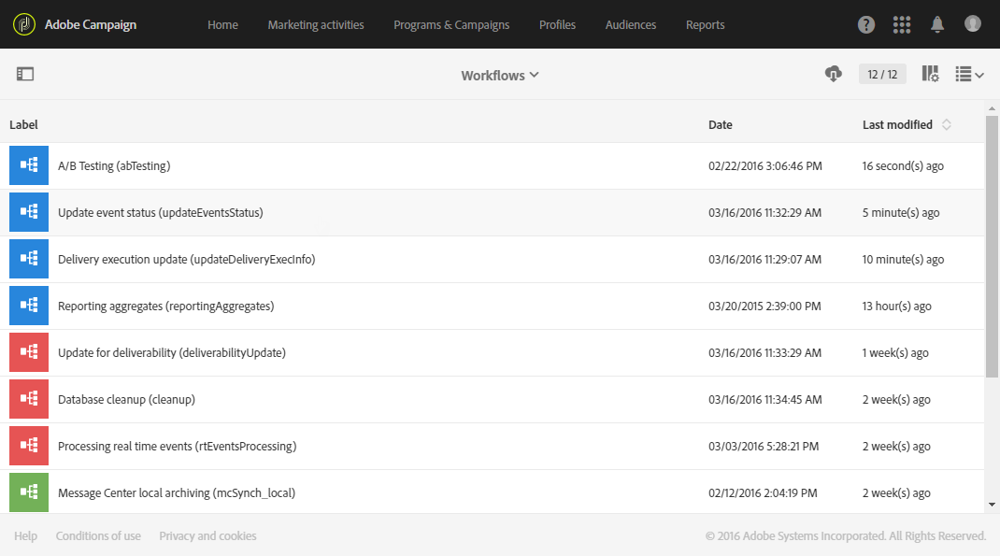

# 技術工作流程{#technical-workflows}

Adobe Campaign 可立即提供技術工作流程。技術工作流程是排程定期在伺服器上執行的操作或作業。

它們可讓您對資料庫執行維護操作、利用傳送中的追蹤資訊，以及更新傳送的臨時工作。

功能管理員可存取 **[!UICONTROL Administration > Application settings > Workflows]** 功能表下的技術工作流程。

>[!NOTE]
>
>身為功能管理員，您可以重新啟動或暫停技術工作流程，並修改其屬性和結構。

## 技術工作流程清單 {#list-of-technical-workflows}

技術工作流程可用於處理 Adobe Campaign 中自我觸發的背景和技術程式。

<table> 
 <tbody> 
  <tr> 
   <td> <strong>標籤</strong>  </td> 
   <td> <strong>ID</strong>  </td> 
   <td> <strong>說明</strong>  </td> 
  </tr> 
  <tr> 
   <td> A/B 測試   </td> 
   <td> abTesting   </td> 
   <td> 此工作流程會分析每個變體的追蹤記錄檔。在 A/B 測試期間結束時，會自動計算成功變數。預設會每天啟動。  </td> 
  </tr> 
  <tr> 
   <td> 帳單   </td> 
   <td> 帳單   </td> 
   <td> 此工作流程會透過電子郵件，將系統活動報告傳送給「帳單」使用者。預設會每天凌晨 1:00 自動啟動。  </td> 
  </tr> 
  <tr> 
   <td> 資料庫清除   </td> 
   <td> cleanup   </td> 
   <td> 此工作流程是資料庫維護工作流程：會執行不同的統計和進度，並根據已定義的設定，從資料庫中刪除過時資料。預設會每天凌晨 4:00 自動啟動。  </td> 
  </tr> 
  <tr> 
   <td> 預測   </td> 
   <td> 預測   </td> 
   <td> 此工作流程會執行臨時預測（建立臨時記錄）中儲存的傳送分析。預設會每天早上 1:00 點開始。  </td> 
  </tr> 
  <tr> 
   <td> 匯入共用的對象   </td> 
   <td> importSharedAudience   </td> 
   <td> 此工作流程會同步在 Adobe Campaign 中匯入的 Adobe Experience Cloud 對象資料。預設會每小時啟動一次。  </td> 
  </tr> 
  <tr> 
   <td> 即時報告共用   </td> 
   <td> reportSendingNow   </td> 
   <td> 排程傳送報告時，就會立即啟動此工作流程。它會將您的報告轉換為 PDF 檔案，然後以電子郵件傳送給目標收件者。  </td> 
  </tr> 
  <tr> 
   <td> KPI 與 Adobe Analytics 之調解   </td> 
   <td> kpiReconciliation   </td> 
   <td> 此工作流程每天從報告服務擷取 KPI 一次，並與 Adobe Analytics 中的資料進行調解。之後，會視需要推播差異。預設會每天凌晨 4:20 開始。  </td> 
  </tr> 
  <tr> 
   <td> 管理 CCPA 選取退出   </td> 
   <td> mobileAppOptOutMgt   </td> 
   <td> 此工作流程會更新行動裝置上通知的取消訂閱。預設會從上午 1:00 到午夜，每 6 小時啟動一次。  </td> 
  </tr> 
  <tr> 
   <td> 訊息中心本機封存   </td> 
   <td> mcSynch_local   </td> 
   <td> 此工作流程會將即時事件封存至歷史表格。預設會每小時啟動一次。  </td> 
  </tr> 
  <tr> 
   <td> 報告彙總   </td> 
   <td> reportingAggregates   </td> 
   <td> 此工作流程會更新報告中使用的彙總。預設會在凌晨 2:00 自動啟動。  </td> 
  </tr> 
  <tr> 
   <td> 與 Adobe Analytics 共用 KPI   </td> 
   <td> kpiSharing   </td> 
   <td> 此工作流程每 15 分鐘將 KPI 資料從 Adobe Campaign Standard 推播至 Adobe Analytics。  </td> 
  </tr> 
    </tr> 
   <tr> 
   <td> 與 Launch 同步   </td> 
   <td> SyncWithLaunch   </td> 
   <td> 此工作流程會同步在 Adobe Campaign Standard 中匯入的 Adobe Launch 行動裝置屬性。每 15 分鐘開始一次。  </td> 
  </tr>
  <tr> 
   <td> 更新傳送執行   </td> 
   <td> updateDeliveryExecInfo   </td> 
   <td> 此工作流程會更新傳送的追蹤。預設會每 10 分鐘啟動一次。  </td> 
  </tr> 
  <tr> 
   <td> 更新傳送指標   </td> 
   <td> updateDeliveryIndicators   </td> 
   <td> 此工作流程會更新傳送的 KPI（關鍵績效指標）。預設會每小時啟動一次。  </td> 
  </tr> 
  <tr> 
   <td> 更新事件狀態   </td> 
   <td> updateEventsStatus   </td> 
   <td> 此工作流程可讓您將狀態歸因於事件。可使用下列事件狀態： <strong>待定</strong>：事件位於佇列中。尚未為其指派訊息範本。  待定傳送：事件在佇列中，已指派訊息範本給該事件，並由傳送處理。  <strong>已傳送</strong>：此狀態是從傳送記錄檔複製而來。這表示傳送已進行。  <strong>由傳送忽略</strong>：此狀態是從傳送記錄檔複製而來。這表示會由傳送忽略。  <strong>傳送失敗</strong>：此狀態是從傳送記錄檔複製而來。這表示傳送失敗。  未考慮事件：無法將事件連結至訊息範本。將不會處理事件。  </td> 
  </tr> 
  <tr> 
   <td> 傳送能力更新   </td> 
   <td> deliverabilityUpdate   </td> 
   <td> 此工作流程可讓您建立退回規則限定規則清單，以及平台中的網域及 MX 的清單。只有在 HTTPS 開啟時，此工作流程才能運作。預設會在凌晨 2:00 自動啟動。  </td> 
  </tr> 
 </tbody> 
</table>

