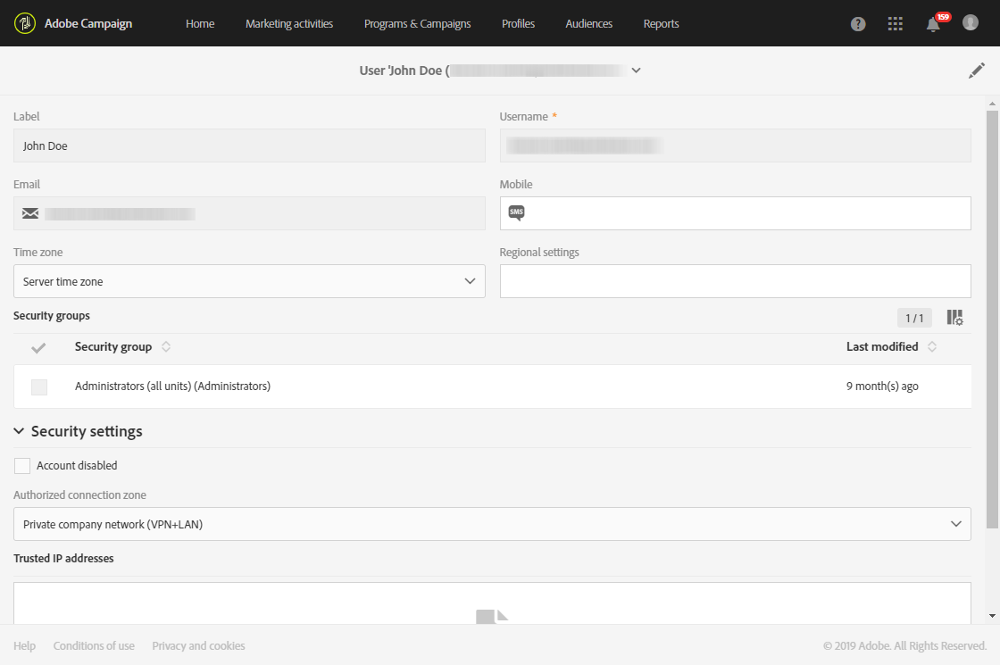

# 使用者管理{#users-management}

## 關於使用者 {#about-users}

Adobe Campaign 可讓您指派一組角色給使用者，以定義使用者可存取的介面部分。

以下各節將詳細介紹特定角色和相應的授權：[瞭解角色](../../administration/using/list-of-roles.md)和[授權](https://docs.campaign.adobe.com/doc/standard/en/Technotes/AdobeCampaign-ACSRights.pdf)。

管理員可從 Admin Console 管理使用者。然後，使用者會自動與 Adobe Campaign 同步。如需詳細資訊，請參閱 [Admin Console](https://helpx.adobe.com/tw/enterprise/using/users.html) 文件。

 [在影片中探索此功能](#video)

若要在 Adobe Campaign 中檢視使用者，請按一下左上方的 **[!UICONTROL Adobe Campaign]** 標誌，然後選取 **[!UICONTROL Administration > Users & Security > Users]**。

若要從 Adobe Campaign 存取使用者管理介面，請按一下 **[!UICONTROL User administration]**。

**相關主題：**

* [管理使用者權限](https://docs.adobe.com/content/help/en/campaign-learn/campaign-standard-tutorials/getting-started/access-management.html)影片
* [角色清單](../../administration/using/list-of-roles.md)
* [授權清單](https://docs.campaign.adobe.com/doc/standard/en/Technotes/AdobeCampaign-ACSRights.pdf)

## 使用者類型 {#type-of-users}

此使用者區段並非強制性，而僅代表 Adobe Campaign 最常用的用法。

本節將協助您瞭解 Adobe Campaign 使用者的主要類型。在此，我們不會討論使用者可以承擔的所有特定角色（開始傳送、匯出、準備傳送等）。有關角色的詳細資訊，請參閱[角色清單](../../administration/using/list-of-roles.md)和[管理群組及使用者](../../administration/using/managing-groups-and-users.md)頁面。

我們寧可專注於 Adobe Campaign 中不同工作的分割方式，分為三種主要使用者類型：

* [功能管理員](#functional-administrators)：在您組織的所有使用者中，他們具有最佳技術技能。
* [進階使用者](#advanced-users)：他們會設定行銷人員傳送及監控其傳送所需的所有元素。
* [基本使用者](#basic-users)：他們是行銷人員，負責個人化、傳送和監控其宣傳活動。

>[!NOTE]
>
>功能管理員與 Adobe 技術管理員不同。Adobe 技術管理員負責客戶無法使用的 Adobe 內部角色。他們管理執行個體設定、託管、基礎架構監控和監控、技術疑難排解。

### 功能管理員 {#functional-administrators}

功能管理員是可存取介面中最技術部分的使用者。他們負責 **[!UICONTROL Administration]** 角色，並確保平台都已妥善設定，因此行銷人員只需專注於傳送其行銷活動。

>[!CAUTION]
>
>只有具有&#x200B;**[!UICONTROL Administration]**&#x200B;角色和&#x200B;**所有**&#x200B;單元訪問權限的職能管理員才能訪問發送日誌、消息日誌、跟蹤日誌、排除日誌、提案日誌和訂閱日誌。 非管理員使用者可以定位這些記錄檔，但是從連結的表格（描述檔、傳送）開始。

功能管理員是唯一可存取 Adobe Campaign 介面之 **[!UICONTROL Administration]** 功能表的使用者。由於這些使用者需要存取技術資源，因此應指派更多進階角色給他們，例如 **[!UICONTROL Administration]** 及 **[!UICONTROL Datamodel]** 現成可用的角色。這些角色會在 **[!UICONTROL Administrators]** 現成可用的安全性群組中結合。如需詳細資訊，請參閱[本區段](../../administration/using/list-of-roles.md)。

以下是他們可以執行的主要任務：

* [管理使用者和權限](../../administration/using/about-access-management.md)：管理對平台（使用者、角色、安全性群組、裝置）的存取權限。
* [設定不同的通道](../../administration/using/about-channel-configuration.md)：建立不同的平台通道，以及分類和隔離管理。
* [設定一般應用程式設定](../../administration/using/external-accounts.md)：設定不同的應用程式元素（外部帳戶、選項、技術工作流程）。
* [開發新功能以增強現成可用的功能](../../developing/using/data-model-concepts.md)：管理您的自訂資源並存取診斷工具。
* [設定執行個體參數](../../administration/using/branding.md)：定義您的不同品牌並進行其設定（標誌、管理追蹤、存取登錄頁面的 URL 網域等）。
* [匯出和匯入資料套件](../../automating/using/managing-packages.md)：透過結構化 XML 檔案，在不同 Adobe Campaign 執行個體之間交換資源。
* [匯出記錄檔](../../automating/using/exporting-logs.md)及[定義匯入範本](../../automating/using/importing-data-with-import-templates.md#setting-up-import-templates)。

### 進階使用者 {#advanced-users}

進階使用者是在 Adobe Campaign 中執行最具技術性使用案例的行銷使用者。他們會預先設定行銷人員用來傳送及監控其傳送的所有元素。

與功能管理員相比，這種類型的使用者需要更多的一般角色，但仍應能夠執行一些技術操作。為此，應指派這些角色，例如 **[!UICONTROL Export]**、**[!UICONTROL Generic import]** 或 **[!UICONTROL Workflow]** 現成可用的角色。如需詳細資訊，請參閱[本區段](../../administration/using/list-of-roles.md)。

以下是他們可以執行的主要任務：

* [建立並執行複雜的資料管理工作流程](../../automating/using/about-data-management-activities.md)：匯入、擴充及轉換資料以饋送資料庫，或匯出外部檔案中所需的資料，以便在您自己的工具中處理。
* [管理範本](../../start/using/marketing-activity-templates.md)：管理範本，以根據您的需求預先設定特定的行銷活動參數。
* [建立查詢](../../automating/using/editing-queries.md#about-query-editor)及[管理您的閱聽眾](../../audiences/using/about-audiences.md)：使用查詢手動建立您的閱聽眾，或自動使用專屬的工作流程。
* [執行進階運算式編輯](../../automating/using/editing-queries.md#about-query-editor)：使用進階函式來控制用於執行特定查詢的值，例如日期、字串、數值欄位、排序等。
* 使用現有的匯入範本[匯出清單](../../automating/using/exporting-lists.md)和[匯入資料](../../automating/using/importing-data-with-import-templates.md)。

### 基本使用者 {#basic-users}

由於擁有功能管理員和進階使用者，行銷人員可以個人化、提供和監控其宣傳活動，而不需擔心技術設定。為此，應指派這些角色，例如 **[!UICONTROL Prepare deliveries]**、**[!UICONTROL Workflow]** 及 **[!UICONTROL Start deliveries]** 現成可用的角色。這些角色會在 **[!UICONTROL Standard Users]** 現成可用的安全性群組中結合。如需詳細資訊，請參閱[本區段](../../administration/using/list-of-roles.md)。

以下是他們可以執行的主要任務：

* [管理方案和宣傳活動](../../start/using/programs-and-campaigns.md)：建立行銷宣傳，包括不同的活動類型（電子郵件、SMS 訊息、推播通知、工作流程、登錄頁面）。
* 管理[設定檔](../../audiences/using/about-profiles.md)及[測試設定檔](../../audiences/using/managing-test-profiles.md)：管理已識別的收件者，並測試您的傳送目標。新增名字、姓氏、聯絡人資訊、訂閱、電子郵件等資訊。
* [建立和傳送訊息](../../sending/using/confirming-the-send.md)：建立您的訊息、選取閱聽眾、定義訊息內容及其個人化元素、傳送校樣並傳送最終訊息給對象。
* [建立和發佈登錄頁面](../../channels/using/getting-started-with-landing-pages.md)：建立並管理您想要提供給客戶的一組服務，例如訂閱或取消訂閱表格。
* [建立並執行促銷活動工作流程](../../automating/using/building-a-workflow.md)：使用工作流程自動化您的宣傳流程。
* 透過[可用報告](../../reporting/using/defining-the-report-period.md)監控您的行銷活動。

## 建立使用者 {#creating-a-user}

若要新增使用者至您的執行個體，您必須先在 Admin Console 中建立該使用者，然後才能在 Adobe Campaign Standard 中進行管理。

1. 從進階功能表中，選取 **[!UICONTROL Administration > Users & Security > Users]** 並按一下 **[!UICONTROL User administration]** 以存取 Admin Console。

   

1. 在 **[!UICONTROL Admin Console]** 中，按一下 **[!UICONTROL Users]** 索引標籤。

1. 按一下 **[!UICONTROL Add User]**。

   

1. 從 **[!UICONTROL User details]** 索引標籤，填寫使用者的詳細資訊，例如電子郵件地址、姓名和姓氏。

   

1. 從 **[!UICONTROL Assign products]** 索引標籤，為您的使用者指派一或多個安全性群組。如需安全性群組的詳細資訊，請參閱本[頁面](../../administration/using/managing-groups-and-users.md)。

   完成設定時，按一下 **[!UICONTROL Save]**。

   

現在已建立您的使用者，應會收到一封電子郵件，而將之重新導向至下列視窗，使用者必須先設定密碼，然後接受使用合約條款。然後，此使用者便能連線至您的 Adobe Campaign Standard 執行個體。

當您的使用者登入您的執行個體時，就會將其同步至 Adobe Campaign Standard。

之後，您可以檢查您的使用者是否已正確同步至 Adobe Campaign：

1. 從進階功能表 **[!UICONTROL Administration > Users & Security > Users]** 中，選取您先前建立的使用者。

1. 如有需要，可更新 **[!UICONTROL Mobile]**、**[!UICONTROL Time zone]** 或 **[!UICONTROL Regional settings]**。

1. 檢查您使用者的安全性群組。在這裡，您可以看到使用者已被指派給 **[!UICONTROL Administrators]**&#x200B;安全性群組。

   >[!NOTE]
   >
   >安全性群組只能在 Admin Console 中移除或新增至使用者。

   

1. 如果您想停用此使用者，請核取 **[!UICONTROL Account disabled]**。

1. 在 **[!UICONTROL Authorized connection zone]** 欄位中，選取使用者將透過哪個方式連線到此執行個體，如內部網路或 VPN。

1. 按一下 **[!UICONTROL Save]**。

您的使用者現在已準備好使用 Adobe Campaign Standard。

## 教學課程影片(#video)

此影片顯示如何管理使用者存取權限。

>[!VIDEO](https://video.tv.adobe.com/v/24671?quality=12)

其他Campaign Standard操作說明影片可在[這裡](https://experienceleague.adobe.com/docs/campaign-standard-learn/tutorials/overview.html?lang=zh-Hant)取得。
