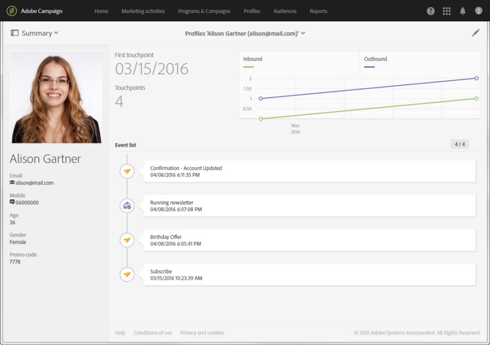

# 關於設定檔{#about-profiles}

使用 Adobe Campaign，您可在使用者檔案的整個生命週期對其進行管理，即建立、匯入、鎖定、活動追蹤、更新等等。聯絡人儲存在資料庫中，作為包含與其連結的資訊的設定檔：姓氏、名字、地址、訂閱、傳送等。

>[!NOTE]
>
>您也可以使用 Adobe Campaign Standard API 取得設定檔。如需詳細資訊，請參閱[專屬文件](../../api/using/retrieving-profiles.md)。

當您建立行銷活動時，您可以根據簡單或進階標準選取設定檔，以定義傳送的目標。就技術方面而言，設定檔是資料庫中包含定位、確認和追蹤行為所需的所有資訊的項目。

設定檔可以是：客戶、潛在客戶、訂閱電子報的個人、收件者、使用者或任何其他面額（視您的組織而定）。若要定義各種設定檔類型，請使用[目標維度](../../automating/using/query.md#targeting-dimensions-and-resources)。
