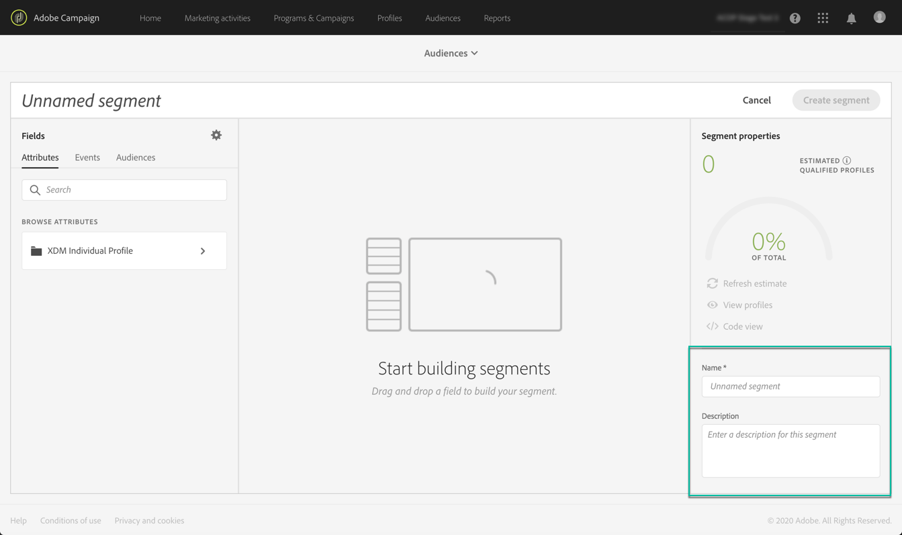
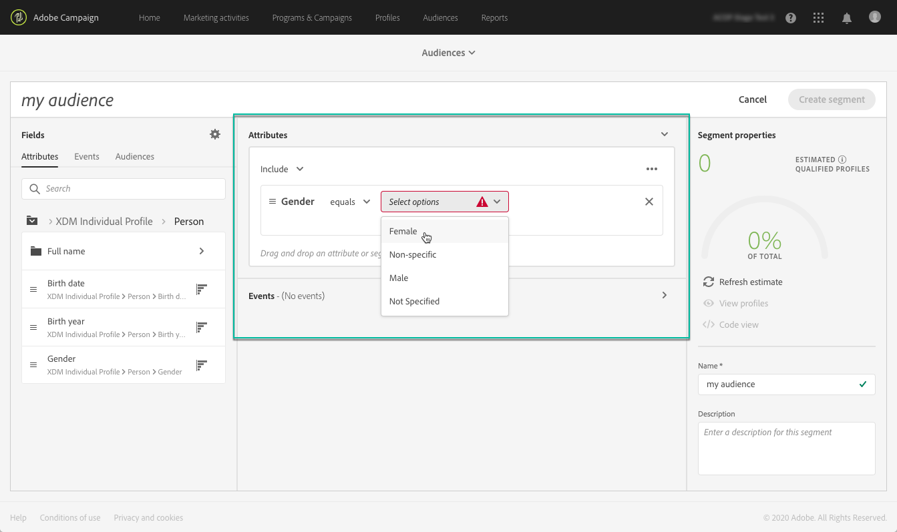

# 使用區段建置器 {#using-the-segment-builder}

>[!IMPORTANT]
>
>觀眾目標服務目前為測試版，可能會經常更新，恕不另行通知。 客戶必須在Azure上代管（目前僅限北美地區測試版）才能存取這些功能。 如果您想要存取，請聯絡Adobe客戶服務。

「區段產生器」可讓您根據來自即時客戶個人檔案的資料定義規則， [以建立觀眾](https://docs.adobe.com/content/help/zh-Hant/experience-platform/profile/home.html)。

本節介紹建立區段時的全域概念。 如需「區段產生器」本身的詳細資訊，請參閱「區段產 [生器」使用指南](https://docs.adobe.com/content/help/en/experience-platform/segmentation/ui/overview.html)。

「區段產生器」介面的組成如下：

* 左側窗格會將所需欄位拖放至區段產生器工作區，以提供建立區段的所有屬性、事件和對象。
* 中心區域提供工作區，可從可用欄位定義並結合規則來建立區段。
* 標題和右窗格會顯示區段的屬性（例如，名稱、說明和區段的估計合格設定檔）。

## 建立區段

若要建立區段，請遵循下列步驟：

「區段產生器」現在應會顯示在您的工作區中。 它可讓您使用Adobe Experience Platform中的資料來建立細分，這些資料最終將用來建立您的觀眾。

1. 命名區段，然後輸入說明（選用）。

   

1. 請確定在設定窗格中已選取所要的合併原則。

   如需合併原則的詳細資訊，請參閱「區段產生器」使用指 [南中的專屬章節](https://docs.adobe.com/content/help/en/experience-platform/segmentation/ui/overview.html)。

   

1. 在左窗格中尋找所要的欄位，並將它們拖曳至中心工作區。

   

1. 設定與拖曳欄位對應的規則。

   

1. 按一下 **[!UICONTROL Create segment]** 按鈕。

## 尋找區段的正確欄位

左窗格列出可用於建構規則的所有屬性、事件和對象。

列出的欄位是您公司擷取的屬性，並已透過 [Experience Data Model(XDM)系統提供](https://docs.adobe.com/content/help/zh-Hant/experience-platform/xdm/home.html)。

欄位會組織成標籤：

* **[!UICONTROL Attributes]**:現有的描述檔屬性，可能源自您的Adobe Campaign資料庫和／或Adobe Experience Platform。 它們指附加至描述檔的靜態資訊（例如電子郵件地址、居住國家、忠誠度方案狀態等）。

   

* **[!UICONTROL Events]**:識別與您公司客戶觸點有互動的消費者的活動，例如「兩週內訂購兩次的任何人」。 這可從Adobe Analytics串流，或使用協力廠商的ETL工具直接吸收到Adobe Experience Platform。

   

>[!NOTE]
>
>**多實體分段** ，可讓您根據產品、商店或其他非描述檔類別，以其他資料擴充描述檔資料。 連線後，其他類別的資料就會變成描述檔架構的原生資料。
>
>如需詳細資訊，請參閱[專屬文件](https://docs.adobe.com/content/help/en/experience-platform/segmentation/multi-entity-segmentation.html)。

依預設，「區段產生器」會顯示資料已存在的欄位。 要顯示完整方案，包括沒有資料的欄位，請啟用設 **[!UICONTROL Show full XDM schema]** 置中的選項。

每個欄位結尾的符號會提供屬性及其使用方式的其他資訊。

## 定義區段規則

>[!NOTE]
>
>下節提供規則定義的全域資訊。 如需詳細資訊，請參閱「區段產生 [器」使用指南](https://docs.adobe.com/content/help/en/experience-platform/segmentation/ui/overview.html)。

若要建立規則，請遵循下列步驟：

1. 從左窗格尋找反映規則所依據之屬性或事件的欄位。

1. 將欄位拖曳至中心工作區，然後根據所要的區段定義加以設定。 若要這麼做，可使用數個字串和日期／時間函式。

   在下列範例中，規則會將性別等於「男性」的所有描述檔定位。

   

   區段中自動重新計算與區段對應的估計人口 **[!UICONTROL Segment Properties]** 數。

1. 按 **[!UICONTROL View Profiles]** 鈕可讓您預覽與規則對應的前20個記錄，讓您快速驗證區段。

   

   您可以視需要新增任意數量的其他規則，以定位正確的描述檔。

   將規則新增至容器時，規則會附加至具有AND邏輯運算子的任何現有規則。 如果需要，按一下邏輯運算子以修改它。

   

連結在一起後，這兩個規則就會形成容器。

## 比較欄位

「區段產生器」可讓您比較兩個欄位以定義規則。 例如，其家鄉地址與工作地址的郵遞區號不同的女性。

要執行此操作，請依照下列步驟執行：

1. 將您要比較的第一個欄位（例如，首頁位址郵遞區號）拖曳至中心工作區。

   

1. 選擇將與第一個欄位進行比較的第二個欄位（例如工作地址郵遞區號）。

   將它拖曳至方塊中第一個欄位所在的容器中的中心工作區 **[!UICONTROL Drop here to compare operands]** 上。

   

1. 視需要在兩個欄位之間設定運算子。 在此範例中，我們希望我們的區段定位首頁位址與工作位址不同的描述檔。

   

規則現在已設定，並可立即啟動為觀眾。
