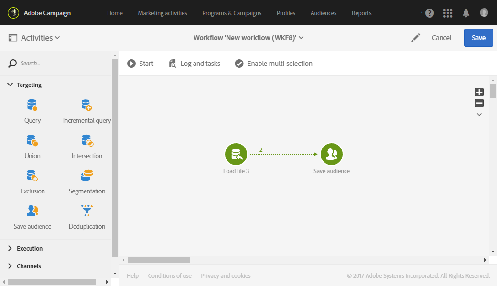

# 建立對象{#creating-audiences}

## 建立查詢對象 {#creating-query-audiences}

本節說明如何建立「**查詢**」對象。您也可以從匯入檔案或在[工作流程](../../automating/using/get-started-workflows.md)中鎖定目標來建立對象。

從對象清單中，您可以對 Adobe Campaign 設定檔執行查詢或匯入 Adobe Experience Cloud 對象，以建立對象。

1. 透過標籤或卡片前往 **[!UICONTROL Audiences]** 對象清單。

   

1. 選取 **[!UICONTROL Create]** 存取畫面以建立新對象。

   

1. 為您的對象命名。對象標籤會用於對象清單和查詢工具的浮動視窗中。
1. 選取 **[!UICONTROL Query]** 對象類型：由查詢定義的對象在每次進一步使用時經過重新計算。

   

1. 然後，選取您要用來篩選客戶的項目 **[!UICONTROL Targeting dimension]**。每個對象都由單一目標維度組成。例如，您無法建立由設定檔、測試設定檔和訂閱者組成的對象。有關目標維度的詳細資訊，請參見[此頁面](../../automating/using/query.md#targeting-dimensions-and-resources)。
1. 建立查詢以定義對象人口族群。請參閱有關[編輯查詢](../../automating/using/editing-queries.md)的章節。
1. 按一下 **[!UICONTROL Create]** 按鈕以儲存您的對象。

>[!NOTE]
>
>您可以新增說明給此對象，並透過 **[!UICONTROL Edit properties]** 圖示定義存取授權。

## 建立清單對象 {#creating-list-audiences}

本節說明在工作流程中定 位後 ，如何建立「**清單**」對象。您也可以將檔案匯入[工作流程](../../automating/using/get-started-workflows.md)中，或透過 **[!UICONTROL Audiences]** 功能表的查詢來建立觀眾。

若要建立「**清單**」對象，步驟如下：

1. 在「**行銷活 動**」標籤中，按一下「**建立**」，然後選取「**工作流程**」。

   

1. 拖放，然後設定目標定位活動，讓您選取具有&#x200B;**已知**&#x200B;維度的人口。可用活動的清單及其設定會在「[定位活動](../../automating/using/about-targeting-activities.md)」區段中詳細說明。

   您可以使用 **[!UICONTROL Query]** 活動，或在使用 **[!UICONTROL Reconciliation]** 活動識別匯入的資料維度之前，使用 **[!UICONTROL Load file]** 活動匯入資料。在此，我們的目標視訂閱體育電子報並進行 **[!UICONTROL Query]** 活動的收件者。

   

1. 目標定位後，將 **[!UICONTROL Save audience]** 活動拖放至工作流程中。例如，您可以選取建立 **[!UICONTROL Create or update an audience]**，然後使用新資料自動更新對象。在這種情況下，請在工作流程的開頭新增 **[!UICONTROL Scheduler]** 活動。

   如需設定此活動的詳細資訊，請參閱「[儲存對象](../../automating/using/save-audience.md)」區段。

   

1. 儲存並啟動工作流程。

   當 **[!UICONTROL Save audience]** 在已知維度的對象之後放置時，透過此活動建立的對象為「**清單**」對象。

   接著，儲存的對象內容便可在對象的詳細檢視中取得，而對象的詳細檢視可透過對象清單存取。此視圖中可用的欄對應於工作流程保存活動的入站轉變的欄。例如：匯入的檔案欄、從查詢新增的其他資料。

   

## 建立檔案對象 {#creating-file-audiences}

本節詳細說明如何將檔案匯入工作流程，以建立「**檔案**」閱聽眾。您也可以從[工作流程](../../automating/using/get-started-workflows.md)中的目標定位活動或從 **[!UICONTROL Audiences]** 功能表透過查詢建立閱聽眾。

若要建立「**檔案**」對象，步驟如下：

1. 在「**行銷活 動**」標籤中，按一下「**建立**」，然後選取「**工作流程**」。
1. 拖放，然後設定 **[!UICONTROL Load file]** 活動，可讓您在執行工作流程時匯入具有&#x200B;**未知**&#x200B;維度的人口。有關配置此活動的詳細資訊，請參閱「[載入檔案](../../automating/using/load-file.md)」部分。

   

1. 在 **[!UICONTROL Load file]** 活動後拖放 **[!UICONTROL Save audience]** 活動。如需設定此活動的詳細資訊，請參閱「[儲存對象](../../automating/using/save-audience.md)」區段。
1. 儲存並啟動工作流程。

   

   當匯入後置入 **[!UICONTROL Save audience]** 時，資料維度為未知，透過此活動建立的對象為「**檔案**」對象。

   接著，儲存的對象內容便可在對象的詳細檢視中取得，而對象的詳細檢視可透過對象清單存取。此視圖中可用的欄對應於工作流程保存活動的入站轉變的欄。例如：匯入檔案的欄、從查詢新增的其他資料。

   

## 建立 Experience Cloud 觀眾 {#creating-experience-cloud-audiences}

Adobe Campaign 可讓您與 Adobe Experience Cloud 共用和交換對象。**Experience Cloud** 類型的對象會透過 **[!UICONTROL Import shared audience]** 技術工作流程，直接從 People 核心服務匯入 Adobe Campaign。

與 Adobe Campaign 中查詢個人檔案的&#x200B;**查詢**&#x200B;類型對象不同，**Experience Cloud** 對象是由訪客ID清單所組成。

為了讓此整合發揮作用，您必須先進行設定。如需有關設定以及如何使用 People 核心服務匯入或匯出觀眾的詳細資訊，請參閱下[節](../../integrating/using/sharing-audiences-with-audience-manager-or-people-core-service.md)。

## 編輯對象 {#editing-audiences}

根據對象類型，有不同的編輯對象方式：

* 若要編輯「**查詢**」對象，請透過 **[!UICONTROL Audiences]** 功能表或 Adobe Campaign 首頁的 **[!UICONTROL Audiences]** 資訊卡，移至對象清單。

   開啟相關的對象。您可以編輯先前建立之對象的所有元素。

   >[!CAUTION]
   >
   >如果您變更查詢中的 **[!UICONTROL Filtering dimension]** 規則，先前已定義的規則將會遺失。

* 若要編輯「**清單**」或「**檔案**」對象，請編輯從中建立該對象的工作流程，並修改 **[!UICONTROL Save audience]** 活動。啟動工作流程，以便修改對象。
* 若要編輯 **Experience Cloud** 觀眾，請參閱「[使用 人員核心服務匯入/匯出觀眾](../../integrating/using/sharing-audiences-with-audience-manager-or-people-core-service.md)」區段。

## 刪除對象 {#deleting-audiences}

有兩種方式可刪除一或多個對象。首先，您可以新增到期日給對象

若要這麼做：

1. 存取您的其中一個對象。
1. 按一下  按鈕以存取您對象的設定。

   

1. 在 **[!UICONTROL Expires on]** 欄位中，新增到期日給您的對象。

   

1. 按一下 **[!UICONTROL Confirm]**，之後 **[!UICONTROL Save]**。

您的到期日現在已設定好。一旦到達此日期，您的對象就會自動刪除。

或者，如果您需要刪除對象，您只需選取一或多個對象，然後按一下 **[!UICONTROL Delete element]** 按鈕。

