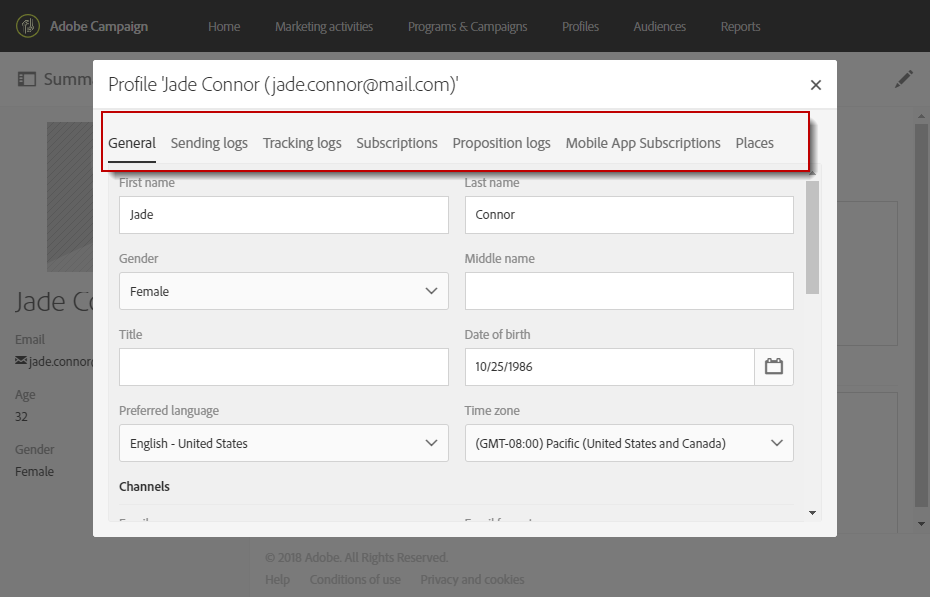

# 編輯輪廓{#editing-profiles}

## 存取設定檔屬性 {#accessing-profile-properties}

若要編輯現有設定檔並查閱與其相關的資料，或修改該設定檔，步驟如下：

1. 從Adobe Campaign首頁，按一下「**[!UICONTROL Customer profiles]**」卡片或「**[!UICONTROL Profiles]**」標籤。
1. 選取聯絡人。
1. 按一下&#x200B;**[!UICONTROL Edit profile properties]**&#x200B;圖示以存取設定檔的詳細資訊。

   

   設定檔的屬性視窗提供數個標籤，可讓您存取所有設定檔資訊。

   其他標籤也會根據在Adobe Campaign中建立或擴充的自訂資源而顯示。 如需自訂資源的詳細資訊，請參閱[關於自訂資源](../../developing/using/data-model-concepts.md)。

   >[!NOTE]
   >
   >您只能修改&#x200B;**[!UICONTROL General]**&#x200B;標籤中的資訊 — **[!UICONTROL Traceability]**&#x200B;區段除外。

也可以使用Adobe Campaign Standard API編輯設定檔。 如需詳細資訊，請參閱[專屬文件](../../api/using/updating-profiles.md)。

相關主題：

* [整合式客戶輪廓](../../audiences/using/integrated-customer-profile.md)
* [在收件者的時區傳送](../../sending/using/sending-messages-at-the-recipient-s-time-zone.md)

## 一般設定檔資料 {#general-profile-data}

**[!UICONTROL General]**&#x200B;索引標籤會將設定檔的下列資訊分組：

* 連絡資訊，包含收件者的名字、姓氏、出生日期、像片、慣用語言（[多語言電子郵件](../../channels/using/creating-a-multilingual-email.md)）等。
* 可連絡設定檔的頻道，包含收件者的電子郵件地址、行動電話號碼、選擇退出資訊。
* 郵寄地址（適用於[直接郵件](../../channels/using/about-direct-mail.md)）和連絡人的時區（以[排程郵件時區](../../sending/using/sending-messages-at-the-recipient-s-time-zone.md)）。
* 存取授權，表示收件者的組織單位（至[管理許可權](../../administration/using/about-access-management.md)）。 也請參閱[分割輪廓](../../administration/using/organizational-units.md#partitioning-profiles)。

## 傳送和追蹤記錄 {#sending-and-tracking-logs}

**[!UICONTROL Sending logs]**&#x200B;和&#x200B;**[!UICONTROL Tracking logs]**&#x200B;索引標籤會將傳送至設定檔的傳遞清單，以及所有相關追蹤資料分組。

如需傳送及追蹤記錄的詳細資訊，請參閱[傳遞記錄](../../sending/using/monitoring-a-delivery.md#delivery-logs)及[追蹤訊息](../../sending/using/tracking-messages.md)區段。

## 訂閱 {#subscriptions}

連絡人的訂閱會列在對應索引標籤中。 如需訂閱服務的詳細資訊，請參閱[本節](../../audiences/using/about-subscriptions.md)。

**[!UICONTROL Mobile App Subscriptions]**&#x200B;標籤參考推播通知。 如需詳細資訊，請參閱[推播通知](../../channels/using/about-push-notifications.md)頻道。
