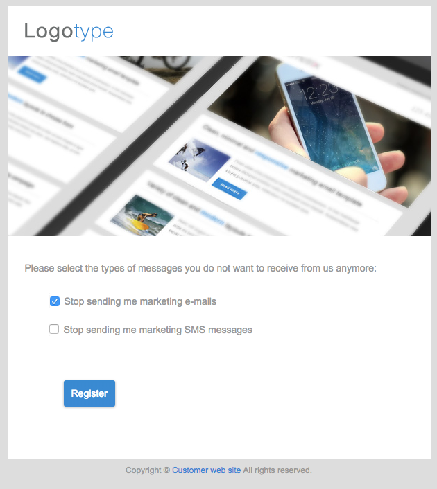

# 管理 Campaign 中的選擇加入和選擇退出{#managing-opt-in-and-opt-out-in-campaign}

## 管理設定檔中的選擇加入和選擇退出 {#managing-opt-in-and-opt-out-from-a-profile}

操作員可以直接從設定檔&#x200B;**[!UICONTROL General]**&#x200B;索引標籤選擇加入或退出使用者。

在&#x200B;**[!UICONTROL No longer contact (on denylist)]**&#x200B;區段中，選取的核取方塊會與使用者選擇退出的管道相對應。 根據使用者的需求選取頻道。

## 設定選擇加入和選擇退出登入頁面 {#setting-up-opt-in-and-opt-out-landing-pages}

若要讓使用者能夠選擇加入或選擇退出，您必須建立並發佈&#x200B;**[!UICONTROL Profile acquisition]**&#x200B;登陸頁面。 接著，他們便能依需求選取管道。 請依照下列步驟以執行此操作。

您也可以設定&#x200B;**[!UICONTROL Denylist]**&#x200B;登陸頁面，讓使用者選擇退出所有傳遞。 如需詳細資訊，請參閱[設定登陸頁面以選擇退出所有傳遞](#setting-up-a-landing-page-to-opt-out-from-all-deliveries)。

>[!NOTE]
>
>登入頁面也可用來啟用服務訂閱。 如需詳細資訊，請參閱[此頁面](../../channels/using/configuring-landing-page.md#linking-a-landing-page-to-a-service)。

1. 建立&#x200B;**[!UICONTROL Profile acquisition]**&#x200B;登陸頁面（請參閱[本區段](../../channels/using/getting-started-with-landing-pages.md)）。
1. 在登入頁面內容中為每個所需管道新增核取方塊，然後將其連結至Campaign資料庫中對應的欄位。

   

1. 儲存登入頁面並加以發佈。
1. 在登入頁面中，已根據設定檔&#x200B;**[!UICONTROL General]**&#x200B;標籤選取核取方塊。 使用者可以根據需求選擇或取消選擇管道並提交表單。

   

1. 提交表單後，設定檔&#x200B;**[!UICONTROL General]**&#x200B;索引標籤會根據使用者的選擇更新。

   

### 設定登陸頁面以選擇退出所有傳遞 {#setting-up-a-landing-page-to-opt-out-from-all-deliveries}

若要讓使用者能夠選擇退出所有傳遞，您必須建立並發佈&#x200B;**[!UICONTROL Denylist]**&#x200B;登陸頁面。 如需建立登入頁面的詳細資訊，請參閱[此頁面](../../channels/using/getting-started-with-landing-pages.md)。

一旦使用者點按登陸頁面連結，設定檔中的&#x200B;**[!UICONTROL No longer contact (by any channel)]**&#x200B;選項就會自動選取。

