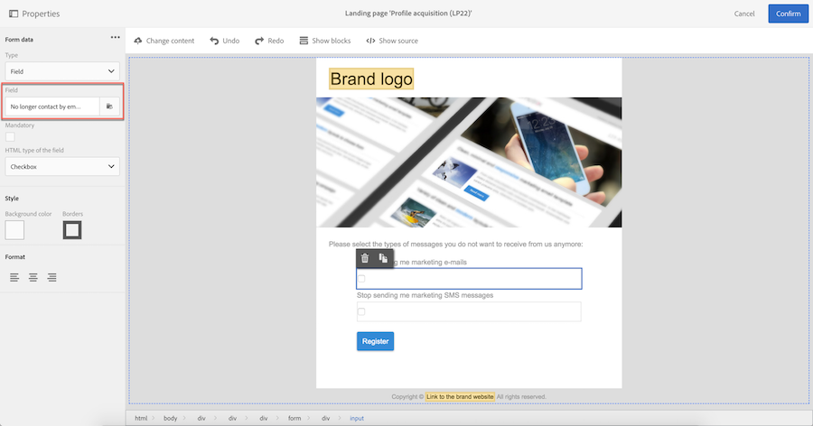

# 管理 Campaign 中的加入和退出{#managing-opt-in-and-opt-out-in-campaign}

## 管理個人檔案的選擇加入和選擇退出 {#managing-opt-in-and-opt-out-from-a-profile}

運算子可直接從描述檔標籤選擇使用者或退出使 **[!UICONTROL General]** 用。

在此區 **[!UICONTROL No longer contact (blacklist)]** 段中，選取的核取方塊會對應使用者選擇退出的頻道。 根據使用者需求選擇頻道。

## 設定選擇加入和選擇退出登陸頁面 {#setting-up-opt-in-and-opt-out-landing-pages}

若要讓使用者能夠選擇加入或選擇退出，您必須建立並發佈著陸 **[!UICONTROL Profile acquisition]** 頁面。 然後他們就可以根據自己的需求來選擇頻道。 若要這麼做，請依照下列步驟進行。

您也可以設定著陸頁 **[!UICONTROL BlackList]** 面，讓使用者可選擇退出所有傳送。 如需詳細資訊，請參 [閱設定著陸頁面以選擇退出所有傳送](#setting-up-a-landing-page-to-opt-out-from-all-deliveries)。

>[!NOTE]
>
>著陸頁面也可用來啟用服務訂閱。 有關詳細資訊，請參見[此頁面](../../channels/using/configuring-landing-page.md#linking-a-landing-page-to-a-service)。

1. 建立著 **[!UICONTROL Profile acquisition]** 陸頁面(請 [參閱本節](../../channels/using/getting-started-with-landing-pages.md))。
1. 在著陸頁面內容中新增每個所需渠道的核取方塊，然後將其連結至「促銷活動」資料庫的對應欄位。

   

1. 儲存著陸頁面並發佈。
1. 在著陸頁面中，已根據描述檔標籤選取核取方 **[!UICONTROL General]** 塊。 用戶可以根據自己的需要選擇或取消選擇渠道並提交表單。

   

1. 提交表單後，會根據使 **[!UICONTROL General]** 用者的選擇更新描述檔標籤。

   

### 設定著陸頁面以選擇退出所有傳送 {#setting-up-a-landing-page-to-opt-out-from-all-deliveries}

若要讓使用者能夠選擇退出所有傳送，您必須建立並發佈著陸 **[!UICONTROL BlackList]** 頁面。 如需建立著陸頁面的詳細資訊，請參 [閱本頁](../../channels/using/getting-started-with-landing-pages.md)。

當使用者按一下著陸頁面連結後，會自 **[!UICONTROL No longer contact (by any channel)]** 動選取描述檔中的選項。

