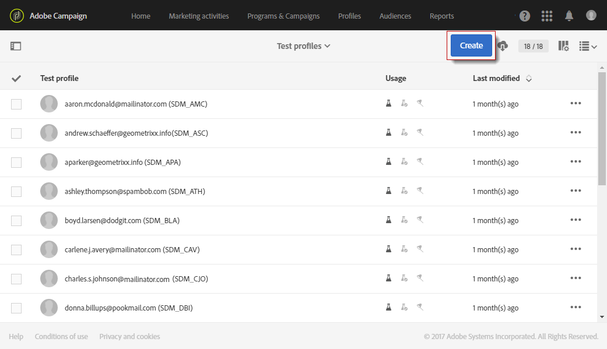
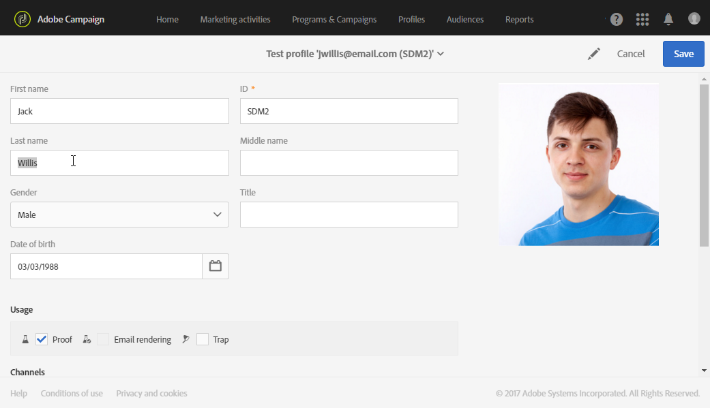

# 管理測試輪廓 {#managing-test-profiles}

## 關於測試設定檔 {#about-test-profiles}

測試輪廓可讓您鎖定與定義之目標定位條件不相符的其他收件者。 已將他們新增至郵件的客群中，以偵測任何詐用收件者資料庫之行為，或確保電子郵件送達至收件匣中。

 [在影片中探索此功能](#video)

您可以從進階功能表 **[!UICONTROL Profiles & audiences > Test profiles]** 管理您的測試輪廓。

測試輪廓包含虛構的聯繫資訊或由寄件者控制的聯繫資訊，這些資訊隨後可用於以下內容的郵件中：

* **傳送校樣**：「校樣」是特定的郵件，以在傳送已完成的傳遞給收件者之前檢查該訊息。 校樣測試輪廓負責檢查傳遞內容與格式。 請參閱[傳送校樣](../../sending/using/sending-proofs.md)。
* 對於&#x200B;**電子郵件呈現**：電子郵件呈現測試輪廓用於根據接收郵件的收件匣檢查郵件的顯示方式。 例如，網路郵件、訊息服務、行動裝置等。請參閱[電子郵件呈現](../../sending/using/email-rendering.md)。

  **電子郵件呈現**&#x200B;使用是唯讀的。 具有此功能的測試輪廓僅能在 Adobe Campaign 中立即使用。

* 作為&#x200B;**捕捉器**：就像傳送至主要目標一樣，訊息會傳送至測試輪廓。 請參閱[使用補漏白](../../sending/using/using-traps.md)。
* **預覽**&#x200B;訊息：在預覽訊息測試個人化元素時，可選取測試輪廓。 請參閱「[預覽訊息](/help/sending/using/previewing-messages.md)」。

## 建立測試設定檔 {#creating-test-profiles}

1. 從進階功能表中，透過 Adobe Campaign 標誌，選取「輪廓與客群 **> 測試輪廓** 」以存取測試輪廓的清單。

   

1. 從 **[!UICONTROL Test profiles]** 控制面板，按一下「 **建立**」。

   

1. 輸入此輪廓的資料。

   

1. 選取您打算用於測試輪廓的用途。

   

1. 輸入聯繫通道 **[!UICONTROL Email, Telephone, Mobile, Mobile app]**，並在必要時輸入測試輪廓地址。

   >[!NOTE]
   >
   >您可以定義偏好的電子郵件格式： **[!UICONTROL Text]** 或 **[!UICONTROL HTML]**。

1. 如果要使用此測試輪廓來測試交易式訊息的個人化項目，請指定事件類型和此事件的資料。
1. 按一下 **[!UICONTROL Create]** 以儲存測試輪廓。

然後，測試輪廓將新增至輪廓清單。

## 編輯測試設定檔 {#editing-test-profiles}

若要編輯測試輪廓並查閱其連結的資料，或對其進行修改，請執行以下步驟：

1. 透過按此影像，並選取您要編輯的測試輪廓。
1. 請查閱或修改此欄位。

   

1. 如果您已輸入變更，請按一下 **[!UICONTROL Save]** ，或選取測試輪廓名稱，然後 **[!UICONTROL Test profiles]** 在螢幕頂端的部分，返回至測試輪廓的控制面板。

## 教學課程影片 {#video}

本影片說明如何建立測試設定檔。

>[!VIDEO](https://video.tv.adobe.com/v/24094?quality=12)

[此處](https://experienceleague.adobe.com/docs/campaign-standard-learn/tutorials/overview.html?lang=zh-Hant)提供其他Campaign Standard操作說明影片。
