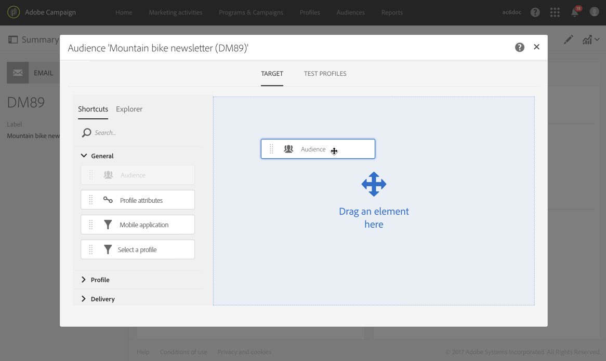
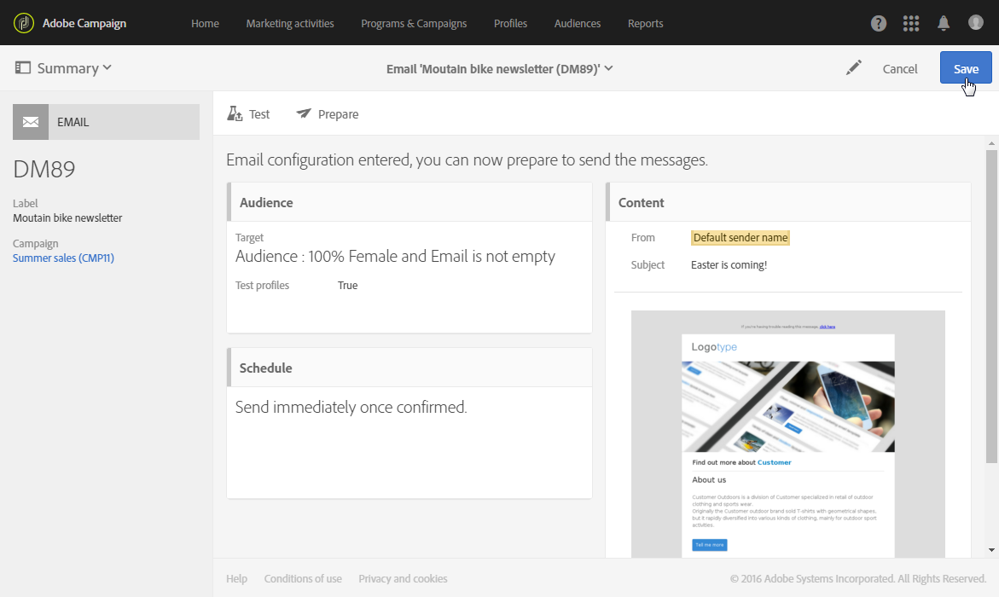

# 在訊息中選取閱聽眾{#selecting-an-audience-in-a-message}

Adobe Campaign可讓您在訊息的對象中設定數種描述檔類型。

您可以在透過建立精靈建立訊息時，或從訊息儀表板（如果訊息已建立）定義觀眾。

>[!NOTE]
>
>如果觀眾是在工作流程中建立並且富含其他資料，您將無法使用這些資料來個人化獨立傳送。 它們只能從在工作流程中執行的傳送中使用。

1. 從控制面板，移至對象區塊以開始。

   

   接著會開啟定義觀眾的畫面。 它有兩個標籤，可讓您分別定義將收到訊息的每個對象類型：

   * Target
   * 測試設定檔
   

1. 定義電子郵件 **[!UICONTROL Target]** 的主要功能。 這是電子郵件的一般目標對象。

   目標在頁籤中定 **[!UICONTROL Target]** 義，由資料庫中標識的配置檔案組成。

   您可以使用查詢編輯器功能來建 [立主目標](../../automating/using/editing-queries.md#creating-queries) 。

   在此標籤中，浮動 **[!UICONTROL Shortcuts]** 視窗僅包含預先定義的篩選條件，以及已在已識別的設定檔中定義的對象。 該選 **[!UICONTROL Explorer]** 項卡允許您訪問其他配置。

   因此，您可以重複使用和合併現有的觀眾，套用其他篩選器等。

1. 定義 **[!UICONTROL Test profiles]** 您要用於電子郵件的項目。 測試設定檔會收到您之前可以傳送的校樣，以在將電子郵件傳送至主要目標之前進行測試。

   如需設定測試設定檔的詳細資訊，請參閱「測 [試設定檔](../../sending/using/managing-test-profiles-and-sending-proofs.md) 」一節。

接著會更新觀眾區塊，並顯示已針對相關電子郵件選取目標和測試設定檔。

