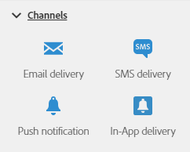

# 關於通道活動{#about-channel-activities}

從浮動視窗的畫面左側展開 **[!UICONTROL Channels]** 區段。

這些活動代表不同的可用通訊通道。您可以結合這些活動，以建立跨通道的工作流程。

**[!UICONTROL Channels]** 一節提供下列活動：

* [電子郵件傳送](../../automating/using/email-delivery.md)
* [簡訊傳送](../../automating/using/sms-delivery.md)
* [推播通知傳送](../../automating/using/push-notification-delivery.md)
* [直接郵件傳送](../../automating/using/direct-mail-delivery.md)
* [應用程式內傳送](../../automating/using/in-app-delivery.md)

