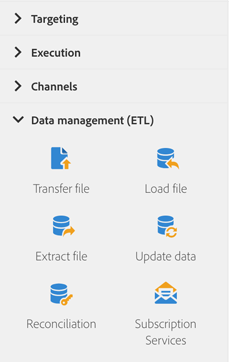

# 關於資料管理活動{#about-data-management-activities}

從浮動視窗的畫面左側展開 **[!UICONTROL Data management (ETL)]** 區段。

這些活動可讓您控制資料。 例如，它們可讓您匯入資料、對資料庫欄位執行大量更新、接收或傳送檔案，或將未識別的資料連結至現有資源。

**[!UICONTROL Data management (ETL)]** 一節提供下列活動：

* [更新資料](../../automating/using/update-data.md)
* [載入檔案](../../automating/using/load-file.md)
* [傳輸檔案](../../automating/using/transfer-file.md)
* [調解](../../automating/using/reconciliation.md)
* [擷取檔案](../../automating/using/extract-file.md)
* [訂閱服務](../../automating/using/subscription-services.md)

**[!UICONTROL Data management (ETL)]** 活動可讓您定義 **其** 對外轉場的區段碼。然後，您可以根據這些區段代碼建立報表，以評估行銷行銷活動的效率。如需詳細資訊，請參閱[本區段](../../reporting/using/creating-a-report-workflow-segment.md)。
