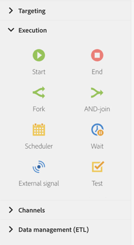

# 關於執行活動{#about-execution-activities}

從浮動視窗中，在畫面左側展開 **[!UICONTROL Execution]** 區段。

以下活動是組織和執行工作流程的特定活動。 他們的主要任務是協調其他活動。

本節 **[!UICONTROL Execution]** 提供下列活動：

* [開始和結束](../../automating/using/start-and-end.md)
* [分支](../../automating/using/fork.md)
* [合併連結](../../automating/using/and-join.md)
* [排程器](../../automating/using/scheduler.md)
* [等待](../../automating/using/wait.md)
* [外部信號](../../automating/using/external-signal.md)
* [測試](../../automating/using/test.md)

