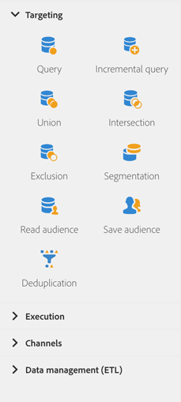

# 關於目標定位活動{#about-targeting-activities}

從浮動視窗的畫面左側展開 **[!UICONTROL Targeting]** 區段。

這些活動專用於鎖定目標、操控人口資料和篩選活動。 它們可讓您定義集，並使用交集、聯合或排除操作分割或組合這些集，以建立一或多個目標。

**[!UICONTROL Targeting]** 一節提供下列活動：

* [查詢](../../automating/using/query.md)
* [增量查詢](../../automating/using/incremental-query.md)
* [聯合](../../automating/using/union.md)
* [交集](../../automating/using/intersection.md)
* [排除](../../automating/using/exclusion.md)
* [細分](../../automating/using/segmentation.md)
* [讀取對象](../../automating/using/read-audience.md)
* [儲存對象](../../automating/using/save-audience.md)
* [去重複化](../../automating/using/deduplication.md)
* [擴充](../../automating/using/enrichment.md)

**[!UICONTROL Targeting]** 活動可讓您定義 **區段代碼** 來進行傳出轉變。 然後，您可以根據這些區段代碼建立報表，以評估行銷行銷活動的效率。如需詳細資訊，請參閱[本區段](../../reporting/using/creating-a-report-workflow-segment.md)。

## 選取資料 {#selecting-data}

您可以使用下列活動來選取資料：

* **[!UICONTROL Query]** 活動可讓您從 Adobe Campaign 資料庫中篩選及擷取元素總量。請參閱 [查詢](../../automating/using/query.md) 區段。
* **[!UICONTROL Incremental query]** 活動可讓您從 Adobe Campaign 資料庫中篩選及擷取元素總量。每次執行此活動時，都會排除先前執行的結果。這可讓您只鎖定新元素請參閱。 [增量查詢](../../automating/using/incremental-query.md) 區段。
* 此 **[!UICONTROL Read audience]** 活動可讓您擷取現有對象，並套用其他篩選條件來調整對象。請參閱 [讀取閱聽眾](../../automating/using/read-audience.md) 區段。

## 將資料分段 {#segmenting-data}

Adobe Campaign可讓您處理傳入資料的集。 因此，您可以合併多個母體、排除其中一部分，或僅保持數個目標的共同資料。

* **[!UICONTROL Union]** 活動可讓您將多個活動的結果重新群組至單一目標。請參閱 [聯合](../../automating/using/union.md) 區段。
* **[!UICONTROL Intersection]**　活動可讓您僅保留活動中不同入站母體的共同元素。請參閱 [交集](../../automating/using/intersection.md) 區段。
* **[!UICONTROL Exclusion]** 活動可讓您根據特定條件，從單一母體中排除元素。請參閱 [排除](../../automating/using/exclusion.md) 區段。
* **[!UICONTROL Segmentation]** 活動可讓您從工作流程中先前放置之活動計算的母體中建立一或多個分段。在活動結束時，可以在單一轉變或不同轉變中處理這些轉變。請參閱 [區段](../../automating/using/segmentation.md) 區段。

## 豐富資料 {#enriching-data}

識別和收集的資料可以被豐富、聚合和操作以優化目標構造。 您可以包含未在資料集市中模型化的資料，借此簡化並最佳化鎖定流程。

此 **[!UICONTROL Additional data]** 的 **[!UICONTROL Query]** 和 **[!UICONTROL Incremental query]** 活動可讓您擴充查詢所定位的資料，並將此資料傳輸至下列工作流程活動，以便在其中使用。 您尤其可以新增：

* 簡單資料
* 彙總
* 集合

**相關主題：**

* [使用案例：使用其他資料個人化電子郵件](../../automating/using/personalizing-email-with-additional-data.md)
