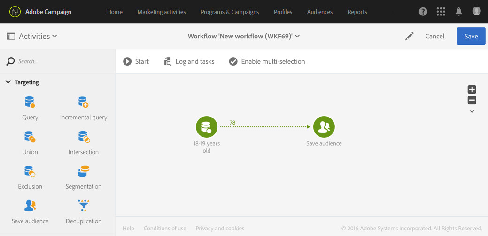

# 關於工作流程執行 {#about-workflow-execution}

工作流程一律手動啟動。 不過，啟動後，視[排程器](../../automating/using/scheduler.md)活動中指定的資訊而定，它可能會保持非作用中狀態。

>[!CAUTION]
>
> Adobe建議客戶排定工作流程執行的優先順序，並執行最多20個同時執行的工作流程，以持續在執行個體間達到最佳效能。 可能會計畫超過20個並行工作流執行，並預設會依序執行。 您可以將票證提交給客戶服務，以調整最大併發工作流執行數的預設設定。

執行相關動作（開始、停止、暫停等） 是&#x200B;**非同步**&#x200B;程式：命令會儲存，並在伺服器可用來套用後生效。

在工作流程中，每個活動的結果通常會透過轉變（以箭頭表示）傳送至下列活動。

如果轉變未連結至目的地活動，則會取消終止。

>[!NOTE]
>
>仍可執行包含未終止轉變的工作流程：系統會產生警告訊息，且工作流程一旦到達轉變就會暫停，但這不會產生錯誤。 您也可以在完成設計的情況下開始工作流程，並隨時完成。

執行活動後，轉變中傳送的記錄數會顯示在其上方。

您可以開啟轉變來檢查在執行工作流程期間或之後傳送的資料是否正確。您可以檢視資料和資料結構。

依預設，只能存取工作流程最後轉變的詳細資訊。 若要存取前述活動的結果，您必須先勾選工作流程屬性的&#x200B;**[!UICONTROL Execution]**&#x200B;區段中的&#x200B;**[!UICONTROL Keep interim results]**&#x200B;選項，才能啟動工作流程。

>[!NOTE]
>
>此選項佔用大量記憶體，旨在協助建構工作流程並確保其正確設定和行為。 在生產執行個體中保留未核取的狀態。

開啟轉變時，您可以編輯其&#x200B;**[!UICONTROL Label]**，或將&#x200B;**[!UICONTROL Segment code]**&#x200B;連結至轉變。 若要這麼做，請編輯對應的欄位並確認您的修改。

使用Campaign StandardREST API，您可以&#x200B;**start**、**pause**、**resume**&#x200B;和&#x200B;**stop**&#x200B;工作流。 您可以在[API檔案中找到更多詳細資料和REST呼叫範例。](../../api/using/controlling-a-workflow.md)
