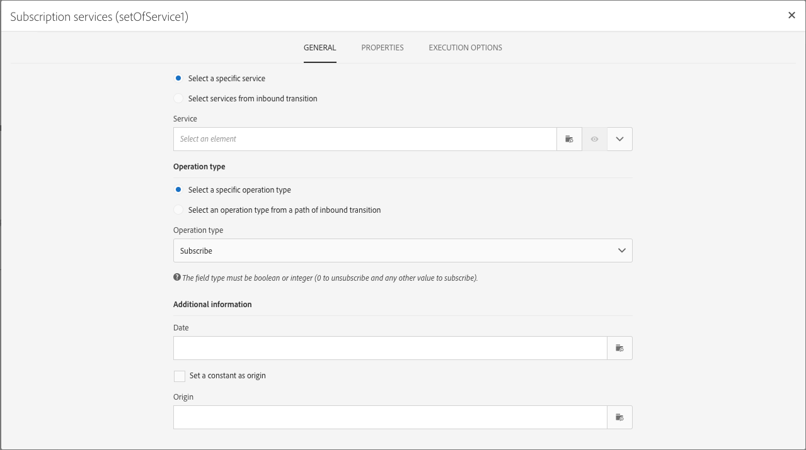

# 管理活動的屬性 {#activity-properties}

## 活動{#global-properties-of-an-activity}的全局屬性

每個活動都有一個&#x200B;**[!UICONTROL General]**&#x200B;頁籤，允許您修改特定於活動的常規參數。

**[!UICONTROL Properties]**&#x200B;標籤允許您修改活動的全局參數，特別是標籤和ID。 配置此頁籤是可選的。

## 管理活動的出站轉場{#managing-an-activity-s-outbound-transitions}

預設情況下，某些活動沒有出站轉移。 您可以從&#x200B;**[!UICONTROL Transitions]**&#x200B;標籤或活動的&#x200B;**[!UICONTROL Properties]**&#x200B;標籤中新增一個，以便將其他流程套用至相同工作流程中的人口族群。

根據活動，您可以添加幾種類型的出站轉場：

* **標準轉換**:由活動計算的人口
* **無人口轉換**:可以添加此類型的出站轉移以繼續工作流，並且不包含任何人口以不佔用系統上任何不必要的空間。
* **拒絕**:被拒絕。例如，如果活動的傳入資料因不正確或不完整而無法處理。
* **補充**:執行活動後剩餘人口數。例如，如果區段活動設定為僅儲存傳入人口的百分比。

如果適用，請為活動的出站轉移指定&#x200B;**[!UICONTROL Segment code]**。 此區段代碼可讓您識別目標人口的子集來自何處，並稍後可能提供訊息個人化用途。

## 活動執行選項{#activity-execution-options}

在活動的屬性螢幕中，有一個&#x200B;**[!UICONTROL Advanced options]**&#x200B;頁籤，可讓您定義活動的執行模式和行為，以防發生錯誤。

若要存取這些選項，請在工作流程中選取活動，然後使用動作列的按鈕將其開啟。

**[!UICONTROL Execution]**&#x200B;欄位允許您定義在任務啟動時要執行的操作。 這有三種選擇：

* **正常**:活動正常執行。
* **啟用但不執行**:活動會暫停，因此後續的任何後續進程也會暫停。如果您希望在任務啟動時出現，則此選項會很有用。
* **不要啟用**:活動不會執行，因此，後續的所有活動（在同一分支中）也不會執行。

**[!UICONTROL In case of error]**&#x200B;欄位可讓您指定當活動遇到錯誤時要執行的動作。 有兩個選項可供使用：

* **暫停流程**:工作流程會自動暫停。然後，工作流狀態為&#x200B;**錯誤**，相關顏色變為紅色。 問題解決後，請重新啟動工作流程。
* **忽略**:不會執行活動，因此，後續的任何活動（位於同一個分支）也不會執行。這可能對循環性任務非常有用。 如果分支有調度程式放在上游，則應在下次執行日期觸發。

使用&#x200B;**[!UICONTROL Behavior]**&#x200B;欄位可以定義在使用非同步任務時要遵循的過程。 有兩個選項可供使用：

* **授權多項任務**:即使第一個任務未完成，也可以同時執行多個任務。
* **當前任務具有優先順序**:一旦任務進行中，就會優先處理。只要一個任務仍在進行中，就不會執行其他任務。

**[!UICONTROL Max. execution duration]**&#x200B;欄位可讓您指定持續時間，例如&quot;30s&quot;或&quot;1h&quot;。 如果活動在指定的持續時間過後仍未完成，則會觸發警報。 這不會影響工作流程的運作方式。

**[!UICONTROL Affinity]**&#x200B;欄位可讓您強制在特定機器上執行工作流程或工作流程活動。 若要這麼做，您必須為相關的工作流程或活動指定一或數個相關性。

**[!UICONTROL Time zone]**&#x200B;欄位可讓您選取活動的時區。 Adobe Campaign可讓您管理同一執行個體上多個國家／地區之間的時間差異。 建立實例時，將配置所應用的設定。

>[!NOTE]
>
>預設情況下，如果未選擇時區，則活動將使用工作流屬性中定義的時區。

**Comment**&#x200B;欄位是可讓您新增附註的免費欄位。
