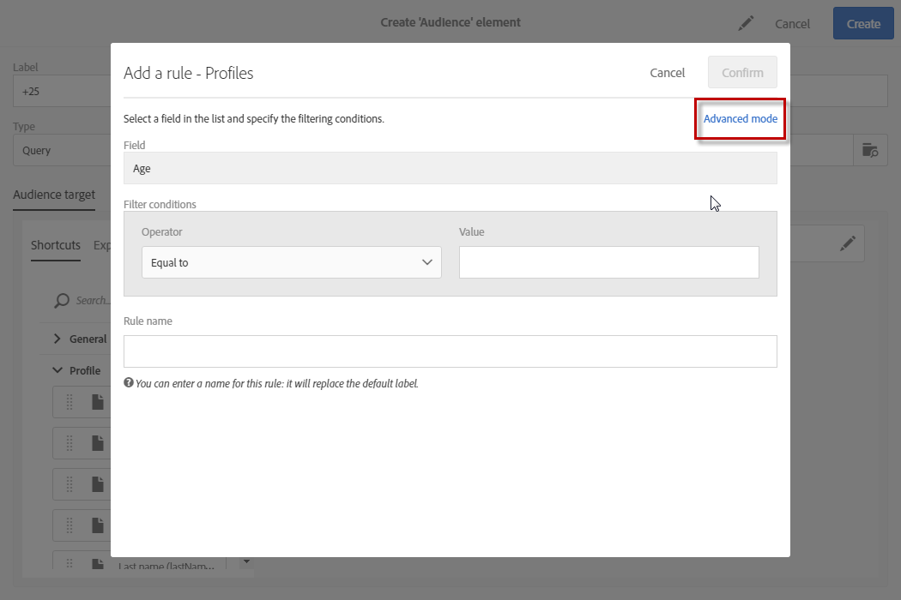

# 進階運算式編輯{#advanced-expression-editing}

## 關於進階運算式編輯 {#about-advanced-expression-editing}

編輯運算式需要手動輸入條件以形成規則。

此模式可讓您使用進階功能。 這些函式可讓您控制用於執行特定查詢的值，例如控制日期、字串、數值欄位、排序等。

編輯運算式時也可以使用事件變數。 如需詳細資訊，請參閱「使用事件變 [數自訂活動](../../automating/using/calling-a-workflow-with-external-parameters.md#customizing-activities-with-events-variables) 」一節。

您可以編輯運算式，以：

* 透過新增規則時 **[!UICONTROL Advanced mode]** 可用的選項定義查詢。

   

* 編輯工作流程中的運算式。 例如，若要新增其他資料至活動。
* 編輯可見性條件，以定義HTML內容編輯器中區塊的顯示方式。 在這種情況下，運算式會以JavaScript格式編輯，不提供使用進階函式做為標準的功能。

## 編輯運算式 {#edit-an-expression}

進階運算式版本可讓您手動定義符合您需求的運算式。

編輯運算式可在建立電子郵件時用於「對象」視窗，或在建立工作流程時用於「查詢」活動。

1. 透過「關於進階運算式編輯」區段中所詳述的其中一個方法， [存取運算式編輯視窗](../../automating/using/advanced-expression-editing.md#about-advanced-expression-editing) 。 它包含下列元素：

   * 定義表達式的輸入欄位。
   * 可用欄位清單，可用於運算式中，並對應至查詢的定位維度(請參閱定 [位維度和資源](../../automating/using/query.md#targeting-dimensions-and-resources))。
   * 可用函式的清單，按類別排序。
   

1. 直接在對應欄位中輸入運算式，或使用可用欄位和函式清單來編輯運算式。

   按兩下某個欄位或表達式將其添加到游標所在的表達式中。

   您可使用工作流程的事件變數來建立運算式。 如需詳細資訊，請參閱「使用事件變 [數自訂活動](../../automating/using/calling-a-workflow-with-external-parameters.md#customizing-activities-with-events-variables) 」一節。

1. 視需要為規則指定特定名稱。 輸入的名稱將作為規則名稱顯示在查詢編輯器工作區中。

編輯運算式可讓您個人化「觀眾」運算式，以視需要鎖定人口。

**相關主題：**

* [運算式語法](../../automating/using/advanced-expression-editing.md#expression-syntax)
* [函式清單](../../automating/using/list-of-functions.md)

## 運算式語法 {#expression-syntax}

### 標準語法 {#standard-syntax}

標準運算式由一個或多個符合下列語法元素的條件組成：

* 每個條件的形 **式為&lt;value1&gt; &lt;comparison運算子&gt; &lt;value2&gt;** :

   * **&lt;value1&gt;是** 一個欄位或函式。 例如， **@created** for the date a profile was created, or **Year(@created)** for the year a profile screated.
   * **&lt;comparison operator&gt;** 是「比較」運算子區段中所列的 [運算子](../../automating/using/advanced-expression-editing.md#comparison-operators) 。 此運算子定義 **&lt;value1&gt;和****&lt;value2&gt;之間的比較方法**。
   * **&lt;value2&gt;** 是手動輸入的欄位、函式或值。
   >[!NOTE]
   >
   >&lt; **value1&gt;** 和 **** &lt;value2&gt;類型資料必須相同。 例如，如果 **&lt;value1&gt;是日期** ，則 **** &lt;value2&gt;也必須是日期。

* 如果要使用多個條件，可以使用邏輯運算子將它們組合起來。

   * **[!UICONTROL AND]**:兩個條件相交。
   * **[!UICONTROL OR]**:兩個條件結合在一起。

例如：

```
Year(@created) = Year(GetDate()) AND Month(@created) = Month(GetDate())
```

在此範例中，會定位其建立日期為目前月份和年份的描述檔。

### JavaScript語法 {#javascript-syntax}

在定義HTML內容編輯器的文本類型塊的可見性條件時，必須使用具有JavaScript類型語法的表達式。

JavaScript運算式由一或多個條件組成，並使用下列語法元素：

* 每個條件都採用 **&lt;context&gt; &lt;comparison運算子&gt; &lt;value2&gt;的形式** ，其中：

   * **&lt;context&gt;** 是可讓您指定上下文的欄位或函式。 例如 **context.profile。@email** ，取得描述檔的電子郵件地址或 **context.profile.firstName.length()** ，取得描述檔名字的字元數。
   * **&lt;comparison operator&gt;** 是「比較」運算子區段中所列的 [運算子](../../automating/using/advanced-expression-editing.md#comparison-operators) 。 此運算子定義 **&lt;context&gt;** 和 **&lt;value2&gt;之間的比較方法**。
   * **&lt;value2&gt;** 是手動輸入的欄位、函式或值。
   >[!NOTE]
   &lt;context&gt; ******** 和&lt;value2&gt;類型資料必須相同。 例如，如果 **&lt;context&gt;是日期** ，則 **&lt;value2&gt;** 也必須是日期。

* 如果要使用多個條件，可以使用邏輯運算子將它們組合起來。

   * **[!UICONTROL &&]**:兩個條件相交。
   * **[!UICONTROL ||]**:兩個條件結合在一起。

例如：

```
context.profile.age > 21 && context.profile.firstName.length() > 0
```

在此範例中，已提供21歲以上且其名字的描述檔(以 **firstName** 欄位至少包含一個字元為例)。

## 比較運算子 {#comparison-operators}

對於某些規則，查詢編輯器可讓您選擇值來定義條件。

條件必須使用下列其中一個運算子連結至值。

<table> 
 <thead> 
  <tr> 
   <th> 運算元<br /> </th> 
   <th> 標準語法<br /> </th> 
   <th> JavaScript語法<br /> </th> 
   <th> 說明<br /> </th> 
   <th> Example<br /> </th> 
  </tr> 
 </thead> 
 <tbody> 
  <tr> 
   <td> <span class="uicontrol">等於</span><br /> </td> 
   <td> =<br /> </td> 
   <td> ==<br /> </td> 
   <td> 第一個值必須與第二個值完全相同。<br /> </td> 
   <td> <strong>@lastName = Martin</strong> 會擷取其姓氏為'Martin'的描述檔，只會擷取這些相同字元。<br /> </td> 
  </tr> 
  <tr> 
   <td> <span class="uicontrol">大於</span><br /> </td> 
   <td> &gt;<br /> </td> 
   <td> &gt;<br /> </td> 
   <td> 第一個值必須斷斷續續大於第二個值。<br /> </td> 
   <td> <strong>@age &gt; 50</strong> 會擷取早於'50'、'51'、'52'等的描述檔。<br /> </td> 
  </tr> 
  <tr> 
   <td> <span class="uicontrol">小於</span><br /> </td> 
   <td> &lt;<br /> </td> 
   <td> &lt;<br /> </td> 
   <td> 第一個值必須斷斷續續小於第二個值。<br /> </td> 
   <td> <strong>@created &lt; DaysAgo(100)</strong> ，檢索在少於100天前的資料庫中建立的所有配置檔案。<br /> </td> 
  </tr> 
  <tr> 
   <td> <span class="uicontrol">大於或等於</span><br /> </td> 
   <td> &gt;=<br /> </td> 
   <td> &gt;=<br /> </td> 
   <td> 第一個值必須大於或等於第二個值。<br /> </td> 
   <td> <strong>@age &gt;= 30</strong> 會擷取年齡在30歲以上的描述檔。<br /> </td> 
  </tr> 
  <tr> 
   <td> <span class="uicontrol">小於或等於</span><br /> </td> 
   <td> &lt;=<br /> </td> 
   <td> &lt;=<br /> </td> 
   <td> 第一值必須小於或等於第二值。<br /> </td> 
   <td> <strong>@age &lt;= 60</strong> referse profiles are of 60.<br /> </td> 
  </tr> 
  <tr> 
   <td> <span class="uicontrol">不同 </span> 的 <br /> </td> 
   <td> !=<br /> </td> 
   <td> !=<br /> </td> 
   <td> 第一個值必須與第二個值不同。<br /> </td> 
   <td> <strong>@language != English</strong> refires that have not defined as English。<br /> </td> 
  </tr> 
  <tr> 
   <td> <span class="uicontrol">包含</span><br /> </td> 
   <td> IN<br /> </td> 
   <td> 不適用<br /> </td> 
   <td> 第一個值必須包含第二個值。<br /> </td> 
   <td> <strong>@domain IN mail</strong>。 在此，結果中將返回所有具有'mail'值的域名。 因此，'gmail.com'網域名稱將構成傳回結果的一部分。<br /> </td> 
  </tr> 
  <tr> 
   <td> <span class="uicontrol">贊</span><br /> </td> 
   <td> 贊<br /> </td> 
   <td> 不適用<br /> </td> 
   <td> <span class="uicontrol">Like</span> 與Contains運算子非 <span class="uicontrol">常類似</span> 。 它可讓您在所搜 <span class="uicontrol">尋的值中插入</span> %萬用字元。<br /> </td> 
   <td> <strong>@lastName LIKE Mart%n</strong>。 在此處，替代字 <strong>元%</strong> (%)作為「小丑」，在拼字不正確的假設情況下尋找名稱"Martin"。<br /> </td> 
  </tr> 
  <tr> 
   <td> <span class="uicontrol">不贊</span><br /> </td> 
   <td>  NOT<br /> </td> 
   <td> 不適用<br /> </td> 
   <td> 類似 <span class="uicontrol">Like</span>。 它可讓您不復原輸入的值。 在這裡，輸入的值也必須包含 <span class="uicontrol">%</span> （萬用字元）。<br /> </td> 
   <td> <strong>@lastName NOT Smi%h</strong>。 在這裡，收件者對應名稱「Smi%h」（所以Smith等）的值。<br /> </td> 
  </tr> 
  <tr> 
   <td> <span class="uicontrol">空白</span><br /> </td> 
   <td> 為空<br /> </td> 
   <td> 不適用<br /> </td> 
   <td> 第一個值必須對應至空值。<br /> </td> 
   <td> <strong>@mobilePhone IS NULL</strong> 會擷取所有尚未提供行動電話號碼的設定檔。<br /> </td> 
  </tr> 
 </tbody> 
</table>

