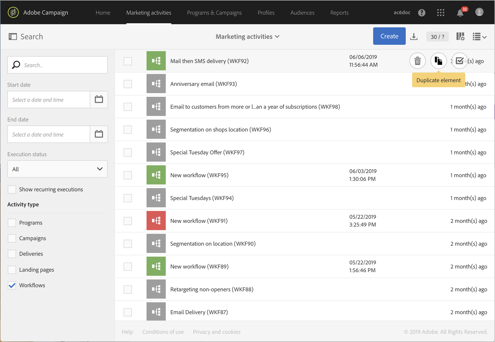

# 工作流程最佳實務{#workflow-best-practices}

有了 Adobe Campaign，您可以設定所有類型的工作流程，以執行大範圍的工作。不過，在設計和執行工作流程時，您必須非常小心，因為不當實作可能會導致效能不佳、錯誤和平台問題。您可以在下方找到最佳實務和疑難排解提示。

>[!NOTE]
>
>工作流程設計和執行必須由 Adobe Campaign 進階使用者執行。

## 命名{#naming}

為方便工作流程疑難排解，Adobe 建議您明確命名工作流程並加上標籤。填寫工作流程的說明欄位，彙總要執行的程序，讓營運商可輕鬆瞭解。
如果工作流程是涉及多個工作流程的流程的一部分，您可以在輸入標籤時，使用數字以清楚地對其進行排序。

例如：

* 001 – 匯入 – 匯入收件人
* 002 – 匯入 – 匯入銷售
* 003 – 匯入 – 匯入銷售詳細資訊
* 010 – 匯出 – 匯出傳送記錄檔
* 011 – 匯出 – 匯出追蹤記錄檔

## 複製工作流程{#duplicating-workflows}

您可以複製工作流程。在 **[!UICONTROL Marketing Activities]** 中，將滑鼠指標停留在工作流程上，然後按一下 **[!UICONTROL Duplicate element]**。複製之後，不會將工作流程的修改轉存到工作流程的副本中。可以編輯工作流程的副本。

## 執行{#execution}

### 工作流程數量

依預設，我們建議不要同時執行超過 20 個作用中的工作流程。達到此限制之後，會將工作流程排入佇列，以免影響效能。同樣地，Adobe 建議您將工作流程執行分散到不同的時間。
在特定情況下，您可能需要執行超過 20 個工作流程。不適用於等待排程執行的工作流程。若是如此，您需要向 Campaign 專家檢查使用案例，並聯絡 Adobe 客戶服務以提高限制。

### 頻率

工作流程無法每隔 10 分鐘自動執行一次。
活動的重複頻率不得少於 10 分鐘。如果重複頻率設為 0（也是預設值），則不會考慮此選項，並會根據執行頻率執行工作流程。

### 暫停的工作流程

已暫停或失敗狀態超過 7 天的工作流程會停止，以減少使用的磁碟空間。清除任務顯示在工作流程記錄檔中。

### 轉變

仍可執行包含未終止轉變的工作流程：它將產生警告訊息，工作流程在轉變時會暫停，但不會產生錯誤。您也可以在沒有完成設計的情況下開始工作流程，並隨時完成工作流程。

如需詳細資訊，請參閱[執行工作流程](../../automating/using/about-workflow-execution.md)。

### 時區

工作流程屬性可讓您定義在其所有活動中預設使用的特定時區。依預設，工作流程的時區是為目前的促銷活動運算子定義的時區。

## 活動{#activity}

### 每個工作流的活動數{#number-activities}

我們建議在單一工作流程中使用最多100個活動。 超過100種活動，在設計和設定工作流程時可能會遇到一些效能問題。

### 工作流程設計

為確保工作流正常結束，請避免使用&#x200B;**[!UICONTROL End activity]**，讓工作流程的最後一次轉場完全自行進行。

若要存取轉變的詳細檢視，請核取工作流程屬性的「執行」區段中的 **[!UICONTROL Keep interim results]** 選項。

>[!CAUTION]
>
>此選項佔用了大量磁碟空間，設計旨在幫助您建構工作流程並確保正確的設定和行為。在生產執行個體中保留未核取的狀態。

### 標籤活動 {#activity-labeling}

在開發工作流程時，會針對每個活動產生名稱，例如所有 Adobe Campaign 物件。雖然工具會產生活動名稱且無法編輯，但建議在設定活動名稱時，以明確的名稱加上標籤。

### 複製活動{#activity-duplicating}

若要複製現有活動，您可以使用複製貼上。如此，您就可保留原本定義的設定。如需詳細資訊，請參閱[複製工作流程活動](../../automating/using/workflow-interface.md)。

### 排程器活動{#acheduler-activity}

在建立工作流程時，每個分支僅使用一個 **[!UICONTROL Scheduler activity]**。如果工作流程的同一分支有多個排程器（相互連結），則要執行的任務數量將呈指數倍增，這將使得資料庫大幅超載。

您可以按一下 **[!UICONTROL Preview next executions]**，預覽工作流程後續的十個執行。

如需詳細資訊，請參閱[排程器活動](../../automating/using/scheduler.md)。

## 使用參數呼叫工作流程{#workflow-with-parameters}

請確定參數的名稱和數目與呼叫工作流時定義的相同（請參閱[本頁](../../automating/using/defining-parameters-calling-workflow.md)）。 參數的類型也必須與預期值一致。

請確定所有參數都已在　**[!UICONTROL External signal activity]**　中宣告。否則，執行活動時將發生錯誤。

如需詳細資訊，請參閱[使用外部參數呼叫工作流程](../../automating/using/calling-a-workflow-with-external-parameters.md)。

## 匯出套件{#exporting-packages}

若要匯出套件，匯出的資源不可包含預設　ID。因此，必須使用與　Adobe Campaign Standard　標準範本不同的名稱，以變更可匯出資源的　ID。
如需詳細資訊，請參閱[管理套件](../../automating/using/managing-packages.md)。

## 匯出清單{#exporting-lists}

匯出清單選項預設會匯出最多　100,000　行，並且由 **Nms_ExportListLimit　選項定義**。此選項可由功能管理員管理，位於 **[!UICONTROL Administration]** > **[!UICONTROL Application settings]** > **[!UICONTROL Options]**　下方。
如需詳細資訊，請參閱[匯出清單](../../automating/using/exporting-lists.md)。

## 疑難排解{#workflow-troubleshooting}

Adobe Campaign　提供多種記錄檔，讓您更清楚瞭解工作流程問題。

### 使用工作流程記錄檔{#using-workflow-logs}

您可以存取工作流程記錄檔，以監控活動的執行。其會按時間順序，對執行的操作和執行錯誤進行索引。Logs 索引標籤包含所有或某些選取活動的執行歷史記錄。
Tasks 索引標籤會詳細說明活動的執行順序。若要取得活動的詳細資訊，請按一下任務。
有關詳細資訊，請參閱[監控工作流程執行](../../automating/using/monitoring-workflow-execution.md)。

#### 疑難排解資料管理活動{#troubleshooting-data-management-activities}

您可以在　Log　索引標籤中分析　SQL　查詢。

1. 在工作流程工作區中，按一下 **[!UICONTROL Edit properties]**。
1. 在 **[!UICONTROL General]** > **[!UICONTROL Execution]** 中，核取 **[!UICONTROL Save SQL queries in the log]** 及 **[!UICONTROL Execute in the engine]** 選項並按一下 **[!UICONTROL Confirm]**。

**若要檢視記錄檔中的 SQL 查詢：**
1. 按一下 **[!UICONTROL Log and Tasks]**。
1. 在 **[!UICONTROL Logs]** 索引標籤中，開啟 **[!UICONTROL Search]** 面板。
1. 核取 **[!UICONTROL Display SQL logs only]**。

查詢會顯示在記錄檔的 **[!UICONTROL Message]** 欄中。

### 使用傳送記錄檔{#using-delivery-logs}

傳送記錄檔可監控傳送是否成功。排除記錄在準備傳送期間傳回已排除的訊息。傳送記錄檔會提供每個描述檔的傳送狀態。
如需詳細資訊，請參閱[瞭解傳送失敗](../../sending/using/understanding-delivery-failures.md)。

### 使用傳送警報{#delivery-alerting}

「傳送警報」功能是警報管理系統，可讓一組使用者自動接收包含其傳送執行資訊的通知。
如需詳細資訊，請參閱[傳送警報](../../sending/using/receiving-alerts-when-failures-happen.md)。

**相關主題：**

* [錯誤管理](../../automating/using/monitoring-workflow-execution.md)
