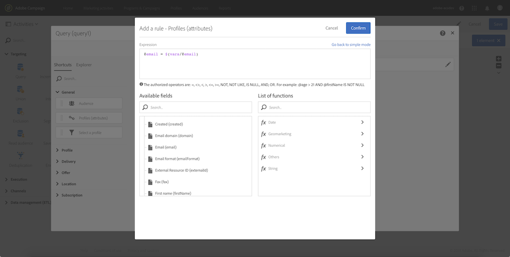
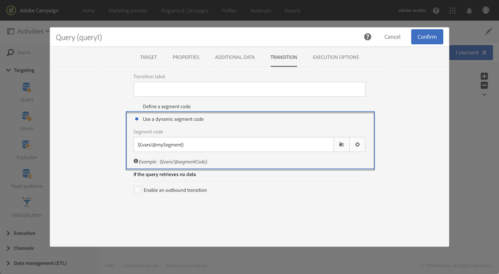

# 使用外部參數呼叫工作流程{#calling-a-workflow-with-external-parameters}

Campaign Standard可讓您使用參數（要定位的對象名稱、要匯入的檔案名稱、訊息內容的一部分等）來呼叫工作流程。 如此，您就可輕鬆將Campaign自動化與外部系統整合。

讓我們舉下列範例，其中我們要直接從CMS傳送電子郵件。 在這種情況下，您可以設定系統以選擇觀眾，並將內容以電子郵件形式傳送至CMS。 按一下「傳送」將會使用這些參數呼叫促銷活動工作流程，讓您將這些參數用在工作流程中，以定義要用於傳送的對象和URL內容。

使用參數調用工作流的過程如下：

1. 在活動中聲明參 **[!UICONTROL External signal]** 數。 請參 [閱聲明外部信號活動中的參數](../../automating/using/calling-a-workflow-with-external-parameters.md#declaring-the-parameters-in-the-external-signal-activity)。
1. 設定活 **[!UICONTROL End]** 動或API呼叫，以定義參數並觸發工作流程 **[!UICONTROL External signal]** 活動。

觸發工作流程後，這些參數就會被收錄到工作流程的事件變數中，並可在工作流程中使用。 請參 [閱使用外部參數自訂工作流程](../../automating/using/calling-a-workflow-with-external-parameters.md#customizing-a-workflow-with-external-parameters)。


## 在「外部信號」活動中聲明參數 {#declaring-the-parameters-in-the-external-signal-activity}

使用參數呼叫工作流程的第一步是在活動中宣告這 **[!UICONTROL External signal]** 些參數。

1. 開啟活 **[!UICONTROL External signal]** 動，然後選取標 **[!UICONTROL Parameters]** 簽。
1. 按一下 **[!UICONTROL Create element]** 按鈕，然後指定每個參數的名稱和類型。

   >[!CAUTION]
   >
   >請確定參數的名稱和數目與呼叫工作流時所定義的相同(請參閱呼 [叫工作流時定義參數](../../automating/using/calling-a-workflow-with-external-parameters.md#defining-the-parameters-when-calling-the-workflow))。 此外，參數類型必須與預期值一致。

   

1. 聲明參數後，完成工作流配置，然後運行它。

## 在調用工作流時定義參數 {#defining-the-parameters-when-calling-the-workflow}

本節詳細說明如何在調用工作流時定義參數。 如需如何從API呼叫執行此作業的詳細資訊，請參閱 [REST API檔案](../../api/using/triggering-a-signal-activity.md)。

在定義參數之前，請確定：

* 參數已在活動中聲 **[!UICONTROL External Signal]** 明。 請參 [閱聲明外部信號活動中的參數](../../automating/using/calling-a-workflow-with-external-parameters.md#declaring-the-parameters-in-the-external-signal-activity)。
* 包含信號活動的工作流正在運行。

要配置活 **[!UICONTROL End]** 動，請執行以下步驟：

1. 開啟活 **[!UICONTROL End]** 動，然後選取標 **[!UICONTROL External signal]** 簽。
1. 選擇要調用的工作流和外部信號活動。
1. 按一下 **[!UICONTROL Create element]** 按鈕以新增參數，然後填入其名稱和值。

   * **[!UICONTROL Name]**:已在活動中宣告的名稱(請參 **[!UICONTROL External signal]** 閱在「外 [部信號」活動中宣告參數](../../automating/using/calling-a-workflow-with-external-parameters.md#declaring-the-parameters-in-the-external-signal-activity))。
   * **[!UICONTROL Value]**:要指派給參數的值。 值應遵循 **Standard語法**，如本 [節所述](../../automating/using/advanced-expression-editing.md#standard-syntax)。
   

   >[!CAUTION]
   >
   >請確定活動中已聲明所有參 **[!UICONTROL External signal]** 數。 否則，當執行活動時將發生錯誤。

1. 定義參數後，確認活動，然後儲存您的工作流程。

## 監控事件變數 {#monitoring-the-events-variables}

您可以監控工作流程中可用的事件變數，包括宣告的外部參數。 要執行此操作，請遵循下列步驟：

1. 選擇活動後面的活 **[!UICONTROL External signal]** 動，然後按一下按 **[!UICONTROL Log and tasks]** 鈕。
1. 在標籤 **[!UICONTROL Tasks]** 中，按一下  按鈕。

   

1. 會顯示任務的執行上下文（ID、狀態、持續時間等），包括所有現在可用於工作流的事件變數。

   

## Customizing a workflow with external parameters {#customizing-a-workflow-with-external-parameters}

觸發工作流程後，這些參數會被收錄到事件變數中，並可用來自訂工作流程的活動。

例如，它們可用來定義要在活動中讀取的對象、 **[!UICONTROL Read audience]** 要在活動中傳輸的檔案 **[!UICONTROL Transfer file]** 的名稱等。

使用事件變數可自訂的活動將在本節 [中詳述](../../automating/using/calling-a-workflow-with-external-parameters.md#customizing-activities-with-events-variables)。

### 使用事件變數 {#using-events-variables}

事件變數用於必須遵循標準語法的運 **[算式中](../../automating/using/advanced-expression-editing.md#standard-syntax)**。

使用事件變數的語法必須遵循下列格式，並使用已在活動中定義的參數名 **[!UICONTROL External signal]** 稱(請參 [閱聲明外部信號活動中的參數](../../automating/using/calling-a-workflow-with-external-parameters.md#declaring-the-parameters-in-the-external-signal-activity)):

```
$(vars/@parameterName)
```

在此語法中， **$** 函式會傳 **回字串資料類型** 。 如果您想要指定其他類型的資料，請使用下列函式：

* **$long**:整數。
* **$float**:小數。
* **$boolean**:true/false。
* **$datetime**:時間戳記。

在活動中使用變數時，介面會提供呼叫變數的說明。


* :在工作流程中可用的所有變數中選取事件變數（請參閱）。

   

* :編輯結合變數和函式的運算式。 有關「表達式」編輯器的詳細資訊，請參 [閱本節](../../automating/using/advanced-expression-editing.md)。

   

**相關主題：**

* [編輯運算式](../../automating/using/advanced-expression-editing.md#edit-an-expression)
* [標準語法](../../automating/using/advanced-expression-editing.md#standard-syntax)
* [函式清單](../../automating/using/list-of-functions.md)

### 使用事件變數自訂活動 {#customizing-activities-with-events-variables}

事件變數可用來自訂數個活動，列於下方一節。 如需如何從活動呼叫變數的詳細資訊，請參 [閱本節](../../automating/using/calling-a-workflow-with-external-parameters.md#using-events-variables)。

**[!UICONTROL Read audience]** 活動：根據事件變數定義要定位的對象。

有關如何使用活動的詳細說明，請參閱專 [用章節](../../automating/using/read-audience.md)。


**[!UICONTROL Test]** 活動：根據事件變數建立條件。

有關如何使用活動的詳細說明，請參閱專 [用章節](../../automating/using/test.md)。


**[!UICONTROL Transfer file]** 活動：根據事件變數自訂檔案以進行傳輸。

有關如何使用活動的詳細說明，請參閱專 [用章節](../../automating/using/transfer-file.md)。


**[!UICONTROL Query]** 活動：參數可在查詢中參考，方法是使用結合事件變數和函式的運算式。 若要這麼做，請新增規則，然後按一下連 **[!UICONTROL Advanced mode]** 結以存取運算式編輯視窗(請參閱進 [階運算式編輯](../../automating/using/advanced-expression-editing.md))。

有關如何使用活動的詳細說明，請參閱專 [用章節](../../automating/using/query.md)。



**[!UICONTROL Channels]** 活動：根據事件變數個人化傳送。

>[!NOTE]
>
>每次準備傳送時，都檢索該傳送參數的值。
>
>週期性交貨準備是基於交貨匯總 **期間**。 例如，如果匯總期間是「按天」，則每天只重新準備一次傳送。 如果傳送參數的值在當天被修改，則不會在傳送中更新，因為已準備一次。
>
>如果您計畫每天呼叫多次工作流程，請使用 [!UICONTROL No aggregation] 選項，如此每次都會更新傳送參數。 如需循環傳送設定的詳細資訊，請參 [閱本節](/help/automating/using/email-delivery.md#configuration)。

若要根據事件變數個人化傳送，您必須先將您要使用的變數宣告至傳送活動：

1. 選取活動，然後按一下按  鈕以存取設定。
1. 選取標 **[!UICONTROL General]** 簽，然後新增事件變數，這些變數將可在傳送中當做個人化欄位使用。

   

1. Click the **[!UICONTROL Confirm]** button.

個人化欄位清單中現在提供宣告的事件變數。 您可以在傳送中使用它們，以執行下列動作：

* 定義要用於傳送的範本名稱。

   >[!NOTE]
   >
   >此動作僅適用於 **循環** 傳送。

   

* 個人化交付：選取個人化欄位以設定傳送時，事件變數可在元素中使 **[!UICONTROL Workflow parameters]** 用。 您可將其用作任何個人化欄位，例如定義傳送主體、傳送者等。

   傳送個人化在本節中 [詳述](../../designing/using/personalization.md)。

   

**區段代碼**:根據事件變數定義區段代碼。

>[!NOTE]
>
>您可以從任何可讓您定義區段代碼（例如，活動）的活動執行 **[!UICONTROL Query]** 此 **[!UICONTROL Segmentation]** 動作。



**傳送標籤**:根據事件變數定義傳送標籤。


## 使用案例 {#use-case}

以下使用案例說明如何使用工作流程中的參數來呼叫工作流程。

其目的在於使用外部參數從API呼叫觸發工作流程。 此工作流程會從檔案將資料載入您的資料庫，並建立相關對象。 在建立對象後，會觸發第二個工作流程，以傳送具有API呼叫中定義之外部參數之個人化訊息。

要執行此使用案例，您需要執行以下操作：

1. **進行API呼叫** ，以使用外部參數觸發Workflow 1。 請參 [閱步驟1:設定API呼叫](../../automating/using/calling-a-workflow-with-external-parameters.md#step-1--configuring-the-api-call)。
1. **建立工作流程1**:工作流將傳輸檔案並將其載入到資料庫中。 然後，它會測試資料是否空白，並最終將描述檔儲存至觀眾。 最後，它將觸發Workflow 2。 請參 [閱步驟2:設定工作流程1](../../automating/using/calling-a-workflow-with-external-parameters.md#step-2--configuring-workflow-1).
1. **建立工作流程2**:工作流程會讀取在Workflow 1中建立的觀眾，然後傳送個人化訊息至描述檔，並使用參數自訂區段代碼。 請參 [閱步驟3:設定工作流程2](../../automating/using/calling-a-workflow-with-external-parameters.md#step-3--configuring-workflow-2).


### 必要條件 {#prerequisites}

在設定工作流程之前，您必須先建立「工作流程1」和「工作流程2」，其 **[!UICONTROL External signal]** 中每個工作流程都包含活動。 如此，您就可以在呼叫工作流程時鎖定這些訊號活動。

### 步驟1:設定API呼叫 {#step-1--configuring-the-api-call}

進行API呼叫，以使用參數觸發Workflow 1。 如需API呼叫語法的詳細資訊，請參閱 [Campaign Standard REST API檔案](../../api/using/triggering-a-signal-activity.md)。

在本例中，我們要使用下列參數來呼叫工作流程：

* **fileToTarget**:要導入到資料庫的檔案的名稱。
* **折扣設計**:要在交貨中顯示的折扣說明。

```
-X POST https://mc.adobe.io/<ORGANIZATION>/campaign/<TRIGGER_URL>
-H 'Authorization: Bearer <ACCESS_TOKEN>' 
-H 'Cache-Control: no-cache' 
-H 'X-Api-Key: <API_KEY>' 
-H 'Content-Type: application/json;charset=utf-8' 
-H 'Content-Length:79' 
-i
-d {
-d "source:":"API",
-d "parameters":{
-d "fileToTarget":"profile.txt",
-d "discountDesc":"Running shoes"
-d } 
```

### 步驟2:設定工作流程1 {#step-2--configuring-workflow-1}

工作流程1的建立方式如下：

* **[!UICONTROL External signal]** 活動：其中，必須聲明外部參數才能在工作流中使用。
* **[!UICONTROL Transfer file]** 活動：導入具有參數中定義的名稱的檔案。
* **[!UICONTROL Load file]** 活動：從導入的檔案將資料載入到資料庫中。
* **[!UICONTROL Update data]** 活動：使用導入檔案中的資料插入或更新資料庫。
* **[!UICONTROL Test]** 活動：檢查是否有匯入的資料。
* **[!UICONTROL Save audience]** 活動：如果檔案包含資料，請將描述檔儲存至觀眾。
* **[!UICONTROL End activity]** 活動：呼叫Workflow 2，其中包含您要使用的參數。


請依照下列步驟來設定工作流程：

1. 宣告已在API呼叫中定義的參數。 若要這麼做，請開啟 **[!UICONTROL External signal]** 活動，然後新增參數的名稱和類型。

   

1. 新增活 **[!UICONTROL Transfer file]** 動以將資料匯入資料庫。若要這麼做，請拖放活動，將其開啟，然後選取標 **[!UICONTROL Protocol]** 簽。
1. 選取 **[!UICONTROL Use a dynamic file path]** 選項，然後使 **** 用fileToTarget參數作為要傳輸的檔案：

   ```
   $(vars/@fileToTarget)
   ```

   

1. 將資料從檔案載入到資料庫中。

   若要這麼做，請將活動拖放 **[!UICONTROL Load file]** 至工作流程中，然後根據您的需求進行設定。

1. 使用導入檔案中的資料插入和更新資料庫。

   若要這麼做，請拖放活 **[!UICONTROL Update data]** 動，然後選取標 **[!UICONTROL Identification]** 簽以新增協調條件(在我們的例子中為電子郵件 **欄位** )。

   

1. 選取標 **[!UICONTROL Fields to update]** 簽，然後指定要在資料庫中更新的欄位(在我們的例子中是名 **字** 和電 **子郵件欄位** )。

   

1. 檢查是否從檔案檢索到資料。 若要這麼做，請將活動拖放 **[!UICONTROL Test]** 至工作流程中，然後按一下按 **[!UICONTROL Add an element]** 鈕以新增條件。
1. 命名並定義條件。 在本例中，我們要測試出站轉場是否包含下列語法的資料：

   ```
   $long(vars/@recCount)>0
   ```

   

1. 如果擷取資料，請將其儲存至觀眾。 若要這麼做，請新增活 **[!UICONTROL Save audience]** 動至 **Target而非空白轉場** ，然後開啟它。
1. 選取 **[!UICONTROL Use a dynamic label]** 選項，然後使 **** 用fileToTarget參數作為對象的標籤：

   ```
   $(vars/@fileToTarget)
   ```

   

1. 拖放會以參 **[!UICONTROL End]** 數呼叫Workflow 2的活動，然後開啟它。
1. 選取標 **[!UICONTROL External signal]** 簽，然後指定要觸發的工作流程及其相關的信號活動。
1. 定義您要在Workflow 2中使用的參數及其關聯值。

   在我們的情況下，我們會傳遞API呼叫(**fileToTarget** and **discountDesc**)中最初定義的參數，以及具有固定值的額 **外segmentCode** 參數（「20%折扣」）。

   

Workflow 1已設定，您現在可以建立Workflow 2。 如需詳細資訊，請參閱[本小節](../../automating/using/calling-a-workflow-with-external-parameters.md#step-3--configuring-workflow-2)。

### 步驟3:設定工作流程2 {#step-3--configuring-workflow-2}

工作流程2的建立方式如下：

* **[!UICONTROL External signal]** 活動：其中，必須聲明參數才能在工作流中使用。
* **[!UICONTROL Read audience]** 活動：讀取在Workflow 1中儲存的對象。
* **[!UICONTROL Email delivery]** 活動：傳送循環訊息給目標對象，並使用參數個人化。


請依照下列步驟來設定工作流程：

1. 聲明已在Workflow 1中定義的參數。

   若要這麼做，請開啟 **[!UICONTROL External signal]** 活動，然後新增Workflow 1活動中定義之每個參數 **[!UICONTROL End]** 的名稱和類型。

   

1. 使用已儲存在Workflow 1中的對象。 若要這麼做，請將活動拖放 **[!UICONTROL Read audience]** 至工作流程中，然後開啟它。
1. 選取 **[!UICONTROL Use a dynamic audience]** 選項，然後使 **** 用fileToTarget參數作為要讀取的對象名稱：

   ```
   $(vars/@fileToTarget)
   ```

   

1. 根據segmentCode參數命名出站 **轉場** 。

   若要這麼做，請先選取標 **[!UICONTROL Transition]** 簽，再選取 **[!UICONTROL Use a dynamic segment code]** 選項。

1. 使用 **segmentCode** 參數作為傳出轉換的名稱：

   ```
   $(vars/@segmentCode)
   ```

   

1. 拖放活動 **[!UICONTROL Email delivery]** 以傳送訊息給觀眾。
1. 識別訊息中要使用的參數，以便使用discountDesc參 **數個人化** 。 若要這麼做，請開啟活動的進階選項，然後新增參數名稱和值。

   

1. 您現在可以設定訊息。 開啟活動，然後選取 **[!UICONTROL Recurring email]**。

   

1. 選取要使用的範本，然後根據您的需求定義電子郵件屬性。
1. 使用 **discountDesc** 參數做為個人化欄位。 若要這麼做，請從個人化欄位清單中選取它。

   

1. 您現在可以完成訊息的設定，然後照常傳送。

   

### 執行工作流程 {#executing-the-workflows}

建立工作流程後，您就可以執行這些工作流程。 在執行API呼叫前，請確定已啟動兩個工作流程。
