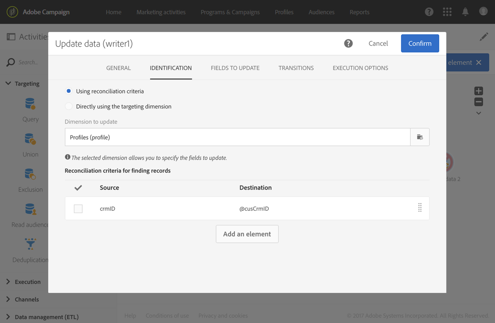

# 建立工作流程範本以匯入資料 {#import-workflow-template}

如果您需要定期匯入具有相同結構的檔案，請使用匯入範本是最佳做法。

此範例說明如何預先設定可重複用於匯入來自Adobe Campaign資料庫中CRM的設定檔的工作流程。

1. 從中建立新的工作流模板 **[!UICONTROL Resources > Templates > Workflow templates]**。
1. 新增下列活動：

   * **[!UICONTROL Load file]**:定義包含要導入資料的檔案的預期結構。

      >[!NOTE]
      >
      >您只能從單一檔案匯入資料。 如果工作流程有多 **[!UICONTROL Load file]** 個活動，則每次都會使用相同的檔案。

   * **[!UICONTROL Reconciliation]**:協調導入的資料與資料庫資料。
   * **[!UICONTROL Segmentation]**:根據記錄是否可以調節，建立篩選器以不同方式處理記錄。
   * **[!UICONTROL Deduplication]**:在將傳入檔案插入資料庫之前，先從該檔案中消除重複資料。
   * **[!UICONTROL Update data]**:使用導入的配置檔案更新資料庫。

   

1. 設定活 **[!UICONTROL Load file]** 動：

   * 上傳範例檔案以定義預期的結構。 範例檔案應僅包含幾行，但是導入時需要的所有列。 檢查並編輯檔案格式，以確保每列的類型設定正確：文字、日期、整數等。 例如：

      ```
      lastname;firstname;birthdate;email;crmID
      Smith;Hayden;23/05/1989;hayden.smith@mailtest.com;123456
      ```

   * 在區 **[!UICONTROL File to load]** 段中，選 **[!UICONTROL Upload a new file from the local machine]** 取並保留空白欄位。 每次從此模板建立新工作流時，您都可以在此處指定所需的檔案，只要該檔案與定義的結構相對應。

      您可以使用任何選項，但必須相應修改模板。 例如，如果您選 **[!UICONTROL Use the file specified in the inbound transition]**&#x200B;取，則可在 **[!UICONTROL Transfer file]** 擷取要從FTP/SFTP伺服器匯入的檔案之前新增活動。

      如果您希望使用者能夠下載包含匯入期間發生錯誤的檔案，請勾選 **[!UICONTROL Keep the rejects in a file]** 選項並指定 **[!UICONTROL File name]**。

      

1. 設定活 **[!UICONTROL Reconciliation]** 動。 此活動的目的是識別傳入的資料。

   * 在標籤 **[!UICONTROL Relations]** 中，選 **[!UICONTROL Create element]** 取並定義匯入資料與收件者定位維度之間的連結(請參閱 [定位維度和資源](../../automating/using/query.md#targeting-dimensions-and-resources))。 在此範例中， **CRM ID** custom欄位用來建立連結條件。 只要您需要欄位或欄位組合，就能識別唯一記錄。
   * 在頁籤 **[!UICONTROL Identification]** 中，將選項保留為未 **[!UICONTROL Identify the document from the working data]** 選中狀態。

   

1. 設定活 **[!UICONTROL Segmentation]** 動，以擷取一個轉場中已協調的收件者，以及在第二個轉場中無法協調但擁有足夠資料的收件者。

   然後，可以使用與已調節的收件人之間的轉換來更新資料庫。 然後，如果檔案中有一組最小資訊，則與未知收件人的轉換可用於在資料庫中建立新收件人條目。

   無法協調且沒有足夠資料的收件者會在補充的對外轉場中選取，並可匯出成個別檔案或略過。

   * 在活 **[!UICONTROL General]** 動的標籤中，將設為 **[!UICONTROL Resource type]** 並 **[!UICONTROL Temporary resource]** 選擇作 **[!UICONTROL Reconciliation]** 為目標集。
   * 在選 **[!UICONTROL Advanced options]** 項卡中，選 **[!UICONTROL Generate complement]** 中該選項可查看是否無法在資料庫中插入任何記錄。 如果需要，您可以對補充資料套用進一步的處理：檔案匯出、清單更新等。
   * 在標籤的第一個區 **[!UICONTROL Segments]** 段中，在傳入人口中新增篩選條件，以僅選擇描述檔的CRM ID不等於0的記錄。 這樣，在該子集中選擇與資料庫配置檔案協調的檔案資料。

      

   * 添加第二個段，該段選擇具有足夠資料要插入到資料庫中的未協調記錄。 例如：電子郵件地址、名字和姓氏。 未協調的記錄的配置檔案的CRM ID值等於0。

      

   * 未在前兩個子集中選擇的所有記錄都在中選擇 **[!UICONTROL Complement]**。

1. 設定位 **[!UICONTROL Update data]** 於先前設定之活動首次出站轉 **[!UICONTROL Segmentation]** 移後的活動。

   * 選 **[!UICONTROL Update]** 擇為 **[!UICONTROL Operation type]** ，因為入站轉換只包含資料庫中已存在的收件人。
   * 在標 **[!UICONTROL Identification]** 簽中，選 **[!UICONTROL Using reconciliation criteria]** 擇並定義- Profiles in this **[!UICONTROL Dimension to update]** -和活動中建立的連結之間的鍵 **[!UICONTROL Reconciliation]** 。 在此範例中，會 **使用CRM ID** custom欄位。

      

   * 在頁籤 **[!UICONTROL Fields to update]** 中，指定「配置檔案」維中的欄位，以使用檔案中相應列的值進行更新。 如果檔案列的名稱與收件人維欄位的名稱相同或幾乎相同，則可以使用魔術棒按鈕自動匹配不同的欄位。

      

      >[!NOTE]
      >
      >如果您打算將直效郵件傳送給這些個人檔案，請務必包含郵遞區號，因為這項資訊對於直效郵件提供者而言十分重要。 同時，請確定已勾 **[!UICONTROL Address specified]** 選設定檔資訊中的方塊。 若要從工作流程更新此選項，只需將元素新增至要更新的欄位，然後將 **1****[!UICONTROL Source]** 指定為，並 `postalAddress/@addrDefined` 選取欄位 **[!UICONTROL Destination]**。 有關直效郵件和使用選項的詳細 **[!UICONTROL Address specified]** 資訊，請參 [閱此文檔](../../channels/using/about-direct-mail.md#recommendations)。

1. 設定轉換 **[!UICONTROL Deduplication]** 後包含未協調描述檔的活動：

   * 在該選 **[!UICONTROL Properties]** 項卡中，將設定 **[!UICONTROL Resource type]** 為從工作流活動生成的 **[!UICONTROL Reconciliation]** 臨時資源。

      

   * 在此範例中，電子郵件欄位可用來尋找獨特的描述檔。 您可以使用任何您確定已填入的欄位，以及唯一組合的一部分。
   * 選擇 **[!UICONTROL Deduplication method]**。 在這種情況下，應用程式會自動決定在出現重複記錄時保存哪些記錄。

   

1. 設定先前 **[!UICONTROL Update data]** 設定之活動之 **[!UICONTROL Deduplication]** 後的活動。

   * 選 **[!UICONTROL Insert only]** 擇為 **[!UICONTROL Operation type]** ，因為入站轉換只包含資料庫中不存在的配置檔案。
   * 在標 **[!UICONTROL Identification]** 簽中，選 **[!UICONTROL Using reconciliation criteria]** 擇並定義- Profiles in this **[!UICONTROL Dimension to update]** -和活動中建立的連結之間的鍵 **[!UICONTROL Reconciliation]** 。 在此範例中，會 **使用CRM ID** custom欄位。

      

   * 在頁籤 **[!UICONTROL Fields to update]** 中，指定「配置檔案」維中的欄位，以使用檔案中相應列的值進行更新。 如果檔案列的名稱與收件人維欄位的名稱相同或幾乎相同，則可以使用魔術棒按鈕自動匹配不同的欄位。

      

      >[!NOTE]
      >
      >如果您打算將直效郵件傳送給這些個人檔案，請務必包含郵遞區號，因為這項資訊對於直效郵件提供者而言十分重要。 同時，請確定已勾 **[!UICONTROL Address specified]** 選設定檔資訊中的方塊。 若要從工作流程更新此選項，只需將元素新增至要更新的欄位，然後將 **1****[!UICONTROL Source]** 指定為，並選取 **[postalAddress/@addrDefined]** field as **[!UICONTROL Destination]**。 有關直效郵件和使用選項的詳細 **[!UICONTROL Address specified]** 資訊，請參 [閱此文檔](../../channels/using/about-direct-mail.md#recommendations)。

1. 在活動的第三次轉 **[!UICONTROL Segmentation]** 換後，如果要跟蹤未插入數 **[!UICONTROL Extract file]****[!UICONTROL Transfer file]** 據庫的資料，請添加活動和活動。 設定這些活動，以匯出您需要的欄，並在FTP或SFTP伺服器上傳輸檔案，您可在其中擷取該欄。
1. 新增活 **[!UICONTROL End]** 動並儲存工作流程範本。

範本現在可以使用，而且適用於每個新的工作流程。 然後，需要全部指定包含要在活動中導入的資料的文 **[!UICONTROL Load file]** 件。


