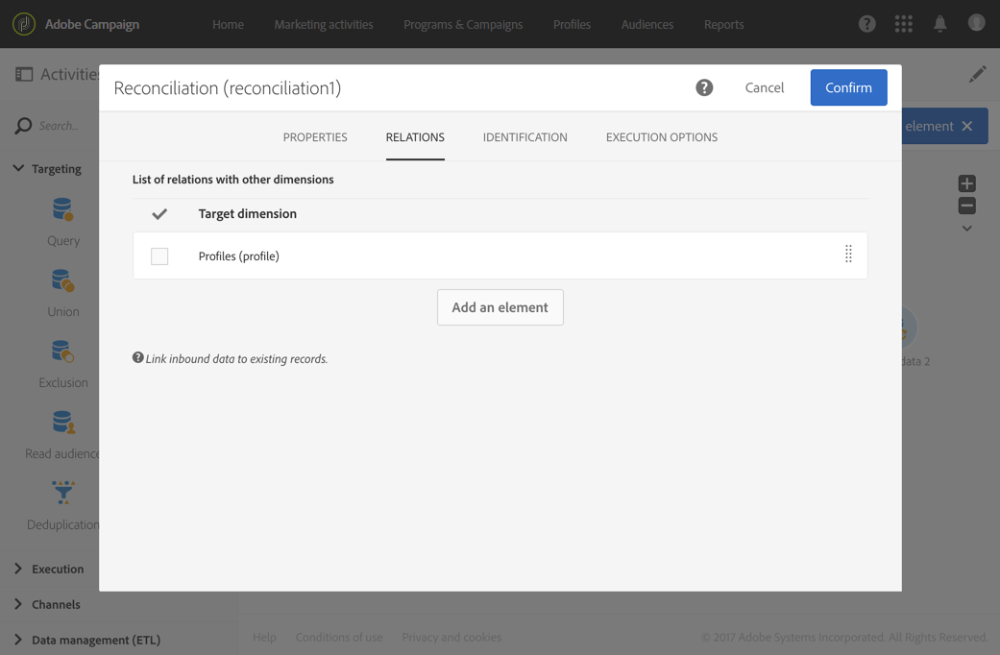

# 建立工作流程範本以匯入資料 {#import-workflow-template}

如果您需要定期匯入具有相同結構的檔案，使用匯入範本是最佳實務。

此範例說明如何預先設定工作流程，該工作流程可重複用於匯入來自Adobe Campaign資料庫中CRM的設定檔。

1. 建立新的工作流程範本，從 **[!UICONTROL Resources > Templates > Workflow templates]**.
1. 新增下列活動：

   * **[!UICONTROL Load file]**：定義包含要匯入之資料的檔案的預期結構。

      >[!NOTE]
      >
      >您只能從單一檔案匯入資料。 如果工作流程有多個 **[!UICONTROL Load file]** 活動，每次都會使用相同的檔案。

   * **[!UICONTROL Reconciliation]**：使用資料庫資料調解匯入的資料。
   * **[!UICONTROL Segmentation]**：建立篩選條件以根據是否可以調解記錄而以不同方式處理記錄。
   * **[!UICONTROL Deduplication]**：在傳入檔案插入資料庫之前，從傳入檔案中刪除重複資料。
   * **[!UICONTROL Update data]**：使用匯入的設定檔更新資料庫。

   

1. 設定 **[!UICONTROL Load file]** 活動：

   * 透過上傳範例檔案來定義預期的結構。 範例檔案應僅包含幾行，但應包含匯入所需的所有欄。 檢查並編輯檔案格式，以確定每欄的型別已正確設定：文字、日期、整數等。 例如：

      ```
      lastname;firstname;birthdate;email;crmID
      Smith;Hayden;23/05/1989;hayden.smith@mailtest.com;123456
      ```

   * 在 **[!UICONTROL File to load]** 區段，選取 **[!UICONTROL Upload a new file from the local machine]** 並將欄位留空。 每次從這個範本建立新工作流程時，只要檔案與定義的結構相對應，您就可以在此處指定想要的檔案。

      您可以使用任何選項，但必須相應地修改範本。 例如，如果您選取 **[!UICONTROL Use the file specified in the inbound transition]**，您可以新增 **[!UICONTROL Transfer file]** 活動，以擷取要從FTP/SFTP伺服器匯入的檔案。

      如果您希望使用者能夠下載包含匯入期間發生錯誤的檔案，請檢查 **[!UICONTROL Keep the rejects in a file]** 選項並指定 **[!UICONTROL File name]**.

      

1. 設定 **[!UICONTROL Reconciliation]** 活動。 此活動在此情境中的目的是識別傳入的資料。

   * 在 **[!UICONTROL Relations]** 索引標籤，選取 **[!UICONTROL Create element]** 和定義匯入資料和收件者目標定位維度之間的連結(請參閱 [目標維度和資源](../../automating/using/query.md#targeting-dimensions-and-resources))。 在此範例中， **CRM ID** 自訂欄位用於建立連線條件。 只要允許您識別唯一記錄，就使用您需要的欄位或欄位組合。
   * 在 **[!UICONTROL Identification]** tab鍵，保留 **[!UICONTROL Identify the document from the working data]** 選項未勾選。

   

1. 設定 **[!UICONTROL Segmentation]** 在某個轉變中擷取已調解收件者的活動，以及無法調解但在第二個轉變中擁有足夠資料的收件者。

   然後可以使用包含已調解收件者的轉變來更新資料庫。 如果檔案中有最少的一組資訊，則可使用具有未知收件者的轉變，在資料庫中建立新的收件者專案。

   無法調解且資料不足的收件者，會在補充傳出轉變中選取，並可在個別檔案中匯出或直接忽略。

   * 在 **[!UICONTROL General]** 索引標籤中，設定 **[!UICONTROL Resource type]** 至 **[!UICONTROL Temporary resource]** 並選取 **[!UICONTROL Reconciliation]** 作為目標集。
   * 在 **[!UICONTROL Advanced options]** 索引標籤，核取 **[!UICONTROL Generate complement]** 選項，以檢視是否有任何記錄無法插入資料庫中。 如有需要，您可以對補充資料套用進一步處理：檔案匯出、清單更新等。
   * 在的第一個區段中 **[!UICONTROL Segments]** 索引標籤，對入站母體新增篩選條件，以僅選取設定檔的CRM ID不等於0的記錄。 如此一來，來自與來自資料庫的設定檔調解的檔案資料，便在該子集中選取。

      

   * 新增第二個區段，選取有足夠資料可插入資料庫中的未調解記錄。 例如：電子郵件地址、名字和姓氏。 未調解的記錄其設定檔的CRM ID值等於0。

      

   * 在前兩個子集中未選取的所有記錄都會在 **[!UICONTROL Complement]**.

1. 設定 **[!UICONTROL Update data]** 位於第一個出站轉變之後的活動 **[!UICONTROL Segmentation]** 活動是先前設定的。

   * 選取 **[!UICONTROL Update]** 作為 **[!UICONTROL Operation type]** 由於入站轉變僅包含資料庫中已存在的收件者。
   * 在 **[!UICONTROL Identification]** 索引標籤，選取 **[!UICONTROL Using reconciliation criteria]** 並定義 **[!UICONTROL Dimension to update]**  — 在此案例中的設定檔 — 以及在中建立的連結 **[!UICONTROL Reconciliation]** 活動。 在此範例中， **CRM ID** 使用自訂欄位。

      

   * 在 **[!UICONTROL Fields to update]** 標籤中，表示設定檔維度中的欄位，以使用檔案中對應欄的值更新。 如果檔案欄的名稱相同或幾乎與收件者維度欄位的名稱相同，您可以使用魔術棒按鈕來自動比對不同的欄位。

      

      >[!NOTE]
      >
      >如果您打算將直接郵件傳送給這些設定檔，請務必包含郵寄地址，因為此資訊對直接郵件提供者至關重要。 同時請確定 **[!UICONTROL Address specified]** 方塊中設定的預設值。 若要從工作流程更新此選項，只需將元素新增至要更新的欄位，並指定 **1** 作為 **[!UICONTROL Source]** 並選取 `postalAddress/@addrDefined` 欄位為 **[!UICONTROL Destination]**. 如需直接郵件和使用的詳細資訊， **[!UICONTROL Address specified]** 選項，請參閱 [本檔案](../../channels/using/about-direct-mail.md#recommendations).

1. 設定 **[!UICONTROL Deduplication]** 位於包含未調解設定檔的轉變之後的活動：

   * 在 **[!UICONTROL Properties]** 標籤，設定 **[!UICONTROL Resource type]** 至臨時資源，該臨時資源是從 **[!UICONTROL Reconciliation]** 工作流程的活動。

      

   * 在此範例中，電子郵件欄位用於尋找唯一設定檔。 您可以使用任何您確定已填入的欄位，以及唯一組合的一部分。
   * 選擇 **[!UICONTROL Deduplication method]**. 在這種情況下，應用程式會自動決定要保留哪些記錄以防重複。

   

1. 設定 **[!UICONTROL Update data]** 活動位於以下專案之後： **[!UICONTROL Deduplication]** 活動是先前設定的。

   * 選取 **[!UICONTROL Insert only]** 作為 **[!UICONTROL Operation type]** 因為入站轉變只包含資料庫中不存在的設定檔。
   * 在 **[!UICONTROL Identification]** 索引標籤，選取 **[!UICONTROL Using reconciliation criteria]** 並定義 **[!UICONTROL Dimension to update]**  — 在此案例中的設定檔 — 以及在中建立的連結 **[!UICONTROL Reconciliation]** 活動。 在此範例中， **CRM ID** 使用自訂欄位。

      

   * 在 **[!UICONTROL Fields to update]** 標籤中，表示設定檔維度中的欄位，以使用檔案中對應欄的值更新。 如果檔案欄的名稱相同或幾乎與收件者維度欄位的名稱相同，您可以使用魔術棒按鈕來自動比對不同的欄位。

      

      >[!NOTE]
      >
      >如果您打算將直接郵件傳送給這些設定檔，請務必包含郵寄地址，因為此資訊對直接郵件提供者至關重要。 同時請確定 **[!UICONTROL Address specified]** 方塊中設定的預設值。 若要從工作流程更新此選項，只需將元素新增至要更新的欄位，並指定 **1** 作為 **[!UICONTROL Source]** 並選取 **[郵寄地址/@addrDefined]** 欄位為 **[!UICONTROL Destination]**. 如需直接郵件和使用的詳細資訊， **[!UICONTROL Address specified]** 選項，請參閱 [本檔案](../../channels/using/about-direct-mail.md#recommendations).

1. 在的第三個轉變之後 **[!UICONTROL Segmentation]** 活動，新增 **[!UICONTROL Extract file]** 活動和 **[!UICONTROL Transfer file]** 活動（如果要追蹤未插入資料庫中的資料）。 設定這些活動以匯出您需要的欄，並在可擷取檔案的FTP或SFTP伺服器上傳輸檔案。
1. 新增 **[!UICONTROL End]** 活動並儲存工作流程範本。

範本現在可供使用，並可用於每個新工作流程。 然後只需指定包含要匯入之資料的檔案 **[!UICONTROL Load file]** 活動。


