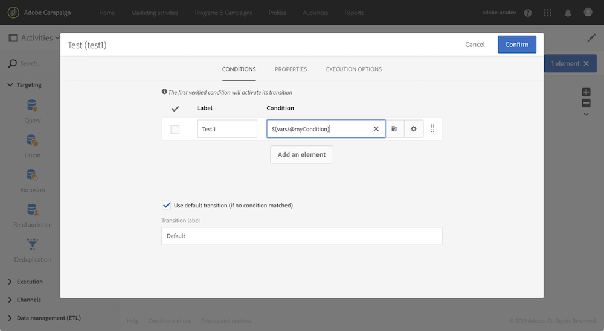

# Customizing a workflow with external parameters {#customizing-a-workflow-with-external-parameters}

觸發工作流程後，參數會被收錄到事件變數中，並可用來自訂工作流程的活動。

例如，它們可用來定義要在活動中讀取的對象、 **[!UICONTROL Read audience]** 要在活動中傳輸的檔案 **[!UICONTROL Transfer file]** 的名稱等。 (see [](../../automating/using/customizing-workflow-external-parameters.md)).

## 使用事件變數 {#using-events-variables}

事件變數用於必須遵循標準語法的運 [算式中](../../automating/using/advanced-expression-editing.md#standard-syntax)。

使用事件變數的語法必須遵循下列格式，並使用已在活動中定義的參數名 **[!UICONTROL External signal]** 稱(請參 [閱聲明外部信號活動中的參數](../../automating/using/declaring-parameters-external-signal.md)):

```
$(vars/@parameterName)
```

在此語法中， **$** 函式會傳 **回字串資料類型** 。 如果您想要指定其他類型的資料，請使用下列函式：

* **$long**:整數。
* **$float**:小數。
* **$boolean**:true/false。
* **$datetime**:時間戳記。

在活動中使用變數時，介面會提供呼叫變數的說明。


* :在工作流程中可用的所有變數中選取事件變數。

   

* ：編輯結合變數和函式的運算式。如需運算式編輯器的詳細資訊，請參考[本區段](../../automating/using/advanced-expression-editing.md)。

   

**相關主題：**

* [編輯運算式](../../automating/using/advanced-expression-editing.md#edit-an-expression)
* [標準語法](../../automating/using/advanced-expression-editing.md#standard-syntax)
* [函式清單](../../automating/using/list-of-functions.md)

## 使用事件變數自訂活動 {#customizing-activities-with-events-variables}

事件變數可用來自訂數個活動，列於下方一節。 如需如何從活動呼叫變數的詳細資訊，請參 [閱本節](../../automating/using/customizing-workflow-external-parameters.md#using-events-variables)。

**[!UICONTROL Read audience]** 活動：根據事件變數定義要定位的對象。

有關如何使用活動的詳細說明，請參閱專 [用章節](../../automating/using/read-audience.md)。


**[!UICONTROL Test]** 活動：根據事件變數建立條件。

有關如何使用活動的詳細說明，請參閱專 [用章節](../../automating/using/test.md)。



**[!UICONTROL Transfer file]** 活動：根據事件變數自訂檔案以進行傳輸。

有關如何使用活動的詳細說明，請參閱專 [用章節](../../automating/using/transfer-file.md)。


**[!UICONTROL Query]** 活動：參數可在查詢中參考，方法是使用結合事件變數和函式的運算式。 若要這麼做，請新增規則，然後按一下連 **[!UICONTROL Advanced mode]** 結以存取運算式編輯視窗(請參閱進 [階運算式編輯](../../automating/using/advanced-expression-editing.md))。

有關如何使用活動的詳細說明，請參閱專 [用章節](../../automating/using/query.md)。


**[!UICONTROL Channels]** 活動：根據事件變數個人化傳送。

>[!NOTE]
>
>每次準備傳送時，都檢索該傳送參數的值。
>
>週期性交貨準備是基於交貨匯總 **期間**。 例如，如果匯總期間是「按天」，則每天只重新準備一次傳送。 如果傳送參數的值在當天被修改，則不會在傳送中更新，因為已準備一次。
>
>如果您計畫每天呼叫多次工作流程，請使用 [!UICONTROL No aggregation] 選項，如此每次都會更新傳送參數。 如需循環傳送設定的詳細資訊，請參 [閱本節](/help/automating/using/email-delivery.md#configuration)。

若要根據事件變數個人化傳送，您必須先將您要使用的變數宣告至傳送活動：

1. 選取活動，然後按一下按  鈕以存取設定。
1. 選取標 **[!UICONTROL General]** 簽，然後新增事件變數，這些變數將可在傳送中當做個人化欄位使用。

   

1. 按一下 **[!UICONTROL Confirm]** 按鈕。

個人化欄位清單中現在提供宣告的事件變數。 您可以在傳送中使用它們，以執行下列動作：

* 定義要用於傳送的範本名稱。

   >[!NOTE]
   >
   >此動作僅適用於 **循環** 傳送。

   

* 個人化交付：選取個人化欄位以設定傳送時，事件變數可在元素中使 **[!UICONTROL Workflow parameters]** 用。 您可將其用作任何個人化欄位，例如定義傳送主體、傳送者等。

   傳送個人化在本節中 [詳述](../../designing/using/personalization.md)。

   

**區段代碼**:根據事件變數定義區段代碼。

>[!NOTE]
>
>您可以從任何可讓您定義區段代碼（例如，活動）的活動執行 **[!UICONTROL Query]** 此 **[!UICONTROL Segmentation]** 動作。


**傳送標籤**:根據事件變數定義傳送標籤。


