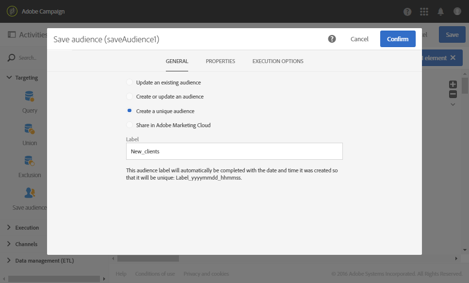

# 使用協調功能更新資料 {#data-update-reconciliation}

下列範例會示範一個工作流程，其會從包含新客戶之匯入檔案直接建立輪廓客群。 它由下列活動組成：


* [載入檔案](../../automating/using/load-file.md)活動，可載入並偵測要匯入之檔案的資料。 匯入的檔案包含下列資料：

  ```
  lastname;firstname;email;dateofbirth
  jackman;megan;megan.jackman@testmail.com;07/08/1975
  phillips;edward;phillips@testmail.com;09/03/1986
  weaver;justin;justin_w@testmail.com;11/15/1990
  martin;babeth;babeth_martin@testmail.net;11/25/1964
  reese;richard;rreese@testmail.com;02/08/1987
  cage;nathalie;cage.nathalie227@testmail.com;07/03/1989
  xiuxiu;andrea;andrea.xiuxiu@testmail.com;09/12/1992
  grimes;daryl;daryl_890@testmail.com;12/06/1979
  tycoon;tyreese;tyreese_t@testmail.net;10/08/1971
  ```

* [調解](../../automating/using/reconciliation.md)活動，可將載入檔案的每個欄連結到設定檔維度欄。 無法識別的檔案記錄（遺失資料、不相容的資料型別等） 會遭到忽略，以保留最終對象資料的完整性。

  

* [儲存對象](../../automating/using/save-audience.md)活動，可儲存設定檔的對象。

  
