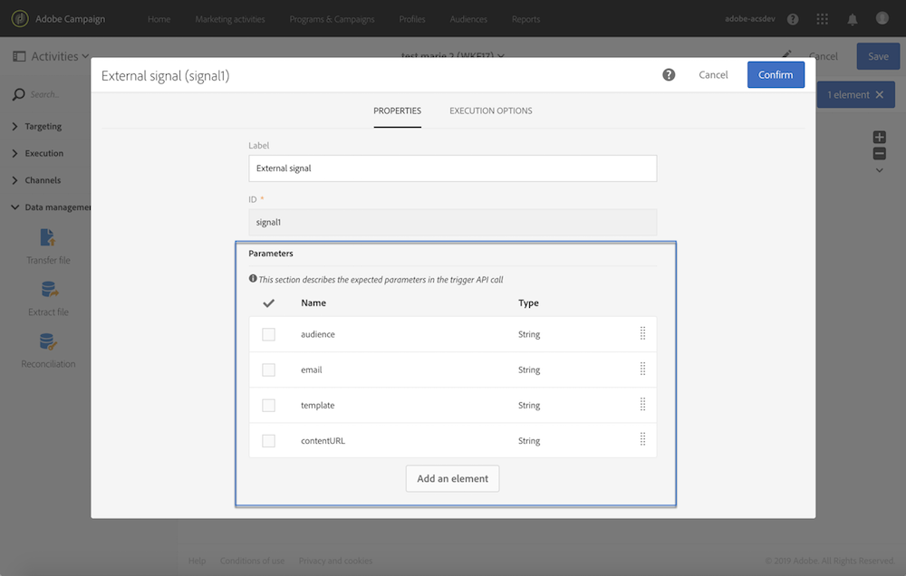

# 在外部訊號活動中宣告引數 {#declaring-the-parameters-in-the-external-signal-activity}

使用引數呼叫工作流程的第一步是在&#x200B;**[!UICONTROL External signal]**&#x200B;活動中宣告它們。

1. 開啟&#x200B;**[!UICONTROL External signal]**&#x200B;活動，然後選取&#x200B;**[!UICONTROL Parameters]**&#x200B;標籤。
1. 按一下&#x200B;**[!UICONTROL Create element]**&#x200B;按鈕，然後指定每個引數的名稱和型別。

   >[!CAUTION]
   >
   >請確定引數的名稱和數目與呼叫工作流程時所定義的相同（請參閱[此頁面](../../automating/using/defining-parameters-calling-workflow.md)）。 此外，引數的型別必須與預期值一致。

   

1. 宣告引數後，請完成工作流程設定，然後執行。
