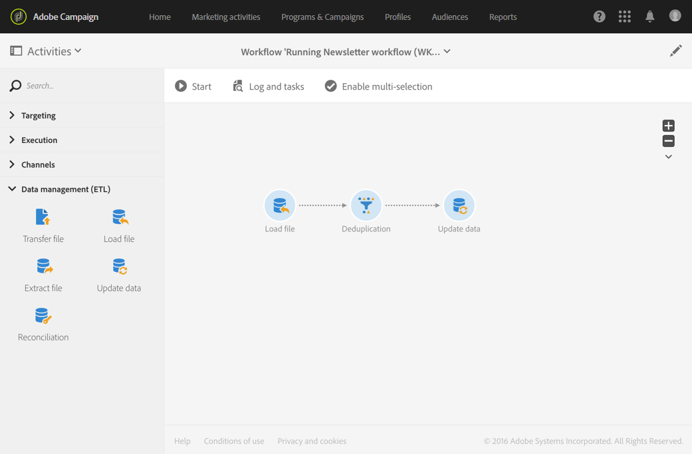

# 重複資料刪除{#deduplication}

## 說明 {#description}


活 **[!UICONTROL Deduplication]** 動允許您刪除入站活動結果中的重複項。

## 使用內容 {#context-of-use}

活動 **[!UICONTROL Deduplication]** 通常用於定位活動後或匯入檔案後，以及允許使用定位資料之活動前。

在重複資料消除期間，入站轉換會單獨處理。 例如，如果配置檔案'A'出現在查詢1的結果中，也出現在查詢2的結果中，則不會對其進行重複資料消除。

因此，建議重複資料消除只有一個入站過渡。 若要這麼做，您可以使用符合您定位需求的活動（例如聯合活動、交叉點活動等）來結合不同的查詢。 例如：


## 配置 {#configuration}

要配置重複資料消除活動，必須輸入標籤、方法和重複資料消除標準，以及與結果相關的選項。

1. 將活動拖放 **[!UICONTROL Deduplication]** 至工作流程。
1. 選擇活動，然後使用顯示的快  速操作中的按鈕將其開啟。

   

1. 選擇必 **[!UICONTROL Resource type]** 須執行重複資料消除的位置：

   * **[!UICONTROL Database resource]** 如果對資料庫中已存在的資料執行重複資料消除。 根據 **[!UICONTROL Filtering dimension]** 要 **[!UICONTROL Targeting dimension]**&#x200B;消除重複的資料，選擇和。 預設情況下，對配置檔案執行重複數 **據消除**。
   * **[!UICONTROL Temporary resource]** 如果對工作流的臨時資料執行重複資料消除：選擇包 **[!UICONTROL Targeted set]** 含要消除重複的資料。 在匯入檔案或資料庫中的資料已豐富（例如使用區段代碼）後，就會遇到此使用案例。

1. 選擇 **[!UICONTROL Number of unique records to keep]**。 此欄位的預設值為1。 值0允許您保留所有重複項。

   例如，如果記錄A和B被視為記錄Y的重複項，而記錄C被視為記錄Z的重複項：

   * 如果欄位的值為1:只保存Y和Z記錄。
   * 如果欄位的值為0:所有記錄都保存了。
   * 如果欄位的值為2:記錄C和Z被保存，並且A、B和Y中的兩條記錄被保存，這是偶然的，或取決於之後選擇的重複資料消除方法。

1. 在提供的 **[!UICONTROL Duplicate identification]** 清單中新增條件，以定義標準。 指定允許標識重複值的欄位和／或表達式：電子郵件地址、名字、姓氏等。 條件的順序允許您指定要首先處理的條件。
1. 在下拉式清單中，選取要 **[!UICONTROL Deduplication method]** 使用的：

   * **[!UICONTROL Choose for me]**:隨機選擇要從重複項中保留的記錄。
   * **[!UICONTROL Following a list of values]**:可讓您定義一或多個欄位的值優先順序。 要定義值，請選擇一個欄位或建立表達式，然後將值添加到相應的表中。 若要定義新欄位，請按一 **[!UICONTROL Add]** 下值清單上方的按鈕。

      

   * **[!UICONTROL Non-empty value]**:這可讓您保留所選運算式值不為空的記錄作為優先順序。

      

   * **[!UICONTROL Using an expression]**:這可讓您保留輸入的運算式值最小或最大的記錄。

      

1. 如有需要，請管理活動的 [轉場](../../automating/using/executing-a-workflow.md#managing-an-activity-s-outbound-transitions) ，以存取出站人口的進階選項。
1. 確認活動的設定並儲存工作流程。

## 範例1:在傳送前識別重複項目 {#example-1--identifying-duplicates-before-a-delivery}

以下示例說明了一個重複資料消除，它允許您在發送電子郵件之前排除目標的重複項。 這表示您不必多次傳送通訊至相同的描述檔。

工作流由以下幾部分組成：


* 可 **[!UICONTROL Query]** 讓您定義電子郵件的目標。 在此，工作流將目標鎖定在客戶端資料庫中已存留超過一年的18到25歲的所有配置檔案。

   

* 活動 **[!UICONTROL Deduplication]** ，它允許您標識來自前一查詢的重複項。 在此示例中，每個復本僅保存一條記錄。 重複項目是使用電子郵件地址識別。 這表示每個要存在於定位中的電子郵件地址只能傳送一次電子郵件傳送。

   選擇的重複資料消除方 **[!UICONTROL Non-empty value]**&#x200B;法。 這可讓您確保在記錄中，若有重複項目，優先順序會指定給已提供 **名字** 。 如果在電子郵件內容的個人化欄位中使用名字，這會使其更連貫。

   此外，還新增了額外的轉場功能，以保留復本並列出復本。

   

* 在重 **[!UICONTROL Email delivery]** 復資料消除的主要出站過渡之後放置的。 電子郵件傳送的設定會在「電子郵件傳送」區 [段中詳細](../../automating/using/email-delivery.md) 說明。
* 重複 **[!UICONTROL Save audience]** 資料消除的額外過渡之後所放置的活動，可將重複資料保存 **到** Duplicates觀眾中。 此對象可重複使用，以直接將其成員排除在每封電子郵件的傳送之外。

## 範例2:從導入的檔案中消除重複資料 {#example-2--deduplicating-the-data-from-an-imported-file}

此示例說明如何在將資料載入到資料庫中之前從導入的檔案中消除重複資料。 此過程提高了在資料庫中載入的資料的質量。

工作流由以下幾部分組成：



* 包含配置檔案清單的檔案使用活動 **[!UICONTROL Load file]** 導入。 在此範例中，匯入的檔案為。csv格式，並包含10個描述檔：

   ```
   lastname;firstname;dateofbirth;email
   Smith;Hayden;23/05/1989;hayden.smith@example.com
   Mars;Daniel;17/11/1987;dannymars@example.com
   Smith;Clara;08/02/1989;hayden.smith@example.com
   Durance;Allison;15/12/1978;allison.durance@example.com
   Lucassen;Jody;28/03/1988;jody.lucassen@example.com
   Binder;Tom;19/01/1982;tombinder@example.com
   Binder;Tommy;19/01/1915;tombinder@example.com
   Connor;Jade;10/10/1979;connor.jade@example.com
   Mack;Clarke;02/03/1985;clarke.mack@example.com
   Ross;Timothy;04/07/1986;timross@example.com
   ```

   此檔案也可用作範例檔案，以偵測並定義欄的格式。 在頁籤 **[!UICONTROL Column definition]** 中，確保已導入檔案的每一列都配置正確。

   

* 活 **[!UICONTROL Deduplication]** 動。 重複資料消除直接在導入檔案後和將資料插入資料庫之前執行。 因此，它應以活動 **[!UICONTROL Temporary resource]** 為基礎 **[!UICONTROL Load file]** 。

   在此範例中，我們希望每個檔案中包含的唯一電子郵件地址保留一個項目。 因此，在臨時資源的電子郵 **件列** 上執行重複標識。 不過，檔案中會出現兩個電子郵件地址。 因此，兩行將視為重複行。

   

* 活動 **[!UICONTROL Update data]** 允許您將重複資料消除過程中保留的資料插入到資料庫中。 只有在更新資料時，匯入的資料才會被識別為屬於描述檔維度。

   在此，我們希望 **[!UICONTROL Insert only]** 看到資料庫中不存在的配置檔案。 我們將使用檔案的電子郵件欄和「描述檔」維度的電子郵件欄位作為 **協調金鑰** ，來執行此動作。

   

   指定要從中插入資料的檔案列與頁籤中資料庫欄位之間的映 **[!UICONTROL Fields to update]** 射。

   

然後啟動工作流程。 然後，從重複資料消除過程中保存的記錄將添加到資料庫中的配置檔案中。
