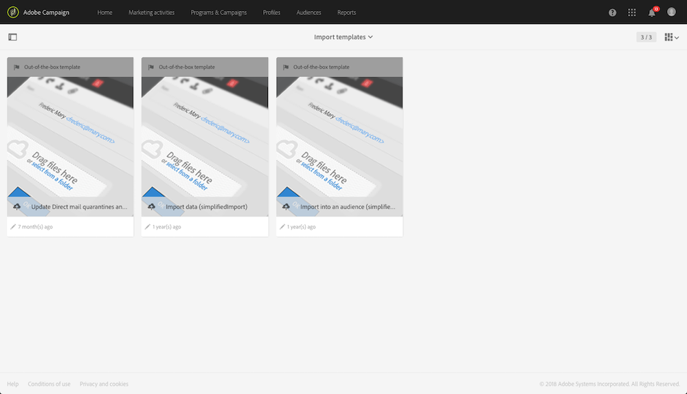

# 定義匯入範本{#defining-import-templates}

匯入範本可讓管理員預先定義特定數量的技術匯入設定。之後，這些範本就可以提供給標準使用者執行和上傳檔案。

匯入範本由功能管理員定義，可在 **[!UICONTROL Resources]** > **[!UICONTROL Templates]** > **[!UICONTROL Import templates]** 功能表下管理。

有三種預設的唯讀範本可供使用：

* **[!UICONTROL Update Direct mail quarantines and delivery logs]**：此範本可作為新匯入的基礎，以更新直接郵件的隔離和傳送記錄檔。範本的工作流程包含下列活動：
* **[!UICONTROL Import data]**：此範本可作為新匯入的基礎，以便將檔案的資料插入資料庫。此範本的工作流程包含下列活動：

   * **[!UICONTROL Load file]**：此活動可讓您在 Adobe Campaign 伺服器上傳檔案。
   * **[!UICONTROL Update data]**：此活動可讓您從資料庫中插入檔案中的資料。

* **[!UICONTROL Import list]**：此範本可做為新匯入的基礎，以便從檔案中的資料建立&#x200B;**清單**&#x200B;類型的對象。此範本的工作流程包含下列活動：

   * **[!UICONTROL Load file]**：此活動可讓您在 Adobe Campaign 伺服器上傳檔案。
   * **[!UICONTROL Reconciliation]**：此活動可讓您將定位維度連結至匯入的資料。之後，您就可以建立&#x200B;**清單**&#x200B;類型對象。如果匯入資料的目標維度不是已知的，則對象為&#x200B;**檔案**&#x200B;類型。請參閱[定位維度和資源](../../automating/using/query.md#targeting-dimensions-and-resources)。
   * **[!UICONTROL Save audience]**：此活動可讓您以&#x200B;**清單**&#x200B;類型對象的形式儲存匯入的資料。儲存的對象名稱與使用者匯入的檔案名稱相對應，並會新增一個字尾，指定匯入的日期和時間。例如：&#39;profiles_20150406_151448&#39;。

這些預設範本為唯讀範本，標準使用者無法看到內容。若要建立可供使用者使用的範本，請遵循下列步驟執行：

1. 複製預設範本。重複的範本包含三個索引標籤：

   * **[!UICONTROL Properties]**：匯入範本的常規參數。此索引標籤可讓您啟用範本並上傳範例檔案。
   * **[!UICONTROL Workflow]**：匯入工作流程。此索引標籤可讓您定義工作流活動。使用者執行的簡化匯入期間，不會看見這些活動。
   * **[!UICONTROL Executed imports]**：使用此範本執行的匯入清單。您可以檢視使用此範本執行之每個匯入的狀態、詳細資訊和結果。您可以從此清單直接存取工作流程（以對使用者而言透明的方式執行）。

1. 從 **[!UICONTROL Properties]** 索引標籤，重新命名範本並新增說明。當範本可供使用時，使用者將可檢視說明。

   

1. 移至 **[!UICONTROL Workflow]** 索引標籤。您可以從此處，根據您的需求新增活動，讓預設提供的工作流程更佳豐富。

   如需如何設定工作流程活動的詳細資訊，請參閱本區段說明的使用案例：[範例：匯入工作流程範本](../../automating/using/creating-import-workflow-templates.md)。此使用案例可協助您設定一個工作流程，此工作流程可重複用於匯入來自 Adobe Campaign 資料庫中 CRM 之設定檔的工作流程。

1. 儲存您的範本，以便正確考慮工作流程的設定。
1. 從 **[!UICONTROL Properties]** 索引標籤上傳範例檔案。上傳的檔案只能有未來匯入或範例資料所需的欄。範例檔案中的資料可讓您在定義工作流程後，測試簡化的匯入。

   

   之後，使用範本進行匯入的使用者將可使用此範例檔案。例如，他們可以將它下載至電腦，以填入要匯入的資料。在新增範例檔案時，請務必考量這一點。

1. 儲存範本。現在會考量範例檔案。您隨時可以將它下載至電腦以檢查內容，或透過 **[!UICONTROL Drop a new sample file]** 選項加以修改。

   

1. 返回索引標籤 **[!UICONTROL Workflow]** 並開啟 **[!UICONTROL Load file]** 活動，以檢查並調整在上一步上載的範例檔案的欄設定。
1. 啟動工作流程以測試匯入。在步驟 **5** 上傳的範例檔案，必須包含資料。

   之後，會確實匯入範例檔案中的資料。請確定所使用的資料是小型且虛構的，以確保您的資料庫不會受損。

1. 移至工作流程執行記錄檔，這可在動作列中使用。如果發生錯誤，請檢查活動是否正確設定。

   

1. 在 **[!UICONTROL Properties]** 索引標籤中，將 **[!UICONTROL Import template status]** 設定為 **[!UICONTROL Available]**，之後儲存範本。若要停止使用此範本，您可將 **[!UICONTROL Import template status]** 設定為 **[!UICONTROL Archived]**。

可透過重新上傳範例檔案並檢查 **[!UICONTROL Load file]** 設定來修改範本工作流程。

匯入範本現在可供使用者使用，並可用於上傳檔案。

**相關主題：**

* [工作流程](../../automating/using/get-started-workflows.md)
* [匯入和匯出資料](../../automating/using/about-data-import-and-export.md)
* [範例：匯入工作流程範本](../../automating/using/creating-import-workflow-templates.md)

