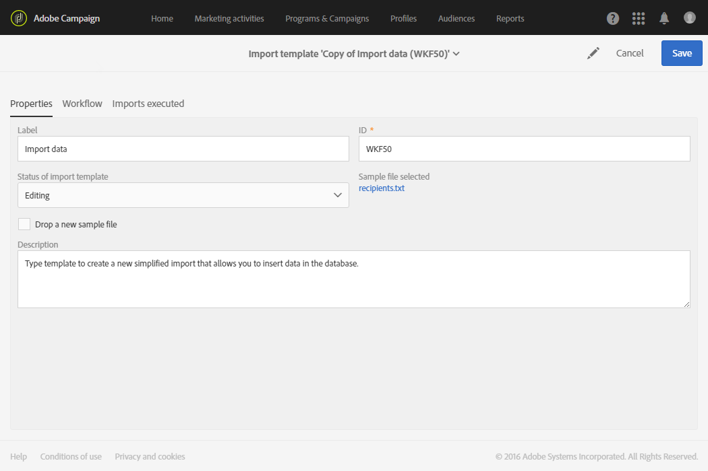
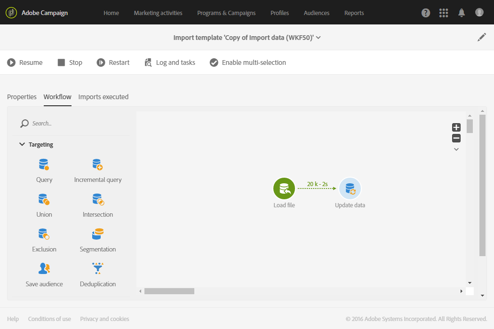

# 定義匯入範本{#defining-import-templates}

匯入範本可讓管理員預先定義特定數量的技術匯入組態。 然後，這些範本就可以提供給標準使用者執行和上傳檔案。

導入模板由功能管理員定義，可在「 &gt; &gt; 」菜單 **[!UICONTROL Resources]** 下 **[!UICONTROL Templates]** 管 **[!UICONTROL Import templates]** 理。

有三種預設的唯讀範本可供使用：

* **[!UICONTROL Update Direct mail quarantines and delivery logs]**:此模板可作為新導入的基礎，以更新Direct郵件的隔離和傳送日誌。 範本的工作流程包含下列活動：
* **[!UICONTROL Import data]**:此模板可作為新導入的基礎，以便將檔案中的資料插入到資料庫中。 此範本的工作流程包含下列活動：

   * **[!UICONTROL Load file]**:此活動可讓您在Adobe Campaign伺服器上上傳檔案。
   * **[!UICONTROL Update data]**:此活動允許您從資料庫中插入檔案中的資料。

* **[!UICONTROL Import list]**:此範本可做為新匯入的基礎，以便從檔案中的資料建立 **清單** 類型的讀者。 此範本的工作流程包含下列活動：

   * **[!UICONTROL Load file]**:此活動可讓您在Adobe Campaign伺服器上上傳檔案。
   * **[!UICONTROL Reconciliation]**:此活動可讓您將定位維度連結至匯入的資料。 然後，您就可以建立「清 **單** 」類型對象。 如果匯入資料的目標維度不為已知，則對象為「檔 **案** 」類型。 請參 [閱定位維度和資源](../../automating/using/query.md#targeting-dimensions-and-resources)。
   * **[!UICONTROL Save audience]**:此活動可讓您以「清單」類型對象的形式儲存匯 **入的** 資料。 儲存的對象名稱與使用者匯入的檔案名稱相對應，並會新增一個字尾，指定匯入的日期和時間。 例如：'profiles_20150406_151448'。

這些預設範本為唯讀範本，標準使用者無法看到。 若要建立可供使用者使用的範本，請遵循下列步驟：

1. 複製預設範本。 複製的範本包含三個標籤：

   * **[!UICONTROL Properties]**:導入模板的常規參數。 此標籤可讓您啟用範本並上傳範例檔案。
   * **[!UICONTROL Workflow]**:匯入工作流程。 此頁籤允許您定義工作流活動。 這些活動在用戶執行的簡化導入過程中不可見。
   * **[!UICONTROL Executed imports]**:使用此模板執行的導入清單。 您可以檢視使用此範本執行之每個匯入的狀態、詳細資訊和結果。 您可以從此清單直接存取工作流程（以對使用者透明的方式執行）。

1. 在標籤 **[!UICONTROL Properties]** 中，重新命名範本並新增說明。 當範本可用時，使用者將可檢視說明。

   

1. 轉至標 **[!UICONTROL Workflow]** 簽。 從這裡，您可以根據您的需求新增活動，以豐富預設提供的工作流程。

   有關如何配置工作流活動的詳細資訊，請參閱本節中介紹的使用案例：范 [例：匯入工作流程範本](../../automating/using/importing-data.md#example--import-workflow-template)。 此使用案例可協助您設定可重複用於匯入來自Adobe Campaign資料庫中CRM的設定檔的工作流程。

1. 儲存您的範本，以便正確考慮工作流程的設定。
1. 從標籤上傳範例檔 **[!UICONTROL Properties]** 案。 上傳的檔案只能有未來匯入或範例資料所需的欄。 範例檔案中的資料可讓您在定義工作流程後，測試簡化的匯入。

   

   然後，使用範本進行匯入的使用者將可使用此範例檔案。 例如，他們可以將它下載至電腦，以填入要匯入的資料。 在新增範例檔案時，請務必考量這一點。

1. 儲存範本。 現在會考量範例檔案。 您隨時可以將它下載至您的電腦，以檢查內容，或透過選項加以修 **[!UICONTROL Drop a new sample file]** 改。

   

1. 返回頁籤 **[!UICONTROL Workflow]** 並開啟活動 **[!UICONTROL Load file]** ，以檢查並調整在上一步上載的示例檔案的列配置。
1. 啟動工作流程以測試匯入。 在步驟5上傳的範例 **檔** ，必須包含資料。

   然後，從範例檔案中擷取的資料會真正匯入。 請確定所使用的資料是小型且虛構的，以確保您的資料庫不會受損。

1. 轉至操作欄中提供的工作流執行日誌。 如果您遇到錯誤，請檢查活動配置是否正確。

   

1. 在標 **[!UICONTROL Properties]** 簽中，將設定 **[!UICONTROL Import template status]** 為 **[!UICONTROL Available]**，然後保存模板。 若要停止使用此範本，您可將 **[!UICONTROL Import template status]** 設為 **[!UICONTROL Archived]**。

範本工作流程可以透過重新上傳範例檔案並檢查設定來 **[!UICONTROL Load file]** 修改。

匯入範本現在可供使用者使用，並可用來上傳檔案。

**相關主題：**

* [工作流程](../../automating/using/discovering-workflows.md)
* [匯入資料](../../automating/using/importing-data.md)
* [範例：匯入工作流程範本](../../automating/using/importing-data.md#example--import-workflow-template)

